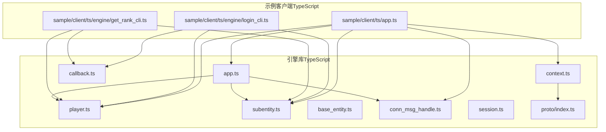
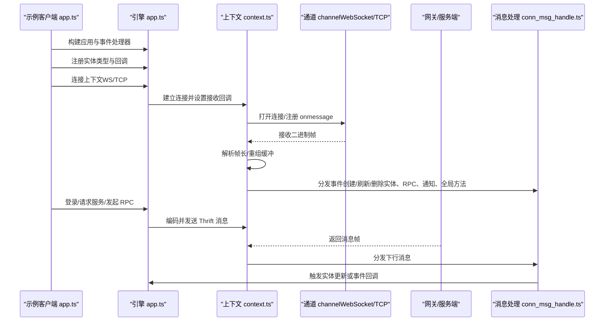
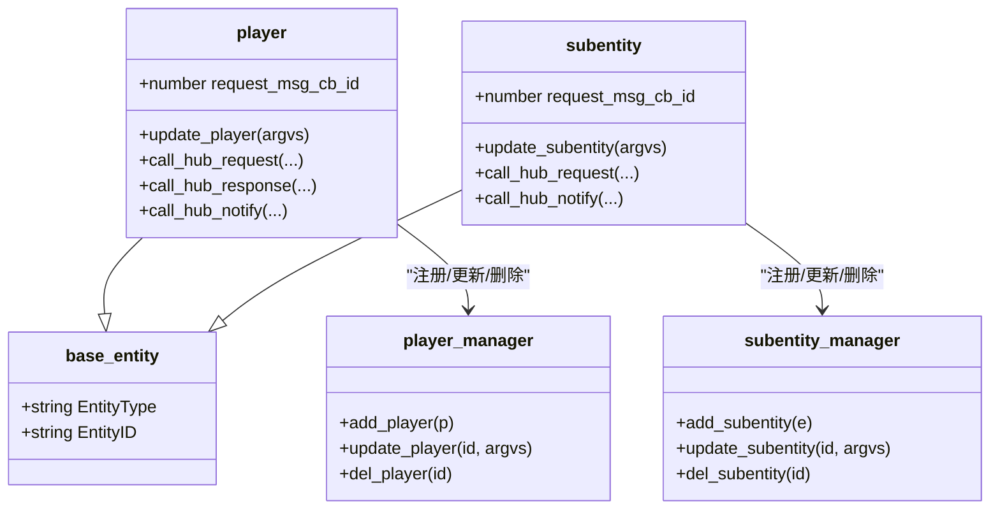
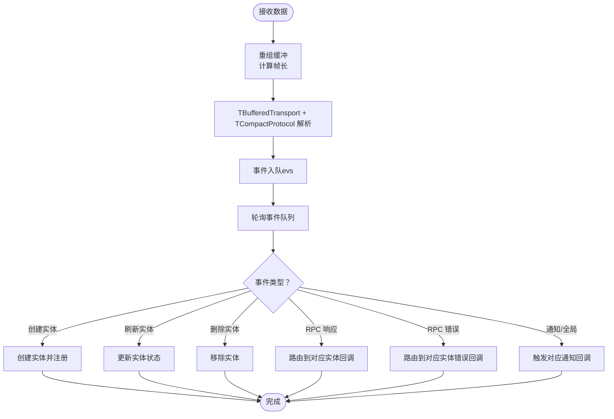
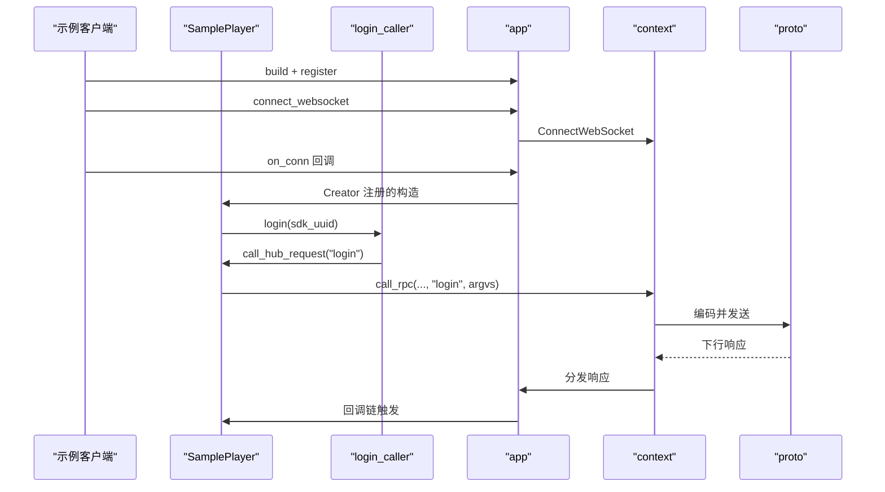
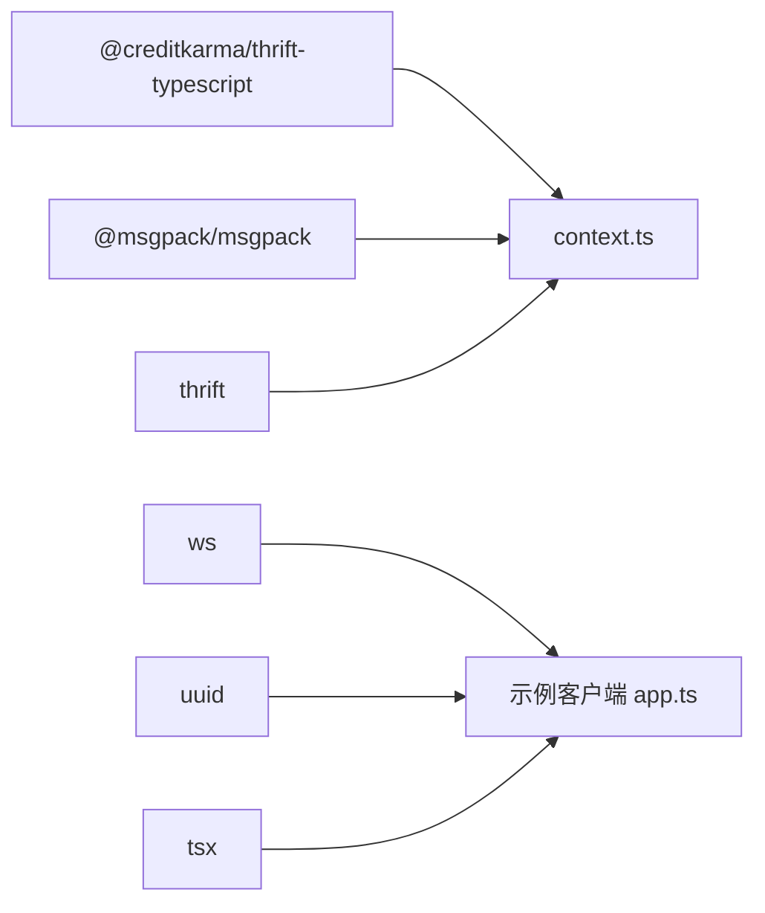

# TypeScript 客户端示例

<cite>
**本文引用的文件**
- [index.ts](file://expand/ts/engine/index.ts)
- [app.ts](file://expand/ts/engine/app.ts)
- [base_entity.ts](file://expand/ts/engine/base_entity.ts)
- [player.ts](file://expand/ts/engine/player.ts)
- [callback.ts](file://expand/ts/engine/callback.ts)
- [conn_msg_handle.ts](file://expand/ts/engine/conn_msg_handle.ts)
- [context.ts](file://expand/ts/engine/context.ts)
- [session.ts](file://expand/ts/engine/session.ts)
- [subentity.ts](file://expand/ts/engine/subentity.ts)
- [proto/index.ts](file://expand/ts/engine/proto/index.ts)
- [login_cli.ts](file://sample/client/ts/engine/login_cli.ts)
- [get_rank_cli.ts](file://sample/client/ts/engine/get_rank_cli.ts)
- [app.ts](file://sample/client/ts/app.ts)
- [package.json（示例客户端）](file://sample/client/ts/package.json)
- [package.json（引擎库）](file://expand/ts/package.json)
</cite>

## 目录
1. [简介](#简介)
2. [项目结构](#项目结构)
3. [核心组件](#核心组件)
4. [架构总览](#架构总览)
5. [详细组件分析](#详细组件分析)
6. [依赖关系分析](#依赖关系分析)
7. [性能考量](#性能考量)
8. [故障排查指南](#故障排查指南)
9. [结论](#结论)
10. [附录](#附录)

## 简介
本文件面向 TypeScript 客户端 SDK 的使用者与维护者，提供从初始化、连接配置、实体管理到消息处理的完整使用示例，并深入解析 TypeScript 类型系统在该 SDK 中的应用：接口与抽象类的职责分离、泛型与联合类型的使用、类型推导与编译期检查、以及 Promise/回调链与超时控制等异步模式。同时，结合示例客户端，展示如何通过协议生成器、消息编解码与上下文适配层，构建稳定、可扩展且类型安全的网络交互。

## 项目结构
TypeScript 引擎库位于 expand/ts/engine，示例客户端位于 sample/client/ts。两者共享相同的协议生成产物（proto），并通过 context 抽象层对接不同传输通道（如 WebSocket/TCP）。示例客户端通过 app 构建运行时，注册实体类型与事件处理器，建立连接并发起 RPC 调用。

图示来源
- [app.ts:18-51](file://expand/ts/engine/app.ts#L18-L51)
- [context.ts:18-31](file://expand/ts/engine/context.ts#L18-L31)
- [conn_msg_handle.ts:9-36](file://expand/ts/engine/conn_msg_handle.ts#L9-L36)
- [player.ts:10-26](file://expand/ts/engine/player.ts#L10-L26)
- [subentity.ts:10-23](file://expand/ts/engine/subentity.ts#L10-L23)
- [login_cli.ts:43-56](file://sample/client/ts/engine/login_cli.ts#L43-L56)
- [get_rank_cli.ts:81-102](file://sample/client/ts/engine/get_rank_cli.ts#L81-L102)
- [app.ts（示例客户端）:134-145](file://sample/client/ts/app.ts#L134-L145)

章节来源
- [index.ts:1-9](file://expand/ts/engine/index.ts#L1-L9)
- [app.ts:18-51](file://expand/ts/engine/app.ts#L18-L51)
- [context.ts:18-31](file://expand/ts/engine/context.ts#L18-L31)
- [conn_msg_handle.ts:9-36](file://expand/ts/engine/conn_msg_handle.ts#L9-L36)
- [player.ts:10-26](file://expand/ts/engine/player.ts#L10-L26)
- [subentity.ts:10-23](file://expand/ts/engine/subentity.ts#L10-L23)
- [login_cli.ts:43-56](file://sample/client/ts/engine/login_cli.ts#L43-L56)
- [get_rank_cli.ts:81-102](file://sample/client/ts/engine/get_rank_cli.ts#L81-L102)
- [app.ts（示例客户端）:134-145](file://sample/client/ts/app.ts#L134-L145)

## 核心组件
- 应用入口与生命周期
  - app：全局应用实例，负责心跳、连接、实体注册与消息轮询；提供登录、重连、请求服务、实体创建/更新/删除等能力。
- 实体模型
  - base_entity：统一的实体标识（类型+ID）。
  - player/subentity：继承自 base_entity，分别承载玩家与子实体的业务逻辑与 Hub 通信能力。
- 回调与超时
  - callback：封装响应回调、错误回调与超时回调，支持按消息 ID 注册与释放。
- 消息处理
  - conn_msg_handle：解码并分发来自网关的消息（创建/刷新/删除实体、RPC 响应/错误、通知、全局方法等）。
- 上下文与传输
  - context：抽象传输上下文，负责 Thrift 协议序列化、帧长度封装、发送与接收缓冲重组、事件队列与轮询。
  - channel：抽象传输通道（WebSocket/TCP），由具体实现注入。
- 协议与生成物
  - proto/index.ts：导出 Thrift 生成的客户端/服务端协议类型与消息结构。
- 示例客户端
  - app.ts：演示 app 初始化、事件处理、实体注册、连接建立与登录流程。
  - login_cli.ts / get_rank_cli.ts：基于生成的协议封装 RPC 调用与回调。

章节来源
- [app.ts:18-159](file://expand/ts/engine/app.ts#L18-L159)
- [base_entity.ts:7-15](file://expand/ts/engine/base_entity.ts#L7-L15)
- [player.ts:10-102](file://expand/ts/engine/player.ts#L10-L102)
- [subentity.ts:10-76](file://expand/ts/engine/subentity.ts#L10-L76)
- [callback.ts:7-39](file://expand/ts/engine/callback.ts#L7-L39)
- [conn_msg_handle.ts:9-96](file://expand/ts/engine/conn_msg_handle.ts#L9-L96)
- [context.ts:18-270](file://expand/ts/engine/context.ts#L18-L270)
- [proto/index.ts:1-51](file://expand/ts/engine/proto/index.ts#L1-L51)
- [app.ts（示例客户端）:134-145](file://sample/client/ts/app.ts#L134-L145)
- [login_cli.ts:43-56](file://sample/client/ts/engine/login_cli.ts#L43-L56)
- [get_rank_cli.ts:81-102](file://sample/client/ts/engine/get_rank_cli.ts#L81-L102)

## 架构总览
下图展示了从示例客户端到引擎库、再到协议与传输层的整体交互路径，以及消息在各组件间的流转。

图示来源
- [app.ts（示例客户端）:134-145](file://sample/client/ts/app.ts#L134-L145)
- [app.ts:53-159](file://expand/ts/engine/app.ts#L53-L159)
- [context.ts:32-270](file://expand/ts/engine/context.ts#L32-L270)
- [conn_msg_handle.ts:9-96](file://expand/ts/engine/conn_msg_handle.ts#L9-L96)

## 详细组件分析

### 应用与事件处理（app.ts）
- 关键点
  - 单例 app 实例，持有上下文、事件处理器、实体管理器与消息轮询。
  - 心跳定时器与 on_conn 回调，用于连接建立后的初始化动作。
  - 提供登录、重连、请求服务、实体注册与生命周期管理。
- 类型安全要点
  - Map 键值对与回调签名均以明确类型约束，避免运行时类型不匹配。
  - 对外暴露的回调函数签名在编译期即可校验一致性。

章节来源
- [app.ts:18-159](file://expand/ts/engine/app.ts#L18-L159)

### 实体模型（base_entity.ts、player.ts、subentity.ts）
- 关键点
  - base_entity 统一实体标识；player/subentity 继承并扩展 Hub 通信能力。
  - 提供注册/注销回调、请求/响应/通知的统一封装。
- 类型安全要点
  - 抽象类约束子类必须实现 update_* 方法，确保实体状态更新的契约性。
  - Map 存储回调与实体，键为字符串 ID，减少运行时查找成本。

图示来源
- [base_entity.ts:7-15](file://expand/ts/engine/base_entity.ts#L7-L15)
- [player.ts:10-102](file://expand/ts/engine/player.ts#L10-L102)
- [subentity.ts:10-76](file://expand/ts/engine/subentity.ts#L10-L76)
- [player.ts:104-129](file://expand/ts/engine/player.ts#L104-L129)
- [subentity.ts:78-103](file://expand/ts/engine/subentity.ts#L78-L103)

章节来源
- [base_entity.ts:7-15](file://expand/ts/engine/base_entity.ts#L7-L15)
- [player.ts:10-102](file://expand/ts/engine/player.ts#L10-L102)
- [subentity.ts:10-76](file://expand/ts/engine/subentity.ts#L10-L76)
- [player.ts:104-129](file://expand/ts/engine/player.ts#L104-L129)
- [subentity.ts:78-103](file://expand/ts/engine/subentity.ts#L78-L103)

### 回调与超时（callback.ts）
- 关键点
  - callback 封装成功/错误回调与超时回调，支持按消息 ID 注册并在释放时自动清理。
  - 提供 timeout 方法，统一超时处理逻辑。
- 类型安全要点
  - 回调参数类型为 Uint8Array，确保与协议编解码一致。
  - 通过闭包传递释放函数，避免重复释放与内存泄漏。

章节来源
- [callback.ts:7-39](file://expand/ts/engine/callback.ts#L7-L39)

### 消息处理（conn_msg_handle.ts）
- 关键点
  - 解码后根据事件类型分发至 app 的实体管理器与事件处理器。
  - 支持创建/刷新/删除实体、RPC 响应/错误、通知与全局方法。
- 类型安全要点
  - 使用 decode<object> 对二进制数据进行解码，后续再做类型判断，保证健壮性。

章节来源
- [conn_msg_handle.ts:9-96](file://expand/ts/engine/conn_msg_handle.ts#L9-L96)

### 上下文与传输（context.ts、channel）
- 关键点
  - channel 抽象传输通道，由具体实现（如 WebSocket）注入。
  - context 负责 Thrift 协议编码/解码、帧长度封装、接收缓冲重组与事件轮询。
  - 提供 login/reconnect/request_hub_service/call_rpc/rsp/err/ntf/heartbeats 等方法。
- 类型安全要点
  - 所有 Thrift 结构体与枚举均由生成物提供，调用侧无需手写类型，编译期即受约束。
  - 发送前统一转换为 Uint8Array 并写入长度字段，避免粘包/拆包问题。

图示来源
- [context.ts:32-270](file://expand/ts/engine/context.ts#L32-L270)
- [conn_msg_handle.ts:9-96](file://expand/ts/engine/conn_msg_handle.ts#L9-L96)

章节来源
- [context.ts:18-270](file://expand/ts/engine/context.ts#L18-L270)
- [conn_msg_handle.ts:9-96](file://expand/ts/engine/conn_msg_handle.ts#L9-L96)

### 协议与生成物（proto/index.ts）
- 关键点
  - 导出 Thrift 生成的客户端/服务端协议类型，涵盖 RPC、通知、全局方法、实体生命周期等。
- 类型安全要点
  - 生成物提供强类型结构体与枚举，调用侧无需手写类型，降低出错率。

章节来源
- [proto/index.ts:1-51](file://expand/ts/engine/proto/index.ts#L1-L51)

### 示例客户端（app.ts、login_cli.ts、get_rank_cli.ts）
- 关键点
  - 示例 app 展示了 app 构建、事件处理、实体注册、连接建立与登录流程。
  - login_cli.ts 与 get_rank_cli.ts 展示了基于生成协议的 RPC 调用封装与回调链式调用。
- 类型安全要点
  - 调用方通过生成的 caller 与回调类进行类型化调用，编译期即可发现参数与返回类型不匹配问题。
  - 回调链中统一使用 callback.timeout 设置超时，提升健壮性。

图示来源
- [app.ts（示例客户端）:134-145](file://sample/client/ts/app.ts#L134-L145)
- [login_cli.ts:43-56](file://sample/client/ts/engine/login_cli.ts#L43-L56)
- [player.ts:72-101](file://expand/ts/engine/player.ts#L72-L101)
- [context.ts:130-144](file://expand/ts/engine/context.ts#L130-L144)

章节来源
- [app.ts（示例客户端）:134-145](file://sample/client/ts/app.ts#L134-L145)
- [login_cli.ts:43-56](file://sample/client/ts/engine/login_cli.ts#L43-L56)
- [get_rank_cli.ts:81-102](file://sample/client/ts/engine/get_rank_cli.ts#L81-L102)
- [player.ts:72-101](file://expand/ts/engine/player.ts#L72-L101)
- [context.ts:130-144](file://expand/ts/engine/context.ts#L130-L144)

## 依赖关系分析
- 引擎库依赖
  - @creditkarma/thrift-typescript：Thrift 协议编解码。
  - @msgpack/msgpack：二进制编解码（用于 RPC 参数与响应）。
  - ws：WebSocket 客户端（示例中使用）。
- 示例客户端依赖
  - 同引擎库，额外包含 uuid 与 tsx，便于示例运行与测试。

图示来源
- [package.json（引擎库）:2-13](file://expand/ts/package.json#L2-L13)
- [package.json（示例客户端）:2-13](file://sample/client/ts/package.json#L2-L13)

章节来源
- [package.json（引擎库）:2-13](file://expand/ts/package.json#L2-L13)
- [package.json（示例客户端）:2-13](file://sample/client/ts/package.json#L2-L13)

## 性能考量
- 轮询与心跳
  - app 内部以固定间隔执行心跳与消息轮询，建议根据实际网络状况调整频率，避免过度占用 CPU。
- 编解码与缓冲
  - context 对接收数据进行缓冲重组，避免频繁分配；发送前统一写入帧长，减少网络碎片。
- 回调与实体管理
  - 使用 Map 按 ID 快速定位实体与回调，注意及时释放回调，防止内存泄漏。
- 超时控制
  - callback.timeout 提供统一超时策略，建议在调用链上为关键 RPC 设置合理超时时间。

## 故障排查指南
- 连接失败
  - 检查 WS/TCP 地址与端口是否正确；确认 onopen/onerror/onclose 回调日志。
- 登录/重连无响应
  - 确认 app.build 已设置事件处理器；检查 on_conn 是否被触发；核对 argvs 编码是否正确。
- RPC 无回调
  - 确认实体已注册；检查回调 ID 是否正确；查看超时是否过短导致提前触发。
- 消息乱序/丢失
  - 检查 context 的缓冲重组逻辑与帧长解析；确保发送端与接收端协议版本一致。

章节来源
- [app.ts（示例客户端）:74-132](file://sample/client/ts/app.ts#L74-L132)
- [context.ts:32-95](file://expand/ts/engine/context.ts#L32-L95)
- [callback.ts:33-39](file://expand/ts/engine/callback.ts#L33-L39)

## 结论
该 TypeScript 客户端 SDK 通过清晰的抽象层次与强类型协议生成物，实现了高内聚、低耦合的网络通信框架。借助 app 的生命周期管理、player/subentity 的实体模型、callback 的回调与超时控制，以及 context 的协议编解码与消息轮询，开发者可以以类型安全的方式快速构建稳定的客户端应用。示例客户端提供了从初始化、连接、实体管理到消息处理的完整参考路径，便于二次开发与扩展。

## 附录
- 初始化与连接
  - 在示例客户端中，通过 app.build 设置事件处理器，注册实体类型，建立上下文连接，并在 on_conn 中发起登录。
- 实体管理
  - 使用 app.register 注册实体构造器；通过 app.create_entity/update_entity/delete_entity 管理实体生命周期。
- 消息处理
  - 通过 player/subentity 的回调注册方法（如 reg_hub_callback/reg_hub_notify）订阅 RPC 响应与通知。
- 异步与错误处理
  - 使用 callback.timeout 设置超时；在响应/错误回调中进行类型转换与业务处理；必要时在调用链上进行 Promise 包装以便链式调用。

章节来源
- [app.ts（示例客户端）:134-145](file://sample/client/ts/app.ts#L134-L145)
- [app.ts:119-140](file://expand/ts/engine/app.ts#L119-L140)
- [player.ts:64-101](file://expand/ts/engine/player.ts#L64-L101)
- [subentity.ts:54-75](file://expand/ts/engine/subentity.ts#L54-L75)
- [callback.ts:22-39](file://expand/ts/engine/callback.ts#L22-L39)