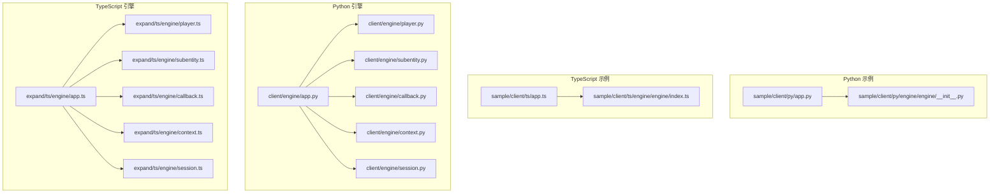
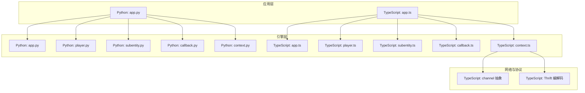
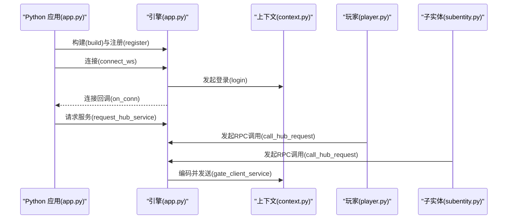
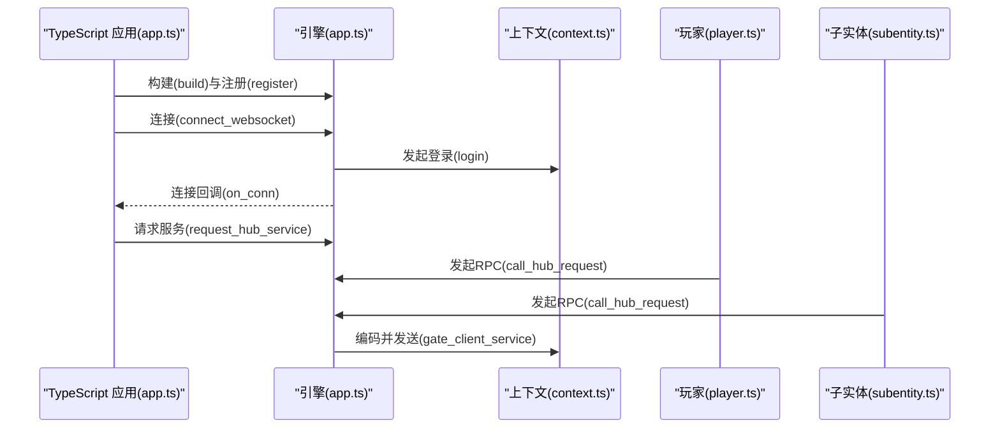
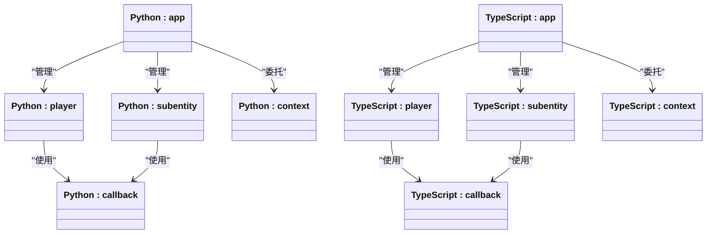
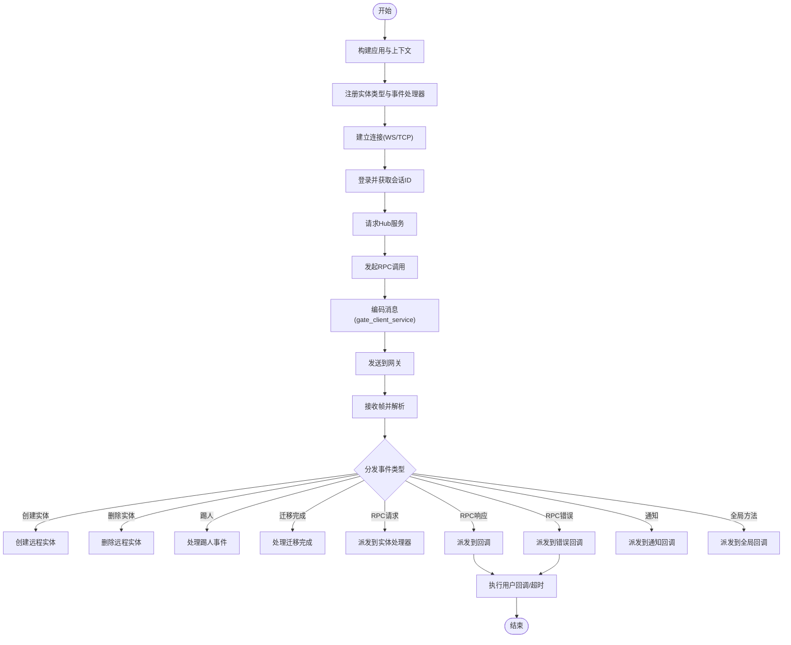
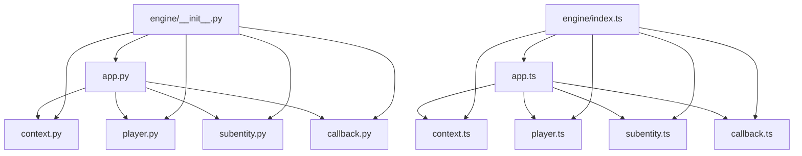

# 客户端示例

<cite>
**本文引用的文件**
- [sample/client/py/app.py](file://sample/client/py/app.py)
- [sample/client/ts/app.ts](file://sample/client/ts/app.ts)
- [client/engine/app.py](file://client/engine/app.py)
- [expand/ts/engine/app.ts](file://expand/ts/engine/app.ts)
- [client/engine/player.py](file://client/engine/player.py)
- [expand/ts/engine/player.ts](file://expand/ts/engine/player.ts)
- [client/engine/subentity.py](file://client/engine/subentity.py)
- [expand/ts/engine/subentity.ts](file://expand/ts/engine/subentity.ts)
- [client/engine/callback.py](file://client/engine/callback.py)
- [expand/ts/engine/callback.ts](file://expand/ts/engine/callback.ts)
- [client/engine/context.py](file://client/engine/context.py)
- [expand/ts/engine/context.ts](file://expand/ts/engine/context.ts)
- [client/engine/session.py](file://client/engine/session.py)
- [expand/ts/engine/session.ts](file://expand/ts/engine/session.ts)
- [sample/client/py/engine/engine/__init__.py](file://sample/client/py/engine/engine/__init__.py)
- [sample/client/ts/engine/engine/index.ts](file://sample/client/ts/engine/engine/index.ts)
</cite>

## 目录
1. [简介](#简介)
2. [项目结构](#项目结构)
3. [核心组件](#核心组件)
4. [架构总览](#架构总览)
5. [详细组件分析](#详细组件分析)
6. [依赖分析](#依赖分析)
7. [性能考虑](#性能考虑)
8. [故障排查指南](#故障排查指南)
9. [结论](#结论)
10. [附录](#附录)

## 简介
本指南面向希望使用 geese 客户端 SDK 的开发者，覆盖 Python 与 TypeScript 两种语言的完整示例工程。内容包括：客户端初始化、连接建立、登录认证、实体管理（玩家与子实体）、消息收发与回调、全局方法注册、心跳保活、事件处理以及错误与超时处理等。同时提供跨语言对比与最佳实践建议，帮助快速上手并正确使用不同语言的客户端。

## 项目结构
客户端示例位于 sample/client 下，分别提供 Python 与 TypeScript 的最小可运行示例；核心引擎代码位于 client/engine 与 expand/ts/engine，二者分别对应 Python 与 TypeScript 的 SDK 实现。示例应用通过 app 构建运行时环境，注册实体类型与事件处理器，并通过 context 建立网络通道与协议编解码。

**图表来源**
- [sample/client/py/app.py:1-71](file://sample/client/py/app.py#L1-L71)
- [sample/client/ts/app.ts:1-146](file://sample/client/ts/app.ts#L1-L146)
- [client/engine/app.py:1-157](file://client/engine/app.py#L1-L157)
- [expand/ts/engine/app.ts:1-159](file://expand/ts/engine/app.ts#L1-L159)

**章节来源**
- [sample/client/py/app.py:1-71](file://sample/client/py/app.py#L1-L71)
- [sample/client/ts/app.ts:1-146](file://sample/client/ts/app.ts#L1-L146)
- [sample/client/py/engine/engine/__init__.py:1-8](file://sample/client/py/engine/engine/__init__.py#L1-L8)
- [sample/client/ts/engine/engine/index.ts:1-9](file://sample/client/ts/engine/engine/index.ts#L1-L9)

## 核心组件
- 应用入口与运行循环
  - Python: app 类负责构建上下文、注册实体、启动轮询与心跳。
  - TypeScript: app 类提供静态实例、注册实体、心跳定时器与轮询调度。
- 实体模型
  - player 与 subentity 抽象类封装 RPC 请求/响应、通知、回调注册与分发。
- 回调与超时
  - callback 封装成功/错误回调与超时计时器。
- 上下文与网络
  - context 提供连接、登录、RPC、通知、心跳等接口；TypeScript 版本还包含自定义 channel 抽象与 Thrift 编解码。
- 会话与事件
  - session 表示会话来源；client_event_handle 处理断线、迁移等事件。

**章节来源**
- [client/engine/app.py:40-157](file://client/engine/app.py#L40-L157)
- [expand/ts/engine/app.ts:18-159](file://expand/ts/engine/app.ts#L18-L159)
- [client/engine/player.py:9-108](file://client/engine/player.py#L9-L108)
- [expand/ts/engine/player.ts:10-129](file://expand/ts/engine/player.ts#L10-L129)
- [client/engine/subentity.py:9-89](file://client/engine/subentity.py#L9-L89)
- [expand/ts/engine/subentity.ts:10-103](file://expand/ts/engine/subentity.ts#L10-L103)
- [client/engine/callback.py:5-23](file://client/engine/callback.py#L5-L23)
- [expand/ts/engine/callback.ts:7-39](file://expand/ts/engine/callback.ts#L7-L39)
- [client/engine/context.py:4-39](file://client/engine/context.py#L4-L39)
- [expand/ts/engine/context.ts:18-270](file://expand/ts/engine/context.ts#L18-L270)
- [client/engine/session.py:3-7](file://client/engine/session.py#L3-L7)
- [expand/ts/engine/session.ts:6-12](file://expand/ts/engine/session.ts#L6-L12)

## 架构总览
下图展示 Python 与 TypeScript 客户端示例的整体交互：应用层通过 app 初始化引擎，注册实体与事件处理器；通过 context 建立网络通道；消息经由协议编解码后发送到网关服务，再路由至 Hub 服务或广播给其他客户端。

**图表来源**
- [sample/client/py/app.py:1-71](file://sample/client/py/app.py#L1-L71)
- [sample/client/ts/app.ts:1-146](file://sample/client/ts/app.ts#L1-L146)
- [client/engine/app.py:40-157](file://client/engine/app.py#L40-L157)
- [expand/ts/engine/app.ts:18-159](file://expand/ts/engine/app.ts#L18-L159)
- [expand/ts/engine/context.ts:6-270](file://expand/ts/engine/context.ts#L6-L270)

## 详细组件分析

### Python 客户端示例
- 初始化与连接
  - 构建 app 并注册实体类型与事件处理器；支持 TCP/WS 连接（示例中使用 WS）。
  - 登录与服务请求在连接回调中触发。
- 实体与消息
  - SamplePlayer 继承 player，注册登录调用；RankSubEntity 继承 subentity，发起查询请求。
  - 通过 caller 对象进行 RPC 调用，设置回调与超时。
- 事件处理
  - ClientEventHandle 实现 on_kick_off 与 on_transfer_complete。

**图表来源**
- [sample/client/py/app.py:55-68](file://sample/client/py/app.py#L55-L68)
- [client/engine/app.py:60-115](file://client/engine/app.py#L60-L115)
- [client/engine/context.py:14-39](file://client/engine/context.py#L14-L39)
- [client/engine/player.py:68-89](file://client/engine/player.py#L68-L89)
- [client/engine/subentity.py:57-69](file://client/engine/subentity.py#L57-L69)

**章节来源**
- [sample/client/py/app.py:7-71](file://sample/client/py/app.py#L7-L71)
- [client/engine/app.py:40-157](file://client/engine/app.py#L40-L157)
- [client/engine/player.py:9-108](file://client/engine/player.py#L9-L108)
- [client/engine/subentity.py:9-89](file://client/engine/subentity.py#L9-L89)
- [client/engine/context.py:4-39](file://client/engine/context.py#L4-L39)

### TypeScript 客户端示例
- 初始化与连接
  - 构建 app 并注册实体类型与事件处理器；通过自定义 WSContext 建立 WebSocket 连接。
  - 在连接回调中触发登录与服务请求。
- 实体与消息
  - SamplePlayer 与 RankSubEntity 同 Python 版本职责一致；通过 caller 对象发起 RPC 并设置回调与超时。
- 协议与网络
  - context.ts 内置 channel 抽象与 Thrift 编解码，自动拼接长度前缀并解析帧边界。

**图表来源**
- [sample/client/ts/app.ts:134-145](file://sample/client/ts/app.ts#L134-L145)
- [expand/ts/engine/app.ts:53-121](file://expand/ts/engine/app.ts#L53-L121)
- [expand/ts/engine/context.ts:97-197](file://expand/ts/engine/context.ts#L97-L197)
- [expand/ts/engine/player.ts:72-101](file://expand/ts/engine/player.ts#L72-L101)
- [expand/ts/engine/subentity.ts:58-76](file://expand/ts/engine/subentity.ts#L58-L76)

**章节来源**
- [sample/client/ts/app.ts:1-146](file://sample/client/ts/app.ts#L1-L146)
- [expand/ts/engine/app.ts:18-159](file://expand/ts/engine/app.ts#L18-L159)
- [expand/ts/engine/player.ts:10-129](file://expand/ts/engine/player.ts#L10-L129)
- [expand/ts/engine/subentity.ts:10-103](file://expand/ts/engine/subentity.ts#L10-L103)
- [expand/ts/engine/context.ts:18-270](file://expand/ts/engine/context.ts#L18-L270)

### 类关系与继承

**图表来源**
- [client/engine/player.py:9-108](file://client/engine/player.py#L9-L108)
- [client/engine/subentity.py:9-89](file://client/engine/subentity.py#L9-L89)
- [client/engine/callback.py:5-23](file://client/engine/callback.py#L5-L23)
- [client/engine/app.py:40-157](file://client/engine/app.py#L40-L157)
- [client/engine/context.py:4-39](file://client/engine/context.py#L4-L39)
- [expand/ts/engine/player.ts:10-129](file://expand/ts/engine/player.ts#L10-L129)
- [expand/ts/engine/subentity.ts:10-103](file://expand/ts/engine/subentity.ts#L10-L103)
- [expand/ts/engine/callback.ts:7-39](file://expand/ts/engine/callback.ts#L7-L39)
- [expand/ts/engine/app.ts:18-159](file://expand/ts/engine/app.ts#L18-L159)
- [expand/ts/engine/context.ts:18-270](file://expand/ts/engine/context.ts#L18-L270)

### 消息收发与回调流程

**图表来源**
- [client/engine/app.py:60-157](file://client/engine/app.py#L60-L157)
- [expand/ts/engine/app.ts:53-159](file://expand/ts/engine/app.ts#L53-L159)
- [expand/ts/engine/context.ts:199-269](file://expand/ts/engine/context.ts#L199-L269)

**章节来源**
- [client/engine/app.py:60-157](file://client/engine/app.py#L60-L157)
- [expand/ts/engine/app.ts:53-159](file://expand/ts/engine/app.ts#L53-L159)
- [expand/ts/engine/context.ts:199-269](file://expand/ts/engine/context.ts#L199-L269)

## 依赖分析
- Python 侧
  - app.py 依赖 context.py、player.py、subentity.py、callback.py、msgpack 编解码。
  - engine/__init__.py 汇总导出引擎模块。
- TypeScript 侧
  - app.ts 依赖 context.ts、player.ts、subentity.ts、receiver.ts 等。
  - context.ts 依赖 Thrift 协议栈与 proto 定义，实现帧组装与解析。
  - engine/index.ts 汇总导出引擎模块。

**图表来源**
- [sample/client/py/engine/engine/__init__.py:1-8](file://sample/client/py/engine/engine/__init__.py#L1-L8)
- [sample/client/ts/engine/engine/index.ts:1-9](file://sample/client/ts/engine/engine/index.ts#L1-L9)
- [client/engine/app.py:11-17](file://client/engine/app.py#L11-L17)
- [expand/ts/engine/app.ts:6-12](file://expand/ts/engine/app.ts#L6-L12)

**章节来源**
- [sample/client/py/engine/engine/__init__.py:1-8](file://sample/client/py/engine/engine/__init__.py#L1-L8)
- [sample/client/ts/engine/engine/index.ts:1-9](file://sample/client/ts/engine/engine/index.ts#L1-L9)
- [client/engine/app.py:11-17](file://client/engine/app.py#L11-L17)
- [expand/ts/engine/app.ts:6-12](file://expand/ts/engine/app.ts#L6-L12)

## 性能考虑
- 轮询与调度
  - Python 使用线程+Timer 驱动协程循环与心跳；TypeScript 使用定时器驱动轮询。
- 消息处理节律
  - Python 轮询周期控制在约 33ms 左右，避免过载；TypeScript 使用固定间隔轮询。
- 编解码开销
  - TypeScript 使用 msgpack/thrift 编解码，注意对象序列化成本；Python 使用 msgpack 打包。
- 网络缓冲
  - context.ts 自动拼接长度前缀与帧边界解析，减少粘包问题。

[本节为通用指导，不直接分析具体文件]

## 故障排查指南
- 连接失败
  - 确认目标地址与端口正确；检查 WS/TCP 通道是否建立成功。
  - 查看连接回调是否触发，会话 ID 是否返回。
- 登录失败
  - 检查登录参数与编码格式；确认服务端配置允许该 SDK UUID 登录。
- RPC 超时
  - 检查回调是否注册；确认服务端处理耗时与客户端超时阈值设置。
- 断线与迁移
  - 实现 client_event_handle 的 on_kick_off 与 on_transfer_complete，确保资源清理与重连策略。
- 数据解析异常
  - 检查帧长度字段与协议版本一致性；确认 Thrift 编解码与 proto 定义匹配。

**章节来源**
- [client/engine/callback.py:17-23](file://client/engine/callback.py#L17-L23)
- [expand/ts/engine/callback.ts:27-39](file://expand/ts/engine/callback.ts#L27-L39)
- [expand/ts/engine/context.ts:32-73](file://expand/ts/engine/context.ts#L32-L73)

## 结论
本指南基于 Python 与 TypeScript 双语示例，系统梳理了 geese 客户端 SDK 的初始化、连接、实体管理、消息收发与事件处理流程。通过统一的引擎抽象与协议编解码，两类语言客户端在功能与行为上保持一致。建议在生产环境中结合业务需求完善错误处理、超时与重连策略，并根据网络与数据规模优化轮询节奏与编解码性能。

[本节为总结性内容，不直接分析具体文件]

## 附录

### API 使用差异与最佳实践
- 初始化与运行
  - Python: 通过 app().build(...) 构建，register 注册实体类型，connect_tcp/connect_ws 建立连接，run 启动轮询。
  - TypeScript: 通过 new engine.app() 构建，register 注册实体类型，connect_websocket/connect_tcp 建立连接，run 启动轮询。
- 实体与消息
  - 两者均通过 caller 对象发起 RPC，设置回调与超时；player/subentity 提供统一的回调注册与分发。
- 网络与协议
  - Python: context.py 封装底层 ClientContext；消息编解码由 msgpack 提供。
  - TypeScript: context.ts 内置 channel 抽象与 Thrift 编解码，自动处理帧边界与长度前缀。
- 最佳实践
  - 明确实体生命周期：创建、更新、删除；在 on_kick_off/on_transfer_complete 中清理资源。
  - 设置合理的超时时间与重试策略；对高频 RPC 聚合请求以降低网络压力。
  - 使用全局方法注册监听服务端广播；在连接回调中触发登录与服务请求。

**章节来源**
- [client/engine/app.py:60-157](file://client/engine/app.py#L60-L157)
- [expand/ts/engine/app.ts:53-159](file://expand/ts/engine/app.ts#L53-L159)
- [client/engine/context.py:4-39](file://client/engine/context.py#L4-L39)
- [expand/ts/engine/context.ts:18-270](file://expand/ts/engine/context.ts#L18-L270)