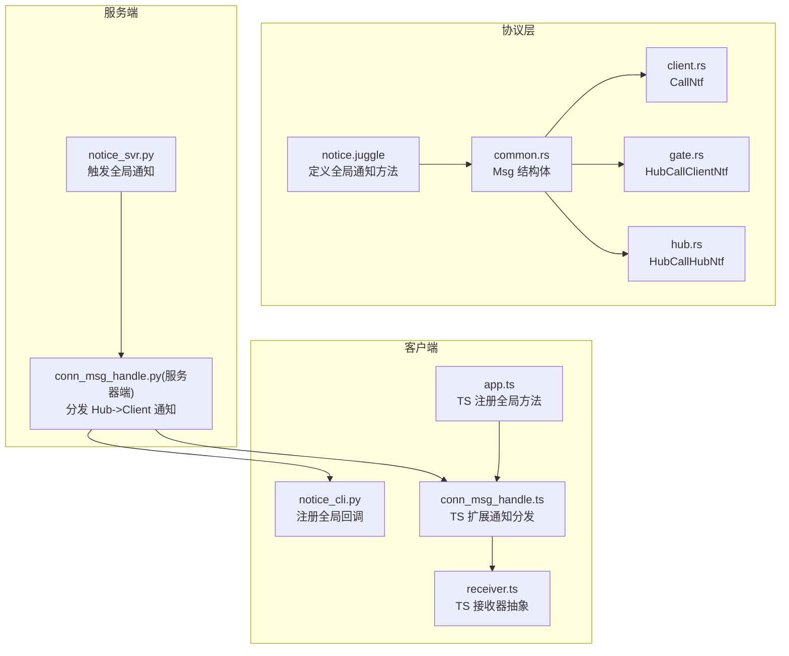
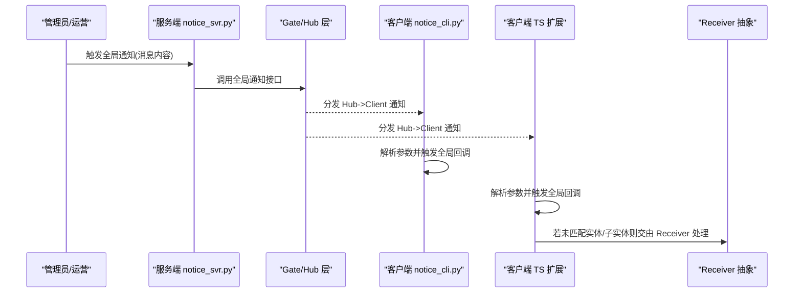
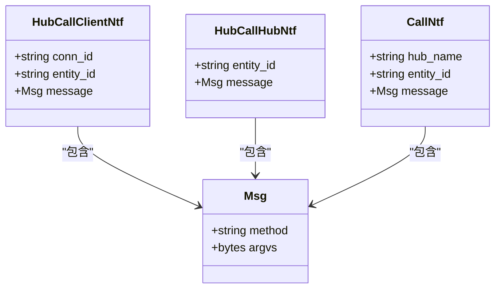
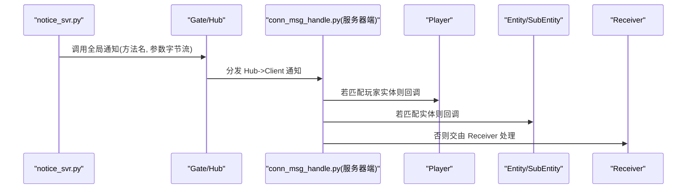
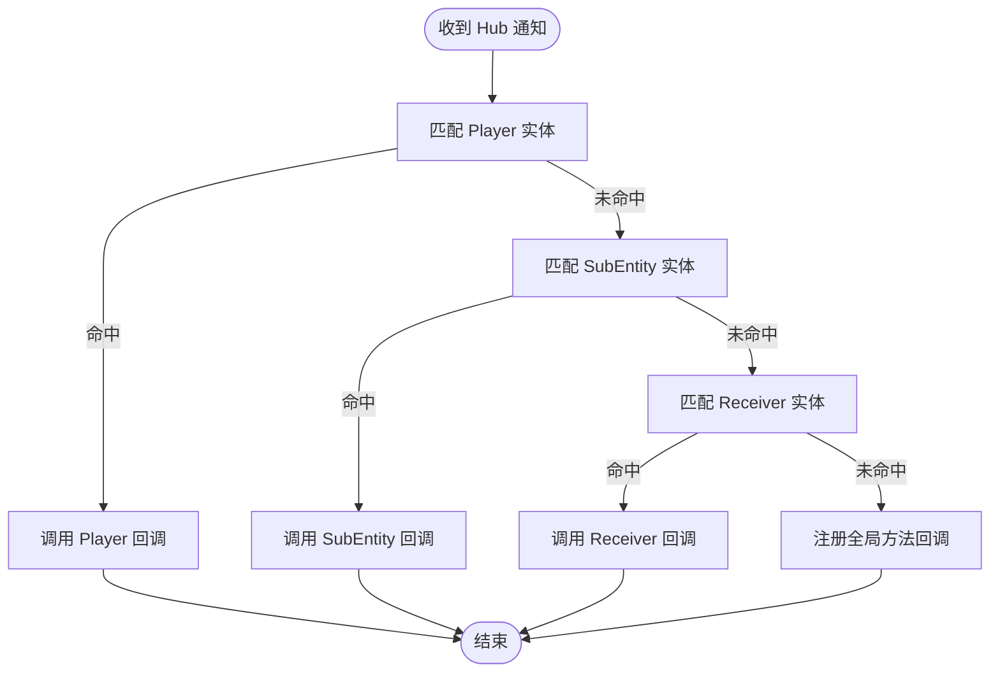
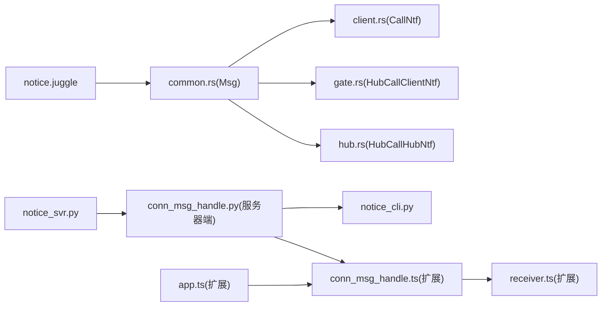

# 公告通知服务

<cite>
**本文引用的文件**
- [notice.juggle](file://sample/proto/proto/hub_call_client/notice.juggle)
- [notice_svr.py](file://sample/server/src/engine/notice_svr.py)
- [notice_cli.py](file://sample/client/py/engine/notice_cli.py)
- [common.rs](file://crates/proto/src/common.rs)
- [client.rs](file://crates/proto/src/client.rs)
- [gate.rs](file://crates/proto/src/gate.rs)
- [hub.rs](file://crates/proto/src/hub.rs)
- [conn_msg_handle.py（服务器端）](file://server/engine/conn_msg_handle.py)
- [conn_msg_handle.py（示例服务器端）](file://sample/server/src/engine/engine/conn_msg_handle.py)
- [conn_msg_handle.py（客户端）](file://client/engine/conn_msg_handle.py)
- [conn_msg_handle.ts（TypeScript 扩展）](file://expand/ts/engine/conn_msg_handle.ts)
- [receiver.ts（TypeScript 扩展）](file://expand/ts/engine/receiver.ts)
- [receiver.ts（TypeScript 游戏 SDK）](file://gem/ccc/assets/script/serverSDK/engine/engine/receiver.ts)
- [app.ts（TypeScript 扩展）](file://expand/ts/engine/app.ts)
- [app.ts（TypeScript 游戏 SDK）](file://gem/ccc/assets/script/serverSDK/engine/engine/app.ts)
- [call_ntf.ts（TypeScript 扩展）](file://expand/ts/engine/proto/call_ntf.ts)
- [hub_call_client_ntf.ts（TypeScript 扩展）](file://expand/ts/engine/proto/hub_call_client_ntf.ts)
- [client_call_hub_ntf.ts（TypeScript 扩展）](file://expand/ts/engine/proto/client_call_hub_ntf.ts)
- [index.ts（TypeScript 扩展）](file://expand/ts/engine/proto/index.ts)
- [call_ntf.ts（游戏 SDK）](file://gem/ccc/assets/script/serverSDK/engine/engine/proto/call_ntf.ts)
- [hub_call_client_ntf.ts（游戏 SDK）](file://gem/ccc/assets/script/serverSDK/engine/engine/proto/hub_call_client_ntf.ts)
- [genglobalmodule.py（Python 生成器）](file://rpc/gen/hub_call_client/python/genglobalmodule.py)
- [genglobalmodule.py（TypeScript 生成器）](file://rpc/gen/hub_call_client/ts/genglobalmodule.py)
</cite>

## 目录
1. [简介](#简介)
2. [项目结构](#项目结构)
3. [核心组件](#核心组件)
4. [架构总览](#架构总览)
5. [组件详解](#组件详解)
6. [依赖关系分析](#依赖关系分析)
7. [性能考量](#性能考量)
8. [故障排查指南](#故障排查指南)
9. [结论](#结论)
10. [附录](#附录)

## 简介
本指南围绕公告通知服务的实现进行系统化说明，覆盖公告发布、推送策略、接收处理、数据模型与消息格式、广播机制、权限控制、时效管理、重复发送防护、扩展性设计、性能优化与监控方案，并给出公告发布的完整流程、客户端接收处理与错误重试机制，帮助开发者实现可靠的实时通知功能。

## 项目结构
公告通知服务在本仓库中由多语言与多层协作构成：
- 协议层：通过 Juggle 定义全局通知方法，生成跨语言调用模块。
- 服务端：Python 示例服务负责触发全局通知；通用连接消息处理器负责分发 Hub->Client 的通知。
- 客户端：Python 客户端模块注册全局回调；TypeScript 扩展与游戏 SDK 提供统一的通知接收与路由能力。
- 协议编解码：基于 Thrift 结构体 Msg 与多种通知消息类型，支持二进制序列化与反序列化。

**图表来源**
- [notice.juggle:1-5](file://sample/proto/proto/hub_call_client/notice.juggle#L1-L5)
- [common.rs:33-46](file://crates/proto/src/common.rs#L33-L46)
- [client.rs:645-660](file://crates/proto/src/client.rs#L645-L660)
- [gate.rs:639-654](file://crates/proto/src/gate.rs#L639-L654)
- [hub.rs:1598-1647](file://crates/proto/src/hub.rs#L1598-L1647)
- [notice_svr.py:16-19](file://sample/server/src/engine/notice_svr.py#L16-L19)
- [conn_msg_handle.py（服务器端）:139-157](file://server/engine/conn_msg_handle.py#L139-L157)
- [notice_cli.py:16-24](file://sample/client/py/engine/notice_cli.py#L16-L24)
- [conn_msg_handle.ts（TypeScript 扩展）:73-91](file://expand/ts/engine/conn_msg_handle.ts#L73-L91)
- [receiver.ts（TypeScript 扩展）:19-28](file://expand/ts/engine/receiver.ts#L19-L28)
- [app.ts（TypeScript 扩展）:94-96](file://expand/ts/engine/app.ts#L94-L96)

**章节来源**
- [notice.juggle:1-5](file://sample/proto/proto/hub_call_client/notice.juggle#L1-L5)
- [common.rs:33-46](file://crates/proto/src/common.rs#L33-L46)
- [client.rs:645-660](file://crates/proto/src/client.rs#L645-L660)
- [gate.rs:639-654](file://crates/proto/src/gate.rs#L639-L654)
- [hub.rs:1598-1647](file://crates/proto/src/hub.rs#L1598-L1647)
- [notice_svr.py:16-19](file://sample/server/src/engine/notice_svr.py#L16-L19)
- [conn_msg_handle.py（服务器端）:139-157](file://server/engine/conn_msg_handle.py#L139-L157)
- [notice_cli.py:16-24](file://sample/client/py/engine/notice_cli.py#L16-L24)
- [conn_msg_handle.ts（TypeScript 扩展）:73-91](file://expand/ts/engine/conn_msg_handle.ts#L73-L91)
- [receiver.ts（TypeScript 扩展）:19-28](file://expand/ts/engine/receiver.ts#L19-L28)
- [app.ts（TypeScript 扩展）:94-96](file://expand/ts/engine/app.ts#L94-L96)

## 核心组件
- 全局通知协议定义：通过 Juggle 文件声明全局通知方法，生成跨语言调用模块。
- 通知消息模型：使用 Msg 结构体承载方法名与参数字节流，确保跨语言一致的二进制编码。
- 通知消息类型：
  - Hub->Client 通知：HubCallClientNtf
  - Hub->Hub 通知：HubCallHubNtf
  - 调用侧通知封装：CallNtf
- 服务端触发器：Python 服务端模块调用全局通知接口。
- 客户端接收器：Python 客户端模块注册全局回调；TS 扩展提供统一接收与路由。
- 连接消息处理器：负责将来自 Hub 的通知分发到 Player/SubEntity/Receiver 或直接回调全局方法。

**章节来源**
- [notice.juggle:3-5](file://sample/proto/proto/hub_call_client/notice.juggle#L3-L5)
- [common.rs:33-46](file://crates/proto/src/common.rs#L33-L46)
- [gate.rs:639-654](file://crates/proto/src/gate.rs#L639-L654)
- [hub.rs:1598-1647](file://crates/proto/src/hub.rs#L1598-L1647)
- [client.rs:645-660](file://crates/proto/src/client.rs#L645-L660)
- [notice_svr.py:16-19](file://sample/server/src/engine/notice_svr.py#L16-L19)
- [notice_cli.py:16-24](file://sample/client/py/engine/notice_cli.py#L16-L24)
- [conn_msg_handle.py（服务器端）:139-157](file://server/engine/conn_msg_handle.py#L139-L157)
- [conn_msg_handle.py（示例服务器端）:139-157](file://sample/server/src/engine/engine/conn_msg_handle.py#L139-L157)
- [conn_msg_handle.py（客户端）:68-82](file://client/engine/conn_msg_handle.py#L68-L82)
- [conn_msg_handle.ts（TypeScript 扩展）:73-91](file://expand/ts/engine/conn_msg_handle.ts#L73-L91)

## 架构总览
公告通知采用“Hub 发布、网关/门面转发、实体/接收器订阅”的模式。服务端通过全局通知接口发布公告，客户端通过统一的连接消息处理器接收并分发到具体回调或接收器。

**图表来源**
- [notice_svr.py:16-19](file://sample/server/src/engine/notice_svr.py#L16-L19)
- [conn_msg_handle.py（服务器端）:139-157](file://server/engine/conn_msg_handle.py#L139-L157)
- [notice_cli.py:16-24](file://sample/client/py/engine/notice_cli.py#L16-L24)
- [conn_msg_handle.ts（TypeScript 扩展）:73-91](file://expand/ts/engine/conn_msg_handle.ts#L73-L91)
- [receiver.ts（TypeScript 扩展）:19-28](file://expand/ts/engine/receiver.ts#L19-L28)

## 组件详解

### 数据模型与消息格式
- Msg 结构体：包含方法名与参数字节数组，作为通知消息的核心载体。
- Hub->Client 通知：包含连接标识、实体标识与消息体。
- Hub->Hub 通知：用于 Hub 内部广播或跨 Hub 通知。
- 调用侧通知封装：封装 Hub 名称、实体标识与消息体，便于统一序列化/反序列化。

**图表来源**
- [common.rs:33-46](file://crates/proto/src/common.rs#L33-L46)
- [gate.rs:639-654](file://crates/proto/src/gate.rs#L639-L654)
- [hub.rs:1598-1647](file://crates/proto/src/hub.rs#L1598-L1647)
- [client.rs:645-660](file://crates/proto/src/client.rs#L645-L660)

**章节来源**
- [common.rs:33-46](file://crates/proto/src/common.rs#L33-L46)
- [gate.rs:639-654](file://crates/proto/src/gate.rs#L639-L654)
- [hub.rs:1598-1647](file://crates/proto/src/hub.rs#L1598-L1647)
- [client.rs:645-660](file://crates/proto/src/client.rs#L645-L660)

### 公告发布流程
- 服务端通过 notice 模块调用全局通知接口，将消息以 Msg 形式封装后广播。
- 服务器端连接消息处理器根据目标实体类型分发到 Player/SubEntity/Receiver 或全局方法。

**图表来源**
- [notice_svr.py:16-19](file://sample/server/src/engine/notice_svr.py#L16-L19)
- [conn_msg_handle.py（服务器端）:139-157](file://server/engine/conn_msg_handle.py#L139-L157)

**章节来源**
- [notice_svr.py:16-19](file://sample/server/src/engine/notice_svr.py#L16-L19)
- [conn_msg_handle.py（服务器端）:139-157](file://server/engine/conn_msg_handle.py#L139-L157)

### 客户端接收处理
- Python 客户端模块注册全局回调，收到通知后解析参数并依次调用已注册的回调函数。
- TypeScript 扩展提供统一的 on_call_ntf 分发逻辑，优先匹配 Player/SubEntity，否则交给 Receiver。
- Receiver 抽象类维护方法到回调的映射，便于按方法名分发。

**图表来源**
- [notice_cli.py:16-24](file://sample/client/py/engine/notice_cli.py#L16-L24)
- [conn_msg_handle.py（客户端）:68-82](file://client/engine/conn_msg_handle.py#L68-L82)
- [conn_msg_handle.ts（TypeScript 扩展）:73-91](file://expand/ts/engine/conn_msg_handle.ts#L73-L91)
- [receiver.ts（TypeScript 扩展）:19-28](file://expand/ts/engine/receiver.ts#L19-L28)

**章节来源**
- [notice_cli.py:16-24](file://sample/client/py/engine/notice_cli.py#L16-L24)
- [conn_msg_handle.py（客户端）:68-82](file://client/engine/conn_msg_handle.py#L68-L82)
- [conn_msg_handle.ts（TypeScript 扩展）:73-91](file://expand/ts/engine/conn_msg_handle.ts#L73-L91)
- [receiver.ts（TypeScript 扩展）:19-28](file://expand/ts/engine/receiver.ts#L19-L28)

### 广播机制与路由
- 服务器端根据实体类型优先级进行路由：Player > Entity/SubEntity > Receiver。
- 若均不匹配，则记录错误日志，避免静默失败。
- TypeScript 扩展与游戏 SDK 的路由逻辑保持一致，保证跨端一致性。

**章节来源**
- [conn_msg_handle.py（服务器端）:139-157](file://server/engine/conn_msg_handle.py#L139-L157)
- [conn_msg_handle.py（示例服务器端）:139-157](file://sample/server/src/engine/engine/conn_msg_handle.py#L139-L157)
- [conn_msg_handle.ts（TypeScript 扩展）:73-91](file://expand/ts/engine/conn_msg_handle.ts#L73-L91)

### 权限控制、时效管理与重复发送防护
- 权限控制：建议在服务端对触发公告的来源进行鉴权校验，结合实体标识与业务角色判断是否允许发布。
- 时效管理：可在 Msg 中携带时间戳字段，客户端在接收时进行过期判断，丢弃超时消息。
- 重复发送防护：可引入消息去重键（如消息 ID/签名），在客户端或网关层缓存已处理的消息 ID，重复则忽略。

[本节为通用实践建议，不直接分析具体文件，故无“章节来源”]

### 错误重试机制
- 客户端在解析通知失败或回调异常时，应记录错误并进行有限次数的重试或降级处理。
- 服务器端在分发失败时，可记录日志并上报监控，避免阻塞主流程。

[本节为通用实践建议，不直接分析具体文件，故无“章节来源”]

## 依赖关系分析
公告通知服务的关键依赖关系如下：
- 协议定义依赖 Msg 结构体与多种通知消息类型。
- 服务端通过 notice_svr.py 调用全局通知接口，依赖 conn_msg_handle.py 进行分发。
- 客户端通过 notice_cli.py 注册全局回调，TS 扩展与游戏 SDK 提供统一的接收与路由。

**图表来源**
- [notice.juggle:1-5](file://sample/proto/proto/hub_call_client/notice.juggle#L1-L5)
- [common.rs:33-46](file://crates/proto/src/common.rs#L33-L46)
- [client.rs:645-660](file://crates/proto/src/client.rs#L645-L660)
- [gate.rs:639-654](file://crates/proto/src/gate.rs#L639-L654)
- [hub.rs:1598-1647](file://crates/proto/src/hub.rs#L1598-L1647)
- [notice_svr.py:16-19](file://sample/server/src/engine/notice_svr.py#L16-L19)
- [conn_msg_handle.py（服务器端）:139-157](file://server/engine/conn_msg_handle.py#L139-L157)
- [notice_cli.py:16-24](file://sample/client/py/engine/notice_cli.py#L16-L24)
- [conn_msg_handle.ts（TypeScript 扩展）:73-91](file://expand/ts/engine/conn_msg_handle.ts#L73-L91)
- [receiver.ts（TypeScript 扩展）:19-28](file://expand/ts/engine/receiver.ts#L19-L28)
- [app.ts（TypeScript 扩展）:94-96](file://expand/ts/engine/app.ts#L94-L96)

**章节来源**
- [notice.juggle:1-5](file://sample/proto/proto/hub_call_client/notice.juggle#L1-L5)
- [common.rs:33-46](file://crates/proto/src/common.rs#L33-L46)
- [client.rs:645-660](file://crates/proto/src/client.rs#L645-L660)
- [gate.rs:639-654](file://crates/proto/src/gate.rs#L639-L654)
- [hub.rs:1598-1647](file://crates/proto/src/hub.rs#L1598-L1647)
- [notice_svr.py:16-19](file://sample/server/src/engine/notice_svr.py#L16-L19)
- [conn_msg_handle.py（服务器端）:139-157](file://server/engine/conn_msg_handle.py#L139-L157)
- [notice_cli.py:16-24](file://sample/client/py/engine/notice_cli.py#L16-L24)
- [conn_msg_handle.ts（TypeScript 扩展）:73-91](file://expand/ts/engine/conn_msg_handle.ts#L73-L91)
- [receiver.ts（TypeScript 扩展）:19-28](file://expand/ts/engine/receiver.ts#L19-L28)
- [app.ts（TypeScript 扩展）:94-96](file://expand/ts/engine/app.ts#L94-L96)

## 性能考量
- 序列化开销：使用二进制协议（如 Msg 字节流）减少序列化成本，避免频繁字符串转换。
- 路由效率：服务器端按实体类型快速匹配，减少不必要的查找链路。
- 缓存与去重：客户端/网关层缓存最近消息 ID，降低重复处理开销。
- 异步处理：服务端与客户端均采用异步回调，避免阻塞主线程。

[本节提供通用指导，不直接分析具体文件，故无“章节来源”]

## 故障排查指南
- 未处理的 Hub 通知：若实体未匹配，服务器端会记录错误日志，需检查实体注册与路由逻辑。
- 客户端未收到通知：确认全局回调是否正确注册，TS 扩展与游戏 SDK 的路由是否一致。
- 参数解析失败：检查通知参数是否符合预期类型，必要时增加参数校验与错误回传。

**章节来源**
- [conn_msg_handle.py（服务器端）:157-157](file://server/engine/conn_msg_handle.py#L157-L157)
- [notice_cli.py:22-24](file://sample/client/py/engine/notice_cli.py#L22-L24)
- [conn_msg_handle.ts（TypeScript 扩展）:73-91](file://expand/ts/engine/conn_msg_handle.ts#L73-L91)

## 结论
公告通知服务通过清晰的协议定义、统一的消息模型与高效的路由分发，实现了跨语言、跨端的一致性通知能力。结合权限控制、时效管理与重复发送防护等机制，可进一步提升系统的可靠性与可运维性。建议在生产环境中配合监控与日志体系，持续优化性能与稳定性。

## 附录

### 通知消息类型一览
- Hub->Client 通知：用于向指定连接或实体推送通知。
- Hub->Hub 通知：用于 Hub 内部或跨 Hub 的广播。
- 调用侧通知封装：用于统一封装 Hub 名称、实体标识与消息体。

**章节来源**
- [gate.rs:639-654](file://crates/proto/src/gate.rs#L639-L654)
- [hub.rs:1598-1647](file://crates/proto/src/hub.rs#L1598-L1647)
- [client.rs:645-660](file://crates/proto/src/client.rs#L645-L660)

### 生成器与跨语言支持
- Python/TypeScript 生成器会根据协议生成全局模块与回调类型，确保跨语言一致的回调签名与注册方式。

**章节来源**
- [genglobalmodule.py（Python 生成器）:10-28](file://rpc/gen/hub_call_client/python/genglobalmodule.py#L10-L28)
- [genglobalmodule.py（TypeScript 生成器）:10-28](file://rpc/gen/hub_call_client/ts/genglobalmodule.py#L10-L28)