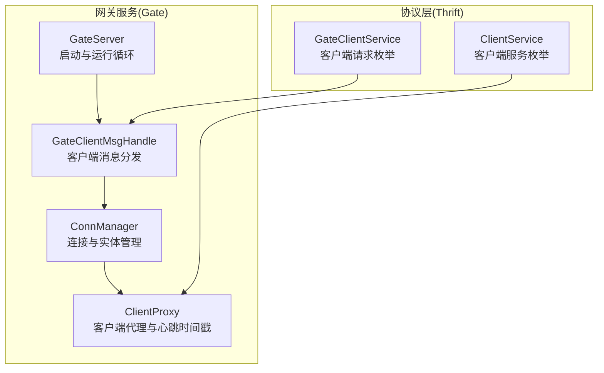
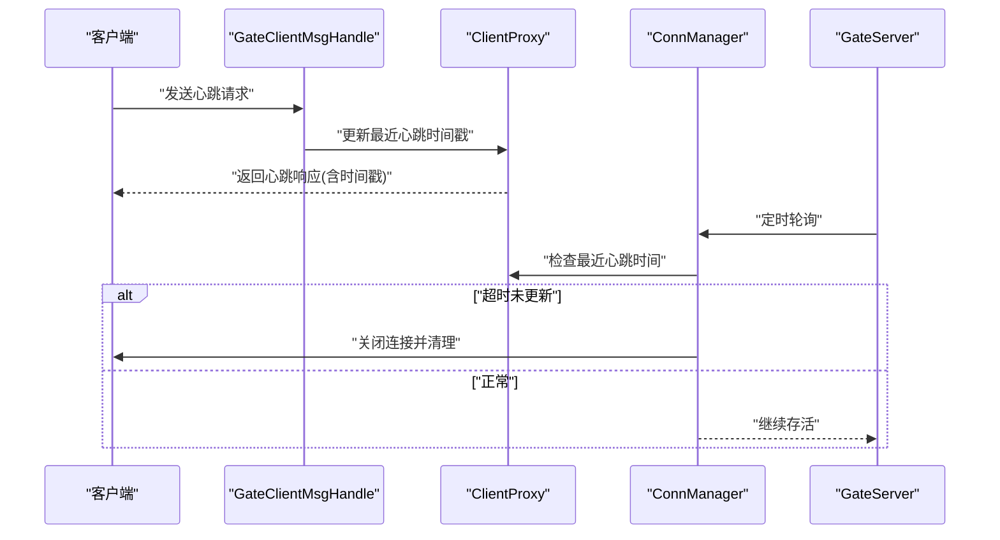
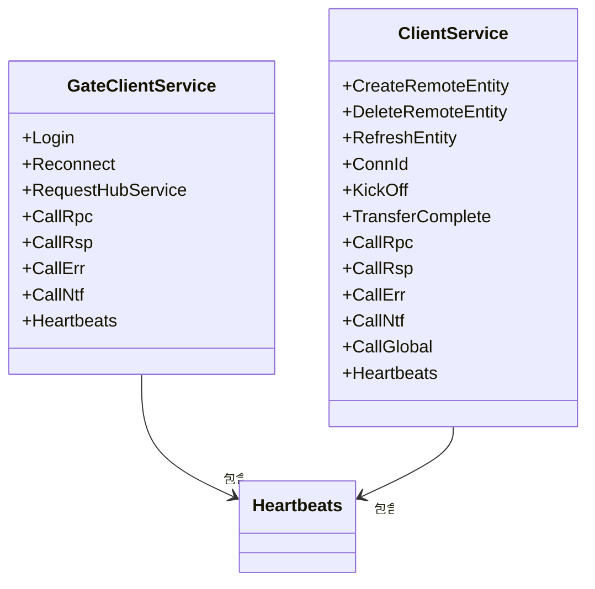
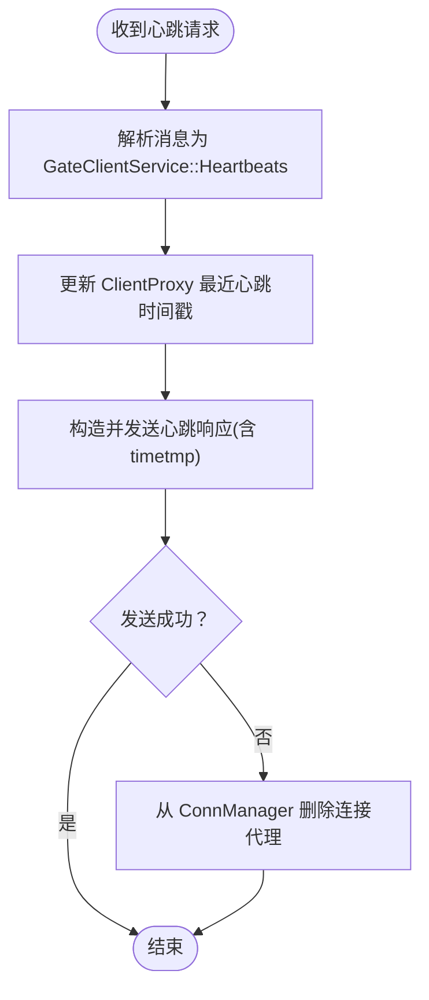
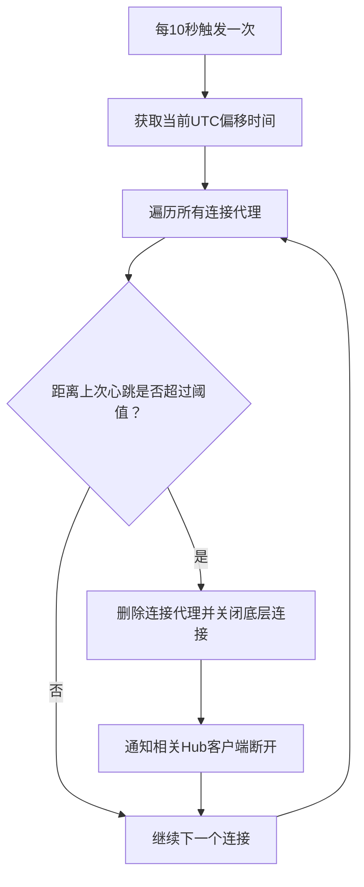
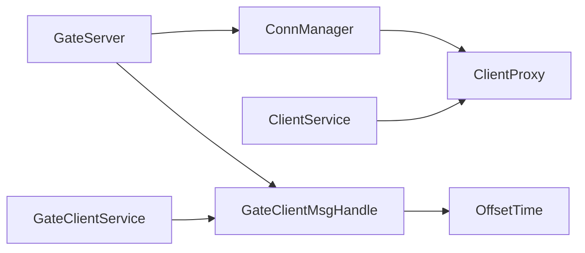

# 心跳检测服务

<cite>
**本文引用的文件**
- [server/lib/gate/src/lib.rs](file://server/lib/gate/src/lib.rs)
- [server/lib/gate/src/client_msg_handle.rs](file://server/lib/gate/src/client_msg_handle.rs)
- [server/lib/gate/src/client_proxy_manager.rs](file://server/lib/gate/src/client_proxy_manager.rs)
- [server/lib/gate/src/conn_manager.rs](file://server/lib/gate/src/conn_manager.rs)
- [crates/proto/src/gate.rs](file://crates/proto/src/gate.rs)
- [crates/proto/src/client.rs](file://crates/proto/src/client.rs)
- [sample/server/src/engine/heartbeat_svr.py](file://sample/server/src/engine/heartbeat_svr.py)
- [sample/client/py/engine/heartbeat_cli.py](file://sample/client/py/engine/heartbeat_cli.py)
- [sample/client/ts/engine/heartbeat_cli.ts](file://sample/client/ts/engine/heartbeat_cli.ts)
- [sample/proto/proto/hub_call_client/heartbeat.juggle](file://sample/proto/proto/hub_call_client/heartbeat.juggle)
</cite>

## 目录
1. [简介](#简介)
2. [项目结构](#项目结构)
3. [核心组件](#核心组件)
4. [架构总览](#架构总览)
5. [详细组件分析](#详细组件分析)
6. [依赖分析](#依赖分析)
7. [性能考虑](#性能考虑)
8. [故障排查指南](#故障排查指南)
9. [结论](#结论)
10. [附录](#附录)

## 简介
本指南围绕心跳检测服务的实现进行系统化说明，涵盖心跳包格式、检测间隔、连接状态监控、定时任务调度、异常处理、协议消息格式与处理流程等。文档同时给出配置参数建议、性能优化策略与常见问题排查方法，帮助开发者正确实现并维护心跳功能。

## 项目结构
心跳检测服务位于网关（Gate）模块中，涉及客户端到网关的消息处理、连接管理与周期性轮询清理不活跃连接。协议层通过 Thrift 定义了心跳请求与响应消息类型，服务端在收到心跳后更新最近心跳时间戳，并向客户端回发带时间戳的心跳响应。

**图表来源**
- [server/lib/gate/src/lib.rs:59-149](file://server/lib/gate/src/lib.rs#L59-L149)
- [server/lib/gate/src/client_msg_handle.rs:48-116](file://server/lib/gate/src/client_msg_handle.rs#L48-L116)
- [server/lib/gate/src/conn_manager.rs:23-62](file://server/lib/gate/src/conn_manager.rs#L23-L62)
- [server/lib/gate/src/client_proxy_manager.rs:148-171](file://server/lib/gate/src/client_proxy_manager.rs#L148-L171)
- [crates/proto/src/gate.rs:2007-2017](file://crates/proto/src/gate.rs#L2007-L2017)
- [crates/proto/src/client.rs:855-869](file://crates/proto/src/client.rs#L855-L869)

**章节来源**
- [server/lib/gate/src/lib.rs:59-149](file://server/lib/gate/src/lib.rs#L59-L149)
- [server/lib/gate/src/client_msg_handle.rs:48-116](file://server/lib/gate/src/client_msg_handle.rs#L48-L116)
- [server/lib/gate/src/conn_manager.rs:23-62](file://server/lib/gate/src/conn_manager.rs#L23-L62)
- [server/lib/gate/src/client_proxy_manager.rs:148-171](file://server/lib/gate/src/client_proxy_manager.rs#L148-L171)
- [crates/proto/src/gate.rs:2007-2017](file://crates/proto/src/gate.rs#L2007-L2017)
- [crates/proto/src/client.rs:855-869](file://crates/proto/src/client.rs#L855-L869)

## 核心组件
- GateServer：负责监听客户端连接、启动心跳轮询任务、运行主循环与健康状态上报。
- GateClientMsgHandle：解析来自客户端的消息，分发到具体处理函数，其中包含心跳处理分支。
- ConnManager：维护所有连接与实体，周期性检查各连接最近心跳时间，超时则关闭连接并通知相关 Hub。
- ClientProxy：每个客户端连接对应的代理对象，保存连接 ID、写入器、Hub 连接集合、最近心跳时间戳等。
- 协议层（GateClientService/ClientService）：定义心跳请求与响应消息结构及序列化/反序列化逻辑。

**章节来源**
- [server/lib/gate/src/lib.rs:59-149](file://server/lib/gate/src/lib.rs#L59-L149)
- [server/lib/gate/src/client_msg_handle.rs:48-116](file://server/lib/gate/src/client_msg_handle.rs#L48-L116)
- [server/lib/gate/src/conn_manager.rs:176-206](file://server/lib/gate/src/conn_manager.rs#L176-L206)
- [server/lib/gate/src/client_proxy_manager.rs:148-171](file://server/lib/gate/src/client_proxy_manager.rs#L148-L171)
- [crates/proto/src/gate.rs:2007-2017](file://crates/proto/src/gate.rs#L2007-L2017)
- [crates/proto/src/client.rs:855-869](file://crates/proto/src/client.rs#L855-L869)

## 架构总览
心跳检测的整体流程如下：
- 客户端周期性发送心跳请求至网关。
- 网关解析请求，更新该连接的最近心跳时间戳，并向客户端回发心跳响应（携带当前 UTC 时间偏移后的 Unix 时间戳）。
- 网关后台定时任务定期扫描所有连接，若某连接超过阈值未更新心跳，则主动断开连接并清理相关资源。

**图表来源**
- [server/lib/gate/src/client_msg_handle.rs:495-514](file://server/lib/gate/src/client_msg_handle.rs#L495-L514)
- [server/lib/gate/src/client_proxy_manager.rs:236-238](file://server/lib/gate/src/client_proxy_manager.rs#L236-L238)
- [server/lib/gate/src/conn_manager.rs:176-206](file://server/lib/gate/src/conn_manager.rs#L176-L206)
- [server/lib/gate/src/lib.rs:50-57](file://server/lib/gate/src/lib.rs#L50-L57)

## 详细组件分析

### 心跳协议与数据结构
- 心跳请求（客户端 -> 网关）
  - 类型：GateClientService::Heartbeats
  - 消息体：空结构（仅标识字段）
  - 序列化/反序列化：由 GateClientService 的 Thrift 实现完成
- 心跳响应（网关 -> 客户端）
  - 类型：ClientService::Heartbeats
  - 消息体：包含 timetmp 字段（i64），表示 UTC 时间偏移后的时间戳
  - 序列化/反序列化：由 ClientService 的 Thrift 实现完成

**图表来源**
- [crates/proto/src/gate.rs:2007-2017](file://crates/proto/src/gate.rs#L2007-L2017)
- [crates/proto/src/client.rs:855-869](file://crates/proto/src/client.rs#L855-L869)

**章节来源**
- [crates/proto/src/gate.rs:1990-2001](file://crates/proto/src/gate.rs#L1990-L2001)
- [crates/proto/src/gate.rs:2007-2017](file://crates/proto/src/gate.rs#L2007-L2017)
- [crates/proto/src/client.rs:830-849](file://crates/proto/src/client.rs#L830-L849)
- [crates/proto/src/client.rs:855-869](file://crates/proto/src/client.rs#L855-L869)

### 心跳处理流程
- 客户端发送心跳请求
- 网关消息处理器解析并调用 do_call_gate_heartbeats
- 更新 ClientProxy 的 last_heartbeats_timetmp 为当前 UTC 偏移时间
- 向客户端发送心跳响应（带 timetmp）
- 若发送失败，从 ConnManager 中删除该连接代理

**图表来源**
- [server/lib/gate/src/client_msg_handle.rs:495-514](file://server/lib/gate/src/client_msg_handle.rs#L495-L514)
- [server/lib/gate/src/client_proxy_manager.rs:236-238](file://server/lib/gate/src/client_proxy_manager.rs#L236-L238)
- [server/lib/gate/src/conn_manager.rs:176-206](file://server/lib/gate/src/conn_manager.rs#L176-L206)

**章节来源**
- [server/lib/gate/src/client_msg_handle.rs:495-514](file://server/lib/gate/src/client_msg_handle.rs#L495-L514)
- [server/lib/gate/src/client_proxy_manager.rs:236-238](file://server/lib/gate/src/client_proxy_manager.rs#L236-L238)

### 定时任务与超时控制
- GateServer 启动一个每 10 秒执行一次的轮询任务，调用 ConnManager::poll
- ConnManager::poll 获取当前时间，遍历所有 ClientProxy
- 对于超过阈值（示例中为 6000ms）未更新心跳的连接，删除其代理并清理关联实体与 Hub 连接

**图表来源**
- [server/lib/gate/src/lib.rs:50-57](file://server/lib/gate/src/lib.rs#L50-L57)
- [server/lib/gate/src/conn_manager.rs:176-206](file://server/lib/gate/src/conn_manager.rs#L176-L206)

**章节来源**
- [server/lib/gate/src/lib.rs:50-57](file://server/lib/gate/src/lib.rs#L50-L57)
- [server/lib/gate/src/conn_manager.rs:176-206](file://server/lib/gate/src/conn_manager.rs#L176-L206)

### 异常处理机制
- 心跳处理过程中若 ClientProxy 已被销毁，记录错误日志并忽略
- 发送心跳响应失败时，立即从 ConnManager 删除该连接代理，避免悬挂连接
- 超时清理时，对每个失效 Hub 连接尝试发送断开通知，若再次失败则移除该 Hub 代理

**章节来源**
- [server/lib/gate/src/client_msg_handle.rs:511-513](file://server/lib/gate/src/client_msg_handle.rs#L511-L513)
- [server/lib/gate/src/client_msg_handle.rs:503-509](file://server/lib/gate/src/client_msg_handle.rs#L503-L509)
- [server/lib/gate/src/conn_manager.rs:194-203](file://server/lib/gate/src/conn_manager.rs#L194-L203)

### 心跳在连接维护、超时控制与服务器负载管理中的作用
- 连接维护：通过心跳维持长连接活性，及时发现网络异常或客户端崩溃
- 超时控制：基于最近心跳时间与阈值判断连接是否存活，避免僵尸连接占用资源
- 负载管理：定期清理不活跃连接，释放内存、句柄与会话资源；同时减少无效消息投递

**章节来源**
- [server/lib/gate/src/conn_manager.rs:176-206](file://server/lib/gate/src/conn_manager.rs#L176-L206)

### 配置参数与实现建议
- 心跳间隔（客户端侧）：建议与服务端轮询间隔相匹配，通常为 10 秒级别，避免过于频繁导致 CPU 与带宽压力
- 心跳阈值（服务端侧）：建议设置为心跳间隔的 3~6 倍，如心跳间隔 10 秒，阈值可设为 60 秒
- 超时清理周期：建议与心跳轮询一致（例如 10 秒），以平衡延迟与资源回收效率
- 时间同步：使用 OffsetTime 提供的 UTC 偏移时间，确保跨机房与 NTP 场景下时间一致性

**章节来源**
- [server/lib/gate/src/lib.rs:50-57](file://server/lib/gate/src/lib.rs#L50-L57)
- [server/lib/gate/src/conn_manager.rs:176-206](file://server/lib/gate/src/conn_manager.rs#L176-L206)
- [server/lib/gate/src/lib.rs:151-154](file://server/lib/gate/src/lib.rs#L151-L154)

### 心跳协议的消息格式与处理流程（Python/TypeScript 示例）
- Python 示例展示了服务端心跳调用器与客户端心跳响应模块的基本结构
- TypeScript 示例展示了前端心跳响应模块与回调封装
- 协议定义文件声明了心跳 RPC 接口与参数结构

**章节来源**
- [sample/server/src/engine/heartbeat_svr.py:12-46](file://sample/server/src/engine/heartbeat_svr.py#L12-L46)
- [sample/client/py/engine/heartbeat_cli.py:12-36](file://sample/client/py/engine/heartbeat_cli.py#L12-L36)
- [sample/client/ts/engine/heartbeat_cli.ts:8-38](file://sample/client/ts/engine/heartbeat_cli.ts#L8-L38)
- [sample/proto/proto/hub_call_client/heartbeat.juggle:3-5](file://sample/proto/proto/hub_call_client/heartbeat.juggle#L3-L5)

## 依赖分析
心跳服务的关键依赖关系如下：
- GateServer 依赖 ConnManager 进行连接与实体管理
- GateClientMsgHandle 依赖 OffsetTime 获取 UTC 偏移时间
- ClientProxy 维护连接状态与最近心跳时间戳
- 协议层（GateClientService/ClientService）提供心跳消息的序列化与反序列化

**图表来源**
- [server/lib/gate/src/lib.rs:84-91](file://server/lib/gate/src/lib.rs#L84-L91)
- [server/lib/gate/src/client_msg_handle.rs:48-51](file://server/lib/gate/src/client_msg_handle.rs#L48-L51)
- [server/lib/gate/src/client_proxy_manager.rs:148-157](file://server/lib/gate/src/client_proxy_manager.rs#L148-L157)
- [crates/proto/src/gate.rs:2007-2017](file://crates/proto/src/gate.rs#L2007-L2017)
- [crates/proto/src/client.rs:855-869](file://crates/proto/src/client.rs#L855-L869)

**章节来源**
- [server/lib/gate/src/lib.rs:84-91](file://server/lib/gate/src/lib.rs#L84-L91)
- [server/lib/gate/src/client_msg_handle.rs:48-51](file://server/lib/gate/src/client_msg_handle.rs#L48-L51)
- [server/lib/gate/src/client_proxy_manager.rs:148-157](file://server/lib/gate/src/client_proxy_manager.rs#L148-L157)
- [crates/proto/src/gate.rs:2007-2017](file://crates/proto/src/gate.rs#L2007-L2017)
- [crates/proto/src/client.rs:855-869](file://crates/proto/src/client.rs#L855-L869)

## 性能考虑
- 心跳频率与阈值：过高的心跳频率会增加 CPU 与网络开销；过低的阈值可能导致误杀活跃连接
- 轮询粒度：10 秒轮询在大多数场景下已足够，可根据业务并发量调整
- 时间计算：统一使用 OffsetTime 计算时间戳，避免多线程/异步场景下的竞态
- 资源回收：超时连接清理应尽量减少锁持有时间，优先在短临界区内删除映射，再做耗时操作

[本节为通用指导，无需列出章节来源]

## 故障排查指南
- 现象：客户端频繁断线
  - 检查客户端心跳间隔是否过大，或服务端阈值设置过小
  - 查看服务端日志中 ConnManager 的超时删除记录
- 现象：心跳响应未到达客户端
  - 检查 GateClientMsgHandle::do_call_gate_heartbeats 的发送路径
  - 关注发送失败分支，确认连接代理是否被提前删除
- 现象：服务端 CPU 使用率升高
  - 检查轮询频率与连接数量，适当增大轮询间隔或限制最大连接数
  - 确认时间计算逻辑未被频繁调用

**章节来源**
- [server/lib/gate/src/conn_manager.rs:189-204](file://server/lib/gate/src/conn_manager.rs#L189-L204)
- [server/lib/gate/src/client_msg_handle.rs:503-509](file://server/lib/gate/src/client_msg_handle.rs#L503-L509)

## 结论
心跳检测服务通过“请求-响应”与“周期性轮询”双通道保障连接活性，结合时间戳与阈值实现可靠的超时控制。合理设置心跳间隔与阈值、优化轮询策略与资源回收，可在保证稳定性的同时降低服务器负载。协议层采用 Thrift 枚举与结构体，清晰地定义了心跳消息格式，便于跨语言扩展与维护。

[本节为总结性内容，无需列出章节来源]

## 附录
- 心跳请求与响应的消息体字段
  - 请求：GateClientService::Heartbeats（空结构）
  - 响应：ClientService::Heartbeats（包含 timetmp 字段）

**章节来源**
- [crates/proto/src/gate.rs:1990-2001](file://crates/proto/src/gate.rs#L1990-L2001)
- [crates/proto/src/client.rs:830-849](file://crates/proto/src/client.rs#L830-L849)