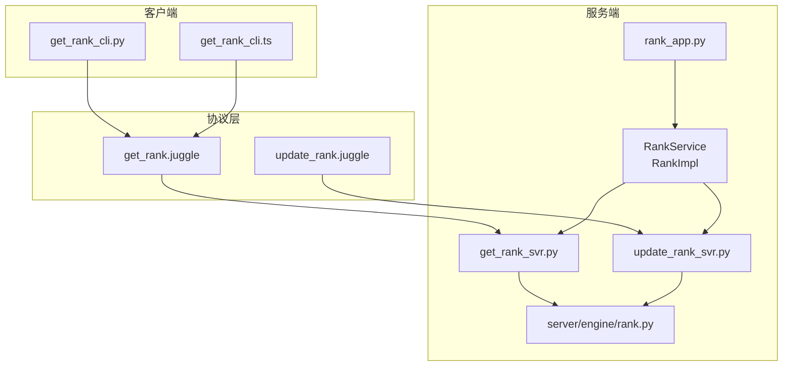
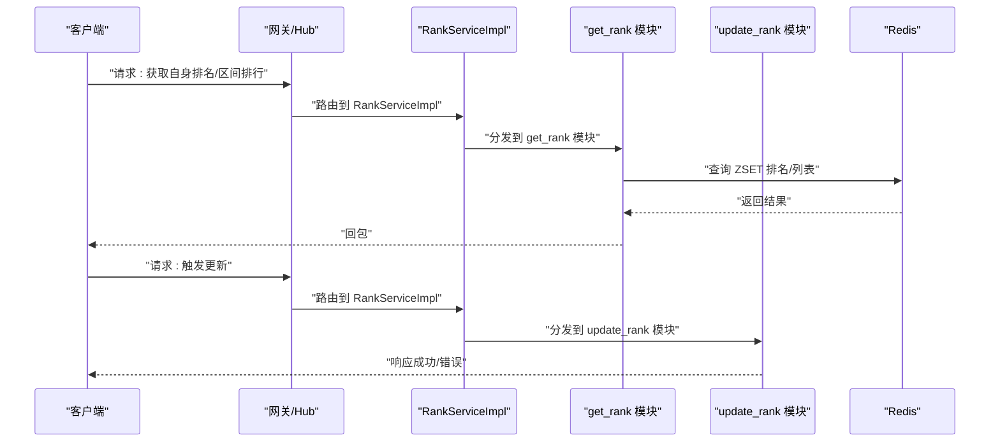
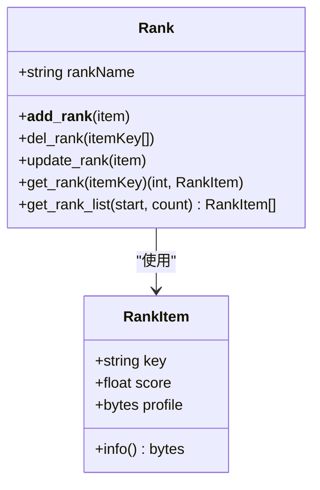
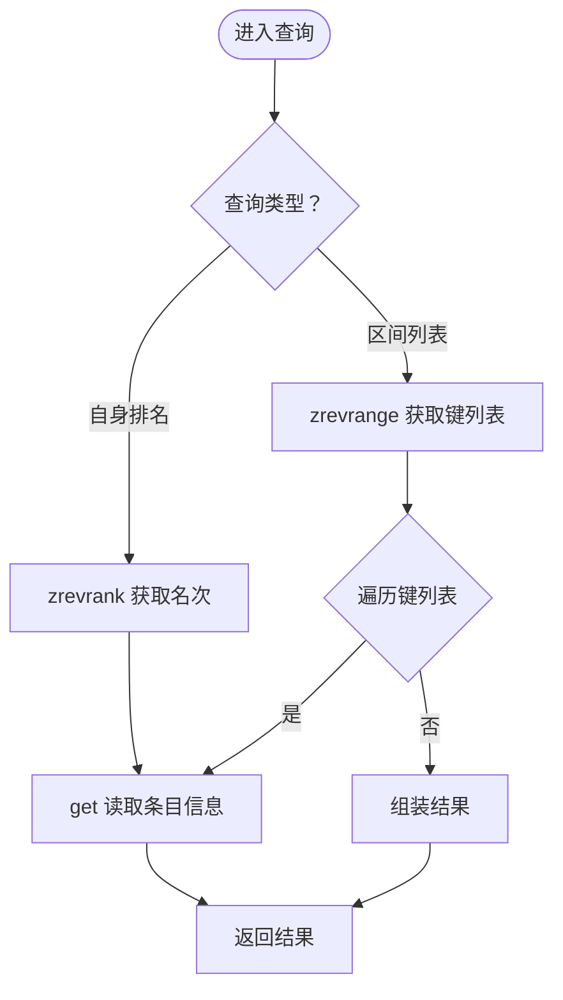
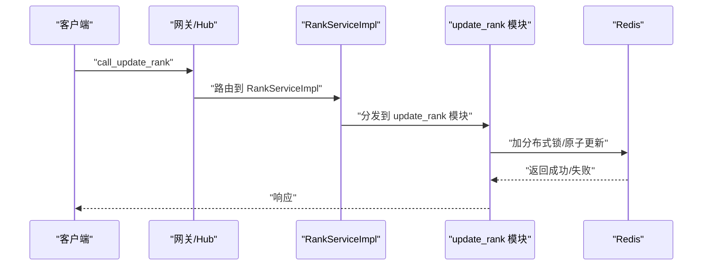
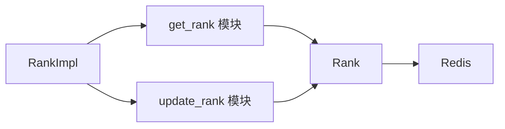

# 排行榜服务

<cite>
**本文引用的文件**
- [server/engine/rank.py](file://server/engine/rank.py)
- [sample/server/src/engine/engine/rank.py](file://sample/server/src/engine/engine/rank.py)
- [sample/server/src/engine/get_rank_svr.py](file://sample/server/src/engine/get_rank_svr.py)
- [sample/server/src/engine/update_rank_svr.py](file://sample/server/src/engine/update_rank_svr.py)
- [sample/server/src/rank_app.py](file://sample/server/src/rank_app.py)
- [sample/server/config/rank.cfg](file://sample/server/config/rank.cfg)
- [sample/proto/proto/client_call_hub/get_rank.juggle](file://sample/proto/proto/client_call_hub/get_rank.juggle)
- [sample/proto/proto/hub_call_hub/update_rank.juggle](file://sample/proto/proto/hub_call_hub/update_rank.juggle)
- [sample/client/py/engine/get_rank_cli.py](file://sample/client/py/engine/get_rank_cli.py)
- [sample/client/ts/engine/get_rank_cli.ts](file://sample/client/ts/engine/get_rank_cli.ts)
</cite>

## 目录
1. [简介](#简介)
2. [项目结构](#项目结构)
3. [核心组件](#核心组件)
4. [架构总览](#架构总览)
5. [详细组件分析](#详细组件分析)
6. [依赖关系分析](#依赖关系分析)
7. [性能考量](#性能考量)
8. [故障排查指南](#故障排查指南)
9. [结论](#结论)
10. [附录](#附录)

## 简介
本指南面向需要在游戏或应用中实现高性能排行榜系统的开发者，基于仓库中的现有实现，系统性讲解排行榜的数据结构设计、Redis 缓存策略、数据库交互机制、更新触发与并发控制、一致性保障、API 设计、查询优化与性能调优，并给出持久化与批量更新、异常恢复的实践建议。读者无需深入底层即可理解如何扩展与稳定运行该排行榜服务。

## 项目结构
该排行榜服务由“协议定义”“服务端实现”“客户端示例”三部分组成：
- 协议层：通过 Juggle 定义客户端到网关、网关到 Hub 的 RPC 接口。
- 服务层：Rank 服务实体负责注册回调、转发请求并调用 Redis 实现增删改查。
- 客户端层：Python/TypeScript 示例演示如何发起查询与更新请求。

图表来源
- [sample/proto/proto/client_call_hub/get_rank.juggle:1-6](file://sample/proto/proto/client_call_hub/get_rank.juggle#L1-L6)
- [sample/proto/proto/hub_call_hub/update_rank.juggle:1-5](file://sample/proto/proto/hub_call_hub/update_rank.juggle#L1-L5)
- [sample/server/src/rank_app.py:1-72](file://sample/server/src/rank_app.py#L1-L72)
- [sample/server/src/engine/get_rank_svr.py:1-94](file://sample/server/src/engine/get_rank_svr.py#L1-L94)
- [sample/server/src/engine/update_rank_svr.py:1-88](file://sample/server/src/engine/update_rank_svr.py#L1-L88)
- [server/engine/rank.py:1-47](file://server/engine/rank.py#L1-L47)
- [sample/client/py/engine/get_rank_cli.py:1-83](file://sample/client/py/engine/get_rank_cli.py#L1-L83)
- [sample/client/ts/engine/get_rank_cli.ts:1-105](file://sample/client/ts/engine/get_rank_cli.ts#L1-L105)

章节来源
- [sample/server/src/rank_app.py:1-72](file://sample/server/src/rank_app.py#L1-L72)
- [sample/server/config/rank.cfg:1-12](file://sample/server/config/rank.cfg#L1-L12)

## 核心组件
- 排行榜数据模型与操作
  - RankItem：封装排行条目键、分数与个人资料。
  - Rank：封装对 Redis 的 ZSET（排序集合）与普通键值存储的操作，提供新增、删除、更新、查询单个、查询列表等方法。
- 服务模块
  - get_rank 模块：注册客户端请求回调，处理“获取自身排名”“获取区间排行列表”两类请求。
  - update_rank 模块：注册 Hub 请求回调，处理“触发更新”请求。
- 服务实体与路由
  - RankService：服务注册与远程实体创建。
  - RankImpl：实体实现，绑定两个模块回调；当前示例返回固定测试数据。

章节来源
- [server/engine/rank.py:1-47](file://server/engine/rank.py#L1-L47)
- [sample/server/src/engine/engine/rank.py:1-47](file://sample/server/src/engine/engine/rank.py#L1-L47)
- [sample/server/src/engine/get_rank_svr.py:1-94](file://sample/server/src/engine/get_rank_svr.py#L1-L94)
- [sample/server/src/engine/update_rank_svr.py:1-88](file://sample/server/src/engine/update_rank_svr.py#L1-L88)
- [sample/server/src/rank_app.py:1-72](file://sample/server/src/rank_app.py#L1-L72)

## 架构总览
下图展示了从客户端到服务端、再到 Redis 的完整调用链路与职责分工：

图表来源
- [sample/server/src/engine/get_rank_svr.py:76-89](file://sample/server/src/engine/get_rank_svr.py#L76-L89)
- [sample/server/src/engine/update_rank_svr.py:79-84](file://sample/server/src/engine/update_rank_svr.py#L79-L84)
- [server/engine/rank.py:34-47](file://server/engine/rank.py#L34-L47)

## 详细组件分析

### 数据模型与存储设计
- 存储结构
  - 使用 Redis ZSET 存放排行榜主索引，键名为“rank:{榜单名}”，成员为条目键，分数为玩家分数。
  - 使用 Redis String 存放每个条目的完整信息（包含 key/score/profile），键为条目键。
- 数据模型类
  - RankItem：封装条目字段与序列化方法。
  - Rank：封装对 ZSET 与 String 的原子性操作，支持新增、删除、更新、查询单个、查询列表。

图表来源
- [server/engine/rank.py:4-47](file://server/engine/rank.py#L4-L47)
- [sample/server/src/engine/engine/rank.py:4-47](file://sample/server/src/engine/engine/rank.py#L4-L47)

章节来源
- [server/engine/rank.py:1-47](file://server/engine/rank.py#L1-L47)
- [sample/server/src/engine/engine/rank.py:1-47](file://sample/server/src/engine/engine/rank.py#L1-L47)

### 查询流程与算法
- 获取自身排名
  - 步骤：通过 ZSET 反向排名获取名次，再通过条目键读取完整信息。
- 获取区间排行列表
  - 步骤：ZSET 反向区间取键，再逐个读取条目完整信息。
- 复杂度与注意点
  - 单条查询：O(log N)（ZSET 排名/查找）+ O(1)（String 读取）。
  - 区间查询：O(log N + k)（k 为区间长度）+ O(k)（逐条读取）。

图表来源
- [server/engine/rank.py:34-47](file://server/engine/rank.py#L34-L47)

章节来源
- [server/engine/rank.py:34-47](file://server/engine/rank.py#L34-L47)

### 更新流程与触发条件
- 触发入口
  - 客户端通过 Hub 调用“触发更新”请求，服务端模块接收后执行业务逻辑。
- 当前实现
  - RankImpl 对“触发更新”直接回包成功；实际业务可在此处接入分数计算与写入逻辑。
- 并发与一致性
  - 建议在更新前加分布式锁，更新时使用 Lua 原子脚本或事务，确保 ZSET 与 String 同步更新。

图表来源
- [sample/server/src/engine/update_rank_svr.py:79-84](file://sample/server/src/engine/update_rank_svr.py#L79-L84)
- [sample/server/src/rank_app.py:28-30](file://sample/server/src/rank_app.py#L28-L30)

章节来源
- [sample/server/src/engine/update_rank_svr.py:1-88](file://sample/server/src/engine/update_rank_svr.py#L1-L88)
- [sample/server/src/rank_app.py:28-30](file://sample/server/src/rank_app.py#L28-L30)

### API 接口设计
- 获取自身排名
  - 请求：entity_id（字符串）
  - 响应：role_rank_info（包含实体 ID、排名、角色名等）
- 获取区间排行列表
  - 请求：start（起始索引）、end（结束索引）
  - 响应：role_rank_info 数组
- 触发更新
  - 请求：entity_id（字符串）
  - 响应：无额外参数

章节来源
- [sample/proto/proto/client_call_hub/get_rank.juggle:3-6](file://sample/proto/proto/client_call_hub/get_rank.juggle#L3-L6)
- [sample/proto/proto/hub_call_hub/update_rank.juggle:3-5](file://sample/proto/proto/hub_call_hub/update_rank.juggle#L3-L5)

### 客户端调用示例
- Python/TypeScript 客户端均提供对应的 Caller 与回调封装，支持注册成功/错误回调，自动管理回调生命周期。

章节来源
- [sample/client/py/engine/get_rank_cli.py:62-79](file://sample/client/py/engine/get_rank_cli.py#L62-L79)
- [sample/client/ts/engine/get_rank_cli.ts:81-100](file://sample/client/ts/engine/get_rank_cli.ts#L81-L100)

## 依赖关系分析
- 组件耦合
  - RankServiceImpl 依赖两个模块回调；模块内部依赖 Rank 类进行 Redis 操作。
- 外部依赖
  - Redis：ZSET 用于排序，String 用于存储条目详情。
  - 配置：rank.cfg 提供 Redis 地址、日志级别与端口等运行参数。
- 可能的循环依赖
  - 当前模块之间为单向依赖，未见循环导入。

图表来源
- [sample/server/src/rank_app.py:7-15](file://sample/server/src/rank_app.py#L7-L15)
- [sample/server/src/engine/get_rank_svr.py:67-75](file://sample/server/src/engine/get_rank_svr.py#L67-L75)
- [sample/server/src/engine/update_rank_svr.py:72-78](file://sample/server/src/engine/update_rank_svr.py#L72-L78)
- [server/engine/rank.py:16-47](file://server/engine/rank.py#L16-L47)

章节来源
- [sample/server/src/rank_app.py:1-72](file://sample/server/src/rank_app.py#L1-L72)
- [sample/server/config/rank.cfg:1-12](file://sample/server/config/rank.cfg#L1-L12)

## 性能考量
- 查询优化
  - 使用 zrevrank 获取自身排名，复杂度 O(log N)。
  - 区间查询使用 zrevrange，避免多次往返，随后批量读取条目详情。
- 缓存策略
  - Redis 已作为主要缓存层；建议对热点榜单增加本地 LRU 缓存，减少跨进程访问。
- 批量更新
  - 使用 Redis Pipeline 或事务批量写入，降低网络开销。
- 分布式锁
  - 更新前加锁，避免并发写导致的排名抖动。
- 分页与限流
  - 区间查询设置上限，防止超大范围查询拖垮服务。
- 日志与监控
  - 结合 rank.cfg 中的日志配置，记录慢查询与异常事件。

[本节为通用性能建议，不直接分析具体文件]

## 故障排查指南
- 常见问题
  - Redis 连接失败：检查 rank.cfg 中 redis_url 是否正确。
  - 查询结果为空：确认 ZSET 键是否存在、条目键是否一致。
  - 更新无效：确认 Hub 回调已注册且触发路径正确。
- 排查步骤
  - 查看服务日志（rank.log）定位异常。
  - 在 RankImpl 中打印关键路径日志，验证回调是否被触发。
  - 使用 Redis 客户端验证 ZSET 与 String 的键值状态。

章节来源
- [sample/server/config/rank.cfg:7-12](file://sample/server/config/rank.cfg#L7-L12)
- [sample/server/src/rank_app.py:28-38](file://sample/server/src/rank_app.py#L28-L38)

## 结论
该排行榜服务以 Redis 为核心，结合清晰的模块化设计与协议定义，提供了可扩展的查询与更新能力。建议在生产环境中补充分布式锁、原子更新、批量写入与本地缓存策略，并完善异常恢复与监控告警，以获得更稳健的性能表现。

[本节为总结性内容，不直接分析具体文件]

## 附录

### API 定义速览
- 获取自身排名
  - 请求：entity_id（字符串）
  - 响应：role_rank_info
- 获取区间排行列表
  - 请求：start（整型）、end（整型）
  - 响应：role_rank_info 数组
- 触发更新
  - 请求：entity_id（字符串）
  - 响应：无

章节来源
- [sample/proto/proto/client_call_hub/get_rank.juggle:3-6](file://sample/proto/proto/client_call_hub/get_rank.juggle#L3-L6)
- [sample/proto/proto/hub_call_hub/update_rank.juggle:3-5](file://sample/proto/proto/hub_call_hub/update_rank.juggle#L3-L5)