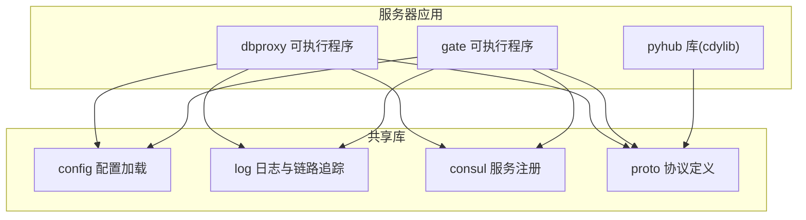
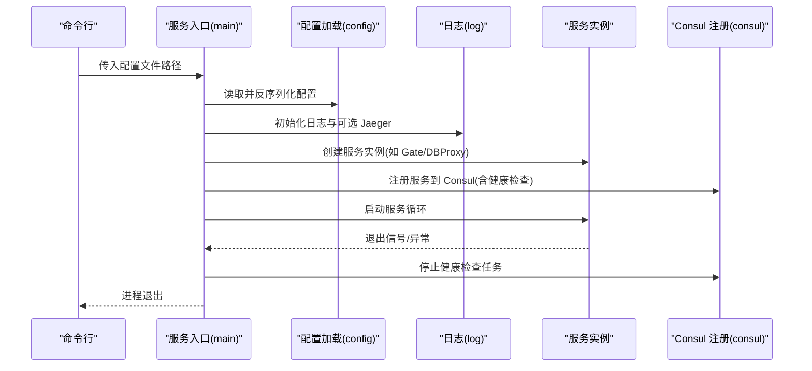
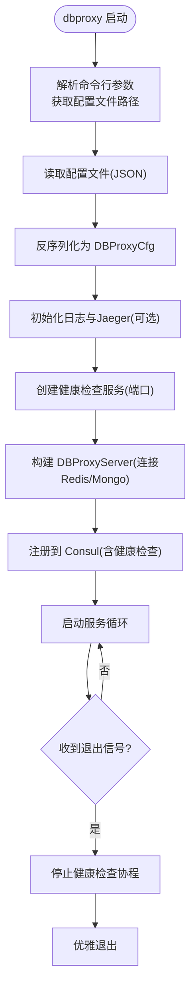
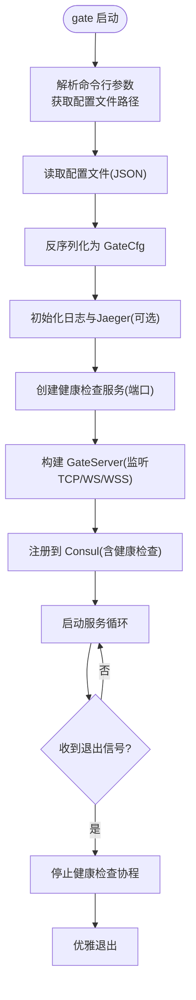
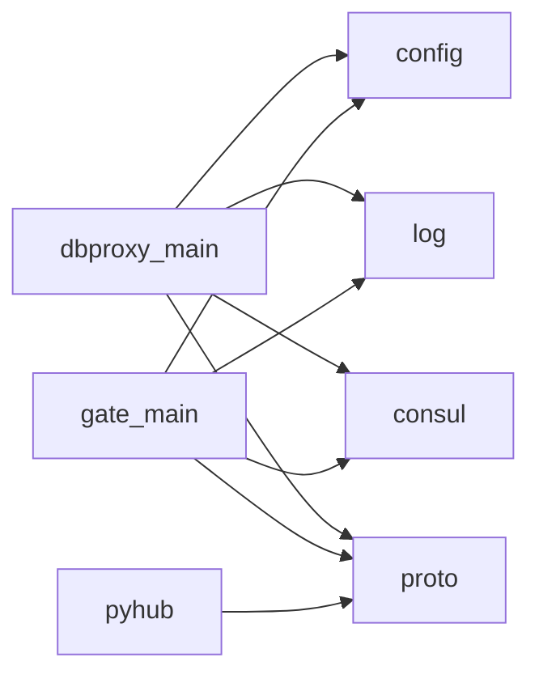

# 服务器应用配置

<cite>
**本文引用的文件**
- [server/Cargo.toml](file://server/Cargo.toml)
- [crates/config/src/lib.rs](file://crates/config/src/lib.rs)
- [crates/consul/src/lib.rs](file://crates/consul/src/lib.rs)
- [crates/log/src/lib.rs](file://crates/log/src/lib.rs)
- [crates/proto/src/lib.rs](file://crates/proto/src/lib.rs)
- [crates/proto/src/gate.rs](file://crates/proto/src/gate.rs)
- [crates/proto/src/dbproxy.rs](file://crates/proto/src/dbproxy.rs)
- [server/src/dbproxy_main.rs](file://server/src/dbproxy_main.rs)
- [server/src/gate_main.rs](file://server/src/gate_main.rs)
- [server/src/hub_lib.rs](file://server/src/hub_lib.rs)
- [sample/server/config/gate.cfg](file://sample/server/config/gate.cfg)
- [sample/server/config/dbproxy.cfg](file://sample/server/config/dbproxy.cfg)
- [sample/server/config/player.cfg](file://sample/server/config/player.cfg)
- [sample/server/config/rank.cfg](file://sample/server/config/rank.cfg)
- [server/dependences/redis/redis.conf](file://server/dependences/redis/redis.conf)
- [server/dependences/redis/sentinel.conf](file://server/dependences/redis/sentinel.conf)
- [sample/server/start.bat](file://sample/server/start.bat)
</cite>

## 目录
1. [简介](#简介)
2. [项目结构](#项目结构)
3. [核心组件](#核心组件)
4. [架构总览](#架构总览)
5. [详细组件分析](#详细组件分析)
6. [依赖分析](#依赖分析)
7. [性能考虑](#性能考虑)
8. [故障排查指南](#故障排查指南)
9. [结论](#结论)
10. [附录](#附录)

## 简介
本指南面向服务器应用的配置与部署，覆盖启动流程、配置文件结构、运行参数、服务类型差异、环境变量、启动脚本、初始化顺序、依赖关系与服务注册机制，并提供模板示例、参数说明与常见问题解决方案。同时给出集群部署、负载均衡与高可用配置建议，帮助开发者正确配置与部署服务器应用。

## 项目结构
服务器应用由多二进制可执行程序与共享库组成，采用模块化设计，通过统一的配置加载与日志、健康检查、Consul 注册等基础设施支撑各服务启动与运行。

**图表来源**
- [server/Cargo.toml:8-33](file://server/Cargo.toml#L8-L33)
- [server/src/dbproxy_main.rs:10-13](file://server/src/dbproxy_main.rs#L10-L13)
- [server/src/gate_main.rs:13-16](file://server/src/gate_main.rs#L13-L16)

**章节来源**
- [server/Cargo.toml:1-42](file://server/Cargo.toml#L1-L42)

## 核心组件
- 配置加载：从 JSON 文件读取并反序列化为具体配置结构体，支持 dbproxy、gate 等服务的差异化配置。
- 日志与链路追踪：基于 tracing 与可选的 OpenTelemetry Jaeger 输出，支持滚动日志文件与级别控制。
- Consul 服务注册：在启动时向 Consul 注册服务实例，提供健康检查地址，便于服务发现与治理。
- 协议定义：通过 Thrift 自动生成的 Rust 模块承载跨服务通信的消息结构，如客户端到网关、网关到 Hub 的消息类型。

**章节来源**
- [crates/config/src/lib.rs:1-13](file://crates/config/src/lib.rs#L1-L13)
- [crates/log/src/lib.rs:1-35](file://crates/log/src/lib.rs#L1-L35)
- [crates/consul/src/lib.rs:1-66](file://crates/consul/src/lib.rs#L1-L66)
- [crates/proto/src/lib.rs:1-5](file://crates/proto/src/lib.rs#L1-L5)

## 架构总览
下图展示服务器应用启动的关键路径：命令行参数解析配置文件、初始化日志与健康检查、创建服务实例、注册 Consul、启动服务循环并在退出时清理资源。

**图表来源**
- [server/src/dbproxy_main.rs:15-77](file://server/src/dbproxy_main.rs#L15-L77)
- [server/src/gate_main.rs:33-116](file://server/src/gate_main.rs#L33-L116)
- [crates/config/src/lib.rs:5-12](file://crates/config/src/lib.rs#L5-L12)
- [crates/log/src/lib.rs:8-34](file://crates/log/src/lib.rs#L8-L34)
- [crates/consul/src/lib.rs:30-39](file://crates/consul/src/lib.rs#L30-L39)

## 详细组件分析

### dbproxy 服务配置与启动流程
- 启动入口：解析命令行参数获取配置文件路径；加载 JSON 并反序列化为 DBProxyCfg。
- 日志初始化：根据配置选择日志级别、输出目录与文件名，可选启用 Jaeger 链路追踪。
- 健康检查：创建 HealthHandle 并以 0.0.0.0:health_port 对外暴露 /health 接口。
- 服务实例：基于配置连接 Redis/Mongo，初始化索引与全局 ID 规则，创建 DBProxyServer。
- Consul 注册：使用本地 IP 与健康检查地址注册 dbproxy 实例，周期性健康检查。
- 生命周期：启动服务循环与健康服务协程，退出时停止健康服务并优雅退出。

**图表来源**
- [server/src/dbproxy_main.rs:15-77](file://server/src/dbproxy_main.rs#L15-L77)

**章节来源**
- [server/src/dbproxy_main.rs:1-78](file://server/src/dbproxy_main.rs#L1-L78)
- [sample/server/config/dbproxy.cfg:1-13](file://sample/server/config/dbproxy.cfg#L1-L13)

### gate 服务配置与启动流程
- 启动入口：解析命令行参数获取配置文件路径；加载 JSON 并反序列化为 GateCfg。
- 日志初始化：根据配置初始化日志与可选 Jaeger。
- 健康检查：创建 HealthHandle 并以 0.0.0.0:health_port 对外暴露 /health 接口。
- 网络监听：根据配置决定 TCP/WS/WSS 监听端口，构造 GateServer。
- Consul 注册：使用本地 IP 与服务端口注册 gate 实例，周期性健康检查。
- 生命周期：启动服务循环与健康服务协程，退出时停止健康服务并优雅退出。

**图表来源**
- [server/src/gate_main.rs:33-116](file://server/src/gate_main.rs#L33-L116)

**章节来源**
- [server/src/gate_main.rs:1-117](file://server/src/gate_main.rs#L1-L117)
- [sample/server/config/gate.cfg:1-12](file://sample/server/config/gate.cfg#L1-L12)

### Python Hub 扩展模块
- pyhub 作为 cdylib 导出 HubContext、HubConnMsgPump、HubDBMsgPump 类型，供 Python 调用。
- 用于在 Python 层与 Hub 交互，实现业务逻辑扩展。

**章节来源**
- [server/src/hub_lib.rs:1-10](file://server/src/hub_lib.rs#L1-L10)
- [crates/proto/src/lib.rs:1-5](file://crates/proto/src/lib.rs#L1-L5)

### 配置文件结构与参数说明
以下为典型配置字段的含义与用途（以 JSON 字段为准）：

- 通用字段
  - namespace：命名空间，用于区分环境或租户。
  - consul_url：Consul 地址，用于服务注册与发现。
  - health_port：健康检查端口，对外暴露 /health。
  - log_level：日志级别(trace/debug/info/warn/error)。
  - log_file：日志文件名。
  - log_dir：日志输出目录。
  - jaeger_url：可选，OpenTelemetry Jaeger Agent 地址，启用链路追踪。

- dbproxy 特有
  - redis_url：Redis 连接串。
  - mongo_url：MongoDB 连接串。
  - guid/index：全局 ID 生成与索引配置，用于分布式唯一 ID 分配。
  - service_port：dbproxy 服务监听端口。

- gate 特有
  - service_port：网关服务监听端口。
  - client_tcp_port：客户端 TCP 监听端口（可选）。
  - client_ws_port：客户端 WebSocket 监听端口（可选）。
  - client_wss_cfg：客户端 WSS 配置（可选）。

- 业务服务特有
  - player/rank：save_time_interval/migrate_time_interval 等业务保存与迁移周期配置。
  - redis_url：业务服务连接 Redis。

**章节来源**
- [sample/server/config/gate.cfg:1-12](file://sample/server/config/gate.cfg#L1-L12)
- [sample/server/config/dbproxy.cfg:1-13](file://sample/server/config/dbproxy.cfg#L1-L13)
- [sample/server/config/player.cfg:1-12](file://sample/server/config/player.cfg#L1-L12)
- [sample/server/config/rank.cfg:1-12](file://sample/server/config/rank.cfg#L1-L12)

### 启动脚本与运行参数
- Windows 启动脚本：自动启动 Consul、Redis/Sentinel、dbproxy、gate、Python 业务服务。
- 运行参数：每个服务入口通过命令行传入配置文件路径，例如 gate.exe ../config/gate.cfg。

**章节来源**
- [sample/server/start.bat:1-23](file://sample/server/start.bat#L1-L23)

### 服务类型差异与协议
- dbproxy：负责全局 ID 分配、对象 CRUD 事件处理、与 MongoDB/Redis 交互。
- gate：负责客户端接入（TCP/WS/WSS）、转发请求至 Hub、维护会话与实体。
- 业务服务（player/rank）：按需实现业务逻辑，定期保存与迁移数据。

协议层面，通过 Thrift 生成的 Rust 模块承载消息结构，如 Hub 与客户端之间的实体创建、刷新、通知、RPC 等消息类型。

**章节来源**
- [crates/proto/src/gate.rs:1-800](file://crates/proto/src/gate.rs#L1-L800)
- [crates/proto/src/dbproxy.rs:1-800](file://crates/proto/src/dbproxy.rs#L1-L800)

## 依赖分析
- 组件耦合
  - dbproxy/gate 共同依赖 config、log、consul、health、proto。
  - pyhub 依赖 proto，用于 Python 扩展。
- 外部依赖
  - Consul：服务注册与发现。
  - Redis：缓存与消息通道。
  - MongoDB：持久化存储（dbproxy）。
  - Jaeger：链路追踪（可选）。
- 可能的循环依赖
  - 当前模块化清晰，未见直接循环依赖迹象。

**图表来源**
- [server/Cargo.toml:8-33](file://server/Cargo.toml#L8-L33)
- [server/src/dbproxy_main.rs:10-13](file://server/src/dbproxy_main.rs#L10-L13)
- [server/src/gate_main.rs:13-16](file://server/src/gate_main.rs#L13-L16)

**章节来源**
- [server/Cargo.toml:1-42](file://server/Cargo.toml#L1-L42)

## 性能考虑
- 日志与链路追踪
  - 使用滚动文件与异步写入，避免阻塞主业务线程。
  - Jaeger 开启仅在需要时启用，减少开销。
- 健康检查
  - 健康检查接口轻量，避免在高峰时段对业务造成额外压力。
- Redis/Mongo
  - 连接池与超时配置应结合实际 QPS 调优，避免阻塞。
- 线程与并发
  - 采用 Tokio 异步运行时，合理拆分任务，避免长耗时同步操作。

## 故障排查指南
- 配置加载失败
  - 现象：提示配置文件读取或反序列化失败。
  - 排查：确认配置文件路径、JSON 格式与字段名称一致。
- Consul 注册失败
  - 现象：服务未出现在 Consul 中。
  - 排查：确认 consul_url 可达、健康检查地址可达、服务端口未被占用。
- 健康检查异常
  - 现象：健康检查返回非 200。
  - 排查：检查 health_port 是否开放、日志中健康服务是否正常启动。
- Redis/Mongo 连接问题
  - 现象：dbproxy 启动失败或运行中断连。
  - 排查：核对连接串、认证信息、网络连通性与防火墙策略。
- Python 业务服务无法启动
  - 现象：Python 业务进程未启动或立即退出。
  - 排查：确认配置文件路径、Python 解释器与依赖安装、日志输出。

**章节来源**
- [server/src/dbproxy_main.rs:23-36](file://server/src/dbproxy_main.rs#L23-L36)
- [server/src/gate_main.rs:41-54](file://server/src/gate_main.rs#L41-L54)
- [crates/consul/src/lib.rs:30-39](file://crates/consul/src/lib.rs#L30-L39)
- [crates/log/src/lib.rs:8-34](file://crates/log/src/lib.rs#L8-L34)

## 结论
通过统一的配置加载、日志与健康检查、Consul 服务注册以及清晰的服务边界，服务器应用实现了可运维、可观测与可扩展的架构。遵循本文提供的配置模板与最佳实践，可快速完成单机与集群部署，并在生产环境中实现高可用与弹性伸缩。

## 附录

### 配置文件模板与参数说明
- dbproxy 配置模板字段
  - namespace、consul_url、health_port、redis_url、mongo_url、guid、index、service_port、log_level、log_file、log_dir、jaeger_url(可选)
- gate 配置模板字段
  - namespace、consul_url、health_port、redis_url、service_port、client_tcp_port(可选)、client_ws_port(可选)、client_wss_cfg(可选)、log_level、log_file、log_dir、jaeger_url(可选)
- 业务服务(player/rank)配置模板字段
  - namespace、consul_url、health_port、save_time_interval、migrate_time_interval、redis_url、service_port、log_level、log_file、log_dir、jaeger_url(可选)

**章节来源**
- [sample/server/config/dbproxy.cfg:1-13](file://sample/server/config/dbproxy.cfg#L1-L13)
- [sample/server/config/gate.cfg:1-12](file://sample/server/config/gate.cfg#L1-L12)
- [sample/server/config/player.cfg:1-12](file://sample/server/config/player.cfg#L1-L12)
- [sample/server/config/rank.cfg:1-12](file://sample/server/config/rank.cfg#L1-L12)

### 集群部署、负载均衡与高可用建议
- 集群部署
  - 多实例部署 dbproxy/gate，分别使用不同 service_port 与 health_port。
  - 通过 Consul 自动注册与发现，实现服务横向扩展。
- 负载均衡
  - 在网关层前置负载均衡器（如 Nginx/TCP LB），将流量分发至多个 gate 实例。
  - 对于客户端 WSS，确保负载均衡器支持 WebSocket。
- 高可用
  - Redis 使用 Sentinel 或集群模式，配合健康检查与自动切换。
  - MongoDB 使用副本集或分片集群，保障数据高可用。
  - Consul 使用多节点集群，避免单点故障。
- 安全
  - Redis/Sentinel/MongoDB 配置访问控制与网络隔离。
  - 网关层启用 TLS/SSL 与认证策略。

### Redis 与 Sentinel 配置要点
- Redis
  - 绑定与保护模式：生产环境建议绑定内网地址并开启保护模式。
  - 日志级别与持久化：根据数据安全需求选择 RDB/AOF。
- Sentinel
  - 监控主节点与副本数阈值，合理设置故障检测与故障转移超时。
  - 通知脚本与客户端重配置脚本，实现自动化运维。

**章节来源**
- [server/dependences/redis/redis.conf:84-111](file://server/dependences/redis/redis.conf#L84-L111)
- [server/dependences/redis/sentinel.conf:56-73](file://server/dependences/redis/sentinel.conf#L56-L73)
- [server/dependences/redis/sentinel.conf:106-114](file://server/dependences/redis/sentinel.conf#L106-L114)
- [server/dependences/redis/sentinel.conf:183-189](file://server/dependences/redis/sentinel.conf#L183-L189)
- [server/dependences/redis/sentinel.conf:191-214](file://server/dependences/redis/sentinel.conf#L191-L214)