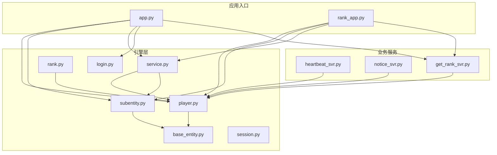
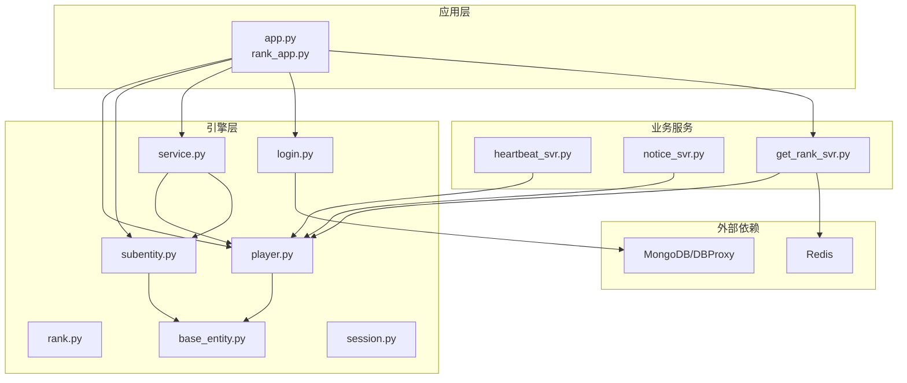
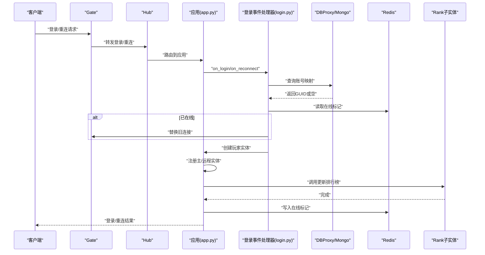
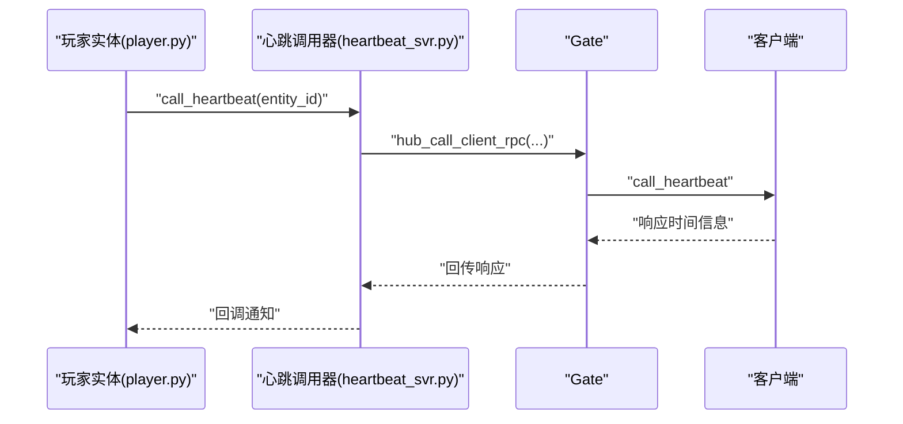
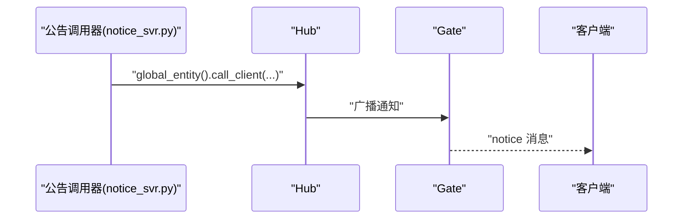
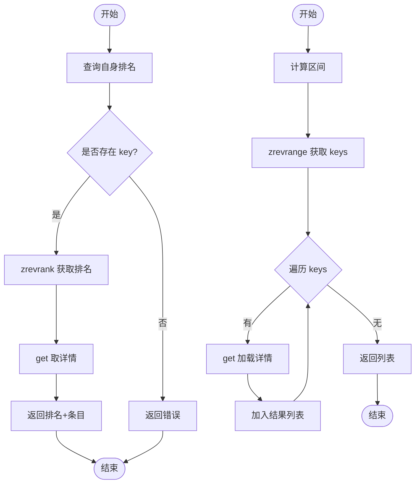
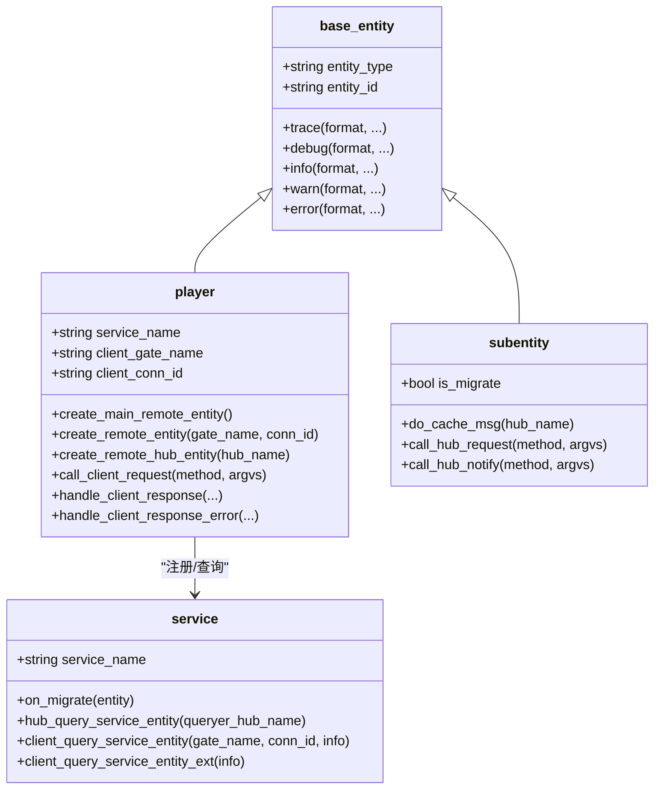
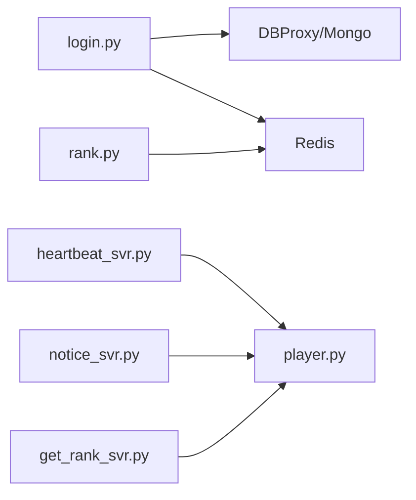

# 服务器示例

<cite>
**本文引用的文件**
- [app.py](file://sample/server/src/app.py)
- [rank_app.py](file://sample/server/src/rank_app.py)
- [login.py](file://sample/server/src/engine/engine/login.py)
- [player.py](file://sample/server/src/engine/engine/player.py)
- [subentity.py](file://sample/server/src/engine/engine/subentity.py)
- [service.py](file://sample/server/src/engine/engine/service.py)
- [heartbeat_svr.py](file://sample/server/src/engine/heartbeat_svr.py)
- [notice_svr.py](file://sample/server/src/engine/notice_svr.py)
- [get_rank_svr.py](file://sample/server/src/engine/get_rank_svr.py)
- [rank.py](file://sample/server/src/engine/engine/rank.py)
- [base_entity.py](file://sample/server/src/engine/engine/base_entity.py)
- [session.py](file://sample/server/src/engine/engine/session.py)
</cite>

## 目录
1. [简介](#简介)
2. [项目结构](#项目结构)
3. [核心组件](#核心组件)
4. [架构总览](#架构总览)
5. [详细组件分析](#详细组件分析)
6. [依赖分析](#依赖分析)
7. [性能考虑](#性能考虑)
8. [故障排查指南](#故障排查指南)
9. [结论](#结论)
10. [附录](#附录)

## 简介
本指南围绕 geese 服务器示例，系统性解析登录认证、心跳检测、排行榜与公告通知等核心业务服务的完整实现。文档从系统架构、组件关系、数据流与处理逻辑入手，结合 RPC 调用与消息传递机制，给出服务启动配置、参数设置与错误处理的最佳实践，并通过多种图示帮助开发者快速掌握服务器端业务实现模式。

## 项目结构
示例服务器位于 sample/server 目录，采用“引擎层 + 业务服务层”的分层组织方式：
- 引擎层（engine）：提供通用实体模型、玩家管理、服务注册、RPC/通知封装、会话抽象等基础能力。
- 业务服务层（engine/*_svr.py）：针对具体业务（登录、心跳、公告、排行榜）提供模块化实现。
- 应用入口（app.py、rank_app.py）：负责应用构建、服务注册、实体创建与运行时调度。

图表来源
- [app.py:107-115](file://sample/server/src/app.py#L107-L115)
- [rank_app.py:63-68](file://sample/server/src/rank_app.py#L63-L68)
- [player.py:11-41](file://sample/server/src/engine/engine/player.py#L11-L41)
- [subentity.py:8-24](file://sample/server/src/engine/engine/subentity.py#L8-L24)
- [service.py:8-36](file://sample/server/src/engine/engine/service.py#L8-L36)
- [login.py:6-36](file://sample/server/src/engine/engine/login.py#L6-L36)
- [rank.py:16-47](file://sample/server/src/engine/engine/rank.py#L16-L47)
- [heartbeat_svr.py:12-46](file://sample/server/src/engine/heartbeat_svr.py#L12-L46)
- [notice_svr.py:12-21](file://sample/server/src/engine/notice_svr.py#L12-L21)
- [get_rank_svr.py:67-94](file://sample/server/src/engine/get_rank_svr.py#L67-L94)

章节来源
- [app.py:107-115](file://sample/server/src/app.py#L107-L115)
- [rank_app.py:63-68](file://sample/server/src/rank_app.py#L63-L68)

## 核心组件
本节聚焦于登录认证、心跳检测、排行榜、公告通知四大核心服务，梳理其职责边界、数据模型与处理流程。

- 登录认证
  - 职责：处理客户端登录/重连事件，生成或复用账号标识，维护玩家在线状态，创建主实体与远程实体，触发排行榜更新。
  - 关键点：账号 ID 生成与缓存、Redis 在线标记、替换旧连接、创建主实体与远程实体、调用排行榜服务。
- 心跳检测
  - 职责：向客户端发起心跳请求，接收时间信息回调，支持错误回调。
  - 关键点：客户端请求封装、回调注册与响应处理。
- 公告通知
  - 职责：向所有已连接客户端广播公告消息。
  - 关键点：全局实体广播、消息打包。
- 排行榜
  - 职责：提供查询自身排名与区间列表的能力；在登录后更新玩家记录。
  - 关键点：Redis ZSET 排行存储、条目增删改查、返回结构体序列化。

章节来源
- [login.py:6-36](file://sample/server/src/engine/engine/login.py#L6-L36)
- [heartbeat_svr.py:12-46](file://sample/server/src/engine/heartbeat_svr.py#L12-L46)
- [notice_svr.py:12-21](file://sample/server/src/engine/notice_svr.py#L12-L21)
- [get_rank_svr.py:67-94](file://sample/server/src/engine/get_rank_svr.py#L67-L94)
- [rank.py:16-47](file://sample/server/src/engine/engine/rank.py#L16-L47)

## 架构总览
下图展示示例服务器的整体交互：应用入口构建引擎与服务，玩家实体通过 Hub/Gate 进行跨进程通信，业务模块通过 RPC/通知与客户端交互，排行榜模块基于 Redis 实现持久化与查询。

图表来源
- [app.py:107-115](file://sample/server/src/app.py#L107-L115)
- [rank_app.py:63-68](file://sample/server/src/rank_app.py#L63-L68)
- [player.py:11-41](file://sample/server/src/engine/engine/player.py#L11-L41)
- [subentity.py:8-24](file://sample/server/src/engine/engine/subentity.py#L8-L24)
- [service.py:8-36](file://sample/server/src/engine/engine/service.py#L8-L36)
- [login.py:6-36](file://sample/server/src/engine/engine/login.py#L6-L36)
- [rank.py:16-47](file://sample/server/src/engine/engine/rank.py#L16-L47)
- [heartbeat_svr.py:12-46](file://sample/server/src/engine/heartbeat_svr.py#L12-L46)
- [notice_svr.py:12-21](file://sample/server/src/engine/notice_svr.py#L12-L21)
- [get_rank_svr.py:67-94](file://sample/server/src/engine/get_rank_svr.py#L67-L94)

## 详细组件分析

### 登录认证服务
- 设计要点
  - 抽象事件处理器：定义登录/重连抽象接口，由具体实现决定账号 ID 获取策略与数据库访问。
  - 替换旧连接：当同一账号在新连接上线时，可向旧连接所在 Gate 发起替换通知，实现强制下线。
  - 创建实体：为新玩家创建主实体与远程实体，确保后续 RPC/通知可达。
  - 触发排行榜：登录成功后调用排行榜服务更新玩家记录。
- 数据模型
  - 账号映射：SDK UUID 与 GUID 的映射，用于唯一标识用户。
  - 在线标记：Redis 中以 key-value 存储账号到网关/连接 ID 的映射，便于替换与重连。
- 处理流程
  - 登录/重连：根据 SDK UUID 查询或生成 GUID，检查 Redis 在线标记，必要时替换旧连接。
  - 创建实体：创建玩家实体并注册主/远程实体，随后调用排行榜服务。
  - 缓存更新：写入 Redis 在线标记，供后续登录/重连使用。

图表来源
- [login.py:24-26](file://sample/server/src/engine/engine/login.py#L24-L26)
- [app.py:65-80](file://sample/server/src/app.py#L65-L80)
- [app.py:82-99](file://sample/server/src/app.py#L82-L99)

章节来源
- [login.py:6-36](file://sample/server/src/engine/engine/login.py#L6-L36)
- [app.py:65-100](file://sample/server/src/app.py#L65-L100)

### 心跳检测服务
- 设计要点
  - 客户端请求封装：通过玩家实体向客户端发送心跳请求，携带回调 UUID。
  - 回调注册与响应：注册回调以接收客户端时间信息或错误码。
- 处理流程
  - 发起请求：构造参数并调用客户端 RPC。
  - 响应回调：解析响应数据，触发上层回调或错误处理。

图表来源
- [heartbeat_svr.py:36-46](file://sample/server/src/engine/heartbeat_svr.py#L36-L46)
- [heartbeat_svr.py:12-34](file://sample/server/src/engine/heartbeat_svr.py#L12-L34)
- [player.py:191-203](file://sample/server/src/engine/engine/player.py#L191-L203)

章节来源
- [heartbeat_svr.py:12-46](file://sample/server/src/engine/heartbeat_svr.py#L12-L46)
- [player.py:191-211](file://sample/server/src/engine/engine/player.py#L191-L211)

### 公告通知服务
- 设计要点
  - 广播机制：通过全局实体向所有连接的客户端广播公告消息。
  - 参数封装：将消息内容打包后发送。
- 处理流程
  - 发送公告：调用全局客户端通知接口，广播给所有连接。

图表来源
- [notice_svr.py:12-21](file://sample/server/src/engine/notice_svr.py#L12-L21)

章节来源
- [notice_svr.py:12-21](file://sample/server/src/engine/notice_svr.py#L12-L21)

### 排行榜服务
- 设计要点
  - 查询接口：提供查询自身排名与区间列表两类 RPC。
  - 排行存储：基于 Redis ZSET 维护分数与排序，条目以 key-value 存储详情。
  - 更新流程：登录后调用更新接口，确保玩家记录进入排行榜。
- 数据模型
  - 条目结构：包含 key、score、profile 三要素，序列化后存入 Redis。
  - 排行键：rank:rankName 形式的 ZSET 键。
- 处理流程
  - 自身排名：根据 key 查询排名与条目详情。
  - 区间列表：按区间范围返回条目列表。
  - 更新/删除：支持增删改操作，保证一致性。

图表来源
- [rank.py:34-47](file://sample/server/src/engine/engine/rank.py#L34-L47)

章节来源
- [get_rank_svr.py:67-94](file://sample/server/src/engine/get_rank_svr.py#L67-L94)
- [rank.py:16-47](file://sample/server/src/engine/engine/rank.py#L16-L47)

### 服务注册与实体生命周期
- 服务注册
  - 应用入口通过服务管理器注册服务，对外暴露服务名称，供其他 Hub/Gate 查询。
- 实体生命周期
  - 玩家实体：创建主/远程实体，维护连接关系，支持迁移与下线清理。
  - 子实体：在 Hub 内部承载跨 Hub 的 RPC/通知，支持迁移过程中的消息缓存与重放。

图表来源
- [base_entity.py:3-26](file://sample/server/src/engine/engine/base_entity.py#L3-L26)
- [player.py:11-41](file://sample/server/src/engine/engine/player.py#L11-L41)
- [subentity.py:8-24](file://sample/server/src/engine/engine/subentity.py#L8-L24)
- [service.py:8-36](file://sample/server/src/engine/engine/service.py#L8-L36)

章节来源
- [service.py:8-36](file://sample/server/src/engine/engine/service.py#L8-L36)
- [player.py:100-114](file://sample/server/src/engine/engine/player.py#L100-L114)
- [subentity.py:77-82](file://sample/server/src/engine/engine/subentity.py#L77-L82)

## 依赖分析
- 组件耦合
  - 登录服务依赖 DBProxy/Mongo 与 Redis，用于账号映射与在线标记。
  - 排行榜服务依赖 Redis，提供高性能排序与查询。
  - 心跳与公告服务依赖玩家实体的 RPC/通知封装。
- 外部依赖
  - Redis：ZSET 排行、KV 详情、在线标记。
  - MongoDB/DBProxy：账号映射查询。
- 循环依赖
  - 未发现直接循环导入；各模块通过引擎层统一接口进行交互。

图表来源
- [login.py:24-26](file://sample/server/src/engine/engine/login.py#L24-L26)
- [rank.py:21-28](file://sample/server/src/engine/engine/rank.py#L21-L28)
- [heartbeat_svr.py:36-46](file://sample/server/src/engine/heartbeat_svr.py#L36-L46)
- [notice_svr.py:16-19](file://sample/server/src/engine/notice_svr.py#L16-L19)
- [get_rank_svr.py:67-94](file://sample/server/src/engine/get_rank_svr.py#L67-L94)

章节来源
- [login.py:24-26](file://sample/server/src/engine/engine/login.py#L24-L26)
- [rank.py:21-28](file://sample/server/src/engine/engine/rank.py#L21-L28)

## 性能考虑
- Redis 使用
  - 排行榜采用 ZSET，适合高频更新与区间查询；建议合理设置区间大小，避免一次性返回过多数据。
  - 条目详情以 KV 存储，注意 key 命名规范与过期策略。
- 玩家实体迁移
  - 动态实体具备迁移能力，应控制迁移频率与批量迁移策略，避免抖动。
- RPC/通知
  - 回调注册与响应处理需及时清理，防止内存泄漏。
  - 广播类通知建议按需分发，避免对所有连接造成压力。

## 故障排查指南
- 登录失败
  - 检查账号映射是否正确写入 Redis，确认 DBProxy 查询是否返回 GUID。
  - 若出现重复登录，确认替换旧连接流程是否执行。
- 心跳异常
  - 核对回调 UUID 是否匹配，确认客户端响应是否到达 Hub/Gate。
- 公告未达
  - 检查全局通知调用路径与目标 Gate 列表。
- 排行查询为空
  - 确认条目是否已写入 Redis，ZSET 与详情 KV 是否一致。

章节来源
- [login.py:24-26](file://sample/server/src/engine/engine/login.py#L24-L26)
- [heartbeat_svr.py:12-34](file://sample/server/src/engine/heartbeat_svr.py#L12-L34)
- [notice_svr.py:16-19](file://sample/server/src/engine/notice_svr.py#L16-L19)
- [rank.py:34-47](file://sample/server/src/engine/engine/rank.py#L34-L47)

## 结论
示例服务器通过清晰的分层与模块化设计，实现了登录认证、心跳检测、公告通知与排行榜等核心业务。引擎层提供统一的实体模型与 RPC/通知封装，业务服务通过抽象接口与外部依赖协作，既保证了扩展性，也便于维护与测试。建议在生产环境中进一步完善监控、限流与容错策略，持续优化 Redis 与数据库的访问模式。

## 附录
- 启动配置与参数
  - 应用入口通过配置文件构建应用，注册登录与玩家服务，启动服务查询与运行循环。
  - 排行榜服务通过服务管理器注册，支持 Hub/Gate 查询。
- 最佳实践
  - 将业务逻辑与引擎层解耦，优先使用引擎提供的回调与通知封装。
  - 对外暴露的服务名称需统一管理，确保跨 Hub/Gate 查询稳定。
  - 对高频操作（如心跳、排行榜查询）进行限流与缓存优化。

章节来源
- [app.py:107-115](file://sample/server/src/app.py#L107-L115)
- [rank_app.py:63-68](file://sample/server/src/rank_app.py#L63-L68)