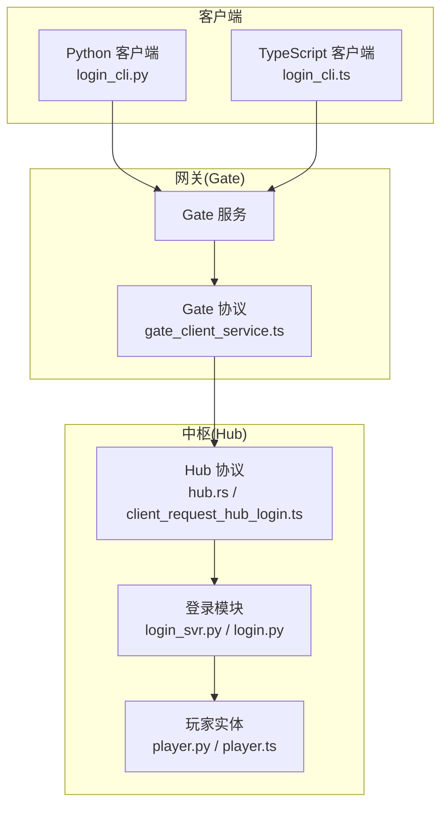
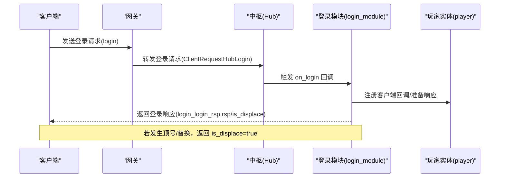
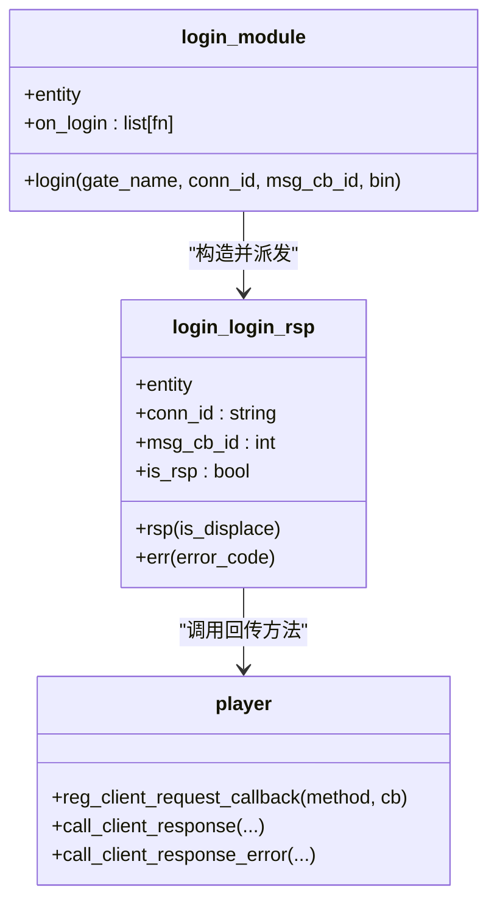
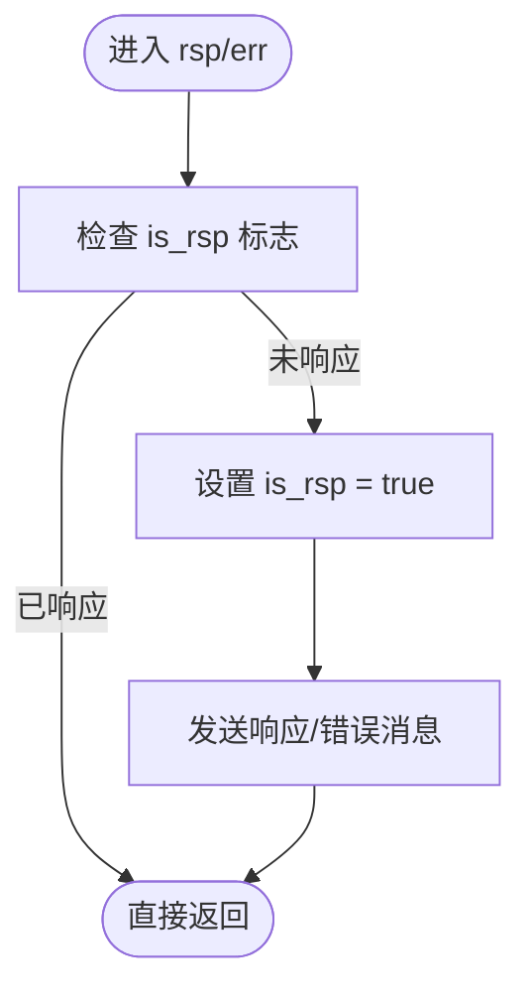
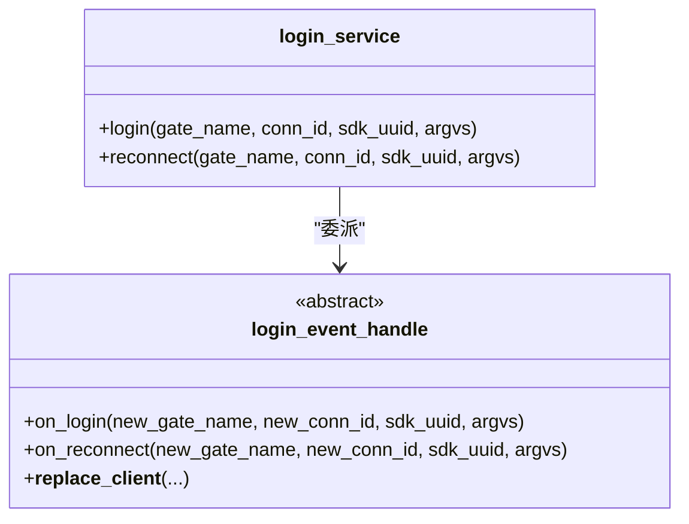
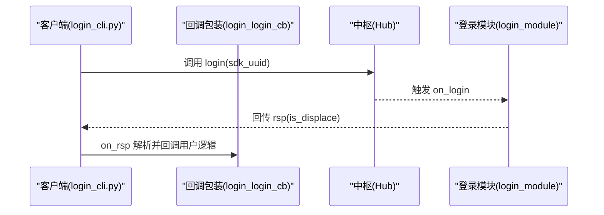
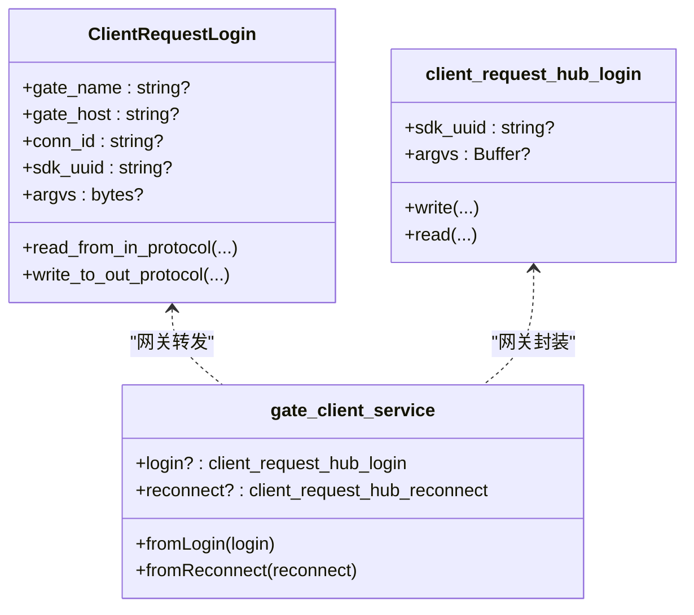
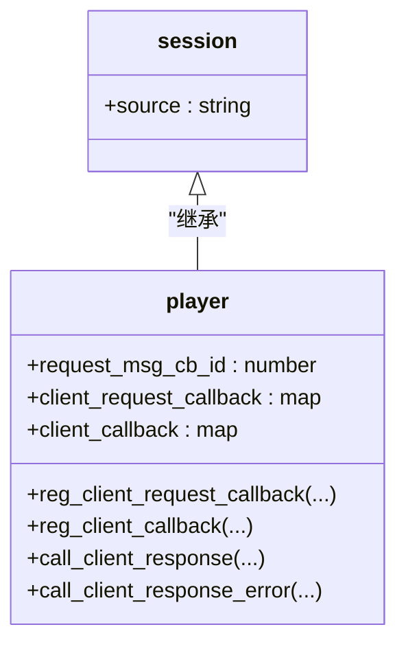
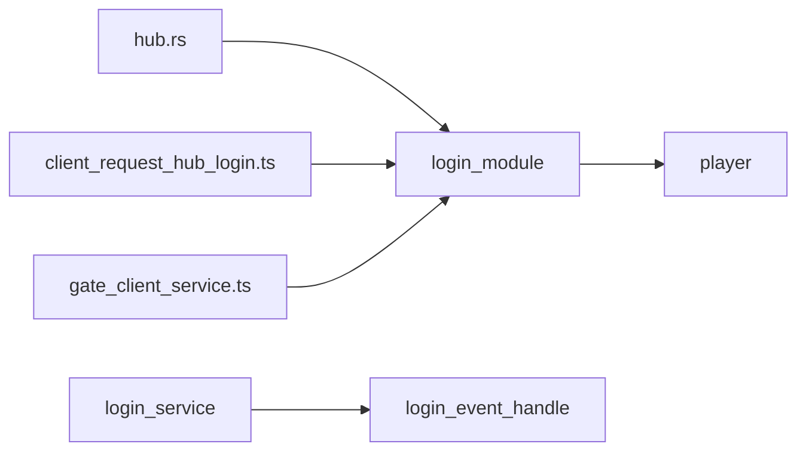
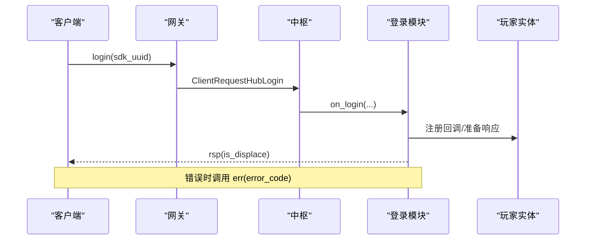

# 登录认证服务

<cite>
**本文引用的文件**
- [login_svr.py](file://sample/server/src/engine/login_svr.py)
- [login_cli.py](file://sample/client/py/engine/login_cli.py)
- [login.py（服务器引擎）](file://server/engine/login.py)
- [login.py（示例服务器引擎）](file://sample/server/src/engine/engine/login.py)
- [hub.rs（协议定义）](file://crates/proto/src/hub.rs)
- [client_request_hub_login.ts（TS协议）](file://expand/ts/engine/proto/client_request_hub_login.ts)
- [gate_client_service.ts（TS协议）](file://expand/ts/engine/proto/gate_client_service.ts)
- [player.py（服务器实体）](file://server/engine/player.py)
- [session.py（服务器会话基类）](file://server/engine/session.py)
- [session.ts（TS会话基类）](file://expand/ts/engine/session.ts)
- [player.ts（TS实体）](file://expand/ts/engine/player.ts)
</cite>

## 目录
1. [简介](#简介)
2. [项目结构](#项目结构)
3. [核心组件](#核心组件)
4. [架构总览](#架构总览)
5. [详细组件分析](#详细组件分析)
6. [依赖关系分析](#依赖关系分析)
7. [性能考量](#性能考量)
8. [故障排查指南](#故障排查指南)
9. [结论](#结论)
10. [附录：调用流程图与最佳实践](#附录调用流程图与最佳实践)

## 简介
本指南围绕登录认证服务的完整实现进行系统化讲解，覆盖客户端请求处理、玩家身份验证、会话管理、响应与错误处理等核心环节。文档重点解析以下内容：
- login_module 的设计模式与回调机制
- login_login_rsp 响应对象的构造参数、状态管理与错误处理
- 客户端到网关再到中枢（Hub）的跨层协议交互
- 登录流程中的实体生命周期与连接迁移
- 安全性与可扩展性的最佳实践

## 项目结构
登录认证涉及多语言与多层级协作：
- 客户端（Python/TypeScript）通过统一的 RPC 接口发起登录请求
- 网关侧接收请求并转发至中枢（Hub）
- 中枢侧由 login 模块处理登录事件，驱动业务逻辑
- 服务器实体负责与客户端建立会话并回传结果

**图表来源**
- [login_svr.py:38-55](file://sample/server/src/engine/login_svr.py#L38-L55)
- [login_cli.py:36-49](file://sample/client/py/engine/login_cli.py#L36-L49)
- [hub.rs（协议定义）:44-138](file://crates/proto/src/hub.rs#L44-L138)
- [client_request_hub_login.ts（TS协议）:12-77](file://expand/ts/engine/proto/client_request_hub_login.ts#L12-L77)
- [gate_client_service.ts（TS协议）:16-83](file://expand/ts/engine/proto/gate_client_service.ts#L16-L83)
- [player.py（服务器实体）:11-217](file://server/engine/player.py#L11-L217)

**章节来源**
- [login_svr.py:12-55](file://sample/server/src/engine/login_svr.py#L12-L55)
- [login_cli.py:12-49](file://sample/client/py/engine/login_cli.py#L12-L49)
- [hub.rs（协议定义）:44-138](file://crates/proto/src/hub.rs#L44-L138)
- [client_request_hub_login.ts（TS协议）:12-77](file://expand/ts/engine/proto/client_request_hub_login.ts#L12-L77)
- [gate_client_service.ts（TS协议）:16-83](file://expand/ts/engine/proto/gate_client_service.ts#L16-L83)
- [player.py（服务器实体）:11-217](file://server/engine/player.py#L11-L217)

## 核心组件
- 登录模块（login_module）
  - 负责注册“login”请求回调，解析客户端参数，触发业务回调链
- 登录响应对象（login_login_rsp）
  - 封装响应/错误回调，确保单次响应语义（防重复发送）
- 登录服务（login_service）
  - 对外暴露 login/reconnect 接口，委托给具体事件处理器
- 登录事件处理器（login_event_handle）
  - 抽象接口，定义 on_login/on_reconnect 两个异步钩子
- 玩家实体（player）
  - 维护客户端连接、回调映射、RPC 请求/响应/通知分发
- 协议层
  - Hub/Gate 间使用 Thrift/MsgPack 序列化，TS/Python 两端生成对应结构体

**章节来源**
- [login_svr.py:12-55](file://sample/server/src/engine/login_svr.py#L12-L55)
- [login.py（服务器引擎）:6-36](file://server/engine/login.py#L6-L36)
- [login.py（示例服务器引擎）:6-36](file://sample/server/src/engine/engine/login.py#L6-L36)
- [player.py（服务器实体）:11-217](file://server/engine/player.py#L11-L217)

## 架构总览
下图展示从客户端到中枢的登录调用路径与数据流：

**图表来源**
- [login_cli.py:36-49](file://sample/client/py/engine/login_cli.py#L36-L49)
- [client_request_hub_login.ts（TS协议）:12-77](file://expand/ts/engine/proto/client_request_hub_login.ts#L12-L77)
- [hub.rs（协议定义）:44-138](file://crates/proto/src/hub.rs#L44-L138)
- [login_svr.py:38-55](file://sample/server/src/engine/login_svr.py#L38-L55)
- [player.py（服务器实体）:149-217](file://server/engine/player.py#L149-L217)

## 详细组件分析

### login_module 设计与回调机制
- 设计模式
  - 观察者模式：通过注册 on_login 回调链，允许上层业务在登录时执行自定义逻辑
  - 命令模式：将客户端请求封装为 login 方法，统一入口处理
- 关键行为
  - 解析客户端参数（如 sdk_uuid），构造 login_login_rsp
  - 遍历回调列表依次执行，完成业务校验与状态变更
- 与实体交互
  - 通过 entity.reg_client_request_callback("login", ...) 注册回调
  - 使用 entity.call_client_response(...) 回传结果

**图表来源**
- [login_svr.py:38-55](file://sample/server/src/engine/login_svr.py#L38-L55)
- [player.py（服务器实体）:185-217](file://server/engine/player.py#L185-L217)

**章节来源**
- [login_svr.py:38-55](file://sample/server/src/engine/login_svr.py#L38-L55)

### login_login_rsp 响应对象
- 构造参数
  - gate_name：目标网关名称
  - conn_id：客户端连接标识
  - msg_cb_id：消息回调 ID
  - entity：玩家实体或实体基类
- 状态管理
  - is_rsp：布尔标志，确保 rsp/err 只能调用一次
- 响应与错误处理
  - rsp(is_displace)：发送登录成功与是否被顶号的标记
  - err(error_code)：发送错误码，同时防止重复发送

**图表来源**
- [login_svr.py:20-37](file://sample/server/src/engine/login_svr.py#L20-L37)

**章节来源**
- [login_svr.py:12-37](file://sample/server/src/engine/login_svr.py#L12-L37)

### 登录服务与事件处理器
- login_service
  - 提供 login/reconnect 异步入口，内部委派给 login_event_handle
- login_event_handle
  - 抽象类，要求实现 on_login/on_reconnect
  - 提供顶号/替换能力（__replace_client__），通过 app().ctx.hub_call_replace_client 触发

**图表来源**
- [login.py（服务器引擎）:28-36](file://server/engine/login.py#L28-L36)
- [login.py（示例服务器引擎）:28-36](file://sample/server/src/engine/engine/login.py#L28-L36)

**章节来源**
- [login.py（服务器引擎）:6-36](file://server/engine/login.py#L6-L36)
- [login.py（示例服务器引擎）:6-36](file://sample/server/src/engine/engine/login.py#L6-L36)

### 客户端登录调用与回调
- 客户端调用
  - login_caller.login(sdk_uuid) 构造参数数组并发起请求
  - 返回 login_login_cb，用于注册 on_rsp/on_err 回调
- 回调处理
  - login_login_cb 在收到响应后解析数组，触发用户提供的回调

**图表来源**
- [login_cli.py:36-49](file://sample/client/py/engine/login_cli.py#L36-L49)
- [login_svr.py:38-55](file://sample/server/src/engine/login_svr.py#L38-L55)

**章节来源**
- [login_cli.py:12-49](file://sample/client/py/engine/login_cli.py#L12-L49)

### 协议与序列化
- Hub 协议（Rust）
  - ClientRequestLogin 字段：gate_name、gate_host、conn_id、sdk_uuid、argvs
  - 实现 read/write 序列化/反序列化
- TS 协议（TypeScript）
  - client_request_hub_login：sdk_uuid、argvs
  - gate_client_service：作为网关侧的联合类型容器，支持 login/reconnect/rpc/notify 等

**图表来源**
- [hub.rs（协议定义）:44-138](file://crates/proto/src/hub.rs#L44-L138)
- [client_request_hub_login.ts（TS协议）:12-77](file://expand/ts/engine/proto/client_request_hub_login.ts#L12-L77)
- [gate_client_service.ts（TS协议）:16-83](file://expand/ts/engine/proto/gate_client_service.ts#L16-L83)

**章节来源**
- [hub.rs（协议定义）:44-138](file://crates/proto/src/hub.rs#L44-L138)
- [client_request_hub_login.ts（TS协议）:12-77](file://expand/ts/engine/proto/client_request_hub_login.ts#L12-L77)
- [gate_client_service.ts（TS协议）:16-83](file://expand/ts/engine/proto/gate_client_service.ts#L16-L83)

### 会话与实体管理
- 会话基类
  - session（Python）/ session.ts（TS）：记录 source（来源）
- 玩家实体
  - 维护客户端连接、回调映射、RPC 请求/响应/通知分发
  - 提供 reg_client_request_callback/reg_client_callback 等注册方法
  - 提供 call_client_response/call_client_response_error 回传结果

**图表来源**
- [session.py（服务器会话基类）:3-7](file://server/engine/session.py#L3-L7)
- [session.ts（TS会话基类）:6-12](file://expand/ts/engine/session.ts#L6-L12)
- [player.py（服务器实体）:11-217](file://server/engine/player.py#L11-L217)

**章节来源**
- [session.py（服务器会话基类）:3-7](file://server/engine/session.py#L3-L7)
- [session.ts（TS会话基类）:6-12](file://expand/ts/engine/session.ts#L6-L12)
- [player.py（服务器实体）:11-217](file://server/engine/player.py#L11-L217)

## 依赖关系分析
- 组件耦合
  - login_module 依赖 player 的回调注册与响应回传
  - login_service 依赖 login_event_handle 的抽象接口
  - 协议层（hub.rs、client_request_hub_login.ts、gate_client_service.ts）为跨语言通信提供契约
- 外部依赖
  - Thrift 序列化框架
  - MsgPack 编解码（Python/TS）
- 循环依赖
  - 当前结构以“协议层”为中心，避免了循环依赖风险

**图表来源**
- [login_svr.py:38-55](file://sample/server/src/engine/login_svr.py#L38-L55)
- [login.py（服务器引擎）:28-36](file://server/engine/login.py#L28-L36)
- [hub.rs（协议定义）:44-138](file://crates/proto/src/hub.rs#L44-L138)
- [client_request_hub_login.ts（TS协议）:12-77](file://expand/ts/engine/proto/client_request_hub_login.ts#L12-L77)
- [gate_client_service.ts（TS协议）:16-83](file://expand/ts/engine/proto/gate_client_service.ts#L16-L83)

**章节来源**
- [login_svr.py:38-55](file://sample/server/src/engine/login_svr.py#L38-L55)
- [login.py（服务器引擎）:28-36](file://server/engine/login.py#L28-L36)
- [hub.rs（协议定义）:44-138](file://crates/proto/src/hub.rs#L44-L138)
- [client_request_hub_login.ts（TS协议）:12-77](file://expand/ts/engine/proto/client_request_hub_login.ts#L12-L77)
- [gate_client_service.ts（TS协议）:16-83](file://expand/ts/engine/proto/gate_client_service.ts#L16-L83)

## 性能考量
- 回调链长度控制：on_login 回调数量应适度，避免阻塞主流程
- 响应幂等：login_login_rsp 的 is_rsp 标志确保只发送一次响应，降低网络与内存开销
- 序列化成本：优先使用二进制协议（MsgPack/Thrift），减少序列化时间
- 连接迁移：动态实体的迁移策略需平衡负载与一致性

## 故障排查指南
- 常见问题
  - 重复响应：确认 login_login_rsp 的 is_rsp 标志是否正确设置
  - 回调未触发：检查 entity.reg_client_request_callback 是否正确注册
  - 协议不匹配：核对 Hub/Gate 协议字段与版本，确保双方一致
- 定位建议
  - 在 login_module.login 中断点，确认回调链执行顺序
  - 在 player.handle_client_response 中断点，确认回调映射是否存在
  - 在协议层打印入参/出参，定位序列化异常

**章节来源**
- [login_svr.py:20-37](file://sample/server/src/engine/login_svr.py#L20-L37)
- [player.py（服务器实体）:162-177](file://server/engine/player.py#L162-L177)

## 结论
登录认证服务通过清晰的模块划分与协议契约，实现了从客户端到中枢的稳定登录流程。login_module 采用观察者+命令模式，login_login_rsp 提供幂等响应保障，配合 player 的回调管理与 Hub/Gate 的协议适配，形成高内聚、低耦合的体系。遵循本文的最佳实践与排障建议，可有效提升系统的稳定性与可维护性。

## 附录：调用流程图与最佳实践

### 完整登录调用流程图

**图表来源**
- [login_cli.py:36-49](file://sample/client/py/engine/login_cli.py#L36-L49)
- [client_request_hub_login.ts（TS协议）:12-77](file://expand/ts/engine/proto/client_request_hub_login.ts#L12-L77)
- [hub.rs（协议定义）:44-138](file://crates/proto/src/hub.rs#L44-L138)
- [login_svr.py:38-55](file://sample/server/src/engine/login_svr.py#L38-L55)
- [player.py（服务器实体）:149-217](file://server/engine/player.py#L149-L217)

### 最佳实践
- 安全性
  - 参数校验：在 on_login 中严格校验 sdk_uuid、argvs 合法性
  - 顶号处理：合理使用 __replace_client__，提示用户并记录日志
  - 传输加密：生产环境启用 TLS/WSs，避免明文传输
- 可靠性
  - 响应幂等：始终使用 login_login_rsp 的 is_rsp 保护
  - 超时与重试：客户端与网关侧设置合理的超时与重试策略
- 可扩展性
  - 回调链：将复杂逻辑拆分为多个小回调，便于测试与维护
  - 协议演进：遵循 Thrift/MsgPack 的向后兼容原则，避免破坏性变更