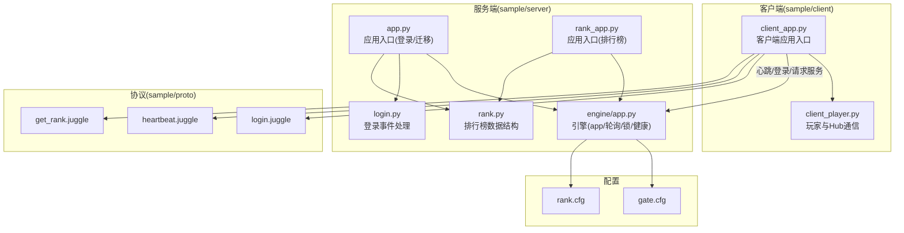
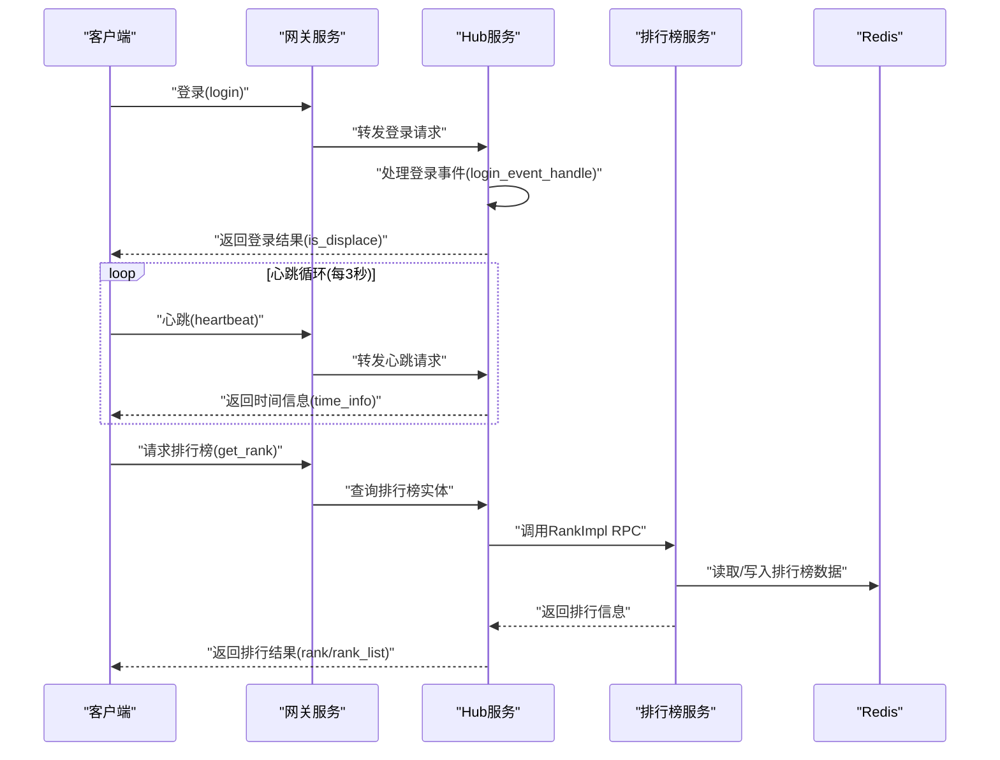
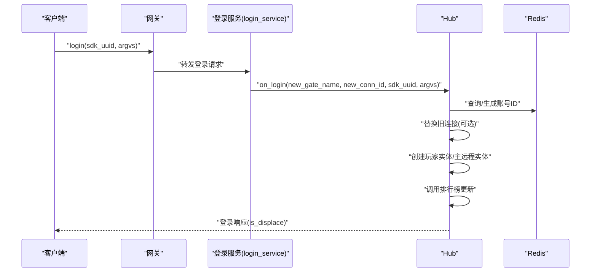
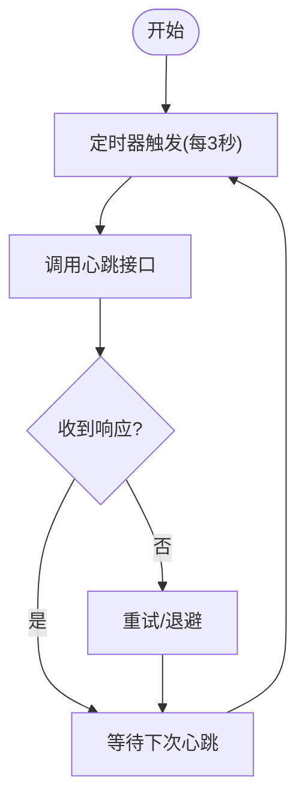
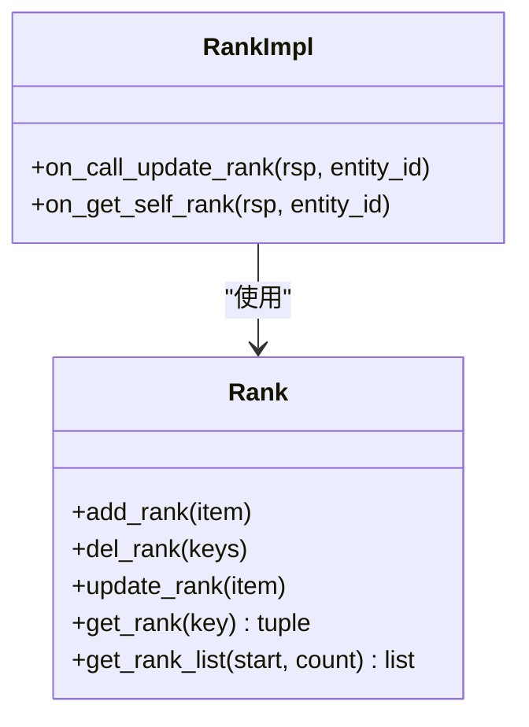
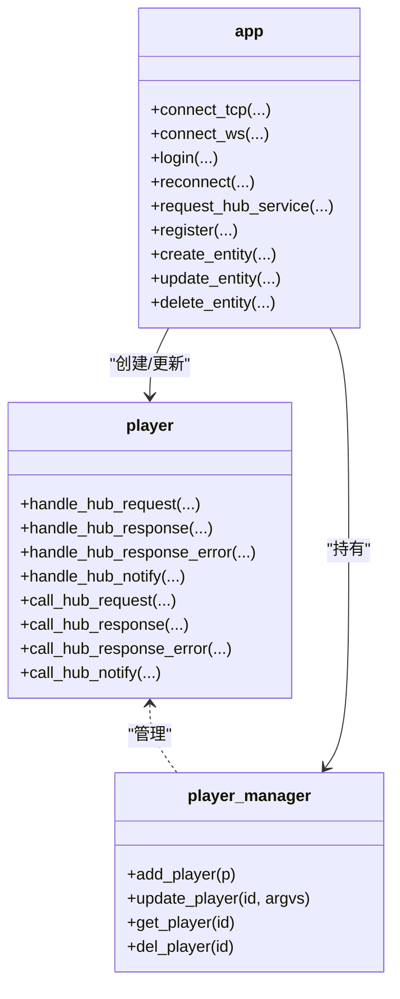
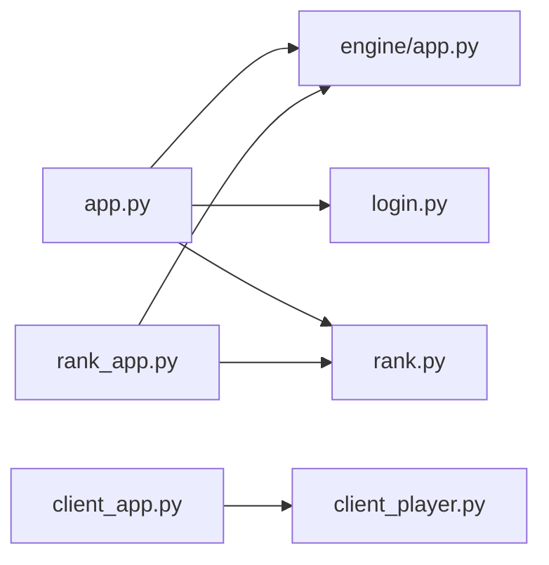

# 示例项目

<cite>
**本文引用的文件**
- [app.py](file://sample/server/src/app.py)
- [rank_app.py](file://sample/server/src/rank_app.py)
- [engine/app.py](file://sample/server/src/engine/engine/app.py)
- [login.py](file://sample/server/src/engine/engine/login.py)
- [rank.py](file://sample/server/src/engine/engine/rank.py)
- [gate.cfg](file://sample/server/config/gate.cfg)
- [rank.cfg](file://sample/server/config/rank.cfg)
- [client_app.py](file://sample/client/py/engine/engine/app.py)
- [client_player.py](file://sample/client/py/engine/engine/player.py)
- [login.juggle](file://sample/proto/proto/client_call_hub/login.juggle)
- [heartbeat.juggle](file://sample/proto/proto/hub_call_client/heartbeat.juggle)
- [get_rank.juggle](file://sample/proto/proto/client_call_hub/get_rank.juggle)
</cite>

## 目录
1. [简介](#简介)
2. [项目结构](#项目结构)
3. [核心组件](#核心组件)
4. [架构总览](#架构总览)
5. [详细组件分析](#详细组件分析)
6. [依赖分析](#依赖分析)
7. [性能考虑](#性能考虑)
8. [故障排查指南](#故障排查指南)
9. [结论](#结论)
10. [附录](#附录)

## 简介
本指南围绕 geese 示例项目，系统性解析登录认证、心跳检测、排行榜等核心功能的实现思路与代码组织方式，覆盖客户端与服务器的完整交互流程、消息协议使用与错误处理策略，并提供配置文件结构说明、性能与压力测试建议、部署与生产环境适配经验，以及可直接参考与修改的完整示例代码路径。

## 项目结构
示例项目采用“服务端 Python 引擎 + Thrift/Juggle 协议 + 客户端 Python/TypeScript 引擎”的分层架构：
- 服务端 sample/server 提供网关与排行榜服务，基于自研引擎封装连接轮询、数据库代理、实体管理、玩家管理、分布式锁与健康状态上报等能力。
- 配置文件位于 sample/server/config，分别定义网关与排行榜服务的网络端口、日志、Redis 连接与 Consul 注册信息。
- 客户端 sample/client 提供 Python/TypeScript 引擎，负责连接网关、心跳、登录、请求服务、实体生命周期管理等。
- 协议层 sample/proto 定义客户端到 Hub 的 RPC 与 Hub 到客户端的通知/请求，如登录、心跳、获取排行榜等。

图表来源
- [client_app.py:1-157](file://sample/client/py/engine/engine/app.py#L1-L157)
- [client_player.py:1-108](file://sample/client/py/engine/engine/player.py#L1-L108)
- [app.py:1-118](file://sample/server/src/app.py#L1-L118)
- [rank_app.py:1-72](file://sample/server/src/rank_app.py#L1-L72)
- [engine/app.py:1-233](file://sample/server/src/engine/engine/app.py#L1-L233)
- [login.py:1-36](file://sample/server/src/engine/engine/login.py#L1-L36)
- [rank.py:1-47](file://sample/server/src/engine/engine/rank.py#L1-L47)
- [gate.cfg:1-12](file://sample/server/config/gate.cfg#L1-L12)
- [rank.cfg:1-12](file://sample/server/config/rank.cfg#L1-L12)
- [login.juggle:1-5](file://sample/proto/proto/client_call_hub/login.juggle#L1-L5)
- [heartbeat.juggle:1-5](file://sample/proto/proto/hub_call_client/heartbeat.juggle#L1-L5)
- [get_rank.juggle:1-6](file://sample/proto/proto/client_call_hub/get_rank.juggle#L1-L6)

章节来源
- [app.py:1-118](file://sample/server/src/app.py#L1-L118)
- [rank_app.py:1-72](file://sample/server/src/rank_app.py#L1-L72)
- [engine/app.py:1-233](file://sample/server/src/engine/engine/app.py#L1-L233)
- [login.py:1-36](file://sample/server/src/engine/engine/login.py#L1-L36)
- [rank.py:1-47](file://sample/server/src/engine/engine/rank.py#L1-L47)
- [gate.cfg:1-12](file://sample/server/config/gate.cfg#L1-L12)
- [rank.cfg:1-12](file://sample/server/config/rank.cfg#L1-L12)
- [client_app.py:1-157](file://sample/client/py/engine/engine/app.py#L1-L157)
- [client_player.py:1-108](file://sample/client/py/engine/engine/player.py#L1-L108)
- [login.juggle:1-5](file://sample/proto/proto/client_call_hub/login.juggle#L1-L5)
- [heartbeat.juggle:1-5](file://sample/proto/proto/hub_call_client/heartbeat.juggle#L1-L5)
- [get_rank.juggle:1-6](file://sample/proto/proto/client_call_hub/get_rank.juggle#L1-L6)

## 核心组件
- 应用引擎(app): 负责构建上下文、注册服务、启动轮询线程、健康状态上报、分布式锁、Redis 连接池、异常捕获与信号处理。
- 登录服务(login_service)与事件(login_event_handle): 将客户端登录/重连请求路由至业务处理，支持替换旧连接、生成账号 ID、缓存在线信息。
- 排行榜服务(RankService)与实体(RankImpl): 提供更新与查询排行榜的 RPC 能力，支持跨 Hub 查询远程实体。
- 客户端引擎(client_app): 维护连接、心跳定时器、全局回调注册、登录/重连、请求 Hub 服务、实体生命周期管理。
- 协议层: 基于 Juggle 定义的 login、heartbeat、get_rank 等服务接口，统一请求/响应/通知格式。

章节来源
- [engine/app.py:54-233](file://sample/server/src/engine/engine/app.py#L54-L233)
- [login.py:6-36](file://sample/server/src/engine/engine/login.py#L6-L36)
- [rank_app.py:40-58](file://sample/server/src/rank_app.py#L40-L58)
- [client_app.py:40-157](file://sample/client/py/engine/engine/app.py#L40-L157)

## 架构总览
下图展示客户端与服务端在登录、心跳、排行榜场景下的交互时序，包括消息协议调用与错误处理路径。

图表来源
- [client_app.py:73-76](file://sample/client/py/engine/engine/app.py#L73-L76)
- [login.juggle:3-5](file://sample/proto/proto/client_call_hub/login.juggle#L3-L5)
- [heartbeat.juggle:3-5](file://sample/proto/proto/hub_call_client/heartbeat.juggle#L3-L5)
- [get_rank.juggle:3-6](file://sample/proto/proto/client_call_hub/get_rank.juggle#L3-L6)
- [engine/app.py:96-100](file://sample/server/src/engine/engine/app.py#L96-L100)
- [login.py:32-36](file://sample/server/src/engine/engine/login.py#L32-L36)
- [rank.py:20-38](file://sample/server/src/engine/engine/rank.py#L20-L38)

## 详细组件分析

### 登录认证流程
- 客户端通过 app.login 发起登录请求，携带 sdk_uuid 与扩展参数。
- 网关将请求转发至 Hub，由 login_service 调用 login_event_handle.on_login。
- 业务侧根据 SDK UUID 获取或生成账号 ID，检查是否已在别处登录，必要时替换旧连接。
- 创建玩家实体并建立主远程实体，随后调用排行榜服务更新分数。
- 登录成功后，客户端收到登录响应；若被顶号，收到踢下线通知。

图表来源
- [client_app.py:104-105](file://sample/client/py/engine/engine/app.py#L104-L105)
- [login.juggle:3-5](file://sample/proto/proto/client_call_hub/login.juggle#L3-L5)
- [login.py:32-33](file://sample/server/src/engine/engine/login.py#L32-L33)
- [app.py:61-79](file://sample/server/src/app.py#L61-L79)

章节来源
- [client_app.py:104-105](file://sample/client/py/engine/engine/app.py#L104-L105)
- [login.py:16-36](file://sample/server/src/engine/engine/login.py#L16-L36)
- [app.py:47-80](file://sample/server/src/app.py#L47-L80)

### 心跳检测机制
- 客户端每 3 秒触发一次心跳，调用 ctx.heartbeats。
- 网关将心跳请求转发至 Hub，Hub 返回客户端时间信息以协助对齐。
- 若发生连接迁移或被顶号，客户端会收到相应通知并触发回调。

图表来源
- [client_app.py:73-76](file://sample/client/py/engine/engine/app.py#L73-L76)
- [heartbeat.juggle:3-5](file://sample/proto/proto/hub_call_client/heartbeat.juggle#L3-L5)

章节来源
- [client_app.py:73-76](file://sample/client/py/engine/engine/app.py#L73-L76)
- [heartbeat.juggle:1-5](file://sample/proto/proto/hub_call_client/heartbeat.juggle#L1-L5)

### 排行榜服务
- 排行榜实体 RankImpl 提供更新与查询接口，内部通过 Redis ZSET 维护排名键值。
- Rank 类封装了添加、删除、更新、查询单个与区间列表等操作。
- 客户端通过请求 Hub 服务查询自身或区间排行，Hub 调用 RankImpl 并回传结果。

图表来源
- [rank.py:16-47](file://sample/server/src/engine/engine/rank.py#L16-L47)
- [rank_app.py:7-38](file://sample/server/src/rank_app.py#L7-L38)

章节来源
- [rank.py:1-47](file://sample/server/src/engine/engine/rank.py#L1-L47)
- [rank_app.py:1-72](file://sample/server/src/rank_app.py#L1-L72)

### 客户端实体与 Hub 通信
- 客户端玩家类继承抽象基类，维护 Hub 请求/通知回调映射，支持 RPC 调用、响应与错误处理。
- 客户端应用负责连接网关、注册全局回调、发起登录/重连、请求 Hub 服务与实体生命周期管理。

图表来源
- [client_player.py:9-108](file://sample/client/py/engine/engine/player.py#L9-L108)
- [client_app.py:40-157](file://sample/client/py/engine/engine/app.py#L40-L157)

章节来源
- [client_player.py:1-108](file://sample/client/py/engine/engine/player.py#L1-L108)
- [client_app.py:1-157](file://sample/client/py/engine/engine/app.py#L1-L157)

## 依赖分析
- 服务端 app 依赖引擎模块：连接泵、数据库泵、Redis 连接池、服务管理器、实体/玩家管理器、接收器管理器。
- 登录流程依赖 dbproxy 消息处理与 Guid 生成器，支持分布式替换连接。
- 排行榜依赖 Redis ZSET 与字符串存储，提供 O(log N) 更新与查询能力。
- 客户端依赖连接泵与消息处理器，维护 Hub 全局回调与实体管理。

图表来源
- [app.py:1-118](file://sample/server/src/app.py#L1-L118)
- [rank_app.py:1-72](file://sample/server/src/rank_app.py#L1-L72)
- [engine/app.py:1-233](file://sample/server/src/engine/engine/app.py#L1-L233)
- [login.py:1-36](file://sample/server/src/engine/engine/login.py#L1-L36)
- [rank.py:1-47](file://sample/server/src/engine/engine/rank.py#L1-L47)
- [client_app.py:1-157](file://sample/client/py/engine/engine/app.py#L1-L157)
- [client_player.py:1-108](file://sample/client/py/engine/engine/player.py#L1-L108)

章节来源
- [engine/app.py:83-100](file://sample/server/src/engine/engine/app.py#L83-L100)
- [login.py:24-26](file://sample/server/src/engine/engine/login.py#L24-L26)
- [rank.py:20-38](file://sample/server/src/engine/engine/rank.py#L20-L38)

## 性能考虑
- 轮询节流：服务端每帧轮询上限约 30 FPS（~0.033s），空闲时延长休眠，繁忙时降低休眠以提升吞吐。
- 异步协程：引擎在独立线程中运行事件循环，避免阻塞轮询线程。
- Redis 批量操作：排行榜批量删除与范围查询减少网络往返。
- 心跳频率：客户端固定 3 秒心跳，既保证存活检测又避免过载。
- 分布式锁：基于 Redis SET 命令的 NX/EX 实现轻量级分布式锁，避免竞态条件。

章节来源
- [engine/app.py:197-228](file://sample/server/src/engine/engine/app.py#L197-L228)
- [client_app.py:73-76](file://sample/client/py/engine/engine/app.py#L73-L76)
- [rank.py:25-47](file://sample/server/src/engine/engine/rank.py#L25-L47)

## 故障排查指南
- 登录被顶号：服务端在登录事件中可替换旧连接并提示“其他位置登录”，客户端收到踢下线通知后应重建连接与实体。
- 心跳异常：若长时间未收到心跳响应，检查网关/Hub 日志与网络连通性；确认客户端心跳定时器正常触发。
- 排行榜查询为空：确认 Redis 中是否存在对应键值与 ZSET；检查排行榜服务是否正确创建实体与注册服务。
- 异常捕获：全局异常钩子记录异常类型与堆栈；SIGTERM 信号触发优雅关闭，保存实体状态。
- 健康状态：引擎周期性设置健康状态，结合外部监控系统定位过载或阻塞点。

章节来源
- [app.py:65-70](file://sample/server/src/app.py#L65-L70)
- [login.py:24-26](file://sample/server/src/engine/engine/login.py#L24-L26)
- [engine/app.py:32-34](file://sample/server/src/engine/engine/app.py#L32-L34)
- [engine/app.py:197-228](file://sample/server/src/engine/engine/app.py#L197-L228)

## 结论
示例项目通过清晰的分层设计与协议定义，实现了从登录、心跳到排行榜的完整链路。服务端引擎提供高内聚的基础设施能力，客户端引擎聚焦连接与实体生命周期管理。配合配置文件与 Redis，可在开发与生产环境中快速落地。建议在生产中完善监控、限流与重试策略，并针对热点接口进行缓存优化。

## 附录

### 配置文件结构与参数说明
- 网关配置(gate.cfg)
  - namespace: 服务命名空间
  - consul_url: Consul 地址
  - health_port: 健康检查端口
  - redis_url: Redis 连接串
  - service_port: 服务端口
  - client_tcp_port: 客户端 TCP 端口
  - client_ws_port: 客户端 WebSocket 端口
  - log_level/log_file/log_dir: 日志级别、文件名与目录

- 排行榜配置(rank.cfg)
  - namespace/consul_url/health_port/redis_url/service_port: 同上
  - save_time_interval/migrate_time_interval: 保存与迁移间隔(秒)

章节来源
- [gate.cfg:1-12](file://sample/server/config/gate.cfg#L1-L12)
- [rank.cfg:1-12](file://sample/server/config/rank.cfg#L1-L12)

### 协议定义与消息使用
- 登录(login.juggle): 客户端向 Hub 发起登录请求，返回是否被顶号。
- 心跳(heartbeat.juggle): Hub 向客户端请求心跳，返回时间信息。
- 获取排行榜(get_rank.juggle): 客户端查询自身或区间排行。

章节来源
- [login.juggle:1-5](file://sample/proto/proto/client_call_hub/login.juggle#L1-L5)
- [heartbeat.juggle:1-5](file://sample/proto/proto/hub_call_client/heartbeat.juggle#L1-L5)
- [get_rank.juggle:1-6](file://sample/proto/proto/client_call_hub/get_rank.juggle#L1-L6)

### 部署与生产环境适配建议
- 环境变量与配置分离：将 redis_url、consul_url 等敏感或环境相关参数通过环境变量注入，避免硬编码。
- 健康检查：结合 health_port 与外部探针定期探测，异常时自动重启或摘除。
- 连接池与超时：合理设置 Redis 连接池大小与命令超时，避免资源耗尽。
- 日志分级：生产环境建议调整 log_level 至 info 或 warn，控制磁盘 IO。
- 灰度与熔断：在登录/排行榜等关键路径增加熔断与降级策略，保障核心链路可用。

### 测试实施指南
- 单元测试：针对登录事件处理、排行榜增删改查进行单元测试，模拟并发与异常场景。
- 集成测试：启动网关与排行榜服务，验证登录、心跳、排行榜查询端到端流程。
- 性能测试：使用压测工具模拟多用户登录与心跳，观察 CPU、内存、Redis 延迟与吞吐。
- 压力测试：逐步提高并发与请求强度，定位瓶颈（网络、CPU、Redis）。
- 负载测试：在稳定状态下持续运行数小时，监控健康状态与错误率。