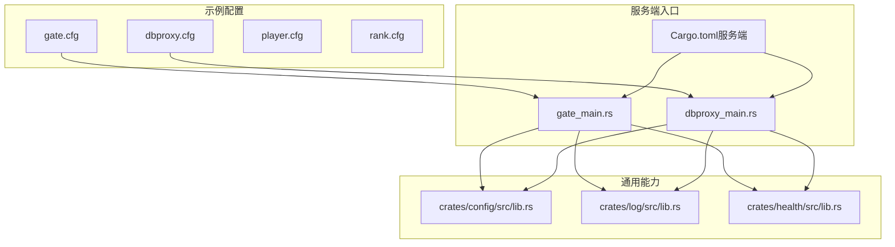
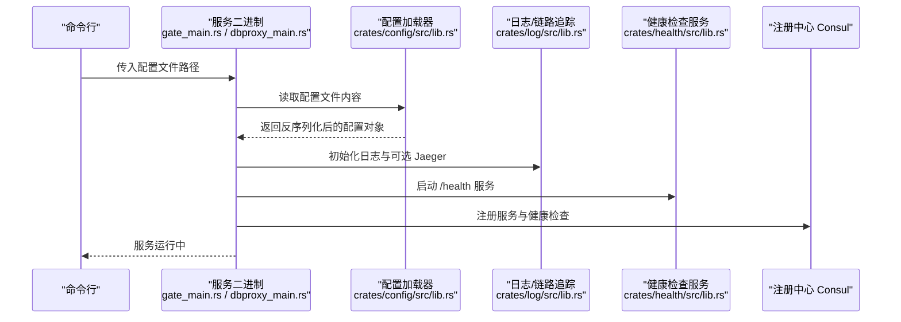
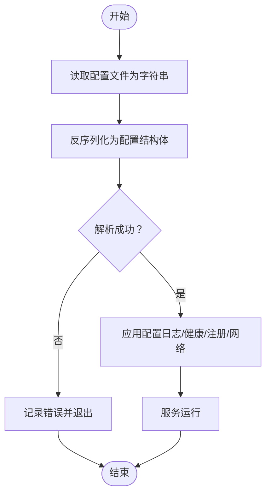
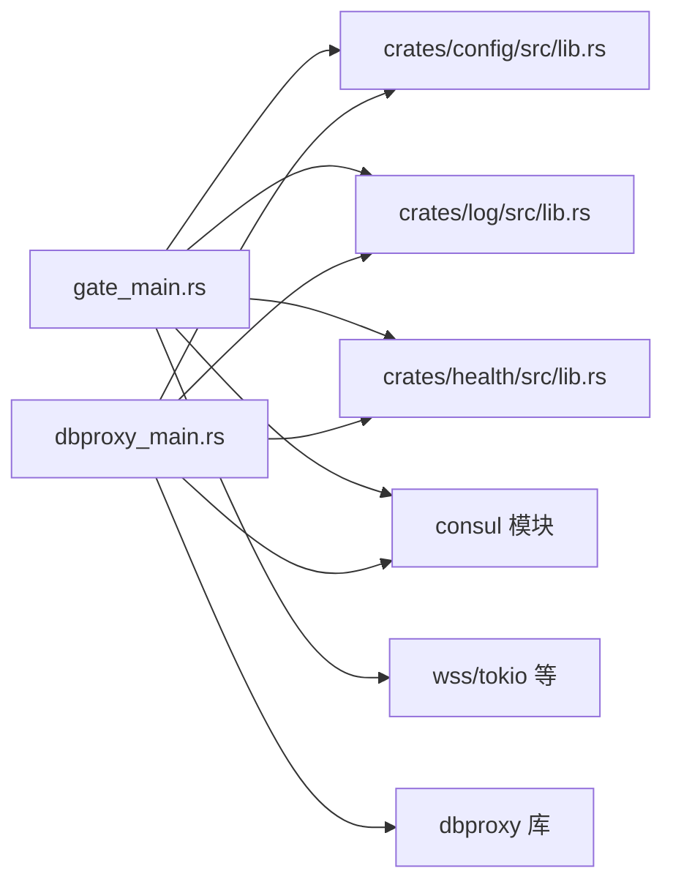

# 配置示例

<cite>
**本文引用的文件**
- [gate.cfg](file://sample/server/config/gate.cfg)
- [dbproxy.cfg](file://sample/server/config/dbproxy.cfg)
- [player.cfg](file://sample/server/config/player.cfg)
- [rank.cfg](file://sample/server/config/rank.cfg)
- [lib.rs（配置加载）](file://crates/config/src/lib.rs)
- [lib.rs（日志与链路追踪）](file://crates/log/src/lib.rs)
- [lib.rs（健康检查）](file://crates/health/src/lib.rs)
- [gate_main.rs](file://server/src/gate_main.rs)
- [dbproxy_main.rs](file://server/src/dbproxy_main.rs)
- [Cargo.toml（服务端）](file://server/Cargo.toml)
- [start.bat（示例启动脚本）](file://sample/server/start.bat)
</cite>

## 目录
1. [简介](#简介)
2. [项目结构](#项目结构)
3. [核心组件](#核心组件)
4. [架构总览](#架构总览)
5. [详细组件分析](#详细组件分析)
6. [依赖关系分析](#依赖关系分析)
7. [性能考量](#性能考量)
8. [故障排查指南](#故障排查指南)
9. [结论](#结论)
10. [附录：配置模板与最佳实践](#附录配置模板与最佳实践)

## 简介
本指南围绕 geese 示例中的配置体系，系统梳理 Gate、DBProxy、玩家服务（Player）、排行榜服务（Rank）等模块的配置文件结构、参数含义、默认行为与推荐设置，并结合启动脚本与运行时加载流程，给出不同环境下的配置模板与最佳实践。同时覆盖配置热更新、配置验证与配置安全的重要性，以及生产环境的参考与排障建议。

## 项目结构
示例工程中，配置文件位于 sample/server/config 下，按服务拆分；服务端 Rust 二进制通过 server/Cargo.toml 声明，入口在 server/src 中；通用配置加载与日志/健康检查能力分别由 crates/config、crates/log、crates/health 提供。

**图表来源**
- [gate.cfg:1-12](file://sample/server/config/gate.cfg#L1-L12)
- [dbproxy.cfg:1-13](file://sample/server/config/dbproxy.cfg#L1-L13)
- [player.cfg:1-12](file://sample/server/config/player.cfg#L1-L12)
- [rank.cfg:1-12](file://sample/server/config/rank.cfg#L1-L12)
- [gate_main.rs:1-117](file://server/src/gate_main.rs#L1-L117)
- [dbproxy_main.rs:1-78](file://server/src/dbproxy_main.rs#L1-L78)
- [lib.rs（配置加载）:1-13](file://crates/config/src/lib.rs#L1-L13)
- [lib.rs（日志与链路追踪）:1-35](file://crates/log/src/lib.rs#L1-L35)
- [lib.rs（健康检查）:1-51](file://crates/health/src/lib.rs#L1-L51)
- [Cargo.toml（服务端）:1-42](file://server/Cargo.toml#L1-L42)

**章节来源**
- [gate.cfg:1-12](file://sample/server/config/gate.cfg#L1-L12)
- [dbproxy.cfg:1-13](file://sample/server/config/dbproxy.cfg#L1-L13)
- [player.cfg:1-12](file://sample/server/config/player.cfg#L1-L12)
- [rank.cfg:1-12](file://sample/server/config/rank.cfg#L1-L12)
- [gate_main.rs:1-117](file://server/src/gate_main.rs#L1-L117)
- [dbproxy_main.rs:1-78](file://server/src/dbproxy_main.rs#L1-L78)
- [lib.rs（配置加载）:1-13](file://crates/config/src/lib.rs#L1-L13)
- [lib.rs（日志与链路追踪）:1-35](file://crates/log/src/lib.rs#L1-L35)
- [lib.rs（健康检查）:1-51](file://crates/health/src/lib.rs#L1-L51)
- [Cargo.toml（服务端）:1-42](file://server/Cargo.toml#L1-L42)

## 核心组件
- 配置加载器：从 JSON 文件读取字符串，再反序列化为具体配置结构体，统一错误处理。
- 日志与链路追踪：支持按级别滚动写日志，可选 Jaeger 追踪注入。
- 健康检查：内置 HTTP /health 接口，供外部探活与注册中心健康检查使用。
- 服务入口：Gate、DBProxy 分别解析各自配置，初始化日志、健康服务、注册中心与网络监听。

**章节来源**
- [lib.rs（配置加载）:1-13](file://crates/config/src/lib.rs#L1-L13)
- [lib.rs（日志与链路追踪）:1-35](file://crates/log/src/lib.rs#L1-L35)
- [lib.rs（健康检查）:1-51](file://crates/health/src/lib.rs#L1-L51)
- [gate_main.rs:1-117](file://server/src/gate_main.rs#L1-L117)
- [dbproxy_main.rs:1-78](file://server/src/dbproxy_main.rs#L1-L78)

## 架构总览
下图展示配置在启动阶段如何被加载、校验与应用，以及服务如何上报健康状态与注册到 Consul。

**图表来源**
- [gate_main.rs:34-116](file://server/src/gate_main.rs#L34-L116)
- [dbproxy_main.rs:15-77](file://server/src/dbproxy_main.rs#L15-L77)
- [lib.rs（配置加载）:5-12](file://crates/config/src/lib.rs#L5-L12)
- [lib.rs（日志与链路追踪）:8-35](file://crates/log/src/lib.rs#L8-L35)
- [lib.rs（健康检查）:34-49](file://crates/health/src/lib.rs#L34-L49)

## 详细组件分析

### Gate 配置与参数说明
- 关键字段
  - namespace：命名空间，用于区分多环境或多业务线。
  - consul_url：Consul 地址，用于服务注册与发现。
  - health_port：健康检查端口，对外暴露 /health。
  - redis_url：Redis 地址，用于会话与消息队列。
  - service_port：Gate 主监听端口。
  - client_tcp_port / client_ws_port：客户端接入端口（可选）。
  - client_wss_cfg：可选 WSS 配置（如证书、加密参数）。
  - log_level / log_file / log_dir：日志级别、文件名与目录。
  - jaeger_url：可选，开启 OpenTelemetry/Jaeger 追踪。
- 默认值与推荐
  - 未显式提供的可选字段（如 client_tcp_port、client_wss_cfg、jaeger_url）应按需启用。
  - 生产环境建议将 log_dir 指向持久化卷，log_level 设为 info 或更高。
- 典型用途
  - 将客户端连接接入、转发至 Hub/Player/Rank 等后端服务。
  - 通过 Consul 健康检查与注册，实现自动扩缩容与流量治理。

**章节来源**
- [gate.cfg:1-12](file://sample/server/config/gate.cfg#L1-L12)
- [gate_main.rs:18-31](file://server/src/gate_main.rs#L18-L31)
- [lib.rs（日志与链路追踪）:8-35](file://crates/log/src/lib.rs#L8-L35)
- [lib.rs（健康检查）:17-49](file://crates/health/src/lib.rs#L17-L49)

### DBProxy 配置与参数说明
- 关键字段
  - namespace：命名空间。
  - consul_url：Consul 地址。
  - health_port：健康检查端口。
  - redis_url：Redis 地址。
  - mongo_url：MongoDB 地址。
  - guid / index：数据库自增主键与索引定义（数组），用于数据一致性与检索优化。
  - service_port：DBProxy 监听端口。
  - log_level / log_file / log_dir：日志配置。
- 默认值与推荐
  - guid/index 在首次部署时必须正确配置，否则可能导致写入冲突或查询异常。
  - 生产环境建议开启独立的 MongoDB 与 Redis 实例，并配置只读副本与哨兵。
- 典型用途
  - 作为数据库访问代理，统一封装读写、事务与索引策略。

**章节来源**
- [dbproxy.cfg:1-13](file://sample/server/config/dbproxy.cfg#L1-L13)
- [dbproxy_main.rs:15-77](file://server/src/dbproxy_main.rs#L15-L77)

### 玩家服务（Player）配置与参数说明
- 关键字段
  - namespace：命名空间。
  - consul_url：Consul 地址。
  - health_port：健康检查端口。
  - save_time_interval：持久化保存周期（秒）。
  - migrate_time_interval：迁移周期（秒）。
  - redis_url：Redis 地址。
  - service_port：玩家服务监听端口。
  - log_level / log_file / log_dir：日志配置。
- 默认值与推荐
  - save_time_interval 与 migrate_time_interval 取决于业务对实时性与资源消耗的权衡。
  - 生产环境建议将 Redis 配置为集群或哨兵模式，确保高可用。
- 典型用途
  - 维护玩家实体状态、持久化与跨服迁移。

**章节来源**
- [player.cfg:1-12](file://sample/server/config/player.cfg#L1-L12)
- [lib.rs（健康检查）:17-49](file://crates/health/src/lib.rs#L17-L49)

### 排行榜服务（Rank）配置与参数说明
- 关键字段
  - namespace：命名空间。
  - consul_url：Consul 地址。
  - health_port：健康检查端口。
  - save_time_interval：持久化保存周期（秒）。
  - migrate_time_interval：迁移周期（秒）。
  - redis_url：Redis 地址。
  - service_port：排行榜服务监听端口。
  - log_level / log_file / log_dir：日志配置。
- 默认值与推荐
  - 排行榜通常对写入吞吐要求较高，建议优化 Redis 写路径与持久化策略。
- 典型用途
  - 维护全局排行榜数据，支持查询与更新。

**章节来源**
- [rank.cfg:1-12](file://sample/server/config/rank.cfg#L1-L12)
- [lib.rs（健康检查）:17-49](file://crates/health/src/lib.rs#L17-L49)

### 配置加载与验证流程
- 加载步骤
  - 读取配置文件为字符串。
  - 使用 serde_json 反序列化为对应配置结构体。
  - 若任一步失败，记录错误并退出。
- 验证要点
  - 必填字段缺失或类型不匹配会导致启动失败。
  - 可选字段（如 WSS、Jaeger）应在启用前确认可用性。
- 安全建议
  - 配置文件权限仅限运行用户读取。
  - 敏感信息（如数据库密码）建议通过密钥管理服务注入，避免硬编码。

**图表来源**
- [lib.rs（配置加载）:5-12](file://crates/config/src/lib.rs#L5-L12)
- [gate_main.rs:41-54](file://server/src/gate_main.rs#L41-L54)
- [dbproxy_main.rs:23-36](file://server/src/dbproxy_main.rs#L23-L36)

**章节来源**
- [lib.rs（配置加载）:1-13](file://crates/config/src/lib.rs#L1-L13)
- [gate_main.rs:34-54](file://server/src/gate_main.rs#L34-L54)
- [dbproxy_main.rs:15-36](file://server/src/dbproxy_main.rs#L15-L36)

### 启动脚本与环境变量
- 示例启动脚本（Windows）
  - 自动启动 Consul 与 Redis。
  - 依次启动 dbproxy、gate、rank、player。
  - 适合本地联调与演示。
- 环境变量建议
  - 通过环境变量注入敏感配置（如数据库密码、密钥），并在启动脚本中导出。
  - 对于容器化部署，建议使用 K8s ConfigMap/Secret 管理配置与密钥。
- 注意事项
  - 脚本中的路径需与实际部署路径一致。
  - 启动顺序与依赖（Consul/Redis/Mongo）需满足。

**章节来源**
- [start.bat（示例启动脚本）:1-23](file://sample/server/start.bat#L1-L23)

## 依赖关系分析
- 服务二进制依赖
  - gate_main.rs 依赖 config、log、health、consul、local_ip、wss 等模块。
  - dbproxy_main.rs 依赖 config、log、health、consul、local_ip、dbproxy 等模块。
- 配置与能力耦合
  - 所有服务均通过 crates/config 的统一加载接口读取配置。
  - 日志与健康检查能力由 crates/log 与 crates/health 提供，贯穿各服务。
- 外部依赖
  - Consul 用于服务注册与发现。
  - Redis/Mongo 用于缓存与持久化。

**图表来源**
- [gate_main.rs:1-117](file://server/src/gate_main.rs#L1-L117)
- [dbproxy_main.rs:1-78](file://server/src/dbproxy_main.rs#L1-L78)
- [lib.rs（配置加载）:1-13](file://crates/config/src/lib.rs#L1-L13)
- [lib.rs（日志与链路追踪）:1-35](file://crates/log/src/lib.rs#L1-L35)
- [lib.rs（健康检查）:1-51](file://crates/health/src/lib.rs#L1-L51)
- [Cargo.toml（服务端）:8-28](file://server/Cargo.toml#L8-L28)

**章节来源**
- [Cargo.toml（服务端）:8-28](file://server/Cargo.toml#L8-L28)
- [gate_main.rs:1-117](file://server/src/gate_main.rs#L1-L117)
- [dbproxy_main.rs:1-78](file://server/src/dbproxy_main.rs#L1-L78)

## 性能考量
- 日志与追踪
  - trace 级别会产生大量日志，生产环境建议调整为 info 或更高。
  - Jaeger 追踪在高并发场景下可能带来额外开销，建议按需启用采样。
- 健康检查
  - /health 接口简单高效，但需确保探针不会成为瓶颈。
- 数据库与缓存
  - Redis/Mongo 的连接池大小、超时与重试策略需根据 QPS 调优。
  - DBProxy 的索引与 GUID 配置直接影响写入性能与一致性。

[本节为通用指导，无需特定文件引用]

## 故障排查指南
- 启动失败（配置加载）
  - 症状：提示“load_data_from_file/ load_cfg_from_data failed”。
  - 排查：检查配置文件路径、JSON 格式与字段类型是否匹配。
- 健康检查失败
  - 症状：/health 返回非 200。
  - 排查：确认 health_port 开放、服务已启动、Consul 健康检查 URL 正确。
- 注册中心异常
  - 症状：服务未出现在 Consul。
  - 排查：确认 consul_url 可达、服务名与端口正确、健康检查通过。
- 日志问题
  - 症状：日志未输出或无法滚动。
  - 排查：确认 log_dir 可写、log_file 存在、log_level 设置合理。

**章节来源**
- [lib.rs（配置加载）:5-12](file://crates/config/src/lib.rs#L5-L12)
- [lib.rs（健康检查）:22-32](file://crates/health/src/lib.rs#L22-L32)
- [lib.rs（日志与链路追踪）:8-35](file://crates/log/src/lib.rs#L8-L35)
- [gate_main.rs:68-86](file://server/src/gate_main.rs#L68-L86)
- [dbproxy_main.rs:52-68](file://server/src/dbproxy_main.rs#L52-L68)

## 结论
本指南基于示例工程梳理了 geese 的配置体系与运行流程，明确了各服务配置的关键字段、默认行为与推荐设置，并给出了启动脚本、依赖关系与故障排查方法。生产环境中应重点关注配置验证、热更新策略与安全加固，确保服务稳定与可观测性。

[本节为总结，无需特定文件引用]

## 附录：配置模板与最佳实践
- 配置模板（字段对照）
  - Gate：namespace、consul_url、health_port、redis_url、service_port、client_tcp_port、client_ws_port、client_wss_cfg、log_level、log_file、log_dir、jaeger_url。
  - DBProxy：namespace、consul_url、health_port、redis_url、mongo_url、guid、index、service_port、log_level、log_file、log_dir。
  - Player/Rank：namespace、consul_url、health_port、save_time_interval、migrate_time_interval、redis_url、service_port、log_level、log_file、log_dir。
- 最佳实践
  - 环境隔离：开发/测试/生产使用不同 namespace 与配置文件。
  - 安全：敏感信息通过密钥管理注入，避免明文存储；限制配置文件权限。
  - 可观测：开启健康检查与日志滚动；按需启用 Jaeger 追踪。
  - 高可用：Redis/Mongo/Consul 均配置高可用与备份策略。
  - 热更新：当前示例为一次性加载；建议引入配置中心与服务端热加载能力（如文件监控或 API 刷新）。

[本节为通用指导，无需特定文件引用]