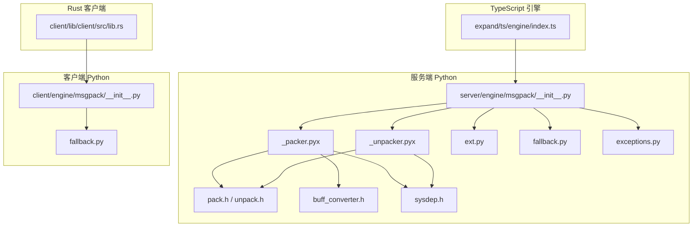
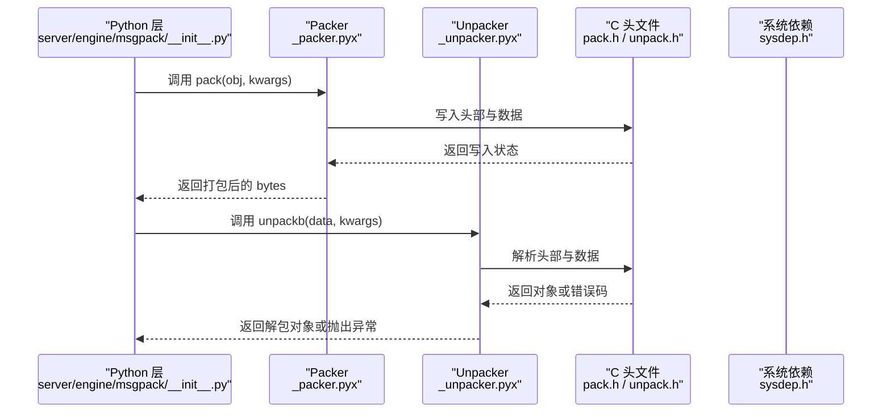
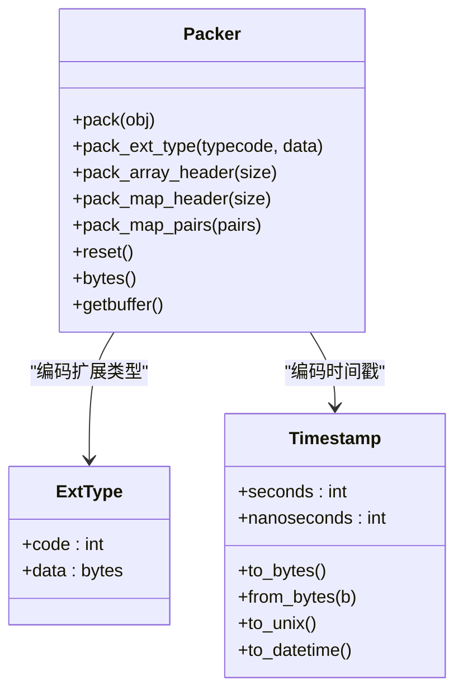
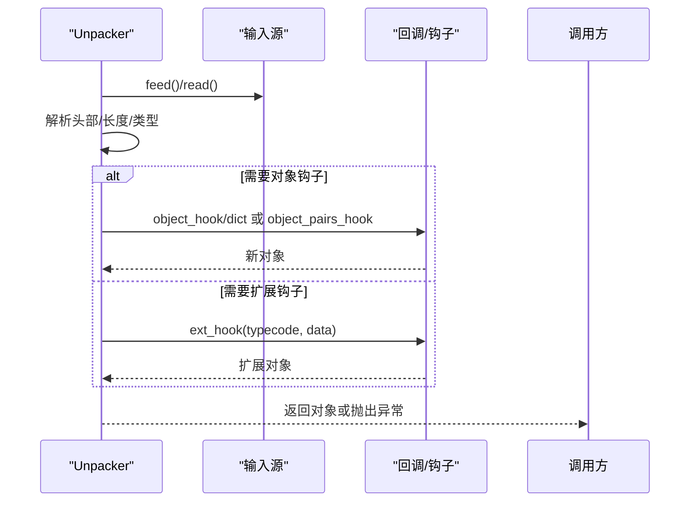
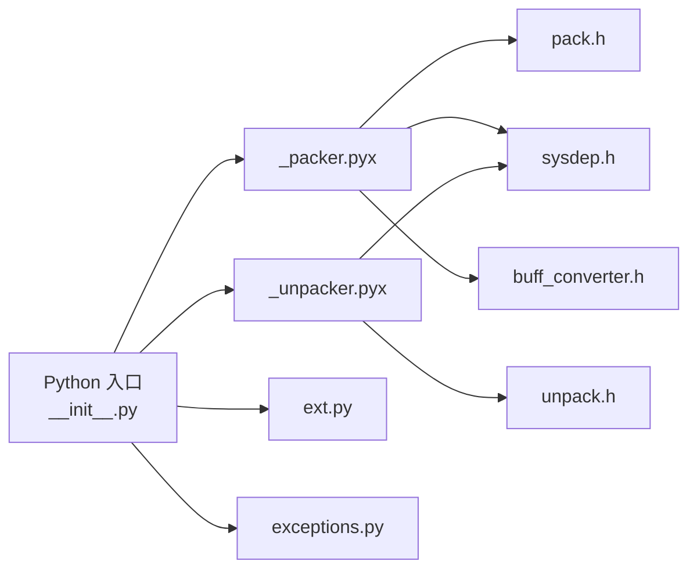

# MessagePack 序列化

<cite>
**本文引用的文件**
- [server/engine/msgpack/__init__.py](file://server/engine/msgpack/__init__.py)
- [server/engine/msgpack/_packer.pyx](file://server/engine/msgpack/_packer.pyx)
- [server/engine/msgpack/_unpacker.pyx](file://server/engine/msgpack/_unpacker.pyx)
- [server/engine/msgpack/ext.py](file://server/engine/msgpack/ext.py)
- [server/engine/msgpack/fallback.py](file://server/engine/msgpack/fallback.py)
- [server/engine/msgpack/pack.h](file://server/engine/msgpack/pack.h)
- [server/engine/msgpack/unpack.h](file://server/engine/msgpack/unpack.h)
- [server/engine/msgpack/buff_converter.h](file://server/engine/msgpack/buff_converter.h)
- [server/engine/msgpack/sysdep.h](file://server/engine/msgpack/sysdep.h)
- [server/engine/msgpack/exceptions.py](file://server/engine/msgpack/exceptions.py)
- [client/engine/msgpack/__init__.py](file://client/engine/msgpack/__init__.py)
- [client/lib/client/src/lib.rs](file://client/lib/client/src/lib.rs)
- [expand/ts/engine/index.ts](file://expand/ts/engine/index.ts)
</cite>

## 目录
1. [引言](#引言)
2. [项目结构](#项目结构)
3. [核心组件](#核心组件)
4. [架构总览](#架构总览)
5. [详细组件分析](#详细组件分析)
6. [依赖分析](#依赖分析)
7. [性能考虑](#性能考虑)
8. [故障排查指南](#故障排查指南)
9. [结论](#结论)
10. [附录](#附录)

## 引言
本文件系统性梳理 geese 项目中基于 MessagePack 的二进制序列化机制，覆盖服务端与客户端在 Python、Rust、TypeScript 环境下的实现与使用方式。内容包括：数据类型映射、编码策略、流式与一次性解包、扩展类型（ExtType、Timestamp）支持、错误处理与边界控制、性能优化建议以及跨语言适配要点。目标是帮助开发者在不同语言环境中正确、高效地使用 MessagePack 进行网络消息编解码。

## 项目结构
geese 在服务端与客户端分别提供了 MessagePack 的 Python 实现与 C 扩展绑定，并在 TypeScript 侧通过生成代码与运行时库进行集成；Rust 客户端通过 Python 绑定与协议生成代码协同工作。

图示来源
- [server/engine/msgpack/__init__.py:1-56](file://server/engine/msgpack/__init__.py#L1-L56)
- [server/engine/msgpack/_packer.pyx:62-375](file://server/engine/msgpack/_packer.pyx#L62-L375)
- [server/engine/msgpack/_unpacker.pyx:213-548](file://server/engine/msgpack/_unpacker.pyx#L213-L548)
- [server/engine/msgpack/ext.py:1-169](file://server/engine/msgpack/ext.py#L1-L169)
- [server/engine/msgpack/fallback.py:1-800](file://server/engine/msgpack/fallback.py#L1-L800)
- [server/engine/msgpack/pack.h:1-90](file://server/engine/msgpack/pack.h#L1-L90)
- [server/engine/msgpack/unpack.h:1-392](file://server/engine/msgpack/unpack.h#L1-L392)
- [server/engine/msgpack/buff_converter.h:1-9](file://server/engine/msgpack/buff_converter.h#L1-L9)
- [server/engine/msgpack/sysdep.h:1-195](file://server/engine/msgpack/sysdep.h#L1-L195)
- [server/engine/msgpack/exceptions.py:1-49](file://server/engine/msgpack/exceptions.py#L1-L49)
- [client/engine/msgpack/__init__.py:1-58](file://client/engine/msgpack/__init__.py#L1-L58)
- [client/lib/client/src/lib.rs:1-116](file://client/lib/client/src/lib.rs#L1-L116)
- [expand/ts/engine/index.ts:1-9](file://expand/ts/engine/index.ts#L1-L9)

章节来源
- [server/engine/msgpack/__init__.py:1-56](file://server/engine/msgpack/__init__.py#L1-L56)
- [client/engine/msgpack/__init__.py:1-58](file://client/engine/msgpack/__init__.py#L1-L58)

## 核心组件
- 服务端入口与选择逻辑
  - 通过环境变量或平台特性自动选择 C 扩展或纯 Python 实现，统一导出 pack/unpack 接口。
- 编码器（Packer）
  - 支持整数、浮点、布尔、字节串、Unicode、数组、映射、内存视图、扩展类型、时间戳等。
  - 可配置单精度浮点、严格类型检查、bin/raw 类型选择、Unicode 错误处理策略、默认转换器等。
- 解码器（Unpacker）
  - 支持一次性解包与流式解包，可配置对象钩子、键值对钩子、列表钩子、扩展钩子、时间戳解析策略、最大长度限制等。
- 扩展类型
  - ExtType：用户自定义扩展类型，带类型码与二进制载荷。
  - Timestamp：标准时间戳扩展，支持秒与纳秒，提供多种序列化/反序列化形式。
- 异常体系
  - 包括缓冲区满、数据不足、格式错误、栈过深、额外数据等，便于定位问题。

章节来源
- [server/engine/msgpack/__init__.py:11-56](file://server/engine/msgpack/__init__.py#L11-L56)
- [server/engine/msgpack/_packer.pyx:62-375](file://server/engine/msgpack/_packer.pyx#L62-L375)
- [server/engine/msgpack/_unpacker.pyx:213-548](file://server/engine/msgpack/_unpacker.pyx#L213-L548)
- [server/engine/msgpack/ext.py:6-169](file://server/engine/msgpack/ext.py#L6-L169)
- [server/engine/msgpack/exceptions.py:1-49](file://server/engine/msgpack/exceptions.py#L1-L49)

## 架构总览
下图展示服务端从 Python 层到 C 扩展层的调用链，以及异常与扩展类型在各层的传递路径。

图示来源
- [server/engine/msgpack/__init__.py:20-56](file://server/engine/msgpack/__init__.py#L20-L56)
- [server/engine/msgpack/_packer.pyx:294-375](file://server/engine/msgpack/_packer.pyx#L294-L375)
- [server/engine/msgpack/_unpacker.pyx:143-211](file://server/engine/msgpack/_unpacker.pyx#L143-L211)
- [server/engine/msgpack/pack.h:38-85](file://server/engine/msgpack/pack.h#L38-L85)
- [server/engine/msgpack/unpack.h:22-392](file://server/engine/msgpack/unpack.h#L22-L392)
- [server/engine/msgpack/sysdep.h:1-195](file://server/engine/msgpack/sysdep.h#L1-L195)

## 详细组件分析

### Python 入口与实现选择
- 服务端优先加载 C 扩展模块，失败则回退到纯 Python 实现；客户端同样遵循相同策略。
- 提供 pack/ packb 与 unpack/ unpackb、dump/dumps/load/loads 等便捷接口。

章节来源
- [server/engine/msgpack/__init__.py:11-56](file://server/engine/msgpack/__init__.py#L11-L56)
- [client/engine/msgpack/__init__.py:13-58](file://client/engine/msgpack/__init__.py#L13-L58)

### 编码器（Packer）类与策略
- 关键参数
  - default：自定义类型转换器
  - use_single_float：是否使用单精度浮点
  - autoreset：每次 pack 后是否重置缓冲区
  - use_bin_type：是否使用 bin/raw 类型
  - strict_types：严格类型匹配
  - datetime：是否将带时区的时间转为 Timestamp
  - unicode_errors：Unicode 编码错误处理
- 数据类型映射与编码策略
  - 整数：根据范围选择最优头部与宽度
  - 浮点：按 use_single_float 选择单/双精度
  - 字节串/内存视图：使用 bin/raw 头部
  - Unicode：使用 str/raw 头部，受 unicode_errors 影响
  - 数组/映射：使用 array/map 头部，支持对象钩子与列表钩子
  - 扩展类型：ExtType 与 Timestamp 分别编码为 ext 类型
  - 递归深度与大对象限制：通过嵌套限制与项上限保护
- 性能优化点
  - 使用内存视图直接读写减少拷贝
  - 自动重置缓冲区避免重复分配
  - 单精度浮点降低体积

图示来源
- [server/engine/msgpack/_packer.pyx:62-375](file://server/engine/msgpack/_packer.pyx#L62-L375)
- [server/engine/msgpack/ext.py:6-169](file://server/engine/msgpack/ext.py#L6-L169)

章节来源
- [server/engine/msgpack/_packer.pyx:62-375](file://server/engine/msgpack/_packer.pyx#L62-L375)
- [server/engine/msgpack/ext.py:19-169](file://server/engine/msgpack/ext.py#L19-L169)

### 解码器（Unpacker）类与流式处理
- 关键参数
  - file_like/read_size：文件对象与读取块大小
  - use_list/raw/timestamp：数组/字符串/时间戳解析策略
  - strict_map_key/object_hook/object_pairs_hook/list_hook/ext_hook：对象与扩展钩子
  - max_buffer_size/max_*_len：安全上限
- 流式与一次性解包
  - 一次性：unpackb，适合已知完整数据
  - 流式：Unpacker.feed/迭代器，适合网络分片
- 时间戳解析策略
  - 0：返回 Timestamp 对象
  - 1：返回秒级浮点
  - 2：返回纳秒级整数
  - 3：返回 UTC datetime 对象
- 边界与错误处理
  - BufferFull：内部缓冲区不足
  - OutOfData：数据不完整
  - FormatError：格式非法
  - StackError：嵌套过深
  - ExtraData：一次性解包后存在多余数据

图示来源
- [server/engine/msgpack/_unpacker.pyx:213-548](file://server/engine/msgpack/_unpacker.pyx#L213-L548)
- [server/engine/msgpack/unpack.h:22-392](file://server/engine/msgpack/unpack.h#L22-L392)

章节来源
- [server/engine/msgpack/_unpacker.pyx:143-548](file://server/engine/msgpack/_unpacker.pyx#L143-L548)
- [server/engine/msgpack/exceptions.py:10-43](file://server/engine/msgpack/exceptions.py#L10-L43)

### 扩展类型与时间戳
- ExtType
  - 由类型码与二进制数据组成，用于承载自定义语义的数据段
- Timestamp
  - 支持 32/64/96 位编码，提供 to_bytes/from_bytes 以适配纯 Python 模式
  - 提供 to_unix/to_datetime/from_unix 等便捷转换

章节来源
- [server/engine/msgpack/ext.py:6-169](file://server/engine/msgpack/ext.py#L6-L169)

### 纯 Python 回退实现
- fallback.py 提供与 C 扩展一致的接口与行为，便于在缺少 C 扩展或特定平台限制时使用
- 解析头字节表与类型分支，逐类构造 Python 对象

章节来源
- [server/engine/msgpack/fallback.py:1-800](file://server/engine/msgpack/fallback.py#L1-L800)

### C 扩展与系统依赖
- pack.h/unpack.h 定义了底层打包/解包的 C 结构与回调函数
- sysdep.h 提供字节序与平台相关的系统依赖
- buff_converter.h 提供从 C 缓冲区到 Python 视图的桥接

章节来源
- [server/engine/msgpack/pack.h:1-90](file://server/engine/msgpack/pack.h#L1-L90)
- [server/engine/msgpack/unpack.h:1-392](file://server/engine/msgpack/unpack.h#L1-L392)
- [server/engine/msgpack/buff_converter.h:1-9](file://server/engine/msgpack/buff_converter.h#L1-L9)
- [server/engine/msgpack/sysdep.h:1-195](file://server/engine/msgpack/sysdep.h#L1-L195)

### 跨语言适配与使用指引

#### Python（服务端/客户端）
- 服务端：优先使用 C 扩展，必要时回退到 fallback
- 客户端：与服务端一致的入口与行为
- 建议：在高吞吐场景启用 C 扩展；在调试或受限环境使用 PUREPYTHON 模式

章节来源
- [server/engine/msgpack/__init__.py:11-56](file://server/engine/msgpack/__init__.py#L11-L56)
- [client/engine/msgpack/__init__.py:13-58](file://client/engine/msgpack/__init__.py#L13-L58)

#### Rust（客户端）
- 通过 Python 绑定与协议生成代码协作，发送/接收消息时使用 Python 侧的 MessagePack 接口
- 注意：Rust 侧不直接调用 C 扩展，而是依赖 Python 层的封装

章节来源
- [client/lib/client/src/lib.rs:1-116](file://client/lib/client/src/lib.rs#L1-L116)

#### TypeScript（引擎侧）
- 通过生成的 proto 文件与引擎入口导出，结合 Python 侧的 MessagePack 进行网络通信
- 建议：在前端/引擎侧保持与服务端一致的类型与字段约定

章节来源
- [expand/ts/engine/index.ts:1-9](file://expand/ts/engine/index.ts#L1-L9)

## 依赖分析
- Python 层依赖
  - C 扩展模块：_cmsgpack（由 Cython 生成），在缺失时回退 fallback
  - 扩展类型：ext.py 提供 ExtType 与 Timestamp
  - 异常：exceptions.py 提供统一异常基类与细分异常
- C 扩展层依赖
  - pack.h/unpack.h：定义打包/解包上下文与回调
  - sysdep.h：字节序与平台宏
  - buff_converter.h：缓冲区视图桥接

图示来源
- [server/engine/msgpack/__init__.py:1-56](file://server/engine/msgpack/__init__.py#L1-L56)
- [server/engine/msgpack/_packer.pyx:22-48](file://server/engine/msgpack/_packer.pyx#L22-L48)
- [server/engine/msgpack/_unpacker.pyx:25-58](file://server/engine/msgpack/_unpacker.pyx#L25-L58)
- [server/engine/msgpack/ext.py:1-169](file://server/engine/msgpack/ext.py#L1-L169)
- [server/engine/msgpack/exceptions.py:1-49](file://server/engine/msgpack/exceptions.py#L1-L49)
- [server/engine/msgpack/pack.h:1-90](file://server/engine/msgpack/pack.h#L1-L90)
- [server/engine/msgpack/unpack.h:1-392](file://server/engine/msgpack/unpack.h#L1-L392)
- [server/engine/msgpack/buff_converter.h:1-9](file://server/engine/msgpack/buff_converter.h#L1-L9)
- [server/engine/msgpack/sysdep.h:1-195](file://server/engine/msgpack/sysdep.h#L1-L195)

## 性能考虑
- 选择合适的数据类型与头部
  - 尽量使用 bin/raw 以减少头部开销
  - 对于小整数与布尔使用紧凑头部
- 控制对象规模与嵌套深度
  - 合理设置 max_*_len 与 max_buffer_size，避免过大对象导致内存压力
- 浮点精度权衡
  - use_single_float 可减小体积，但会损失精度
- 流式解包
  - 使用 Unpacker 流式读取，避免一次性加载大包
- 缓冲区管理
  - autoreset 与 getbuffer/bytes 配合使用，减少重复分配
- 平台与实现
  - 优先使用 C 扩展以获得最佳性能；在受限环境使用 fallback

## 故障排查指南
- 常见异常与定位
  - BufferFull：内部缓冲区不足，增大 max_buffer_size 或分块读取
  - OutOfData：数据不完整，检查网络传输或 feed 次序
  - FormatError：格式非法，检查编码一致性与版本兼容
  - StackError：嵌套过深，检查数据结构设计
  - ExtraData：一次性解包后存在多余数据，确认消息边界
- 时间戳解析
  - 根据 timestamp 参数选择合适的解析策略（Timestamp/float/int/datetime）
- 扩展类型
  - 若未注册 ext_hook，将无法解析非标准扩展类型
- Unicode 与编码
  - unicode_errors 设置为 "replace"/"ignore" 可绕过无效 UTF-8，但需注意数据完整性

章节来源
- [server/engine/msgpack/exceptions.py:10-43](file://server/engine/msgpack/exceptions.py#L10-L43)
- [server/engine/msgpack/_unpacker.pyx:143-211](file://server/engine/msgpack/_unpacker.pyx#L143-L211)
- [server/engine/msgpack/ext.py:70-169](file://server/engine/msgpack/ext.py#L70-L169)

## 结论
geese 的 MessagePack 实现以 Python 入口为核心，结合 C 扩展与纯 Python 回退，提供高性能、可扩展且跨语言一致的二进制序列化能力。通过严格的类型映射、流式解包与丰富的钩子机制，满足游戏与分布式服务对低延迟与高可靠性的需求。建议在生产环境优先使用 C 扩展，并配合合理的边界与错误处理策略，确保稳定性与性能。

## 附录

### 数据类型映射与编码策略摘要
- 整数：紧凑头部 + 无符号/有符号范围判断
- 浮点：单/双精度选择
- 字节串/内存视图：bin/raw 头部
- Unicode：raw/str 头部，受 unicode_errors 影响
- 数组/映射：array/map 头部，支持钩子
- 扩展：ext 头部，ExtType/Timestamp 特殊处理
- 时间戳：32/64/96 位编码，多格式解析

章节来源
- [server/engine/msgpack/_packer.pyx:147-292](file://server/engine/msgpack/_packer.pyx#L147-L292)
- [server/engine/msgpack/_unpacker.pyx:491-563](file://server/engine/msgpack/_unpacker.pyx#L491-L563)
- [server/engine/msgpack/ext.py:70-169](file://server/engine/msgpack/ext.py#L70-L169)