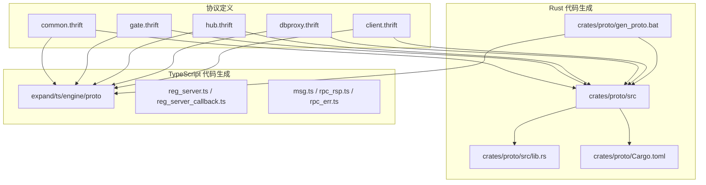
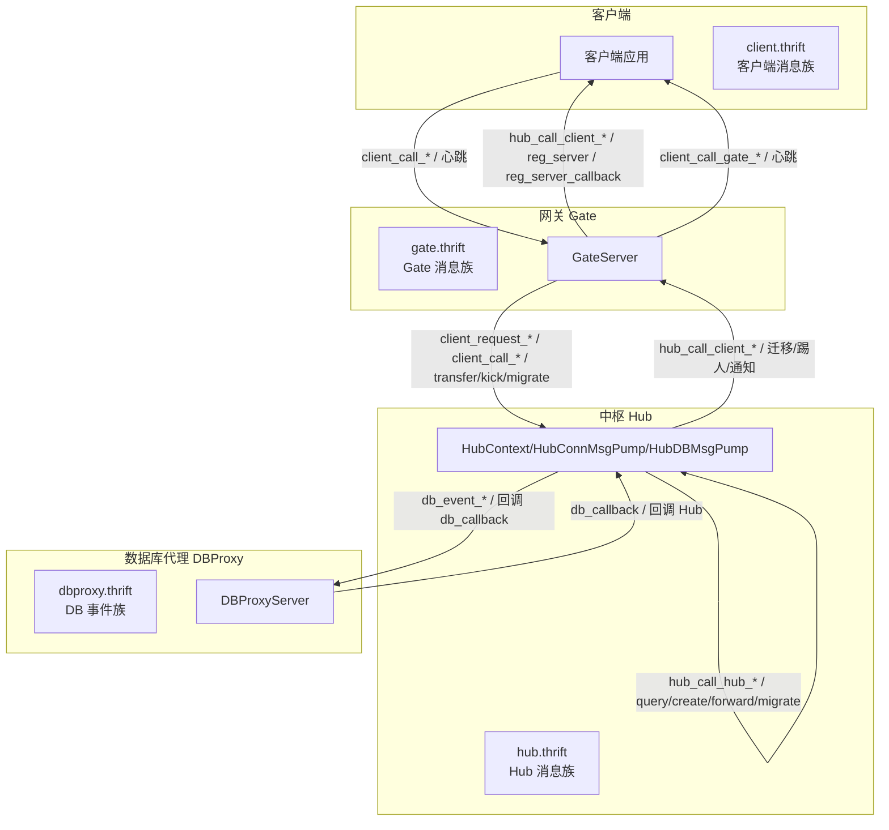
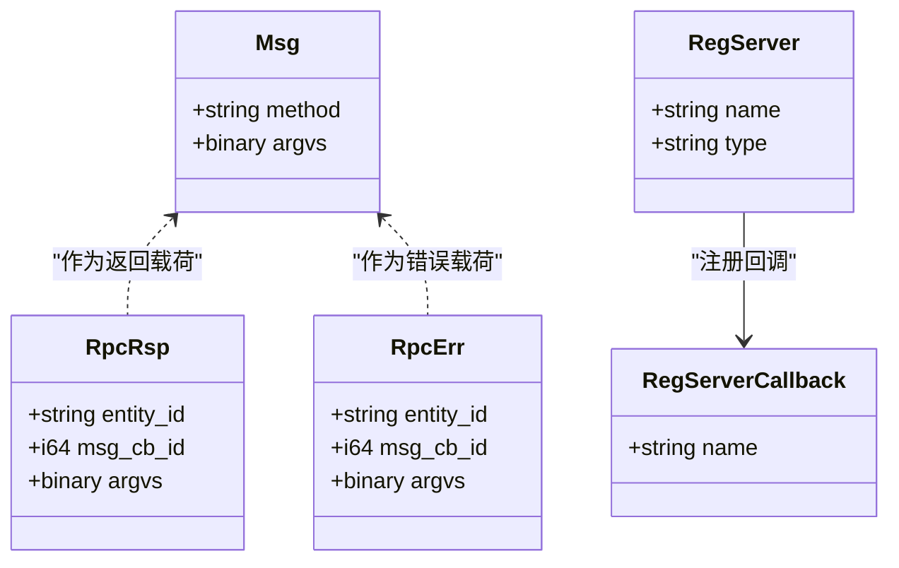
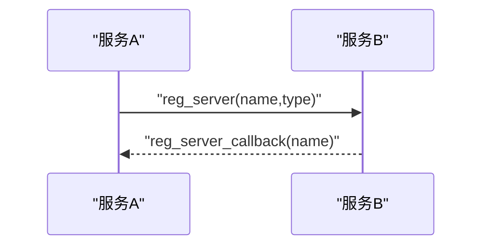
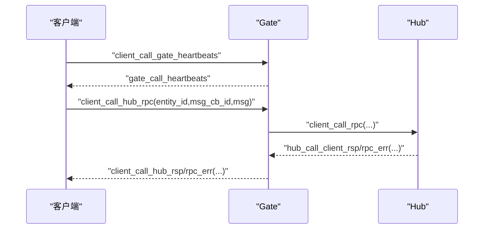
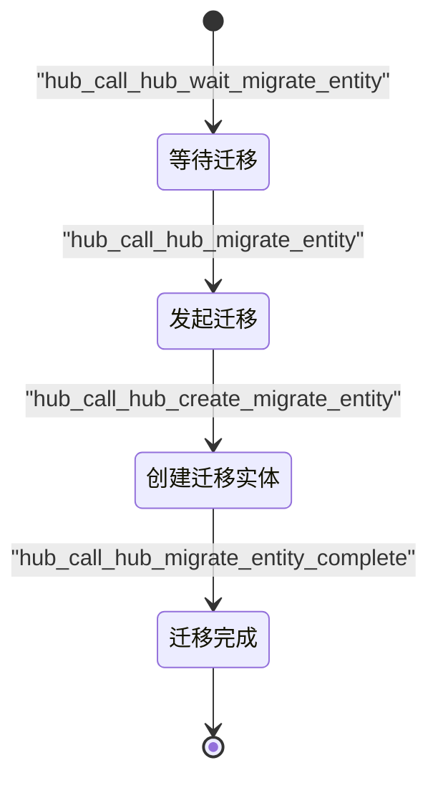
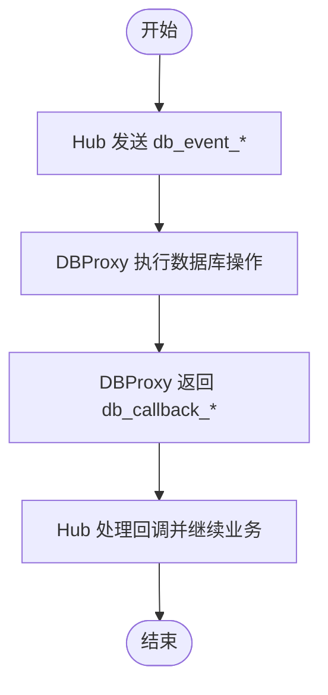
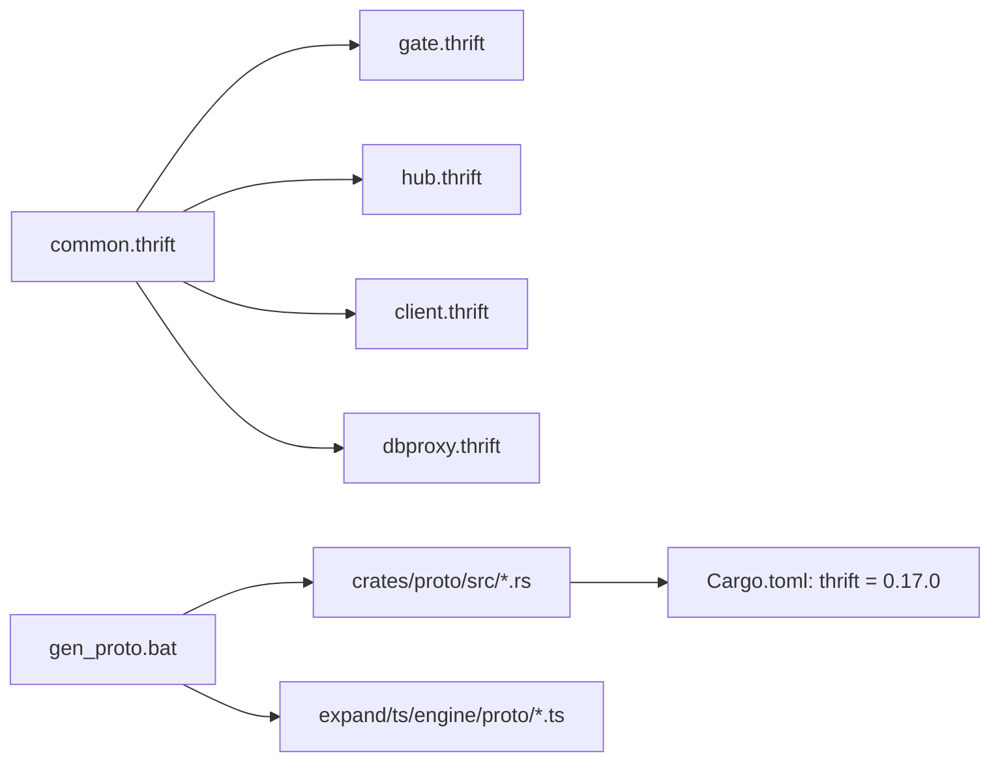

# Thrift 协议定义

<cite>
**本文引用的文件**
- [crates/proto/proto/common.thrift](file://crates/proto/proto/common.thrift)
- [crates/proto/proto/client.thrift](file://crates/proto/proto/client.thrift)
- [crates/proto/proto/gate.thrift](file://crates/proto/proto/gate.thrift)
- [crates/proto/proto/hub.thrift](file://crates/proto/proto/hub.thrift)
- [crates/proto/proto/dbproxy.thrift](file://crates/proto/proto/dbproxy.thrift)
- [crates/proto/src/lib.rs](file://crates/proto/src/lib.rs)
- [crates/proto/Cargo.toml](file://crates/proto/Cargo.toml)
- [crates/proto/gen_proto.bat](file://crates/proto/gen_proto.bat)
- [expand/ts/engine/proto/reg_server.ts](file://expand/ts/engine/proto/reg_server.ts)
- [expand/ts/engine/proto/reg_server_callback.ts](file://expand/ts/engine/proto/reg_server_callback.ts)
- [expand/ts/engine/proto/msg.ts](file://expand/ts/engine/proto/msg.ts)
- [expand/ts/engine/proto/rpc_rsp.ts](file://expand/ts/engine/proto/rpc_rsp.ts)
- [expand/ts/engine/proto/rpc_err.ts](file://expand/ts/engine/proto/rpc_err.ts)
- [server/src/gate_main.rs](file://server/src/gate_main.rs)
- [server/src/dbproxy_main.rs](file://server/src/dbproxy_main.rs)
- [server/src/hub_lib.rs](file://server/src/hub_lib.rs)
</cite>

## 目录
1. [引言](#引言)
2. [项目结构](#项目结构)
3. [核心组件](#核心组件)
4. [架构总览](#架构总览)
5. [详细组件分析](#详细组件分析)
6. [依赖关系分析](#依赖关系分析)
7. [性能考量](#性能考量)
8. [故障排查指南](#故障排查指南)
9. [结论](#结论)
10. [附录](#附录)

## 引言
本文件系统化梳理 geese 的 Thrift 协议定义与跨语言实现，聚焦以下目标：
- 深入解释 Gate、Hub、DBProxy 与客户端之间的 RPC 接口设计与消息流转。
- 详解核心数据结构（如 msg、rpc_rsp、rpc_err）的字段语义与使用场景。
- 阐述服务注册机制（reg_server、reg_server_callback）的工作原理与调用路径。
- 提供协议版本管理与向后兼容策略建议。
- 给出协议编译、代码生成与跨语言调用的完整流程。
- 提供协议扩展指南与最佳实践。

## 项目结构
协议层位于 crates/proto，采用 Thrift IDL 描述服务间消息契约；同时通过脚本生成 Rust 与 TypeScript 双端代码，支撑服务端与前端/浏览器端的统一通信。

图示来源
- [crates/proto/proto/common.thrift](file://crates/proto/proto/common.thrift)
- [crates/proto/proto/gate.thrift](file://crates/proto/proto/gate.thrift)
- [crates/proto/proto/hub.thrift](file://crates/proto/proto/hub.thrift)
- [crates/proto/proto/dbproxy.thrift](file://crates/proto/proto/dbproxy.thrift)
- [crates/proto/proto/client.thrift](file://crates/proto/proto/client.thrift)
- [crates/proto/src/lib.rs](file://crates/proto/src/lib.rs)
- [crates/proto/Cargo.toml](file://crates/proto/Cargo.toml)
- [crates/proto/gen_proto.bat](file://crates/proto/gen_proto.bat)
- [expand/ts/engine/proto/reg_server.ts](file://expand/ts/engine/proto/reg_server.ts)
- [expand/ts/engine/proto/reg_server_callback.ts](file://expand/ts/engine/proto/reg_server_callback.ts)
- [expand/ts/engine/proto/msg.ts](file://expand/ts/engine/proto/msg.ts)
- [expand/ts/engine/proto/rpc_rsp.ts](file://expand/ts/engine/proto/rpc_rsp.ts)
- [expand/ts/engine/proto/rpc_err.ts](file://expand/ts/engine/proto/rpc_err.ts)

章节来源
- [crates/proto/gen_proto.bat](file://crates/proto/gen_proto.bat)
- [crates/proto/src/lib.rs](file://crates/proto/src/lib.rs)
- [crates/proto/Cargo.toml](file://crates/proto/Cargo.toml)

## 核心组件
本节对协议中的关键数据结构进行逐项解读，并给出典型使用场景。

- 基础消息体
  - msg：承载方法名与二进制参数，作为 RPC 调用的通用载体。
  - rpc_rsp：RPC 成功响应，携带实体标识、回调 ID 与返回参数。
  - rpc_err：RPC 失败错误，携带实体标识、回调 ID 与错误参数。
- 服务注册
  - reg_server：服务向其他服务注册自身名称与类型。
  - reg_server_callback：服务注册后的回调，确认注册成功并返回名称。
- 客户端侧消息
  - create_remote_entity / delete_remote_entity / refresh_entity：远程实体生命周期管理。
  - call_rpc / call_rsp / call_err：RPC 请求、响应与错误转发。
  - call_ntf / call_global：通知与全局广播。
  - ntf_conn_id / kick_off / transfer_complete：连接信息、踢人与迁移完成通知。
- Gate 侧消息
  - hub_call_client_*：从 Hub 到客户端的消息族，含实体创建/刷新/删除、RPC、通知、全局消息等。
  - client_call_gate_*：客户端到 Gate 的心跳等消息族。
- Hub 侧消息
  - client_request_*：客户端登录/重连/请求服务。
  - client_call_*：客户端到 Hub 的 RPC/通知。
  - hub_call_hub_*：Hub 内部 RPC/通知。
  - query_service_entity / create_service_entity：服务实体查询与创建。
  - hub_forward_client_request_service*：跨 Gate/Hub 的服务请求转发。
  - 迁移相关：wait_migrate_entity、migrate_entity、create_migrate_entity、migrate_entity_complete。
- DBProxy 事件
  - reg_hub_event / get_guid_event / create_object_event / update_object_event / find_and_modify_event / remove_object_event / get_object_info_event / get_object_count_event：数据库操作事件与回调。

章节来源
- [crates/proto/proto/common.thrift](file://crates/proto/proto/common.thrift)
- [crates/proto/proto/client.thrift](file://crates/proto/proto/client.thrift)
- [crates/proto/proto/gate.thrift](file://crates/proto/proto/gate.thrift)
- [crates/proto/proto/hub.thrift](file://crates/proto/proto/hub.thrift)
- [crates/proto/proto/dbproxy.thrift](file://crates/proto/proto/dbproxy.thrift)

## 架构总览
下图展示 Gate、Hub、DBProxy 与客户端之间的消息流与职责边界。

图示来源
- [crates/proto/proto/client.thrift](file://crates/proto/proto/client.thrift)
- [crates/proto/proto/gate.thrift](file://crates/proto/proto/gate.thrift)
- [crates/proto/proto/hub.thrift](file://crates/proto/proto/hub.thrift)
- [crates/proto/proto/dbproxy.thrift](file://crates/proto/proto/dbproxy.thrift)
- [server/src/gate_main.rs](file://server/src/gate_main.rs)
- [server/src/dbproxy_main.rs](file://server/src/dbproxy_main.rs)
- [server/src/hub_lib.rs](file://server/src/hub_lib.rs)

## 详细组件分析

### 数据模型与消息结构
- msg 字段
  - method：字符串，表示业务方法名。
  - argvs：二进制，表示序列化后的参数载荷。
- rpc_rsp 字段
  - entity_id：字符串，目标实体标识。
  - msg_cb_id：整数（64 位），用于匹配请求-响应。
  - argvs：二进制，返回值载荷。
- rpc_err 字段
  - entity_id：字符串，目标实体标识。
  - msg_cb_id：整数（64 位），用于匹配请求-响应。
  - argvs：二进制，错误信息载荷。
- reg_server / reg_server_callback
  - reg_server：name/type，用于服务注册。
  - reg_server_callback：name，用于注册确认。

图示来源
- [crates/proto/proto/common.thrift](file://crates/proto/proto/common.thrift)

章节来源
- [crates/proto/proto/common.thrift](file://crates/proto/proto/common.thrift)

### 服务注册机制
- 注册请求：服务端构造 reg_server 并发送给目标服务。
- 注册回调：接收方收到 reg_server_callback，确认注册成功。
- 典型调用链：服务 A 发送 reg_server → 服务 B 收到并返回 reg_server_callback。

图示来源
- [crates/proto/proto/common.thrift](file://crates/proto/proto/common.thrift)
- [crates/proto/proto/gate.thrift](file://crates/proto/proto/gate.thrift)
- [crates/proto/proto/hub.thrift](file://crates/proto/proto/hub.thrift)

章节来源
- [crates/proto/proto/common.thrift](file://crates/proto/proto/common.thrift)
- [crates/proto/proto/gate.thrift](file://crates/proto/proto/gate.thrift)
- [crates/proto/proto/hub.thrift](file://crates/proto/proto/hub.thrift)

### RPC 流程与消息映射
- 客户端到 Hub 的 RPC
  - 客户端构造 client_call_hub_rpc，包含 entity_id、msg_cb_id、msg。
  - Hub 收到后可转发至目标 Hub 或服务实体，或回写 client_call_hub_rsp/rpc_err。
- Hub 到客户端的通知/全局消息
  - Hub 通过 hub_call_client_ntf/global/rpc 等结构向客户端推送。
- Gate 的中转
  - Gate 将 Hub 的消息转换为 client.thrift 中的对应结构，再发往客户端。

图示来源
- [crates/proto/proto/gate.thrift](file://crates/proto/proto/gate.thrift)
- [crates/proto/proto/hub.thrift](file://crates/proto/proto/hub.thrift)
- [crates/proto/proto/client.thrift](file://crates/proto/proto/client.thrift)

章节来源
- [crates/proto/proto/gate.thrift](file://crates/proto/proto/gate.thrift)
- [crates/proto/proto/hub.thrift](file://crates/proto/proto/hub.thrift)
- [crates/proto/proto/client.thrift](file://crates/proto/proto/client.thrift)

### 实体迁移与状态机
- Hub 侧迁移状态
  - wait_migrate_entity：等待迁移。
  - migrate_entity：发起迁移，携带实体类型、主连接、网关列表等。
  - create_migrate_entity：在新 Hub 创建迁移实体。
  - migrate_entity_complete：迁移完成。
- Gate 侧迁移状态
  - transfer_client：请求迁移客户端连接。
  - transfer_entity_complete：实体迁移完成。
  - kick_off_client / kick_off_client_complete：踢人与完成。

图示来源
- [crates/proto/proto/hub.thrift](file://crates/proto/proto/hub.thrift)
- [crates/proto/proto/gate.thrift](file://crates/proto/proto/gate.thrift)

章节来源
- [crates/proto/proto/hub.thrift](file://crates/proto/proto/hub.thrift)
- [crates/proto/proto/gate.thrift](file://crates/proto/proto/gate.thrift)

### 数据库代理事件与回调
- 事件族：get_guid、create_object、update_object、find_and_modify、remove_object、get_object_info、get_object_count。
- 回调族：ack_get_guid、ack_create_object、ack_updata_object、ack_find_and_modify、ack_remove_object、ack_get_object_count、ack_get_object_info、ack_get_object_info_end。
- 流程：Hub 发送 db_event_* → DBProxy 执行 → 返回 db_callback_* → Hub 处理。

图示来源
- [crates/proto/proto/dbproxy.thrift](file://crates/proto/proto/dbproxy.thrift)
- [crates/proto/proto/hub.thrift](file://crates/proto/proto/hub.thrift)

章节来源
- [crates/proto/proto/dbproxy.thrift](file://crates/proto/proto/dbproxy.thrift)
- [crates/proto/proto/hub.thrift](file://crates/proto/proto/hub.thrift)

## 依赖关系分析
- 协议依赖
  - gate.thrift、hub.thrift、client.thrift、dbproxy.thrift 均依赖 common.thrift。
- 代码生成依赖
  - gen_proto.bat 使用 Apache Thrift 生成 Rust 与 TypeScript 代码。
  - Rust 通过 Cargo 依赖 thrift crate。
- 服务启动依赖
  - Gate/DBProxy 启动时注册到 Consul，并暴露健康检查端点。

图示来源
- [crates/proto/proto/common.thrift](file://crates/proto/proto/common.thrift)
- [crates/proto/proto/gate.thrift](file://crates/proto/proto/gate.thrift)
- [crates/proto/proto/hub.thrift](file://crates/proto/proto/hub.thrift)
- [crates/proto/proto/client.thrift](file://crates/proto/proto/client.thrift)
- [crates/proto/proto/dbproxy.thrift](file://crates/proto/proto/dbproxy.thrift)
- [crates/proto/gen_proto.bat](file://crates/proto/gen_proto.bat)
- [crates/proto/Cargo.toml](file://crates/proto/Cargo.toml)

章节来源
- [crates/proto/gen_proto.bat](file://crates/proto/gen_proto.bat)
- [crates/proto/Cargo.toml](file://crates/proto/Cargo.toml)

## 性能考量
- 消息序列化
  - 使用二进制 argvs 降低序列化开销，建议在业务层采用高效序列化库（如 MessagePack）。
- RPC 回调匹配
  - msg_cb_id 为 64 位整数，确保高并发下的唯一性与低冲突概率。
- 迁移与通知
  - 迁移过程涉及多节点协调，应避免阻塞式 IO，采用异步与批处理优化。
- 服务注册与发现
  - 通过 Consul 健康检查与自动注册，减少人工干预与故障恢复时间。

## 故障排查指南
- 服务未注册
  - 检查 gen_proto.bat 是否正确生成代码，以及服务启动日志是否包含注册与健康检查信息。
- RPC 无响应
  - 核对 msg_cb_id 是否一致，确认 client_call_* 与 hub_call_client_* 映射正确。
- 迁移异常
  - 关注 hub_call_hub_migrate_entity 与 hub_call_client_* 的一致性，确保实体类型与主连接信息正确。
- 数据库回调缺失
  - 确认 db_event_* 与 db_callback_* 的配对，检查 Hub 对回调的处理逻辑。

章节来源
- [crates/proto/gen_proto.bat](file://crates/proto/gen_proto.bat)
- [server/src/gate_main.rs](file://server/src/gate_main.rs)
- [server/src/dbproxy_main.rs](file://server/src/dbproxy_main.rs)

## 结论
本协议体系以 common.thrift 为核心，围绕 msg、rpc_rsp、rpc_err 构建统一的 RPC 语义，结合 reg_server/reg_server_callback 实现服务自注册与回调确认。Gate、Hub、DBProxy 与客户端之间通过清晰的消息族分工协作，形成可扩展、可观测且具备迁移能力的分布式通信框架。建议在扩展协议时遵循向后兼容原则，严格管理字段编号与默认值，确保跨语言生成代码的一致性。

## 附录

### 协议编译与代码生成流程
- 步骤
  - 在 Windows 上执行 gen_proto.bat，使用 Apache Thrift 生成 Rust 与 TypeScript 代码。
  - Rust 项目通过 Cargo 引入 thrift 依赖，TypeScript 项目通过 npm/yarn 管理依赖。
- 输出
  - Rust：crates/proto/src 下生成对应模块与结构体。
  - TypeScript：expand/ts/engine/proto 下生成对应类与读写方法。

章节来源
- [crates/proto/gen_proto.bat](file://crates/proto/gen_proto.bat)
- [crates/proto/Cargo.toml](file://crates/proto/Cargo.toml)

### 跨语言调用要点
- TypeScript 侧
  - 使用 @creditkarma/thrift-typescript 生成的类进行序列化/反序列化。
  - 注意 i64 类型使用 node-int64 库进行封装与传输。
- Rust 侧
  - 使用 thrift crate 生成的结构体与枚举，配合网络库进行传输。
- 一致性
  - 保持字段编号与类型一致，避免破坏现有客户端/服务端兼容性。

章节来源
- [expand/ts/engine/proto/reg_server.ts](file://expand/ts/engine/proto/reg_server.ts)
- [expand/ts/engine/proto/reg_server_callback.ts](file://expand/ts/engine/proto/reg_server_callback.ts)
- [expand/ts/engine/proto/msg.ts](file://expand/ts/engine/proto/msg.ts)
- [expand/ts/engine/proto/rpc_rsp.ts](file://expand/ts/engine/proto/rpc_rsp.ts)
- [expand/ts/engine/proto/rpc_err.ts](file://expand/ts/engine/proto/rpc_err.ts)
- [crates/proto/Cargo.toml](file://crates/proto/Cargo.toml)

### 协议版本管理与向后兼容
- 版本策略
  - 采用“前缀+主版本号”命名方式（例如 v1、v2），在服务注册与路由中区分不同版本。
- 兼容性保障
  - 新增字段使用可选编号，不修改已有字段编号。
  - 旧客户端/服务端仍可解析新协议，但可能忽略新增字段。
- 扩展指南
  - 新增消息族时，优先复用 common.thrift 的基础结构（msg、rpc_rsp、rpc_err）。
  - 服务注册与回调保持 reg_server/reg_server_callback 的一致性。
  - 迁移与通知消息族需成对维护，确保状态机完整性。