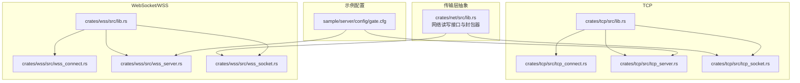
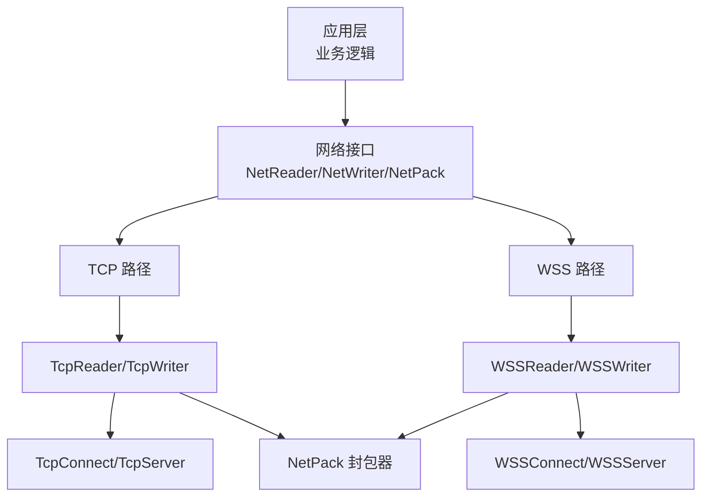
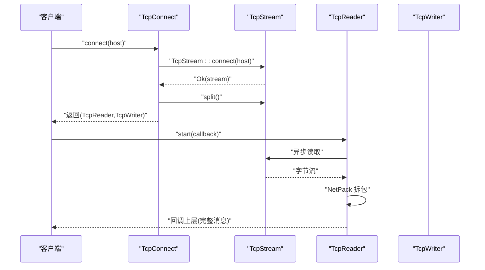
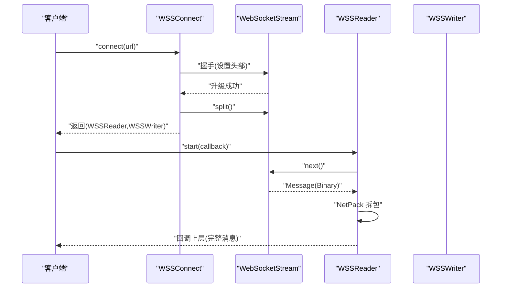
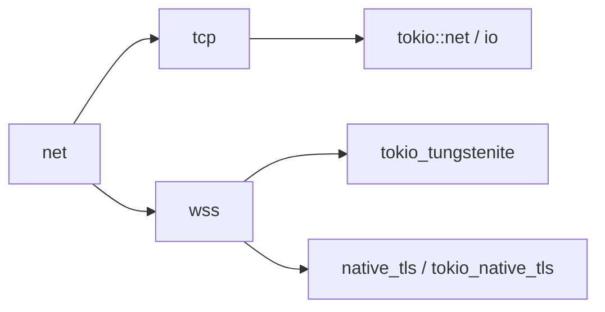

# 传输层实现

<cite>
**本文引用的文件**
- [crates/net/src/lib.rs](file://crates/net/src/lib.rs)
- [crates/tcp/src/lib.rs](file://crates/tcp/src/lib.rs)
- [crates/tcp/src/tcp_connect.rs](file://crates/tcp/src/tcp_connect.rs)
- [crates/tcp/src/tcp_server.rs](file://crates/tcp/src/tcp_server.rs)
- [crates/tcp/src/tcp_socket.rs](file://crates/tcp/src/tcp_socket.rs)
- [crates/wss/src/lib.rs](file://crates/wss/src/lib.rs)
- [crates/wss/src/wss_connect.rs](file://crates/wss/src/wss_connect.rs)
- [crates/wss/src/wss_server.rs](file://crates/wss/src/wss_server.rs)
- [crates/wss/src/wss_socket.rs](file://crates/wss/src/wss_socket.rs)
- [sample/server/config/gate.cfg](file://sample/server/config/gate.cfg)
</cite>

## 目录
1. [简介](#简介)
2. [项目结构](#项目结构)
3. [核心组件](#核心组件)
4. [架构总览](#架构总览)
5. [详细组件分析](#详细组件分析)
6. [依赖关系分析](#依赖关系分析)
7. [性能考量](#性能考量)
8. [故障排查指南](#故障排查指南)
9. [结论](#结论)
10. [附录](#附录)

## 简介
本技术文档聚焦于 geese 传输层的实现与使用，系统性对比并解析 TCP、WebSocket（WS）与 WebSocket Secure（WSS）三种传输协议在代码层面的差异与适用场景。文档涵盖连接管理、连接池与复用策略建议、握手流程与帧格式、安全传输机制、性能优化（缓冲区管理、零拷贝与批量传输）、连接状态管理与心跳检测、异常断线处理、安全考虑（TLS、身份验证与防攻击）、以及面向网络工程师的监控、调试与排障实践。

## 项目结构
传输层相关代码主要分布在以下模块：
- 公共网络抽象与协议封装：crates/net
- TCP 实现：crates/tcp
- WebSocket/WSS 实现：crates/wss
- 示例服务配置：sample/server/config（包含客户端 TCP/WS 端口）

图表来源
- [crates/net/src/lib.rs:1-75](file://crates/net/src/lib.rs#L1-L75)
- [crates/tcp/src/lib.rs:1-3](file://crates/tcp/src/lib.rs#L1-L3)
- [crates/tcp/src/tcp_connect.rs:1-19](file://crates/tcp/src/tcp_connect.rs#L1-L19)
- [crates/tcp/src/tcp_server.rs:1-70](file://crates/tcp/src/tcp_server.rs#L1-L70)
- [crates/tcp/src/tcp_socket.rs:1-101](file://crates/tcp/src/tcp_socket.rs#L1-L101)
- [crates/wss/src/lib.rs:1-4](file://crates/wss/src/lib.rs#L1-L4)
- [crates/wss/src/wss_connect.rs:1-34](file://crates/wss/src/wss_connect.rs#L1-L34)
- [crates/wss/src/wss_server.rs:1-148](file://crates/wss/src/wss_server.rs#L1-L148)
- [crates/wss/src/wss_socket.rs:1-126](file://crates/wss/src/wss_socket.rs#L1-L126)
- [sample/server/config/gate.cfg:1-12](file://sample/server/config/gate.cfg#L1-L12)

章节来源
- [crates/net/src/lib.rs:1-75](file://crates/net/src/lib.rs#L1-L75)
- [crates/tcp/src/lib.rs:1-3](file://crates/tcp/src/lib.rs#L1-L3)
- [crates/wss/src/lib.rs:1-4](file://crates/wss/src/lib.rs#L1-L4)
- [sample/server/config/gate.cfg:1-12](file://sample/server/config/gate.cfg#L1-L12)

## 核心组件
传输层通过统一的网络抽象接口实现对不同传输协议的适配，核心接口与数据结构如下：
- 网络读写接口与回调
  - NetWriter：定义发送与关闭接口
  - NetReader：定义启动接收任务与回调接口
  - NetReaderCallback：收到完整消息后的回调
- 封包器 NetPack：基于固定长度前缀的帧拆装逻辑（长度字段为 4 字节无符号整型）
- TCP 组件：TcpReader/TcpWriter、TcpConnect、TcpServer
- WSS 组件：WSSReader/WSSWriter、WSSConnect、WSSServer（支持 WS 与 WSS）

章节来源
- [crates/net/src/lib.rs:8-23](file://crates/net/src/lib.rs#L8-L23)
- [crates/net/src/lib.rs:25-75](file://crates/net/src/lib.rs#L25-L75)
- [crates/tcp/src/tcp_connect.rs:1-19](file://crates/tcp/src/tcp_connect.rs#L1-L19)
- [crates/tcp/src/tcp_server.rs:17-27](file://crates/tcp/src/tcp_server.rs#L17-L27)
- [crates/tcp/src/tcp_socket.rs:13-101](file://crates/tcp/src/tcp_socket.rs#L13-L101)
- [crates/wss/src/wss_connect.rs:1-34](file://crates/wss/src/wss_connect.rs#L1-L34)
- [crates/wss/src/wss_server.rs:24-27](file://crates/wss/src/wss_server.rs#L24-L27)
- [crates/wss/src/wss_socket.rs:16-126](file://crates/wss/src/wss_socket.rs#L16-L126)

## 架构总览
传输层采用“抽象接口 + 协议适配”的分层设计：
- 上层业务仅依赖 NetReader/NetWriter 与 NetPack，屏蔽底层协议差异
- TCP 与 WSS 分别实现各自的 Reader/Writer，并复用 NetPack 完成帧拆装
- 服务器侧通过回调将新连接的 Reader/Writer 交给上层处理
- 客户端侧通过连接器建立 Reader/Writer 并启动读取任务

图表来源
- [crates/net/src/lib.rs:8-23](file://crates/net/src/lib.rs#L8-L23)
- [crates/net/src/lib.rs:25-75](file://crates/net/src/lib.rs#L25-L75)
- [crates/tcp/src/tcp_connect.rs:1-19](file://crates/tcp/src/tcp_connect.rs#L1-L19)
- [crates/tcp/src/tcp_server.rs:17-27](file://crates/tcp/src/tcp_server.rs#L17-L27)
- [crates/tcp/src/tcp_socket.rs:13-101](file://crates/tcp/src/tcp_socket.rs#L13-L101)
- [crates/wss/src/wss_connect.rs:1-34](file://crates/wss/src/wss_connect.rs#L1-L34)
- [crates/wss/src/wss_server.rs:24-27](file://crates/wss/src/wss_server.rs#L24-L27)
- [crates/wss/src/wss_socket.rs:16-126](file://crates/wss/src/wss_socket.rs#L16-L126)

## 详细组件分析

### TCP 传输实现
- 连接管理
  - 客户端：TcpConnect.connect 建立到远端主机的 TCP 连接，返回分离的读写通道
  - 服务器：TcpServer.listen 绑定监听地址，循环 accept 新连接，拆分为读写通道并通过回调交付给上层
- 读写实现
  - TcpReader.start 启动异步读取任务，使用固定大小缓冲区读取字节流，交由 NetPack 拆包后回调上层
  - TcpWriter.send 在消息前附加 4 字节长度前缀，再发送；close 触发写半部关闭
- 关闭与错误处理
  - 读取返回 0 或错误时视为连接断开并退出读取循环
  - 写入失败返回 false，调用方可据此决定重连或降级

图表来源
- [crates/tcp/src/tcp_connect.rs:10-17](file://crates/tcp/src/tcp_connect.rs#L10-L17)
- [crates/tcp/src/tcp_socket.rs:25-58](file://crates/tcp/src/tcp_socket.rs#L25-L58)
- [crates/net/src/lib.rs:25-75](file://crates/net/src/lib.rs#L25-L75)

章节来源
- [crates/tcp/src/tcp_connect.rs:1-19](file://crates/tcp/src/tcp_connect.rs#L1-L19)
- [crates/tcp/src/tcp_server.rs:22-64](file://crates/tcp/src/tcp_server.rs#L22-L64)
- [crates/tcp/src/tcp_socket.rs:13-101](file://crates/tcp/src/tcp_socket.rs#L13-L101)
- [crates/net/src/lib.rs:25-75](file://crates/net/src/lib.rs#L25-L75)

### WebSocket/ WSS 传输实现
- 连接管理
  - 客户端：WSSConnect.connect 解析 URL，构造握手请求头，发起握手并返回分离的读写通道
  - 服务器：WSSServer.listen_ws 支持明文 WS；listen_wss 使用 native_tls + tokio_native_tls 提供 WSS
- 读写实现
  - WSSReader.start 从流中读取 tungstenite::Message，过滤 Close/Ping，二进制帧交给 NetPack 拆包后回调上层
  - WSSWriter.send 将带长度前缀的消息封装为 Message::Binary 发送；close 触发 WebSocket 关闭
- 握手与帧格式
  - 握手由 tokio_tungstenite::connect_async/accept_async 完成，客户端设置必要的握手头
  - 帧格式与 TCP 一致：4 字节长度前缀 + 负载，但承载在 WebSocket Binary 帧内

图表来源
- [crates/wss/src/wss_connect.rs:12-33](file://crates/wss/src/wss_connect.rs#L12-L33)
- [crates/wss/src/wss_server.rs:98-143](file://crates/wss/src/wss_server.rs#L98-L143)
- [crates/wss/src/wss_socket.rs:29-79](file://crates/wss/src/wss_socket.rs#L29-L79)
- [crates/net/src/lib.rs:25-75](file://crates/net/src/lib.rs#L25-L75)

章节来源
- [crates/wss/src/wss_connect.rs:1-34](file://crates/wss/src/wss_connect.rs#L1-L34)
- [crates/wss/src/wss_server.rs:29-96](file://crates/wss/src/wss_server.rs#L29-L96)
- [crates/wss/src/wss_socket.rs:16-126](file://crates/wss/src/wss_socket.rs#L16-L126)
- [crates/net/src/lib.rs:25-75](file://crates/net/src/lib.rs#L25-L75)

### 三者差异与适用场景
- TCP
  - 特点：面向字节流，自定义帧格式（4 字节长度前缀），低开销，适合高吞吐、低延迟场景
  - 适用：高性能游戏、实时通信、内部微服务间直连
- WebSocket（WS）
  - 特点：基于 HTTP 升级，浏览器友好，可穿越代理/NAT；帧为 Binary 类型
  - 适用：Web 客户端直连、需要代理穿透的场景
- WebSocket Secure（WSS）
  - 特点：在 WS 基础上启用 TLS，提供加密与证书校验
  - 适用：生产环境 Web 客户端、跨公网传输、对机密性有要求的场景

章节来源
- [crates/tcp/src/tcp_socket.rs:72-101](file://crates/tcp/src/tcp_socket.rs#L72-L101)
- [crates/wss/src/wss_socket.rs:94-126](file://crates/wss/src/wss_socket.rs#L94-L126)
- [crates/wss/src/wss_server.rs:98-143](file://crates/wss/src/wss_server.rs#L98-L143)

### 连接池与连接复用策略（建议）
当前仓库未提供连接池实现。基于现有 Reader/Writer 接口，可按以下思路扩展：
- 连接池
  - 维护空闲连接队列（可基于 Channel 或 Mutex+Vec）
  - 出池：取出一个可用连接，若队列为空则新建
  - 归还：发送完成后将连接放回空闲队列
- 复用策略
  - 同一用户会话复用同一连接，避免多连接带来的乱序与资源消耗
  - 批量消息合并发送，减少系统调用次数
- 注意事项
  - 需要心跳与异常检测，及时剔除不可用连接
  - 结合业务负载动态调整池大小

（本小节为概念性建议，不直接对应具体源码）

### 心跳检测与异常断线处理
- 心跳
  - 可在应用层定期发送心跳消息（如 NetPack 前缀帧），并在读取侧检测超时
  - WSS 支持 Ping/Pong（读取侧已记录 ping 日志），可结合业务心跳实现双层保活
- 异常断线
  - TCP：读取返回 0 或错误即视为断线，退出读取循环
  - WSS：遇到 Close 帧或底层错误时退出读取循环
  - 上层应触发重连或迁移逻辑

章节来源
- [crates/tcp/src/tcp_socket.rs:37-55](file://crates/tcp/src/tcp_socket.rs#L37-L55)
- [crates/wss/src/wss_socket.rs:56-77](file://crates/wss/src/wss_socket.rs#L56-L77)

### 安全考虑（TLS、身份验证与防攻击）
- TLS 与证书
  - WSSServer.listen_wss 使用 native_tls + tokio_native_tls 加载 PKCS#12 证书，提供 WSS
  - 建议：生产环境使用受信 CA 证书与强密码套件，禁用弱算法
- 身份验证
  - 可在握手后进行业务层鉴权（如基于 Token 的认证），在回调中完成
- 防攻击
  - 限制单连接最大消息长度，防止内存耗尽
  - 限速与熔断，避免突发流量导致拥塞
  - 对 Ping/Flood 攻击进行速率限制

章节来源
- [crates/wss/src/wss_server.rs:30-96](file://crates/wss/src/wss_server.rs#L30-L96)

## 依赖关系分析
- 模块耦合
  - net 抽象层被 tcp 与 wss 共同依赖，形成低耦合高内聚的接口契约
  - tcp 与 wss 互不依赖，分别独立实现各自协议栈
- 外部依赖
  - TCP：tokio::net、tokio::io
  - WSS：tokio_tungstenite、native_tls、tokio_native_tls
- 可能的循环依赖
  - 当前未见循环依赖；各模块职责清晰

图表来源
- [crates/tcp/src/tcp_socket.rs:1-12](file://crates/tcp/src/tcp_socket.rs#L1-L12)
- [crates/wss/src/wss_socket.rs:1-14](file://crates/wss/src/wss_socket.rs#L1-L14)
- [crates/net/src/lib.rs:1-7](file://crates/net/src/lib.rs#L1-L7)

章节来源
- [crates/tcp/src/tcp_socket.rs:1-12](file://crates/tcp/src/tcp_socket.rs#L1-L12)
- [crates/wss/src/wss_socket.rs:1-14](file://crates/wss/src/wss_socket.rs#L1-L14)
- [crates/net/src/lib.rs:1-7](file://crates/net/src/lib.rs#L1-L7)

## 性能考量
- 缓冲区管理
  - TcpReader 使用固定大小缓冲区（1024 字节）读取，NetPack 作为粘包拆包缓冲
  - 建议：根据业务消息大小调整读缓冲尺寸，减少系统调用次数
- 零拷贝与批量传输
  - 当前实现为拷贝到临时缓冲后再发送；可考虑使用更高效的缓冲链或向量写
  - 批量发送：将多个小包合并为一个大包发送，降低网络栈开销
- 调度与并发
  - 读写均在独立任务中运行，避免阻塞事件循环
  - 建议：为每个连接分配独立任务，避免共享锁竞争

章节来源
- [crates/tcp/src/tcp_socket.rs:33-58](file://crates/tcp/src/tcp_socket.rs#L33-L58)
- [crates/net/src/lib.rs:25-75](file://crates/net/src/lib.rs#L25-L75)

## 故障排查指南
- 常见问题定位
  - 读取返回 0：通常表示对端主动关闭，检查上层是否正确处理断线
  - 读取错误：网络瞬断或对端异常，需记录错误并触发重连
  - WSS Close 帧：对端显式关闭，需清理资源并上报
- 日志与监控
  - 使用 tracing 记录关键事件（accept、read、send、close 等）
  - 建议：统计每秒消息数、平均包大小、丢包率、重连次数等指标
- 调试步骤
  - 确认握手成功（WSS）与端口监听正常（TCP/WS）
  - 验证封包长度前缀与负载一致性
  - 检查 TLS 证书与私钥有效性（WSS）

章节来源
- [crates/tcp/src/tcp_server.rs:42-58](file://crates/tcp/src/tcp_server.rs#L42-L58)
- [crates/tcp/src/tcp_socket.rs:37-55](file://crates/tcp/src/tcp_socket.rs#L37-L55)
- [crates/wss/src/wss_server.rs:58-90](file://crates/wss/src/wss_server.rs#L58-L90)
- [crates/wss/src/wss_socket.rs:56-77](file://crates/wss/src/wss_socket.rs#L56-L77)

## 结论
geese 的传输层以统一的网络接口为核心，分别实现了 TCP 与 WebSocket/WSS 的适配层，既保证了协议多样性，又维持了上层业务的一致性。通过 NetPack 的帧格式与 Reader/Writer 的异步任务模型，系统具备良好的可扩展性与可维护性。建议在生产环境中结合连接池、批量发送、心跳与 TLS 等能力进一步完善性能与安全性。

## 附录
- 端口配置参考
  - 网关服务示例配置包含客户端 TCP 端口与 WS 端口，便于对照部署与测试

章节来源
- [sample/server/config/gate.cfg:7-8](file://sample/server/config/gate.cfg#L7-L8)