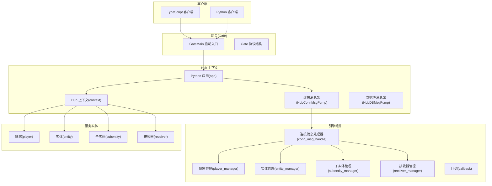
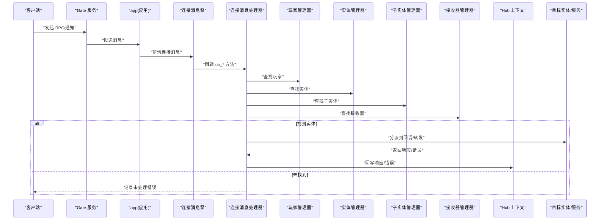
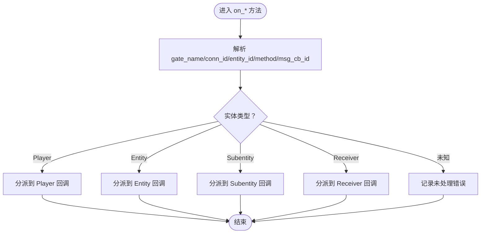
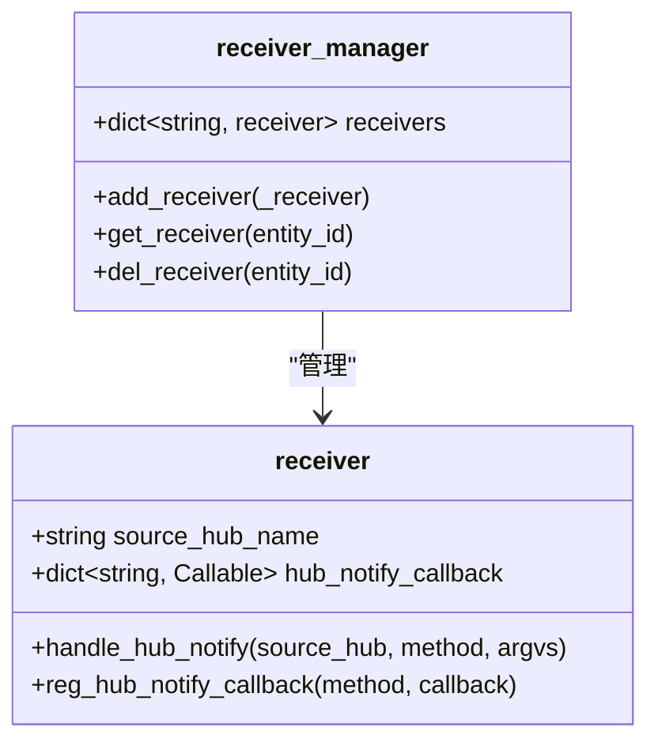
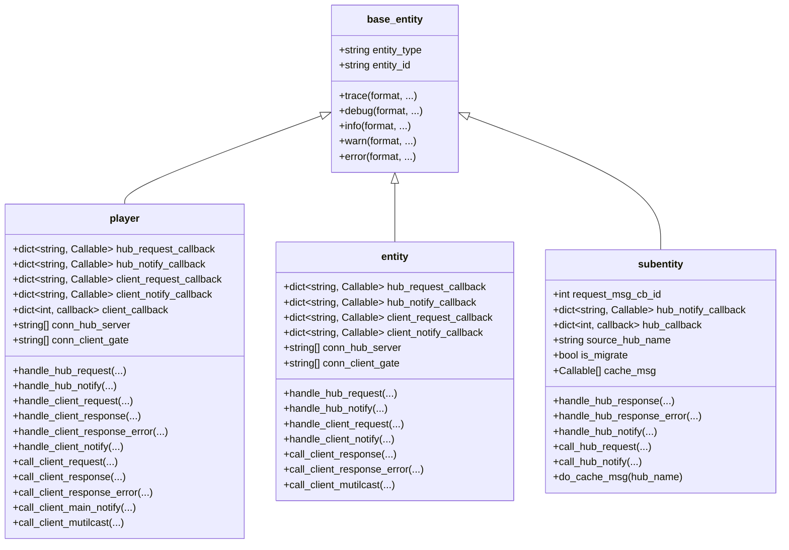
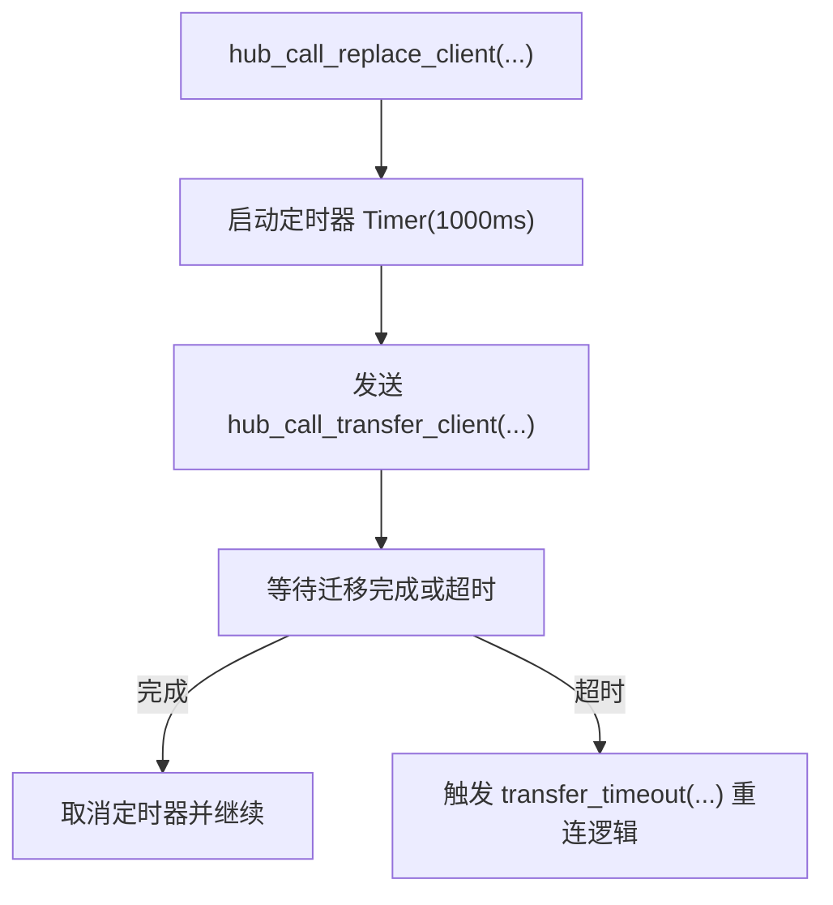
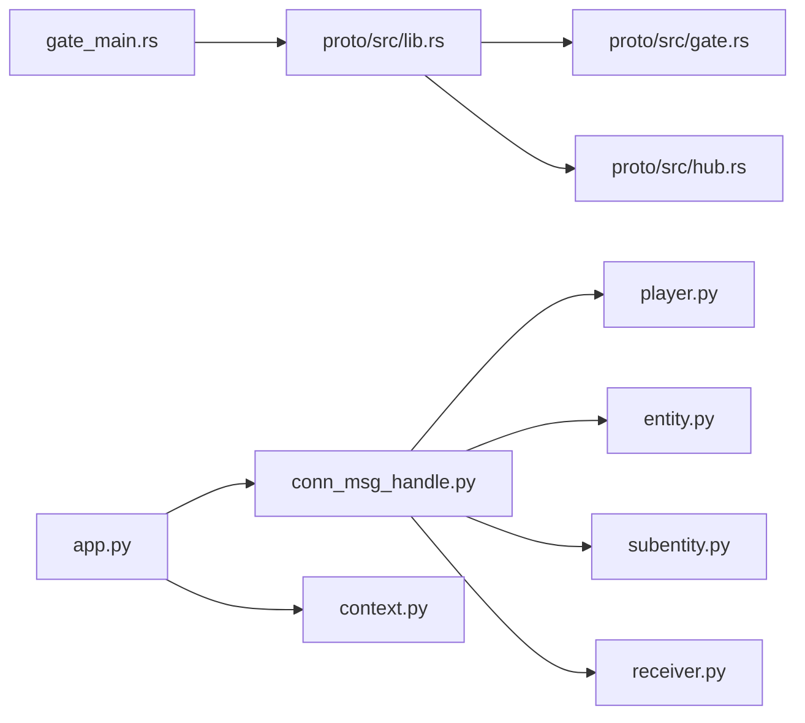

# 消息路由机制

<cite>
**本文档引用的文件**
- [server/engine/conn_msg_handle.py](file://server/engine/conn_msg_handle.py)
- [server/engine/receiver.py](file://server/engine/receiver.py)
- [server/engine/callback.py](file://server/engine/callback.py)
- [server/engine/context.py](file://server/engine/context.py)
- [server/engine/base_entity.py](file://server/engine/base_entity.py)
- [server/engine/player.py](file://server/engine/player.py)
- [server/engine/entity.py](file://server/engine/entity.py)
- [server/engine/subentity.py](file://server/engine/subentity.py)
- [server/engine/app.py](file://server/engine/app.py)
- [crates/proto/src/lib.rs](file://crates/proto/src/lib.rs)
- [crates/proto/src/gate.rs](file://crates/proto/src/gate.rs)
- [crates/proto/src/hub.rs](file://crates/proto/src/hub.rs)
- [server/src/gate_main.rs](file://server/src/gate_main.rs)
</cite>

## 目录
1. [引言](#引言)
2. [项目结构](#项目结构)
3. [核心组件](#核心组件)
4. [架构总览](#架构总览)
5. [详细组件分析](#详细组件分析)
6. [依赖关系分析](#依赖关系分析)
7. [性能考量](#性能考量)
8. [故障排查指南](#故障排查指南)
9. [结论](#结论)
10. [附录](#附录)

## 引言
本文件面向系统架构师与开发工程师，全面阐述 geese 的消息路由机制：从客户端请求进入网关（Gate），经由 Hub 上下文（Context）在服务间转发，再到实体（Player/Entity/Subentity）的路由与回调处理，覆盖消息解析、路由决策、分发策略、回调与超时、迁移与容错等关键环节。文档同时提供架构图、序列图与流程图，帮助读者快速把握端到端的消息流转路径与优化方向。

## 项目结构
geese 采用“Python 引擎 + Rust 协议 + 多语言客户端 SDK”的混合架构：
- Python 引擎层负责业务实体管理、消息泵轮询、上下文桥接与回调调度
- Rust 协议层定义跨进程/跨服务通信的 Thrift 结构体与序列化协议
- 客户端 SDK 提供统一的 RPC/通知接口与回调注册



图表来源
- [server/src/gate_main.rs:33-117](file://server/src/gate_main.rs#L33-L117)
- [server/engine/app.py:54-100](file://server/engine/app.py#L54-L100)
- [server/engine/context.py:13-173](file://server/engine/context.py#L13-L173)
- [server/engine/conn_msg_handle.py:6-190](file://server/engine/conn_msg_handle.py#L6-L190)

章节来源
- [server/src/gate_main.rs:33-117](file://server/src/gate_main.rs#L33-L117)
- [server/engine/app.py:54-100](file://server/engine/app.py#L54-L100)
- [crates/proto/src/lib.rs:1-5](file://crates/proto/src/lib.rs#L1-L5)

## 核心组件
- 连接消息处理器（conn_msg_handle）：负责将来自 Gate 的客户端消息映射到具体实体，并触发路由与转发
- 实体基类（base_entity）：提供日志与实体标识能力
- 玩家实体（player）：管理客户端连接、请求/通知回调、跨 Hub 调用与迁移
- 实体（entity）：通用实体抽象，支持 Hub 间迁移与远程实体创建
- 子实体（subentity）：用于 Hub 内部的请求/通知与缓存消息
- 接收器（receiver）：面向 Hub 通知的回调注册与分发
- 回调（callback）：RPC 响应与错误的异步回调封装，支持超时
- 上下文（context）：Hub 侧消息桥接，封装所有跨服务调用
- 应用（app）：单例应用，初始化各管理器与消息泵，驱动事件循环

章节来源
- [server/engine/conn_msg_handle.py:6-190](file://server/engine/conn_msg_handle.py#L6-L190)
- [server/engine/base_entity.py:3-26](file://server/engine/base_entity.py#L3-L26)
- [server/engine/player.py:11-295](file://server/engine/player.py#L11-L295)
- [server/engine/entity.py:8-194](file://server/engine/entity.py#L8-L194)
- [server/engine/subentity.py:8-98](file://server/engine/subentity.py#L8-L98)
- [server/engine/receiver.py:5-39](file://server/engine/receiver.py#L5-L39)
- [server/engine/callback.py:5-23](file://server/engine/callback.py#L5-L23)
- [server/engine/context.py:13-173](file://server/engine/context.py#L13-L173)
- [server/engine/app.py:54-233](file://server/engine/app.py#L54-L233)

## 架构总览
消息从客户端到服务端的完整路径如下：
- 客户端通过 Gate 发起请求或通知
- Gate 将消息交给 Hub 上下文（context）
- app 的 HubConnMsgPump 轮询连接消息，交由 conn_msg_handle 解析
- conn_msg_handle 根据实体类型与 ID 查找对应实体（Player/Entity/Subentity/Receiver）
- 实体根据方法名分派到已注册的回调，或通过 context 转发至目标 Hub/客户端
- 回调通过 callback 管理响应与错误，并支持超时



图表来源
- [server/engine/app.py:172-233](file://server/engine/app.py#L172-L233)
- [server/engine/conn_msg_handle.py:38-157](file://server/engine/conn_msg_handle.py#L38-L157)
- [server/engine/context.py:75-136](file://server/engine/context.py#L75-L136)

## 详细组件分析

### 连接消息处理器（conn_msg_handle）
职责与流程
- 登录/重连：将客户端登录与重连请求转交登录服务处理
- 迁移控制：更新玩家/实体的连接信息，必要时删除远程实体
- 断线/踢人：清理玩家状态并向客户端发送完成通知
- 客户端请求：按实体类型分派到 Player/Entity 或记录未处理
- Hub 请求/通知：按实体类型分派到 Player/Entity/Subentity/Receiver
- 服务查询与实体迁移：通过服务管理器与上下文协调跨 Hub 路由



图表来源
- [server/engine/conn_msg_handle.py:43-157](file://server/engine/conn_msg_handle.py#L43-L157)

章节来源
- [server/engine/conn_msg_handle.py:6-190](file://server/engine/conn_msg_handle.py#L6-L190)

### 接收器设计模式与消息分发（receiver）
- 接收器（receiver）：面向 Hub 通知的回调注册与分发
- 接收器管理器（receiver_manager）：维护实体 ID 到接收器的映射，支持添加/查询/删除



图表来源
- [server/engine/receiver.py:5-39](file://server/engine/receiver.py#L5-L39)

章节来源
- [server/engine/receiver.py:5-39](file://server/engine/receiver.py#L5-L39)

### 回调机制与异步响应（callback）
- 回调（callback）：封装 RPC 响应与错误回调，支持超时定时器
- 超时处理：通过 Timer 在指定时间后触发超时回调，确保资源释放

```mermaid
classDiagram
class callback {
+callback(rsp_callback, err_callback)
+timeout(_timeout, time_callback)
+__call_timeout__()
+release_handle()
}
```

图表来源
- [server/engine/callback.py:5-23](file://server/engine/callback.py#L5-L23)

章节来源
- [server/engine/callback.py:5-23](file://server/engine/callback.py#L5-L23)

### 实体与消息分发（player/entity/subentity）
- 玩家（player）：维护客户端连接与 Hub 连接列表，支持动态迁移；提供 Hub/客户端双向请求/通知与响应
- 实体（entity）：通用实体抽象，支持 Hub 间迁移与远程实体创建
- 子实体（subentity）：在迁移期间缓存消息，迁移完成后批量回放



图表来源
- [server/engine/base_entity.py:3-26](file://server/engine/base_entity.py#L3-L26)
- [server/engine/player.py:11-295](file://server/engine/player.py#L11-L295)
- [server/engine/entity.py:8-194](file://server/engine/entity.py#L8-L194)
- [server/engine/subentity.py:8-98](file://server/engine/subentity.py#L8-L98)

章节来源
- [server/engine/player.py:11-295](file://server/engine/player.py#L11-L295)
- [server/engine/entity.py:8-194](file://server/engine/entity.py#L8-L194)
- [server/engine/subentity.py:8-98](file://server/engine/subentity.py#L8-L98)

### 上下文与路由（context）
- 上下文（context）：封装所有跨 Hub/客户端的路由调用，如创建/刷新远程实体、RPC/通知、迁移等待与完成等
- 转移超时：在迁移场景中设置定时器，避免长时间挂起



图表来源
- [server/engine/context.py:138-143](file://server/engine/context.py#L138-L143)
- [server/engine/context.py:6-12](file://server/engine/context.py#L6-L12)

章节来源
- [server/engine/context.py:13-173](file://server/engine/context.py#L13-L173)

### 应用与消息泵（app）
- 应用（app）：单例，初始化 HubConnMsgPump/HubDBMsgPump，启动轮询线程，驱动事件循环
- 轮询策略：连接消息与数据库消息分别在独立线程中轮询，保证低延迟与高吞吐

```mermaid
sequenceDiagram
participant App as "app"
participant ConnPump as "HubConnMsgPump"
participant DBPump as "HubDBMsgPump"
participant Loop as "事件循环"
App->>Loop : "启动事件循环"
App->>ConnPump : "轮询连接消息"
App->>DBPump : "轮询数据库消息"
ConnPump-->>App : "回调 conn_msg_handle.*"
DBPump-->>App : "回调 dbproxy_msg_handle.*"
```

图表来源
- [server/engine/app.py:172-233](file://server/engine/app.py#L172-L233)

章节来源
- [server/engine/app.py:54-233](file://server/engine/app.py#L54-L233)

## 依赖关系分析
- 协议层（crates/proto）：定义跨服务消息结构体，包括 Hub <-> Gate、Hub <-> Hub、Hub <-> Client 的消息格式
- 引擎层（server/engine）：基于协议进行消息解析与路由，管理实体生命周期与回调
- Gate 层（server/src/gate_main.rs）：作为客户端接入点，启动健康检查与服务注册



图表来源
- [crates/proto/src/lib.rs:1-5](file://crates/proto/src/lib.rs#L1-L5)
- [crates/proto/src/gate.rs:35-161](file://crates/proto/src/gate.rs#L35-L161)
- [crates/proto/src/hub.rs:35-138](file://crates/proto/src/hub.rs#L35-L138)
- [server/src/gate_main.rs:33-117](file://server/src/gate_main.rs#L33-L117)
- [server/engine/app.py:54-100](file://server/engine/app.py#L54-L100)

章节来源
- [crates/proto/src/lib.rs:1-5](file://crates/proto/src/lib.rs#L1-L5)
- [crates/proto/src/gate.rs:35-161](file://crates/proto/src/gate.rs#L35-L161)
- [crates/proto/src/hub.rs:35-138](file://crates/proto/src/hub.rs#L35-L138)
- [server/src/gate_main.rs:33-117](file://server/src/gate_main.rs#L33-L117)

## 性能考量
- 轮询频率与节流：应用层对轮询间隔进行节流（约 33ms），在繁忙/空闲状态下切换健康状态，避免过度占用 CPU
- 异步事件循环：使用 asyncio 驱动协程任务，减少阻塞
- 缓存与批量：子实体在迁移期间缓存消息，迁移完成后一次性回放，降低消息丢失风险
- 负载均衡建议：通过服务注册与发现（Consul）选择可用 Gate/Hubs，结合实体的动态迁移策略实现水平扩展

章节来源
- [server/engine/app.py:197-233](file://server/engine/app.py#L197-L233)
- [server/engine/subentity.py:77-82](file://server/engine/subentity.py#L77-L82)

## 故障排查指南
常见问题与定位要点
- 未处理的客户端请求/通知：检查 conn_msg_handle 中是否正确匹配实体类型与方法名
- 回调未触发或超时：确认 callback 注册与 msg_cb_id 匹配，检查超时定时器是否被取消
- 迁移过程中的消息丢失：确认 subentity 的缓存机制与 do_cache_msg 是否执行
- 连接断开与重连：检查断线回调与重连逻辑，关注迁移超时定时器的触发

章节来源
- [server/engine/conn_msg_handle.py:55-81](file://server/engine/conn_msg_handle.py#L55-L81)
- [server/engine/callback.py:17-23](file://server/engine/callback.py#L17-L23)
- [server/engine/subentity.py:77-82](file://server/engine/subentity.py#L77-L82)
- [server/engine/context.py:6-12](file://server/engine/context.py#L6-L12)

## 结论
geese 的消息路由机制以“连接消息处理器 + 实体回调 + 上下文桥接”为核心，实现了从客户端到 Hub、再到服务实体的清晰路径。通过回调与超时机制保障异步响应，通过迁移与缓存策略提升容错性。建议在生产环境中结合健康检查、服务注册与动态迁移策略，持续优化吞吐与稳定性。

## 附录
- 协议结构参考
  - Hub <-> Gate：ClientRequestLogin/ClientRequestReconnect/ClientCallRpc/ClientCallRsp/ClientCallErr/ClientCallNtf/ClientDisconnnect/KickOffClient/TransferEntityControl/TransferMsgEnd 等
  - Hub <-> Hub：ClientRequestService/HubCallClientCreateRemoteEntity/HubCallClientDeleteRemoteEntity/HubCallClientRefreshEntity/HubCallClientRpc/HubCallClientRsp/HubCallClientErr/HubCallClientNtf/HubCallClientGlobal 等
  - Hub <-> Hub（内部 RPC）：ClientCallHubRpc/HubCallHubRpc/HubCallHubRsp/HubCallHubErr/HubCallHubNtf 等

章节来源
- [crates/proto/src/gate.rs:35-161](file://crates/proto/src/gate.rs#L35-L161)
- [crates/proto/src/gate.rs:416-493](file://crates/proto/src/gate.rs#L416-L493)
- [crates/proto/src/gate.rs:499-716](file://crates/proto/src/gate.rs#L499-L716)
- [crates/proto/src/hub.rs:35-138](file://crates/proto/src/hub.rs#L35-L138)
- [crates/proto/src/hub.rs:250-356](file://crates/proto/src/hub.rs#L250-L356)
- [crates/proto/src/hub.rs:651-672](file://crates/proto/src/hub.rs#L651-L672)