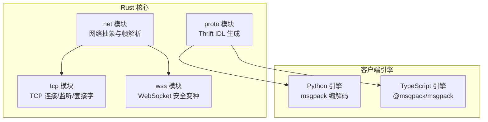
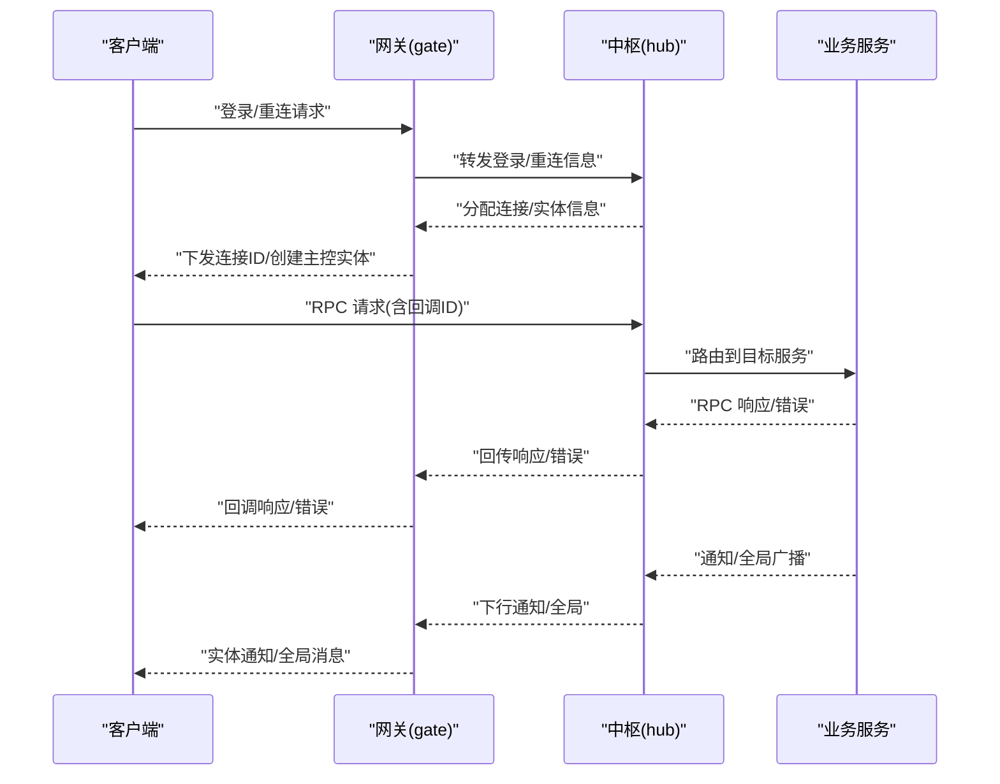
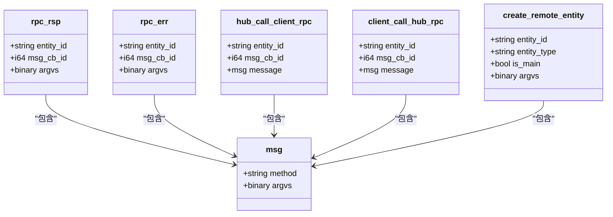
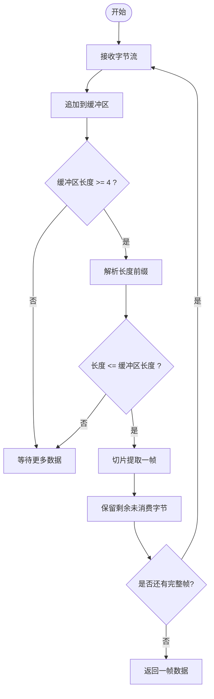
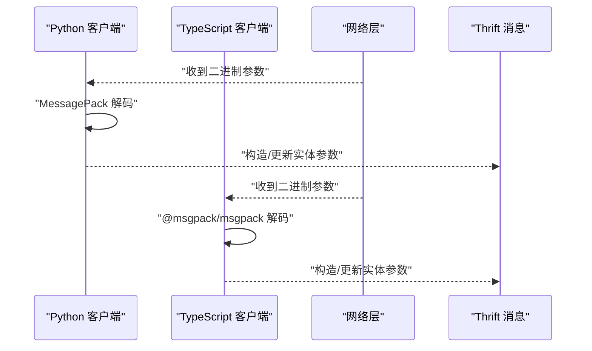
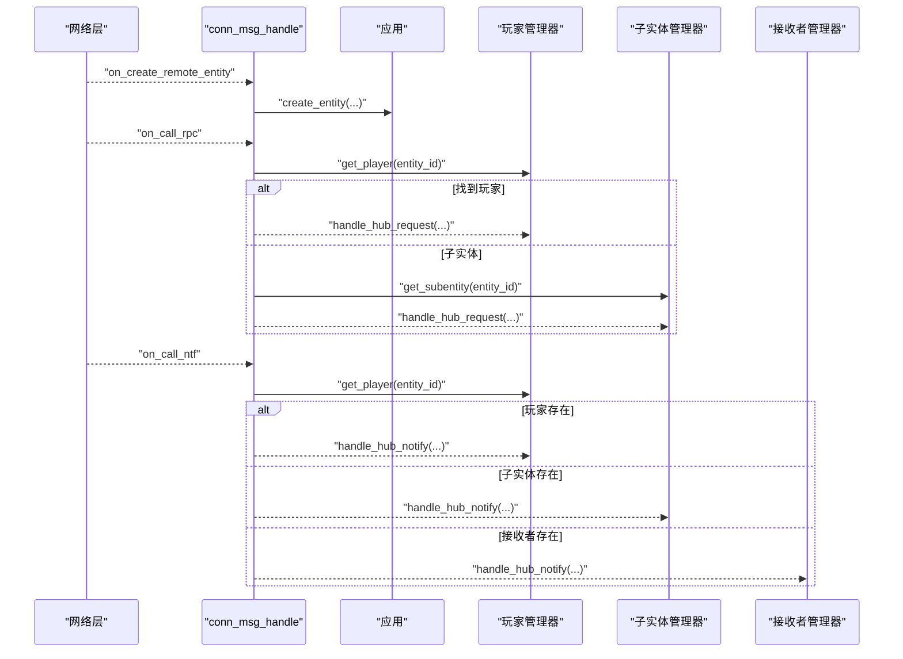
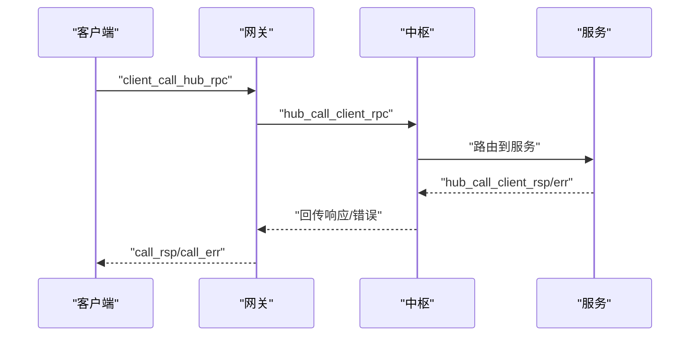
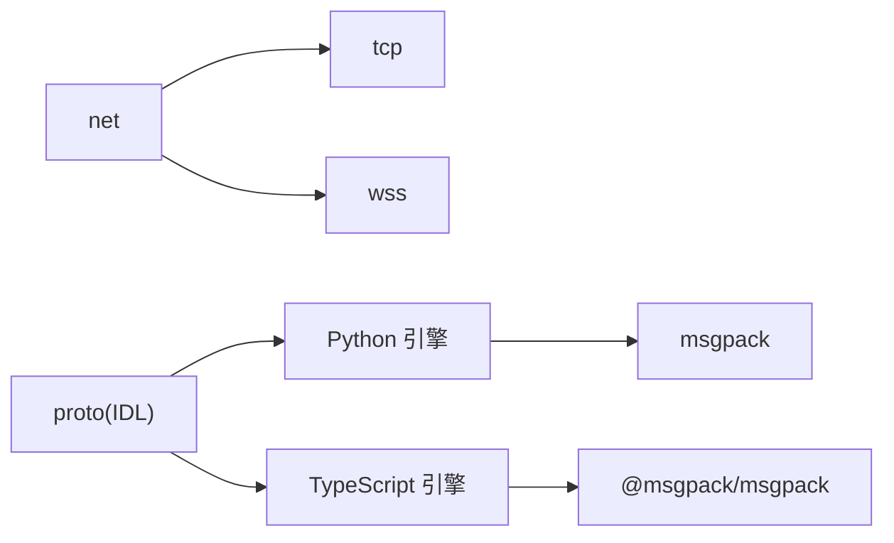

# 通信协议

<cite>
**本文引用的文件**
- [crates/proto/proto/common.thrift](file://crates/proto/proto/common.thrift)
- [crates/proto/proto/client.thrift](file://crates/proto/proto/client.thrift)
- [crates/proto/proto/gate.thrift](file://crates/proto/proto/gate.thrift)
- [crates/proto/proto/hub.thrift](file://crates/proto/proto/hub.thrift)
- [crates/proto/proto/dbproxy.thrift](file://crates/proto/proto/dbproxy.thrift)
- [crates/proto/src/lib.rs](file://crates/proto/src/lib.rs)
- [crates/net/src/lib.rs](file://crates/net/src/lib.rs)
- [crates/tcp/src/lib.rs](file://crates/tcp/src/lib.rs)
- [crates/wss/src/lib.rs](file://crates/wss/src/lib.rs)
- [client/engine/msgpack/__init__.py](file://client/engine/msgpack/__init__.py)
- [client/engine/conn_msg_handle.py](file://client/engine/conn_msg_handle.py)
- [client/engine/session.py](file://client/engine/session.py)
- [client/engine/receiver.py](file://client/engine/receiver.py)
- [expand/ts/engine/conn_msg_handle.ts](file://expand/ts/engine/conn_msg_handle.ts)
- [expand/ts/engine/session.ts](file://expand/ts/engine/session.ts)
</cite>

## 目录
1. [简介](#简介)
2. [项目结构](#项目结构)
3. [核心组件](#核心组件)
4. [架构总览](#架构总览)
5. [详细组件分析](#详细组件分析)
6. [依赖关系分析](#依赖关系分析)
7. [性能考量](#性能考量)
8. [故障排查指南](#故障排查指南)
9. [结论](#结论)
10. [附录](#附录)

## 简介
本文件面向 geese 通信协议的技术文档，聚焦于基于 Thrift 的跨语言 RPC 通信机制与消息编解码方案。内容涵盖：
- 协议定义：Thrift IDL 结构体与联合类型，统一消息模型与回调约定
- 消息格式：二进制封装、长度前缀帧格式与 MessagePack 编解码
- 传输层实现：TCP 与 WebSocket 安全变种的抽象与读写接口
- 消息路由：客户端连接管理、实体生命周期、服务间 RPC/通知/全局广播
- 版本管理与兼容：字段演进与向后兼容策略
- 扩展实践：自定义消息类型与最佳实践
- 高级主题：网络性能优化、消息压缩与批量传输

## 项目结构
geese 采用多语言混合工程组织方式：
- Rust 作为核心运行时与网络传输层（net、tcp、wss）
- Python/TypeScript 客户端引擎与示例
- Thrift IDL 定义跨语言协议契约，生成各语言绑定

**图表来源**
- [crates/net/src/lib.rs:1-75](file://crates/net/src/lib.rs#L1-L75)
- [crates/tcp/src/lib.rs:1-3](file://crates/tcp/src/lib.rs#L1-L3)
- [crates/wss/src/lib.rs:1-4](file://crates/wss/src/lib.rs#L1-L4)
- [crates/proto/src/lib.rs:1-5](file://crates/proto/src/lib.rs#L1-L5)

**章节来源**
- [crates/net/src/lib.rs:1-75](file://crates/net/src/lib.rs#L1-L75)
- [crates/tcp/src/lib.rs:1-3](file://crates/tcp/src/lib.rs#L1-L3)
- [crates/wss/src/lib.rs:1-4](file://crates/wss/src/lib.rs#L1-L4)
- [crates/proto/src/lib.rs:1-5](file://crates/proto/src/lib.rs#L1-L5)

## 核心组件
- 协议定义层（Thrift IDL）：定义统一消息体、RPC 回调、实体生命周期与服务注册等
- 传输层（Rust）：抽象网络读写接口、帧解析器与 TCP/WSS 实现
- 编解码层（Python/TS）：MessagePack 编解码与对象序列化
- 客户端消息处理（Python/TS）：连接 ID 分发、实体创建/刷新/删除、RPC/通知/全局消息分发

**章节来源**
- [crates/proto/proto/common.thrift:1-39](file://crates/proto/proto/common.thrift#L1-L39)
- [crates/proto/proto/client.thrift:1-112](file://crates/proto/proto/client.thrift#L1-L112)
- [crates/proto/proto/gate.thrift:1-225](file://crates/proto/proto/gate.thrift#L1-L225)
- [crates/proto/proto/hub.thrift:1-292](file://crates/proto/proto/hub.thrift#L1-L292)
- [crates/net/src/lib.rs:1-75](file://crates/net/src/lib.rs#L1-L75)
- [client/engine/msgpack/__init__.py:1-58](file://client/engine/msgpack/__init__.py#L1-L58)

## 架构总览
下图展示从客户端到网关再到中枢的典型 RPC 流程，以及实体生命周期与通知广播路径。

**图表来源**
- [crates/proto/proto/gate.thrift:158-225](file://crates/proto/proto/gate.thrift#L158-L225)
- [crates/proto/proto/hub.thrift:69-100](file://crates/proto/proto/hub.thrift#L69-L100)
- [crates/proto/proto/client.thrift:54-90](file://crates/proto/proto/client.thrift#L54-L90)

## 详细组件分析

### 协议定义与消息模型
- 统一消息体与回调
  - msg：方法名与二进制参数
  - rpc_rsp/rpc_err：RPC 响应回调
- 客户端侧消息
  - 创建/刷新/删除远程实体
  - 连接ID、断线踢出、迁移完成
  - RPC/通知/全局消息
- 网关侧消息
  - 客户端到中枢的登录/重连/服务请求
  - 中枢到客户端的实体操作、RPC/通知/全局
  - 踢人/转移/迁移控制
- 中枢侧消息
  - 客户端接入/断开/重连
  - 服务查询/创建/迁移
  - 服务间 RPC/通知/迁移协调
- 数据库代理消息
  - GUID 获取、对象 CRUD、查询计数等事件

**图表来源**
- [crates/proto/proto/common.thrift:2-17](file://crates/proto/proto/common.thrift#L2-L17)
- [crates/proto/proto/client.thrift:7-29](file://crates/proto/proto/client.thrift#L7-L29)
- [crates/proto/proto/gate.thrift:48-52](file://crates/proto/proto/gate.thrift#L48-L52)
- [crates/proto/proto/gate.thrift:158-161](file://crates/proto/proto/gate.thrift#L158-L161)
- [crates/proto/proto/hub.thrift:72-77](file://crates/proto/proto/hub.thrift#L72-L77)

**章节来源**
- [crates/proto/proto/common.thrift:1-39](file://crates/proto/proto/common.thrift#L1-L39)
- [crates/proto/proto/client.thrift:1-112](file://crates/proto/proto/client.thrift#L1-L112)
- [crates/proto/proto/gate.thrift:1-225](file://crates/proto/proto/gate.thrift#L1-L225)
- [crates/proto/proto/hub.thrift:1-292](file://crates/proto/proto/hub.thrift#L1-L292)
- [crates/proto/proto/dbproxy.thrift:1-72](file://crates/proto/proto/dbproxy.thrift#L1-L72)

### 传输层与帧格式
- 抽象接口
  - NetWriter：异步发送与关闭
  - NetReader：启动读取任务并回调数据
  - NetPack：按长度前缀拼包与切片
- 帧格式
  - 固定 4 字节长度前缀（大端/小端一致），随后为完整消息体
  - 解析失败或长度不足时累积缓冲，直至凑齐一帧
- TCP/WSS
  - 提供 socket/connect/server 三类模块，分别对应底层套接字、连接发起与监听

**图表来源**
- [crates/net/src/lib.rs:25-75](file://crates/net/src/lib.rs#L25-L75)

**章节来源**
- [crates/net/src/lib.rs:1-75](file://crates/net/src/lib.rs#L1-L75)
- [crates/tcp/src/lib.rs:1-3](file://crates/tcp/src/lib.rs#L1-L3)
- [crates/wss/src/lib.rs:1-4](file://crates/wss/src/lib.rs#L1-L4)

### 编解码与序列化方案
- 选择理由
  - MessagePack：紧凑二进制、跨语言生态完善、支持时间戳扩展类型
  - Python 优先使用 C 扩展，降级到纯 Python 实现以保证可移植性
  - TypeScript 使用 @msgpack/msgpack，API 与 Python 对齐
- 实现要点
  - Python：通过入口模块自动选择 C 扩展或回退实现；提供 pack/unpack 接口
  - TypeScript：使用 decode/encode 对 Uint8Array 进行对象编解码
  - 客户端引擎在收到二进制参数后进行解码，再交由实体处理

**图表来源**
- [client/engine/msgpack/__init__.py:1-58](file://client/engine/msgpack/__init__.py#L1-L58)
- [expand/ts/engine/conn_msg_handle.ts:1-96](file://expand/ts/engine/conn_msg_handle.ts#L1-L96)

**章节来源**
- [client/engine/msgpack/__init__.py:1-58](file://client/engine/msgpack/__init__.py#L1-L58)
- [expand/ts/engine/conn_msg_handle.ts:1-96](file://expand/ts/engine/conn_msg_handle.ts#L1-L96)

### 客户端消息处理与实体路由
- 连接管理
  - 收到连接ID后设置会话标识，并触发回调
  - 断线/迁移完成后触发相应事件
- 实体生命周期
  - 创建/刷新/删除远程实体，参数为 MessagePack 编码对象
- RPC/通知/全局消息
  - RPC：按实体ID路由至玩家或子实体；回调通过 msg_cb_id 匹配
  - 通知：优先玩家/子实体，其次接收者管理器
  - 全局：直接上抛应用层处理

**图表来源**
- [client/engine/conn_msg_handle.py:1-86](file://client/engine/conn_msg_handle.py#L1-L86)
- [expand/ts/engine/conn_msg_handle.ts:1-96](file://expand/ts/engine/conn_msg_handle.ts#L1-L96)
- [client/engine/receiver.py:1-48](file://client/engine/receiver.py#L1-L48)

**章节来源**
- [client/engine/conn_msg_handle.py:1-86](file://client/engine/conn_msg_handle.py#L1-L86)
- [client/engine/receiver.py:1-48](file://client/engine/receiver.py#L1-L48)
- [expand/ts/engine/conn_msg_handle.ts:1-96](file://expand/ts/engine/conn_msg_handle.ts#L1-L96)

### 服务间通信与迁移
- 登录/重连/服务请求
  - 客户端通过网关向中枢发起请求，中枢分配连接与实体
- RPC/通知/全局
  - 中枢根据实体ID/服务名路由到目标服务，支持跨中枢 RPC
- 迁移与转移
  - 中枢通知网关迁移实体，网关再通知客户端；完成后回传确认

**图表来源**
- [crates/proto/proto/gate.thrift:182-200](file://crates/proto/proto/gate.thrift#L182-L200)
- [crates/proto/proto/hub.thrift:151-169](file://crates/proto/proto/hub.thrift#L151-L169)
- [crates/proto/proto/client.thrift:64-73](file://crates/proto/proto/client.thrift#L64-L73)

**章节来源**
- [crates/proto/proto/gate.thrift:1-225](file://crates/proto/proto/gate.thrift#L1-L225)
- [crates/proto/proto/hub.thrift:1-292](file://crates/proto/proto/hub.thrift#L1-L292)
- [crates/proto/proto/client.thrift:1-112](file://crates/proto/proto/client.thrift#L1-L112)

## 依赖关系分析
- Rust 层
  - net 为传输抽象，tcp/wss 为其具体实现
  - proto 由 Thrift 生成，供 Python/TS 使用
- 客户端层
  - Python/TS 引擎依赖各自语言的 MessagePack 实现
  - 消息处理模块依赖应用层实体管理器

**图表来源**
- [crates/net/src/lib.rs:1-75](file://crates/net/src/lib.rs#L1-L75)
- [crates/tcp/src/lib.rs:1-3](file://crates/tcp/src/lib.rs#L1-L3)
- [crates/wss/src/lib.rs:1-4](file://crates/wss/src/lib.rs#L1-L4)
- [client/engine/msgpack/__init__.py:1-58](file://client/engine/msgpack/__init__.py#L1-L58)
- [expand/ts/engine/conn_msg_handle.ts:1-96](file://expand/ts/engine/conn_msg_handle.ts#L1-L96)

**章节来源**
- [crates/net/src/lib.rs:1-75](file://crates/net/src/lib.rs#L1-L75)
- [crates/tcp/src/lib.rs:1-3](file://crates/tcp/src/lib.rs#L1-L3)
- [crates/wss/src/lib.rs:1-4](file://crates/wss/src/lib.rs#L1-L4)
- [client/engine/msgpack/__init__.py:1-58](file://client/engine/msgpack/__init__.py#L1-L58)
- [expand/ts/engine/conn_msg_handle.ts:1-96](file://expand/ts/engine/conn_msg_handle.ts#L1-L96)

## 性能考量
- 帧格式与粘包处理
  - 4 字节长度前缀 + 消息体，避免粘包/半包问题，解析逻辑简单高效
- 编解码效率
  - MessagePack 二进制紧凑，Python/TS 均有高性能实现；建议复用解码结果，避免重复解码
- 批量传输
  - 可将多个 RPC/通知合并为单帧发送，减少网络往返；需注意边界与超时控制
- 压缩策略
  - 大对象参数可启用压缩（如 gzip/snappy），在编解码阶段插入压缩/解压步骤
- 心跳与保活
  - 客户端与网关/中枢均支持心跳消息，用于检测链路健康与清理空闲连接

[本节为通用性能指导，不直接分析具体文件]

## 故障排查指南
- 连接ID缺失
  - 确认已收到 ntf_conn_id 并设置会话标识
- 实体未创建/刷新
  - 检查 create_remote_entity/refresh_entity 参数是否为合法 MessagePack 对象
- RPC 无响应
  - 核对 msg_cb_id 是否匹配；检查实体是否存在且可处理该方法
- 通知未到达
  - 确认实体/接收者管理器中存在对应实体；检查方法名是否注册回调
- 迁移/转移异常
  - 关注迁移完成与转移完成事件；确保网关与中枢状态一致

**章节来源**
- [client/engine/conn_msg_handle.py:1-86](file://client/engine/conn_msg_handle.py#L1-L86)
- [client/engine/receiver.py:1-48](file://client/engine/receiver.py#L1-L48)
- [expand/ts/engine/conn_msg_handle.ts:1-96](file://expand/ts/engine/conn_msg_handle.ts#L1-L96)

## 结论
geese 通信协议以 Thrift 为契约，结合 MessagePack 编解码与 Rust 传输层，构建了跨语言、低开销、可扩展的 RPC 通信体系。通过统一的消息模型、清晰的实体生命周期与服务间路由机制，满足复杂在线场景下的实时交互需求。遵循本文档的版本管理、扩展实践与性能优化建议，可有效保障系统的稳定性与演进能力。

## 附录

### 协议版本管理与向后兼容
- 字段演进
  - 新增可选字段（带默认值）；旧版本客户端忽略新字段
  - 删除字段改为保留但标记废弃，避免破坏历史数据
- 方法演进
  - 新增方法时保持现有方法签名不变；通过联合类型扩展消息集合
- 版本协商
  - 建议在握手阶段携带协议版本号，服务端按版本裁剪功能集

[本节为通用指导，不直接分析具体文件]

### 协议扩展最佳实践
- 自定义消息类型
  - 在对应 Thrift 文件中新增结构体与联合分支，保持命名规范与语义清晰
  - 生成各语言绑定并同步测试
- 自定义实体
  - 在客户端引擎中注册实体类型与回调映射，确保参数解码正确
- 回调一致性
  - RPC 回调必须成对出现（rsp/err），并在超时与异常情况下清理资源

[本节为通用指导，不直接分析具体文件]