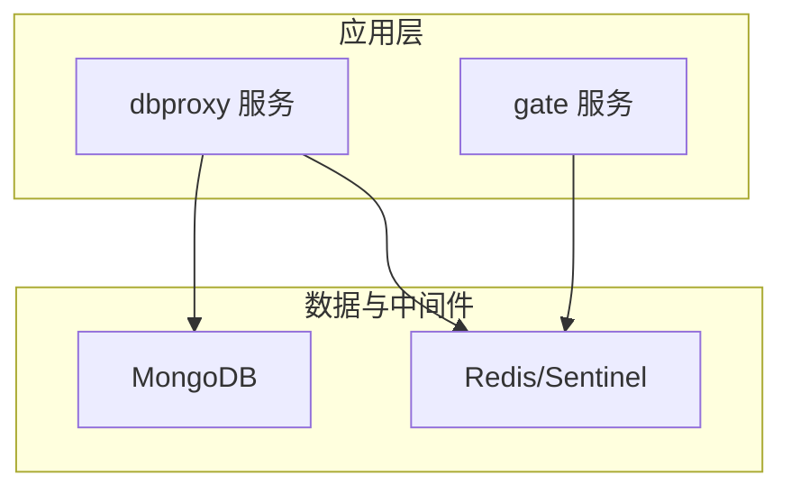
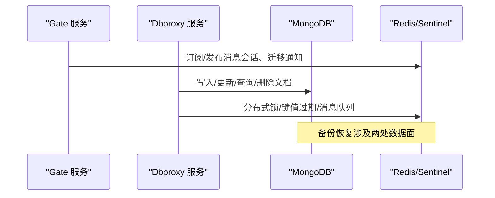
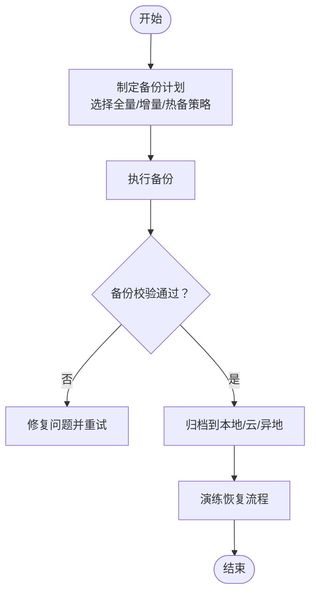
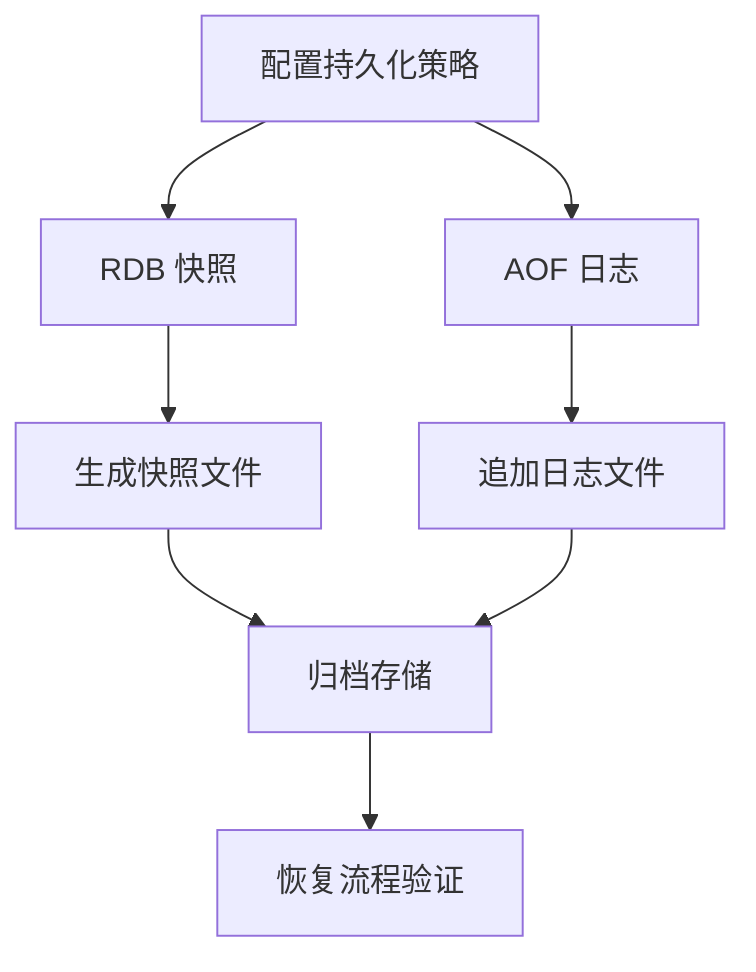
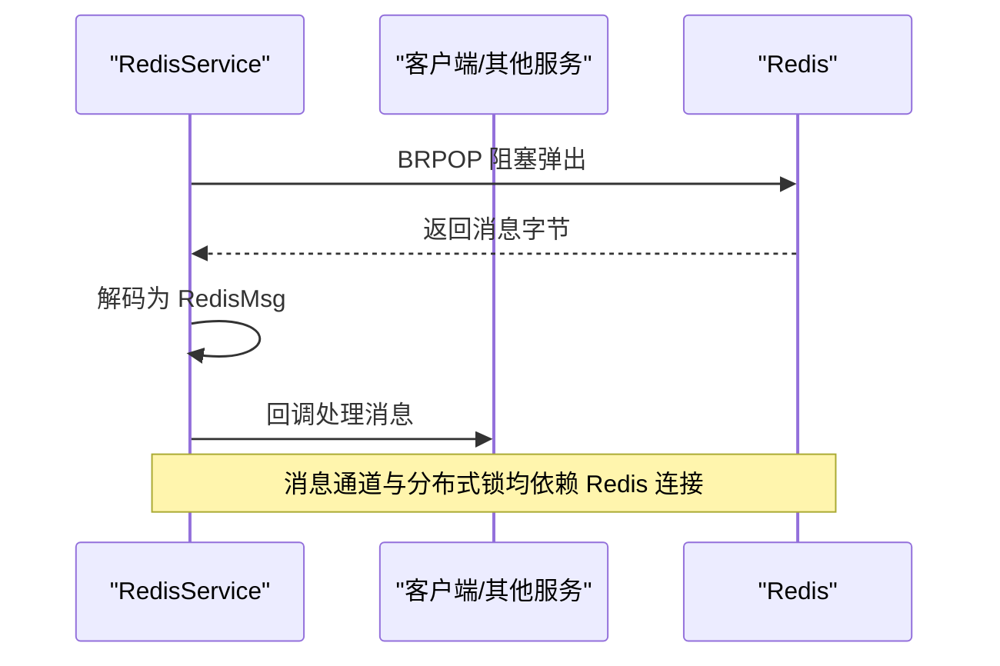
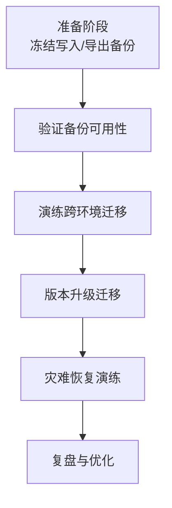
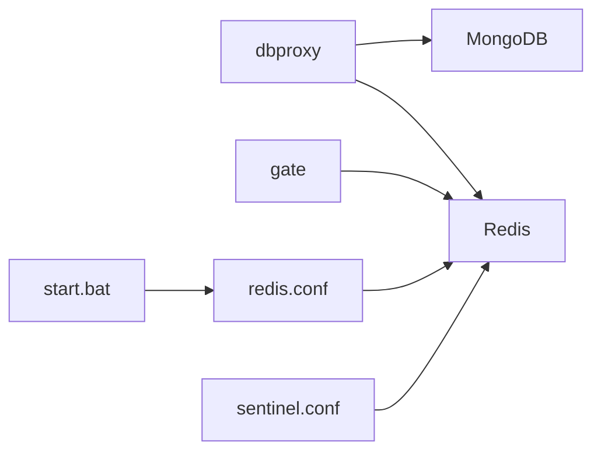

# 备份恢复

<cite>
**本文引用的文件**
- [crates/mongo/src/lib.rs](file://crates/mongo/src/lib.rs)
- [crates/redis_service/src/redis_service.rs](file://crates/redis_service/src/redis_service.rs)
- [crates/redis_service/src/redis_mq_channel.rs](file://crates/redis_service/src/redis_mq_channel.rs)
- [crates/proto/src/common.rs](file://crates/proto/src/common.rs)
- [crates/proto/src/dbproxy.rs](file://crates/proto/src/dbproxy.rs)
- [crates/proto/src/hub.rs](file://crates/proto/src/hub.rs)
- [server/dependences/redis/redis.conf](file://server/dependences/redis/redis.conf)
- [server/dependences/redis/sentinel.conf](file://server/dependences/redis/sentinel.conf)
- [server/dependences/redis/start.bat](file://server/dependences/redis/start.bat)
- [sample/server/config/dbproxy.cfg](file://sample/server/config/dbproxy.cfg)
- [sample/server/config/gate.cfg](file://sample/server/config/gate.cfg)
</cite>

## 目录
1. [简介](#简介)
2. [项目结构](#项目结构)
3. [核心组件](#核心组件)
4. [架构总览](#架构总览)
5. [详细组件分析](#详细组件分析)
6. [依赖关系分析](#依赖关系分析)
7. [性能考量](#性能考量)
8. [故障排查指南](#故障排查指南)
9. [结论](#结论)
10. [附录](#附录)

## 简介
本指南面向 geese 框架的数据备份与恢复场景，聚焦两类关键数据源：MongoDB（持久化存储）与 Redis（缓存与消息通道）。文档内容涵盖：
- MongoDB 全量/增量/热备份策略建议与落地要点
- Redis RDB 快照与 AOF 日志持久化配置与运维建议
- 跨环境迁移、版本升级迁移与灾难恢复演练流程
- 备份存储策略（本地/云端/异地容灾）
- 备份验证与恢复测试方法
- 自动化脚本与监控告警建议
- 数据一致性检查与修复思路
- 备份数据安全与访问控制

## 项目结构
geese 在服务侧通过独立组件对接外部数据库与中间件：
- MongoDB 代理模块负责索引、文档写入、查询、计数、删除等操作
- Redis 服务模块负责连接、发布订阅式消息队列、分布式锁、键值过期等
- 配置文件定义了各服务的连接串、日志级别与端口等运行参数
- Redis 提供了标准配置文件与哨兵配置，便于高可用部署

**图表来源**
- [sample/server/config/dbproxy.cfg:1-13](file://sample/server/config/dbproxy.cfg#L1-L13)
- [sample/server/config/gate.cfg:1-12](file://sample/server/config/gate.cfg#L1-L12)
- [crates/mongo/src/lib.rs:1-245](file://crates/mongo/src/lib.rs#L1-L245)
- [crates/redis_service/src/redis_service.rs:1-304](file://crates/redis_service/src/redis_service.rs#L1-L304)

**章节来源**
- [sample/server/config/dbproxy.cfg:1-13](file://sample/server/config/dbproxy.cfg#L1-L13)
- [sample/server/config/gate.cfg:1-12](file://sample/server/config/gate.cfg#L1-L12)

## 核心组件
- MongoDB 代理（MongoProxy）
  - 提供索引创建、唯一键校验、文档保存、更新、查找、计数、删除、自增 GUID 获取等能力
  - 作为 dbproxy 的数据后端，承载账号、实体等业务数据
- Redis 服务（RedisService）
  - 提供阻塞列表弹出监听、消息编解码、分布式锁、键值设置与过期管理
  - 支持基于 Redis 的跨进程/跨服务消息通道与协调机制

**章节来源**
- [crates/mongo/src/lib.rs:1-245](file://crates/mongo/src/lib.rs#L1-L245)
- [crates/redis_service/src/redis_service.rs:1-304](file://crates/redis_service/src/redis_service.rs#L1-L304)

## 架构总览
下图展示服务与数据组件之间的交互关系，以及备份恢复关注点：

**图表来源**
- [crates/redis_service/src/redis_service.rs:65-155](file://crates/redis_service/src/redis_service.rs#L65-L155)
- [crates/mongo/src/lib.rs:56-80](file://crates/mongo/src/lib.rs#L56-L80)
- [server/dependences/redis/redis.conf:412-504](file://server/dependences/redis/redis.conf#L412-L504)

## 详细组件分析

### MongoDB 备份策略
- 全量备份
  - 使用官方工具进行逻辑或物理备份；结合业务低峰时段执行
  - 建议对重要集合（如账号、全局配置）单独制定备份计划
- 增量备份
  - MongoDB 无原生“增量备份”概念；可通过 oplog 或时间点恢复（ PITR）模拟增量
  - 结合备份窗口与恢复目标，评估恢复时间目标（RTO/RPO）
- 热备份
  - 使用副本集/分片集群时，可在不中断业务的情况下进行备份
  - 对于单实例，需在备份期间限制写入或采用只读快照
- 备份数据校验
  - 导入后执行文档计数、随机采样校验与索引完整性检查
- 迁移与恢复
  - 跨环境迁移：导出目标集合，调整连接信息后导入
  - 版本升级：先在测试环境验证备份可用性，再按批次迁移
  - 灾难恢复：优先恢复主库，再恢复从库；验证复制链路健康

**图表来源**
- [crates/mongo/src/lib.rs:19-80](file://crates/mongo/src/lib.rs#L19-L80)

**章节来源**
- [crates/mongo/src/lib.rs:1-245](file://crates/mongo/src/lib.rs#L1-L245)

### Redis 持久化配置与备份
- RDB 快照
  - 通过配置项启用定时快照，设置文件名与工作目录
  - 建议开启校验与压缩选项以平衡性能与可靠性
- AOF 日志
  - 开启 AOF 并配置刷盘策略，降低数据丢失风险
  - 可配合 BGREWRITEAOF 进行重写，避免日志过大
- 哨兵高可用
  - 使用 Sentinel 进行主从监控与自动切换
  - 配置认证与最小可达副本数，保障写入安全
- 备份与恢复
  - RDB：直接拷贝 dump 文件；AOF：拷贝 appendonly.aof
  - 恢复时注意数据目录权限与文件完整性

**图表来源**
- [server/dependences/redis/redis.conf:412-504](file://server/dependences/redis/redis.conf#L412-L504)
- [server/dependences/redis/sentinel.conf:56-214](file://server/dependences/redis/sentinel.conf#L56-L214)

**章节来源**
- [server/dependences/redis/redis.conf:412-504](file://server/dependences/redis/redis.conf#L412-L504)
- [server/dependences/redis/sentinel.conf:1-343](file://server/dependences/redis/sentinel.conf#L1-L343)

### Redis 消息通道与分布式锁
- 消息通道
  - 基于阻塞列表 BRPOP 实现跨服务消息收发
  - 使用 Thrift 编解码消息体，保证协议一致性
- 分布式锁
  - 使用 SET 命令的 NX/EX 语义实现锁获取与续期
  - 锁释放需校验持有者标识，避免误删

**图表来源**
- [crates/redis_service/src/redis_service.rs:84-146](file://crates/redis_service/src/redis_service.rs#L84-L146)
- [crates/proto/src/common.rs:284-333](file://crates/proto/src/common.rs#L284-L333)

**章节来源**
- [crates/redis_service/src/redis_service.rs:1-304](file://crates/redis_service/src/redis_service.rs#L1-L304)
- [crates/redis_service/src/redis_mq_channel.rs:1-200](file://crates/redis_service/src/redis_mq_channel.rs#L1-L200)
- [crates/proto/src/common.rs:284-333](file://crates/proto/src/common.rs#L284-L333)

### 数据迁移与恢复流程
- 跨环境迁移
  - 导出目标集合，修改连接串与命名空间后导入
  - 校验索引、GUID 初始值与业务数据一致性
- 版本升级迁移
  - 先在灰度环境验证备份与恢复，再逐步扩大范围
  - 升级前冻结写入窗口，确保一致性
- 灾难恢复演练
  - 定期进行离线恢复演练，记录 RTO/RPO
  - 验证主从切换与数据同步状态

**图表来源**
- [crates/mongo/src/lib.rs:40-54](file://crates/mongo/src/lib.rs#L40-L54)
- [crates/mongo/src/lib.rs:211-244](file://crates/mongo/src/lib.rs#L211-L244)

**章节来源**
- [crates/mongo/src/lib.rs:1-245](file://crates/mongo/src/lib.rs#L1-L245)

### 备份存储策略
- 本地备份
  - 小规模或开发测试环境，使用本地磁盘归档
- 云存储备份
  - 使用对象存储服务归档 RDB/AOF 与 MongoDB 备份文件
  - 设置生命周期策略与访问权限
- 异地容灾备份
  - 将备份文件同步至异地数据中心或云区域
  - 定期验证异地恢复路径与网络连通性

[本节为通用策略说明，无需特定文件引用]

### 备份验证与恢复测试
- 验证清单
  - 备份文件完整性校验（哈希/大小）
  - 导入后随机抽样比对字段与索引
  - 执行基本 CRUD 与查询，确认服务可用
- 恢复测试
  - 模拟故障场景，验证恢复时间与数据一致性
  - 记录测试结果并形成标准化流程

[本节为通用流程说明，无需特定文件引用]

### 自动化脚本与监控告警
- 自动化脚本建议
  - 定时触发 RDB/AOF 备份任务，上传至对象存储
  - MongoDB 备份脚本：导出指定集合，压缩并签名
  - Redis 备份脚本：拷贝 dump 文件与 AOF 文件
- 监控告警
  - 监控备份任务执行状态与失败重试
  - 监控 Redis 主从延迟与 Sentinel 健康状态
  - 监控 MongoDB Oplog 延迟与复制状态

[本节为通用实践说明，无需特定文件引用]

### 数据一致性检查与修复
- MongoDB
  - 对关键集合执行计数与采样校验
  - 检查 GUID 自增序列是否连续
  - 重建缺失索引并验证查询性能
- Redis
  - 校验消息通道队列长度与堆积情况
  - 检查分布式锁持有者与过期时间
  - AOF 重写后验证数据完整性

**章节来源**
- [crates/mongo/src/lib.rs:159-183](file://crates/mongo/src/lib.rs#L159-L183)
- [crates/mongo/src/lib.rs:211-244](file://crates/mongo/src/lib.rs#L211-L244)
- [crates/redis_service/src/redis_service.rs:181-217](file://crates/redis_service/src/redis_service.rs#L181-L217)

### 备份数据安全与访问控制
- 存储安全
  - 对备份文件进行加密存储（本地与云端）
  - 控制访问权限，仅授权账户可读取
- 网络与身份
  - Redis/Sentinel 启用认证与 TLS
  - 防火墙限制访问来源，仅允许受信网段

**章节来源**
- [server/dependences/redis/redis.conf:188-302](file://server/dependences/redis/redis.conf#L188-L302)
- [server/dependences/redis/sentinel.conf:152-181](file://server/dependences/redis/sentinel.conf#L152-L181)

## 依赖关系分析
- 组件耦合
  - dbproxy 依赖 MongoDB 与 Redis；Gate 依赖 Redis
  - 备份恢复需同时覆盖 MongoDB 与 Redis 数据面
- 外部依赖
  - Redis 配置与启动脚本位于 dependences 目录
  - 配置文件定义了各服务的连接串与日志参数

**图表来源**
- [sample/server/config/dbproxy.cfg:1-13](file://sample/server/config/dbproxy.cfg#L1-L13)
- [sample/server/config/gate.cfg:1-12](file://sample/server/config/gate.cfg#L1-L12)
- [server/dependences/redis/redis.conf:1-80](file://server/dependences/redis/redis.conf#L1-L80)
- [server/dependences/redis/sentinel.conf:1-30](file://server/dependences/redis/sentinel.conf#L1-L30)
- [server/dependences/redis/start.bat:1-5](file://server/dependences/redis/start.bat#L1-L5)

**章节来源**
- [sample/server/config/dbproxy.cfg:1-13](file://sample/server/config/dbproxy.cfg#L1-L13)
- [sample/server/config/gate.cfg:1-12](file://sample/server/config/gate.cfg#L1-L12)
- [server/dependences/redis/redis.conf:1-80](file://server/dependences/redis/redis.conf#L1-L80)
- [server/dependences/redis/sentinel.conf:1-30](file://server/dependences/redis/sentinel.conf#L1-L30)
- [server/dependences/redis/start.bat:1-5](file://server/dependences/redis/start.bat#L1-L5)

## 性能考量
- 备份窗口与业务影响
  - 全量备份尽量安排在低峰时段；RDB 快照对性能有短期影响
- Redis 持久化权衡
  - RDB：恢复速度快但可能丢失近实时数据
  - AOF：数据更安全但文件更大，需定期重写
- MongoDB 备份
  - 逻辑备份对性能影响较小，物理备份需谨慎规划

[本节为通用性能建议，无需特定文件引用]

## 故障排查指南
- 备份失败
  - 检查磁盘空间、权限与网络连通性
  - 查看服务日志定位错误原因
- 恢复异常
  - 校验备份文件完整性与版本兼容性
  - 逐项验证索引、GUID 序列与消息通道
- Redis 健康问题
  - 检查 Sentinel 报告的主从状态与延迟
  - 确认认证与网络策略未阻断通信

**章节来源**
- [crates/mongo/src/lib.rs:31-38](file://crates/mongo/src/lib.rs#L31-L38)
- [crates/redis_service/src/redis_service.rs:97-107](file://crates/redis_service/src/redis_service.rs#L97-L107)
- [server/dependences/redis/redis.conf:412-504](file://server/dependences/redis/redis.conf#L412-L504)

## 结论
通过明确的备份策略、完善的持久化配置与严格的验证流程，geese 框架可以在 MongoDB 与 Redis 两个数据面实现可靠的备份与恢复能力。建议将自动化脚本与监控告警纳入运维体系，并定期开展灾难恢复演练，持续优化 RTO/RPO。

## 附录
- 启动与配置参考
  - Redis 启动脚本与配置文件路径
  - dbproxy/gate 配置示例

**章节来源**
- [server/dependences/redis/start.bat:1-5](file://server/dependences/redis/start.bat#L1-L5)
- [server/dependences/redis/redis.conf:1-80](file://server/dependences/redis/redis.conf#L1-L80)
- [server/dependences/redis/sentinel.conf:1-30](file://server/dependences/redis/sentinel.conf#L1-L30)
- [sample/server/config/dbproxy.cfg:1-13](file://sample/server/config/dbproxy.cfg#L1-L13)
- [sample/server/config/gate.cfg:1-12](file://sample/server/config/gate.cfg#L1-L12)