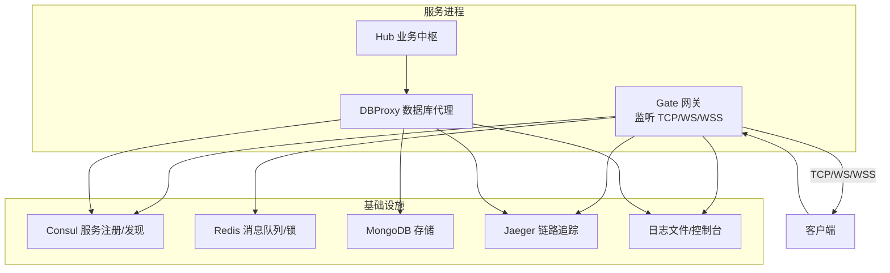
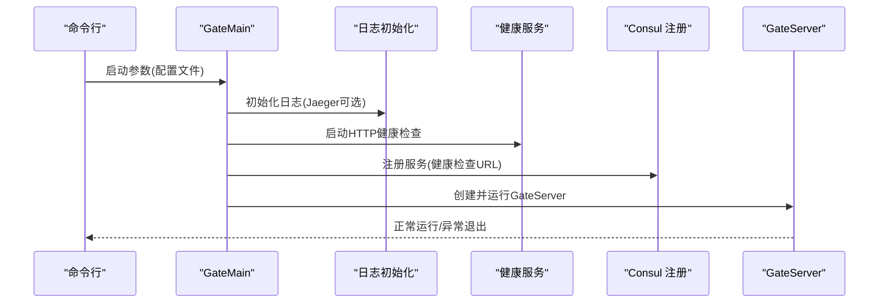
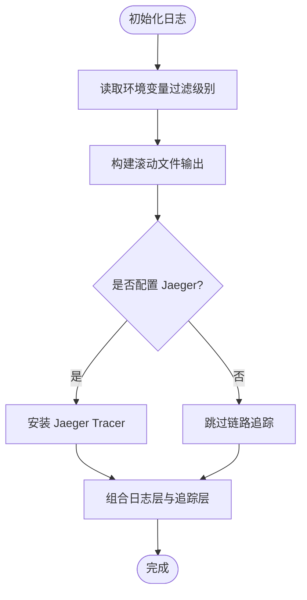
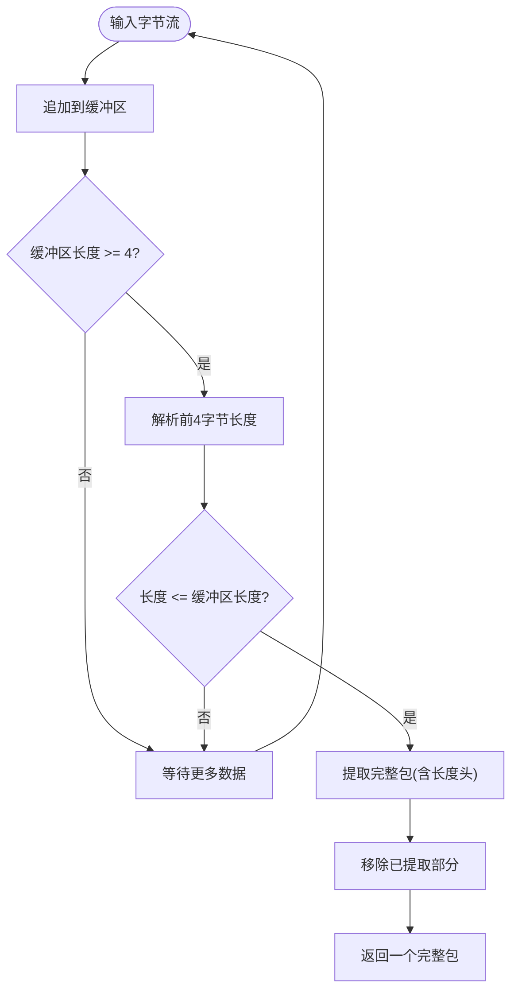
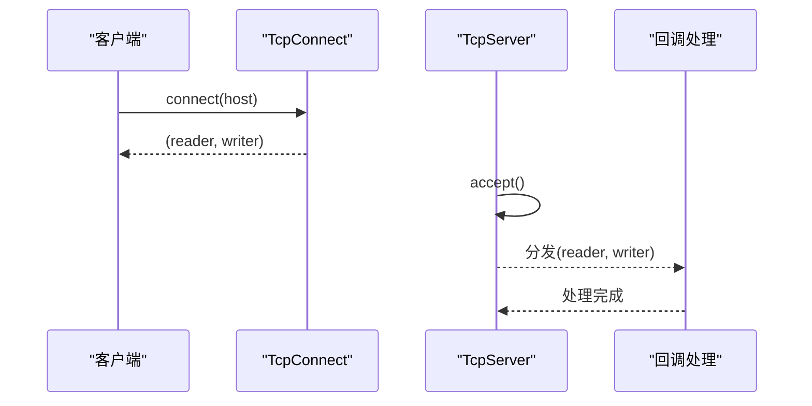
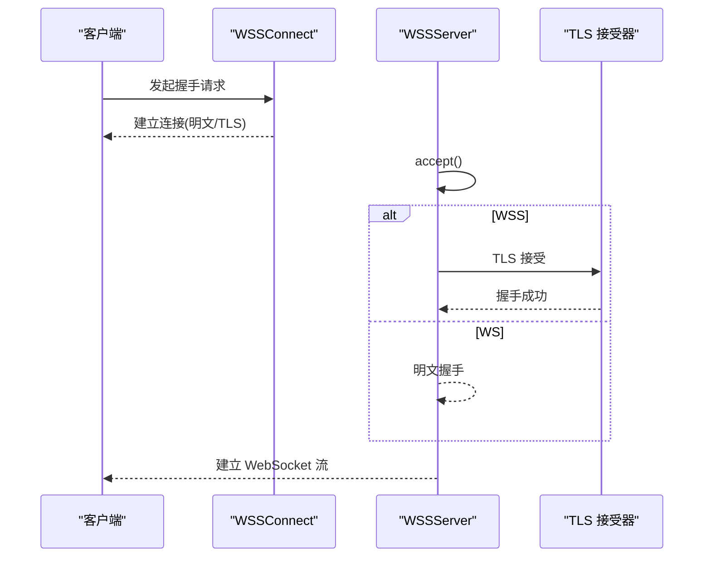
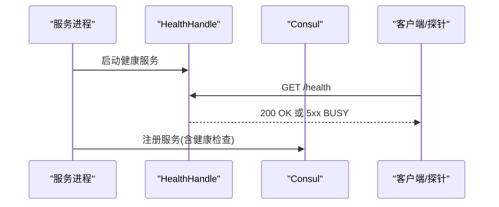
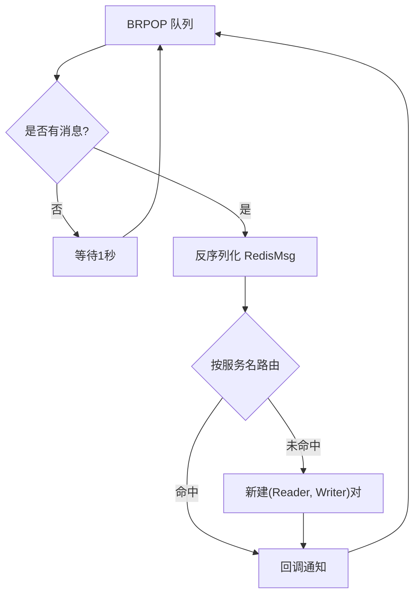
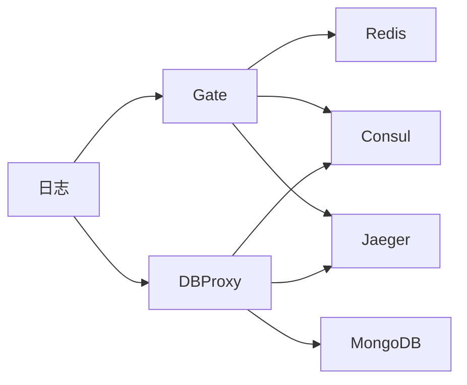

# 故障排查

<cite>
**本文引用的文件**
- [crates/log/src/lib.rs](file://crates/log/src/lib.rs)
- [crates/net/src/lib.rs](file://crates/net/src/lib.rs)
- [crates/tcp/src/lib.rs](file://crates/tcp/src/lib.rs)
- [crates/tcp/src/tcp_connect.rs](file://crates/tcp/src/tcp_connect.rs)
- [crates/tcp/src/tcp_server.rs](file://crates/tcp/src/tcp_server.rs)
- [crates/wss/src/lib.rs](file://crates/wss/src/lib.rs)
- [crates/wss/src/wss_connect.rs](file://crates/wss/src/wss_connect.rs)
- [crates/wss/src/wss_server.rs](file://crates/wss/src/wss_server.rs)
- [crates/health/src/lib.rs](file://crates/health/src/lib.rs)
- [crates/redis_service/src/redis_service.rs](file://crates/redis_service/src/redis_service.rs)
- [server/src/gate_main.rs](file://server/src/gate_main.rs)
- [server/src/dbproxy_main.rs](file://server/src/dbproxy_main.rs)
</cite>

## 目录
1. [简介](#简介)
2. [项目结构](#项目结构)
3. [核心组件](#核心组件)
4. [架构总览](#架构总览)
5. [详细组件分析](#详细组件分析)
6. [依赖关系分析](#依赖关系分析)
7. [性能考量](#性能考量)
8. [故障排查指南](#故障排查指南)
9. [结论](#结论)
10. [附录](#附录)

## 简介
本手册面向 geese 框架使用者与运维工程师，提供系统化的故障排查流程与实操步骤，覆盖连接超时、消息丢失、服务崩溃、性能下降等常见问题；涵盖日志分析技巧（错误日志解读、调试日志启用、关键信息提取）；网络连接问题排查（端口连通性、防火墙、DNS）；服务间通信故障定位（RPC/消息路由、实体状态一致性）；性能问题分析工具与优化建议（CPU、内存、数据库查询）；系统资源监控与瓶颈识别（磁盘 I/O、网络带宽、并发连接数）；以及紧急故障处理与回滚策略。

## 项目结构
geese 采用多语言混合架构：Rust 实现高性能网络与基础设施模块，Python 提供业务逻辑与数据库代理，TypeScript/JavaScript 提供前端与脚本工具，同时通过 Thrift 协议进行跨语言通信。服务侧包含网关（gate）、数据库代理（dbproxy）、Hub（业务中枢），并通过 Consul 进行服务注册与健康检查，使用 Redis 作为消息队列与锁服务，OpenTelemetry/Jaeger 进行链路追踪。

图示来源
- [server/src/gate_main.rs:33-117](file://server/src/gate_main.rs#L33-L117)
- [server/src/dbproxy_main.rs:15-78](file://server/src/dbproxy_main.rs#L15-L78)
- [crates/health/src/lib.rs:34-50](file://crates/health/src/lib.rs#L34-L50)
- [crates/redis_service/src/redis_service.rs:49-155](file://crates/redis_service/src/redis_service.rs#L49-L155)

章节来源
- [server/src/gate_main.rs:18-117](file://server/src/gate_main.rs#L18-L117)
- [server/src/dbproxy_main.rs:15-78](file://server/src/dbproxy_main.rs#L15-L78)

## 核心组件
- 日志与链路追踪：统一初始化日志与 Jaeger 追踪，支持滚动日志文件与环境变量过滤级别。
- 网络层：抽象 NetWriter/NetReader 接口，实现 TCP、WebSocket（WS/WSS）接入与消息包解析。
- 健康检查：内置 HTTP 健康接口，配合 Consul 注册服务健康检查。
- Redis 服务：基于 Redis 的消息队列 BRPOP 拉取、消息序列化/反序列化、分布式锁与键过期管理。
- 服务入口：Gate 与 DBProxy 启动流程，包含配置加载、Consul 注册、健康服务启动、运行与退出。

章节来源
- [crates/log/src/lib.rs:8-35](file://crates/log/src/lib.rs#L8-L35)
- [crates/net/src/lib.rs:8-75](file://crates/net/src/lib.rs#L8-L75)
- [crates/tcp/src/lib.rs:1-3](file://crates/tcp/src/lib.rs#L1-L3)
- [crates/wss/src/lib.rs:1-4](file://crates/wss/src/lib.rs#L1-L4)
- [crates/health/src/lib.rs:12-50](file://crates/health/src/lib.rs#L12-L50)
- [crates/redis_service/src/redis_service.rs:36-155](file://crates/redis_service/src/redis_service.rs#L36-L155)
- [server/src/gate_main.rs:33-117](file://server/src/gate_main.rs#L33-L117)
- [server/src/dbproxy_main.rs:15-78](file://server/src/dbproxy_main.rs#L15-L78)

## 架构总览
下图展示服务启动到运行的关键交互路径，包括日志初始化、健康检查服务、Consul 注册与主服务运行。

图示来源
- [server/src/gate_main.rs:33-117](file://server/src/gate_main.rs#L33-L117)
- [crates/health/src/lib.rs:34-50](file://crates/health/src/lib.rs#L34-L50)
- [crates/log/src/lib.rs:8-35](file://crates/log/src/lib.rs#L8-L35)

## 详细组件分析

### 组件一：日志与链路追踪
- 功能要点
  - 支持按环境变量设置日志级别，滚动日志文件输出，非阻塞写入。
  - 可选 Jaeger Agent 批量导出，便于端到端链路追踪。
- 故障排查要点
  - 日志级别不足：将日志级别提升至 trace/debug，复现问题后降级。
  - 文件路径权限：确认日志目录存在且具备写权限。
  - Jaeger 不可用：关闭 jaeger_url 或修复 Agent 地址，避免初始化失败导致启动阻塞。

图示来源
- [crates/log/src/lib.rs:8-35](file://crates/log/src/lib.rs#L8-L35)

章节来源
- [crates/log/src/lib.rs:8-35](file://crates/log/src/lib.rs#L8-L35)

### 组件二：网络与消息包解析
- 功能要点
  - 抽象 NetWriter/NetReader 接口，统一发送与接收。
  - NetPack 实现长度前缀协议的消息拼包与拆包，trace 记录关键长度信息。
- 故障排查要点
  - 消息丢失/乱序：检查 NetPack.try_get_pack 的返回路径，关注长度字段与缓冲区剩余数据。
  - 发送失败：NetWriter.send 返回值用于判断发送是否成功，结合 trace 日志定位。
  - 接收线程阻塞：确认回调任务未长时间占用锁或阻塞事件循环。

图示来源
- [crates/net/src/lib.rs:25-75](file://crates/net/src/lib.rs#L25-L75)

章节来源
- [crates/net/src/lib.rs:8-75](file://crates/net/src/lib.rs#L8-L75)

### 组件三：TCP 客户端与服务端
- 功能要点
  - TcpConnect.connect 建立 TCP 连接并拆分为读写通道。
  - TcpServer.listen 循环接受连接，分发给回调处理，错误时记录并继续。
- 故障排查要点
  - 连接超时：检查目标地址可达性、端口监听状态、防火墙放行。
  - 服务端拒绝：确认监听地址绑定正确、Accept 循环未因异常中断。
  - 并发连接：观察 Accept 循环中回调执行耗时，避免阻塞后续连接。

图示来源
- [crates/tcp/src/tcp_connect.rs:10-18](file://crates/tcp/src/tcp_connect.rs#L10-L18)
- [crates/tcp/src/tcp_server.rs:23-64](file://crates/tcp/src/tcp_server.rs#L23-L64)

章节来源
- [crates/tcp/src/tcp_connect.rs:10-18](file://crates/tcp/src/tcp_connect.rs#L10-L18)
- [crates/tcp/src/tcp_server.rs:23-64](file://crates/tcp/src/tcp_server.rs#L23-L64)

### 组件四：WebSocket（WS/WSS）客户端与服务端
- 功能要点
  - WSSConnect.connect 构造握手请求并建立连接。
  - WSSServer.listen_wss/listen_ws 分别支持 TLS 与明文 WS 接入，握手失败会记录错误并继续监听。
- 故障排查要点
  - 握手失败：检查证书文件、域名与 Host 头、版本号与密钥。
  - TLS 握手错误：确认 PKCS#12 证书有效、密码正确、端口开放。
  - 明文 WS：确认未误用 WSS 监听函数，避免不必要的 TLS 开销。

图示来源
- [crates/wss/src/wss_connect.rs:12-33](file://crates/wss/src/wss_connect.rs#L12-L33)
- [crates/wss/src/wss_server.rs:30-96](file://crates/wss/src/wss_server.rs#L30-L96)
- [crates/wss/src/wss_server.rs:98-143](file://crates/wss/src/wss_server.rs#L98-L143)

章节来源
- [crates/wss/src/wss_connect.rs:12-33](file://crates/wss/src/wss_connect.rs#L12-L33)
- [crates/wss/src/wss_server.rs:30-143](file://crates/wss/src/wss_server.rs#L30-L143)

### 组件五：健康检查与服务注册
- 功能要点
  - HealthHandle 提供 /health 接口，返回 OK/BUSY，配合 Consul 健康检查。
  - GateMain/DBProxyMain 在启动时注册服务与健康检查。
- 故障排查要点
  - /health 返回 BUSY：检查服务内部状态标志位，定位阻塞点。
  - Consul 注册失败：核对地址、服务名、端口与健康检查 URL。
  - 健康检查频繁失败：降低检查频率或在高负载阶段临时禁用。

图示来源
- [crates/health/src/lib.rs:34-50](file://crates/health/src/lib.rs#L34-L50)
- [server/src/gate_main.rs:68-86](file://server/src/gate_main.rs#L68-L86)
- [server/src/dbproxy_main.rs:52-68](file://server/src/dbproxy_main.rs#L52-L68)

章节来源
- [crates/health/src/lib.rs:12-50](file://crates/health/src/lib.rs#L12-L50)
- [server/src/gate_main.rs:68-86](file://server/src/gate_main.rs#L68-L86)
- [server/src/dbproxy_main.rs:52-68](file://server/src/dbproxy_main.rs#L52-L68)

### 组件六：Redis 消息队列与分布式锁
- 功能要点
  - BRPOP 长轮询拉取消息，反序列化为 RedisMsg，按目标服务分发。
  - 支持分布式锁 acquire/release、键过期 set/get/expire。
- 故障排查要点
  - 消息堆积：检查 BRPOP 超时与消费回调耗时，必要时拆分队列或增加消费者。
  - 锁竞争：观察 acquire 循环重试与过期续期，避免死锁与抖动。
  - 连接断开：捕获 RedisError 后重建连接并替换句柄，确保幂等。

图示来源
- [crates/redis_service/src/redis_service.rs:84-146](file://crates/redis_service/src/redis_service.rs#L84-L146)

章节来源
- [crates/redis_service/src/redis_service.rs:36-304](file://crates/redis_service/src/redis_service.rs#L36-L304)

### 组件七：服务入口与配置加载
- Gate 入口
  - 加载配置、初始化日志、启动健康服务、注册 Consul、创建 GateServer 并运行。
- DBProxy 入口
  - 加载配置、初始化日志、注册 Consul、创建 DBProxyServer 并运行。
- 故障排查要点
  - 配置文件不存在/格式错误：检查路径与 JSON/YAML 格式。
  - 启动失败：查看日志初始化与 Consul 注册阶段的错误码。
  - 优雅退出：确保 join() 被调用，健康服务被正确终止。

章节来源
- [server/src/gate_main.rs:33-117](file://server/src/gate_main.rs#L33-L117)
- [server/src/dbproxy_main.rs:15-78](file://server/src/dbproxy_main.rs#L15-L78)

## 依赖关系分析
- 组件耦合
  - Gate 依赖 Consul 进行注册与健康检查，依赖 Redis 进行消息转发。
  - DBProxy 依赖 MongoDB 存储与 Consul 注册。
  - 日志与健康服务贯穿所有服务进程。
- 外部依赖
  - Redis：消息队列、分布式锁、键值存储。
  - Jaeger：链路追踪。
  - Consul：服务注册与健康检查。
- 潜在风险
  - Redis/Consul/Jaeger 任一不可用可能影响服务可用性与可观测性。
  - 网络层错误未处理会导致连接泄漏或服务假死。

图示来源
- [server/src/gate_main.rs:68-86](file://server/src/gate_main.rs#L68-L86)
- [server/src/dbproxy_main.rs:52-68](file://server/src/dbproxy_main.rs#L52-L68)
- [crates/log/src/lib.rs:8-35](file://crates/log/src/lib.rs#L8-L35)

章节来源
- [server/src/gate_main.rs:68-86](file://server/src/gate_main.rs#L68-L86)
- [server/src/dbproxy_main.rs:52-68](file://server/src/dbproxy_main.rs#L52-L68)
- [crates/log/src/lib.rs:8-35](file://crates/log/src/lib.rs#L8-L35)

## 性能考量
- CPU 使用率分析
  - 使用系统采样工具（如 perf/top）定位热点函数，结合 trace 日志中的时间戳与路径进行交叉验证。
- 内存泄漏检测
  - 结合 Rust 的内存分析工具与 GC/内存分配统计，关注长生命周期对象与未释放的通道/句柄。
- 数据库查询优化
  - 对慢查询进行索引优化与查询计划分析，减少大结果集传输与重复查询。
- 系统资源监控
  - 磁盘 I/O：监控队列堆积与日志写入压力。
  - 网络带宽：观测连接数与吞吐，识别异常峰值。
  - 并发连接数：限制最大连接数并启用连接池，避免资源耗尽。

## 故障排查指南

### 一、连接超时
- 快速检查清单
  - 目标端口是否监听：使用 netstat/ss/lsof 检查端口状态。
  - 防火墙/安全组：确认入站规则放行目标端口。
  - DNS 解析：nslookup/dig 检查域名解析是否正确。
  - 客户端重试与超时：适当增大超时与重试次数，避免误判。
- 关键日志定位
  - TCP/WSS 连接建立阶段的日志，确认握手与接受是否成功。
- 处理步骤
  1) 使用 telnet/nmap 验证端口连通性。
  2) 检查服务监听地址与端口映射。
  3) 若为 WSS，确认证书与 Host 头。
  4) 观察服务端 accept 循环是否持续运行。

章节来源
- [crates/tcp/src/tcp_server.rs:23-64](file://crates/tcp/src/tcp_server.rs#L23-L64)
- [crates/wss/src/wss_server.rs:30-96](file://crates/wss/src/wss_server.rs#L30-L96)
- [crates/wss/src/wss_server.rs:98-143](file://crates/wss/src/wss_server.rs#L98-L143)

### 二、消息丢失
- 快速检查清单
  - 消息序列化/反序列化是否一致，协议版本匹配。
  - NetPack 拆包逻辑是否正确，长度字段是否越界。
  - Redis BRPOP 是否被阻塞或连接断开。
- 关键日志定位
  - NetPack 中 try_get_pack 的 trace 输出，确认包长度与缓冲区剩余。
  - Redis BRPOP 循环中的错误日志与消息体大小。
- 处理步骤
  1) 在客户端/服务端开启更详细的日志级别。
  2) 校验协议与编解码实现。
  3) 检查 Redis 连接与队列长度，必要时扩容消费者。

章节来源
- [crates/net/src/lib.rs:25-75](file://crates/net/src/lib.rs#L25-L75)
- [crates/redis_service/src/redis_service.rs:84-146](file://crates/redis_service/src/redis_service.rs#L84-L146)

### 三、服务崩溃
- 快速检查清单
  - 健康检查接口是否返回 5xx。
  - 启动阶段 Consul 注册是否成功。
  - 日志中是否存在 panic 或未捕获异常。
- 关键日志定位
  - GateMain/DBProxyMain 启动流程中的错误分支。
  - 健康服务状态变化与错误日志。
- 处理步骤
  1) 优先恢复健康检查接口，确保外部探测正常。
  2) 回滚最近变更，恢复上一个稳定版本。
  3) 逐步启用功能模块，定位具体引发崩溃的代码段。

章节来源
- [crates/health/src/lib.rs:22-32](file://crates/health/src/lib.rs#L22-L32)
- [server/src/gate_main.rs:99-104](file://server/src/gate_main.rs#L99-L104)
- [server/src/dbproxy_main.rs:44-49](file://server/src/dbproxy_main.rs#L44-L49)

### 四、性能下降
- 快速检查清单
  - CPU 使用率是否异常升高，是否存在热点循环。
  - Redis/数据库延迟是否上升，队列是否堆积。
  - 网络带宽与连接数是否达到上限。
- 关键日志定位
  - 日志中 trace 级别的耗时统计与路径标记。
  - Redis BRPOP/写入耗时与错误重试。
- 处理步骤
  1) 采集火焰图与系统指标，定位热点。
  2) 优化热点路径与批量处理。
  3) 扩容 Redis/数据库实例或引入缓存层。

章节来源
- [crates/log/src/lib.rs:8-35](file://crates/log/src/lib.rs#L8-L35)
- [crates/redis_service/src/redis_service.rs:84-146](file://crates/redis_service/src/redis_service.rs#L84-L146)

### 五、日志分析技巧
- 错误日志解读
  - 关注 error 级别日志，定位错误类型与发生位置。
  - 结合 trace 级别日志还原调用链与上下文。
- 调试日志启用
  - 通过环境变量设置日志级别，生产环境谨慎调整。
  - 使用非阻塞滚动日志，避免 IO 影响服务性能。
- 关键信息提取
  - 提取时间戳、服务名、请求 ID、错误码与堆栈片段。
  - 使用正则或日志分析工具进行聚合统计。

章节来源
- [crates/log/src/lib.rs:8-35](file://crates/log/src/lib.rs#L8-L35)

### 六、网络连接问题排查
- 端口连通性测试
  - 使用 telnet/nmap/nc 验证端口可达。
  - 检查容器/虚拟机网络与端口映射。
- 防火墙配置检查
  - 核对主机/云厂商安全组规则，确保入站放行。
- DNS 解析问题诊断
  - 使用 nslookup/dig 检查域名解析与 TTL。
  - 如使用自定义 DNS，确认解析服务器可用性。

章节来源
- [crates/wss/src/wss_server.rs:30-96](file://crates/wss/src/wss_server.rs#L30-L96)
- [crates/wss/src/wss_server.rs:98-143](file://crates/wss/src/wss_server.rs#L98-L143)

### 七、服务间通信故障定位
- RPC/消息路由失败
  - 检查 Redis 队列名称与路由键是否一致。
  - 核对服务名与目标实例列表。
- 实体状态不一致
  - 通过链路追踪定位跨服务调用路径。
  - 对关键写操作增加幂等校验与补偿机制。

章节来源
- [crates/redis_service/src/redis_service.rs:124-144](file://crates/redis_service/src/redis_service.rs#L124-L144)

### 八、性能问题分析工具与优化建议
- 工具
  - 系统采样：perf/top/iostat/netstat。
  - 应用埋点：trace 日志与 Jaeger 链路。
  - 数据库分析：慢查询日志与执行计划。
- 优化建议
  - 批量化与异步化处理。
  - 合理设置连接池与超时阈值。
  - 引入缓存与预热策略。

章节来源
- [crates/log/src/lib.rs:8-35](file://crates/log/src/lib.rs#L8-L35)
- [crates/redis_service/src/redis_service.rs:84-146](file://crates/redis_service/src/redis_service.rs#L84-L146)

### 九、系统资源监控与瓶颈识别
- 磁盘 I/O
  - 监控日志写入与队列堆积，避免磁盘饱和。
- 网络带宽
  - 观察连接数与吞吐，识别突发流量。
- 并发连接数
  - 设置上限并启用连接池，防止资源耗尽。

章节来源
- [crates/redis_service/src/redis_service.rs:84-146](file://crates/redis_service/src/redis_service.rs#L84-L146)

### 十、紧急故障处理流程与回滚策略
- 流程
  1) 评估影响范围与 SLA。
  2) 临时降级或熔断高风险路径。
  3) 启动备用实例或回滚至上一个稳定版本。
  4) 修复后灰度发布并持续监控。
- 回滚策略
  - 版本化部署，保留最近几个稳定镜像。
  - 自动化回滚脚本，减少人工干预时间。

## 结论
本手册从日志、网络、消息、健康检查、Redis 与服务入口六个维度提供了系统化的故障排查方法，并结合实际代码路径给出定位思路与处理步骤。建议在生产环境中启用健康检查与链路追踪，完善监控告警体系，定期演练回滚流程，以缩短故障恢复时间并降低业务影响。

## 附录
- 常用命令参考
  - 端口检查：ss -tuln、netstat -an
  - 连接测试：telnet/host
  - DNS 解析：nslookup/dig
  - 日志查看：tail -f、grep
- 配置项参考
  - 日志级别、日志目录、日志文件、Jaeger 地址、健康端口、服务端口、Redis/Mongo 地址等。