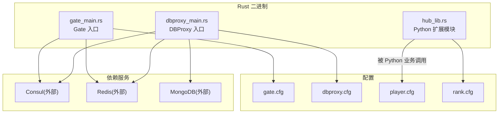
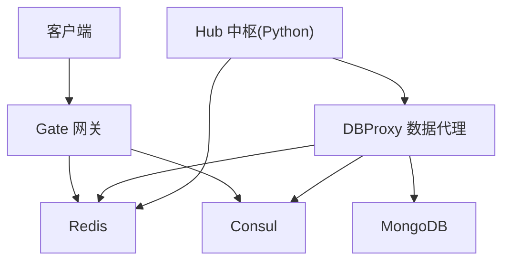
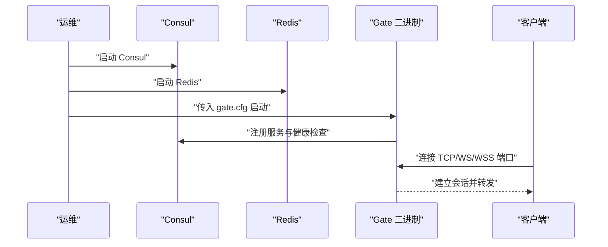
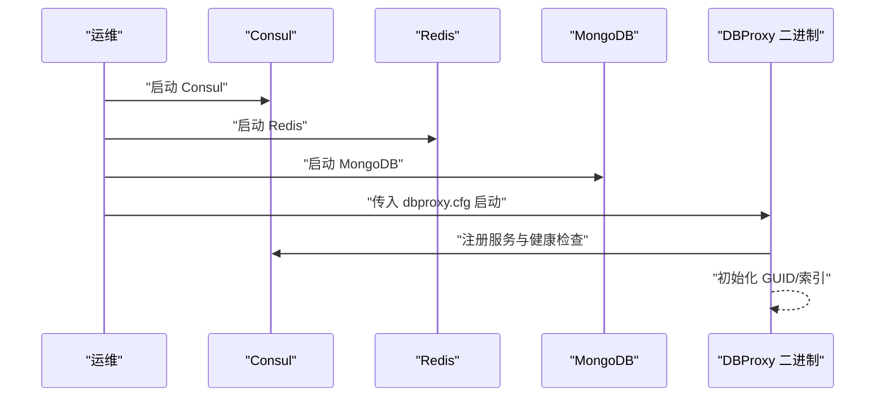
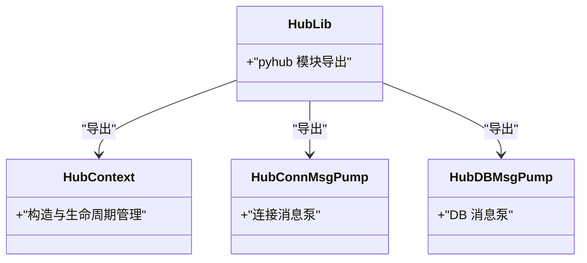
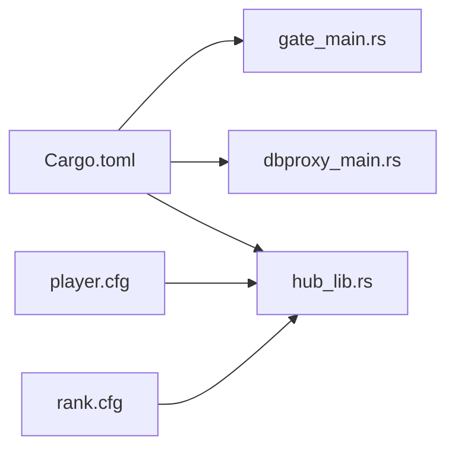

# 环境部署

<cite>
**本文引用的文件**
- [server/src/gate_main.rs](file://server/src/gate_main.rs)
- [server/src/dbproxy_main.rs](file://server/src/dbproxy_main.rs)
- [server/src/hub_lib.rs](file://server/src/hub_lib.rs)
- [server/Cargo.toml](file://server/Cargo.toml)
- [sample/server/config/gate.cfg](file://sample/server/config/gate.cfg)
- [sample/server/config/dbproxy.cfg](file://sample/server/config/dbproxy.cfg)
- [sample/server/config/player.cfg](file://sample/server/config/player.cfg)
- [sample/server/config/rank.cfg](file://sample/server/config/rank.cfg)
- [sample/server/start.bat](file://sample/server/start.bat)
- [server/dependences/redis/start.bat](file://server/dependences/redis/start.bat)
- [server/dependences/redis/redis.conf](file://server/dependences/redis/redis.conf)
</cite>

## 目录
1. [简介](#简介)
2. [项目结构](#项目结构)
3. [核心组件](#核心组件)
4. [架构总览](#架构总览)
5. [详细组件分析](#详细组件分析)
6. [依赖关系分析](#依赖关系分析)
7. [性能与资源考量](#性能与资源考量)
8. [故障排查指南](#故障排查指南)
9. [结论](#结论)
10. [附录：部署清单与验证步骤](#附录部署清单与验证步骤)

## 简介
本指南面向在生产环境中部署 geese 框架的工程团队，覆盖系统要求、依赖安装（Rust 工具链、Python 环境）、数据库与缓存（MongoDB、Redis）准备，以及服务器组件（Gate 网关、Hub 中枢、DBProxy 数据代理）的部署顺序、配置参数、网络与端口绑定、环境变量、日志与数据存储路径、Windows/Linux 部署脚本使用方法、以及部署验证与常见问题排查。

## 项目结构
从仓库结构可见，服务端由 Rust 编写的二进制组件与 Python 业务逻辑共同组成：
- Rust 侧二进制入口位于 server/src，分别对应 Gate、DBProxy 两个可执行程序，并通过 server/Cargo.toml 统一声明。
- 样例服务配置位于 sample/server/config，包含 Gate、DBProxy、Player、Rank 四类服务的配置示例。
- 依赖服务（Consul、Redis）位于 server/dependences，其中 Redis 提供了启动脚本与配置文件。
- Python 扩展模块 hub_lib.rs 将 Hub 的上下文与消息泵导出为 Python 可用模块。

图表来源
- [server/src/gate_main.rs:1-117](file://server/src/gate_main.rs#L1-L117)
- [server/src/dbproxy_main.rs:1-78](file://server/src/dbproxy_main.rs#L1-L78)
- [server/src/hub_lib.rs:1-10](file://server/src/hub_lib.rs#L1-L10)
- [server/Cargo.toml:35-42](file://server/Cargo.toml#L35-L42)
- [sample/server/config/gate.cfg:1-12](file://sample/server/config/gate.cfg#L1-L12)
- [sample/server/config/dbproxy.cfg:1-13](file://sample/server/config/dbproxy.cfg#L1-L13)
- [sample/server/config/player.cfg:1-12](file://sample/server/config/player.cfg#L1-L12)
- [sample/server/config/rank.cfg:1-12](file://sample/server/config/rank.cfg#L1-L12)

章节来源
- [server/Cargo.toml:1-42](file://server/Cargo.toml#L1-L42)
- [sample/server/config/gate.cfg:1-12](file://sample/server/config/gate.cfg#L1-L12)
- [sample/server/config/dbproxy.cfg:1-13](file://sample/server/config/dbproxy.cfg#L1-L13)
- [sample/server/config/player.cfg:1-12](file://sample/server/config/player.cfg#L1-L12)
- [sample/server/config/rank.cfg:1-12](file://sample/server/config/rank.cfg#L1-L12)

## 核心组件
- Gate 网关：负责客户端接入、转发、健康检查注册到 Consul；支持 TCP/WebSocket/WSS 客户端接入端口。
- DBProxy 数据代理：连接 MongoDB 与 Redis，提供统一的数据访问与索引/GUID 初始化能力，注册健康检查。
- Hub 中枢：以 Python 扩展形式提供 Hub 上下文与消息泵，供 Python 业务逻辑使用。
- 依赖服务：Consul（服务发现与健康检查）、Redis（缓存与消息）、MongoDB（持久化存储）。

章节来源
- [server/src/gate_main.rs:18-31](file://server/src/gate_main.rs#L18-L31)
- [server/src/dbproxy_main.rs:15-36](file://server/src/dbproxy_main.rs#L15-L36)
- [server/src/hub_lib.rs:1-10](file://server/src/hub_lib.rs#L1-L10)

## 架构总览
下图展示生产环境典型拓扑：客户端通过 Gate 接入，Gate 与 DBProxy 通过 Redis 协作，DBProxy 连接 MongoDB 存储；Hub 作为 Python 业务运行时与 DBProxy/客户端交互；Consul 用于服务注册与健康检查。

图表来源
- [server/src/gate_main.rs:64-86](file://server/src/gate_main.rs#L64-L86)
- [server/src/dbproxy_main.rs:44-68](file://server/src/dbproxy_main.rs#L44-L68)

## 详细组件分析

### Gate 网关部署
- 启动顺序：先启动依赖服务（Consul、Redis），再启动 Gate。
- 关键配置项（摘自 gate.cfg）：
  - 命名空间与服务端口、客户端接入端口（TCP/WS/WSS）
  - Consul 地址、健康检查端口
  - Redis 地址
  - 日志级别、日志文件名与日志目录
- 启动命令：Gate 二进制接收配置文件路径作为参数。
- 健康检查：Gate 在本地 IP 上暴露健康检查地址并注册到 Consul。
- 端口绑定：监听服务端口与可选的客户端 TCP/WS/WSS 端口。

图表来源
- [server/src/gate_main.rs:34-116](file://server/src/gate_main.rs#L34-L116)
- [sample/server/config/gate.cfg:1-12](file://sample/server/config/gate.cfg#L1-L12)

章节来源
- [server/src/gate_main.rs:34-116](file://server/src/gate_main.rs#L34-L116)
- [sample/server/config/gate.cfg:1-12](file://sample/server/config/gate.cfg#L1-L12)

### DBProxy 数据代理部署
- 启动顺序：先启动 Consul、Redis、MongoDB，再启动 DBProxy。
- 关键配置项（摘自 dbproxy.cfg）：
  - 命名空间、Consul 地址、健康检查端口
  - Redis 地址、MongoDB 地址
  - GUID 初始化与索引初始化列表
  - 日志级别、日志文件名与日志目录
- 启动命令：DBProxy 二进制接收配置文件路径作为参数。
- 健康检查：DBProxy 注册健康检查到 Consul。
- 端口绑定：监听服务端口（用于 Hub/其他内部组件接入）。

图表来源
- [server/src/dbproxy_main.rs:15-77](file://server/src/dbproxy_main.rs#L15-L77)
- [sample/server/config/dbproxy.cfg:1-13](file://sample/server/config/dbproxy.cfg#L1-L13)

章节来源
- [server/src/dbproxy_main.rs:15-77](file://server/src/dbproxy_main.rs#L15-L77)
- [sample/server/config/dbproxy.cfg:1-13](file://sample/server/config/dbproxy.cfg#L1-L13)

### Hub 中枢（Python 扩展）
- Hub 通过 hub_lib.rs 导出为 Python 扩展模块，供 Python 业务应用加载。
- 示例中 Hub 与 DBProxy、Redis 协同工作，处理实体生命周期与全局状态。

图表来源
- [server/src/hub_lib.rs:1-10](file://server/src/hub_lib.rs#L1-L10)

章节来源
- [server/src/hub_lib.rs:1-10](file://server/src/hub_lib.rs#L1-L10)

## 依赖关系分析
- Rust 二进制入口与库：
  - server/Cargo.toml 声明了 gate、dbproxy 两个二进制与 pyhub 库。
  - 二进制入口分别读取配置文件并初始化日志、健康检查、Consul 注册与网络监听。
- Python 业务：
  - 通过 hub_lib.rs 导出的 Python 扩展模块与 DBProxy/Redis 协作。
  - 示例配置中 player.cfg 与 rank.cfg 展示了业务服务的健康端口、保存与迁移周期、Redis 地址等。

图表来源
- [server/Cargo.toml:35-42](file://server/Cargo.toml#L35-L42)
- [server/src/gate_main.rs:34-116](file://server/src/gate_main.rs#L34-L116)
- [server/src/dbproxy_main.rs:15-77](file://server/src/dbproxy_main.rs#L15-L77)
- [server/src/hub_lib.rs:1-10](file://server/src/hub_lib.rs#L1-L10)
- [sample/server/config/player.cfg:1-12](file://sample/server/config/player.cfg#L1-L12)
- [sample/server/config/rank.cfg:1-12](file://sample/server/config/rank.cfg#L1-L12)

章节来源
- [server/Cargo.toml:1-42](file://server/Cargo.toml#L1-L42)
- [sample/server/config/player.cfg:1-12](file://sample/server/config/player.cfg#L1-L12)
- [sample/server/config/rank.cfg:1-12](file://sample/server/config/rank.cfg#L1-L12)

## 性能与资源考量
- 并发模型：Rust 侧采用异步运行时，建议在生产环境按 CPU 核数合理配置线程与连接池。
- 日志与追踪：日志目录与文件名可按天切割归档，Jaeger URL 可选启用分布式追踪。
- 缓存与数据库：Redis 与 MongoDB 的连接池大小、超时时间需结合 QPS 调优。
- 端口与带宽：客户端接入端口（TCP/WS/WSS）应预留足够并发连接数与缓冲区。

[本节为通用指导，无需列出具体文件来源]

## 故障排查指南
- 无法连接 Redis/MongoDB
  - 检查地址与端口是否可达，确认防火墙放行。
  - Redis 默认仅监听本地回环，生产环境需调整 bind 与保护模式。
- Consul 注册失败
  - 确认 Consul 地址可用且健康检查端口未被占用。
  - 检查服务名称与 ID 是否冲突。
- Gate/DBProxy 崩溃或退出
  - 查看日志目录中的日志文件，定位初始化阶段错误。
  - 确认配置文件路径正确且 JSON 结构合法。
- 端口冲突
  - 修改配置中的 service_port 或客户端接入端口，避免与系统或其他进程冲突。
- Python 业务无法加载 Hub 扩展
  - 确认 Python 环境与扩展模块版本匹配，Hub 扩展已编译并可被 Python 加载。

章节来源
- [server/src/gate_main.rs:41-54](file://server/src/gate_main.rs#L41-L54)
- [server/src/dbproxy_main.rs:23-36](file://server/src/dbproxy_main.rs#L23-L36)
- [server/dependences/redis/redis.conf:84-111](file://server/dependences/redis/redis.conf#L84-L111)

## 结论
生产部署的关键在于：先启动并验证依赖服务（Consul、Redis、MongoDB），再按 Gate → DBProxy → Hub/业务服务的顺序启动；严格校验配置文件、日志与数据目录、网络端口与安全策略；最后通过健康检查与日志进行验证与监控。

[本节为总结性内容，无需列出具体文件来源]

## 附录：部署清单与验证步骤

### 系统要求与依赖安装
- Rust 工具链
  - 使用 Cargo 构建二进制，确保已安装 Rust 工具链与 Cargo。
- Python 环境
  - 运行 Python 业务前，确保 Python 解释器可用，Hub 扩展模块可被导入。
- 数据库与缓存
  - Redis：按需启用认证与网络绑定，生产环境建议开启密码与最小权限。
  - MongoDB：按需启用认证与副本集/分片，确保网络连通与备份策略。

章节来源
- [server/Cargo.toml:8-28](file://server/Cargo.toml#L8-L28)
- [server/dependences/redis/redis.conf:84-111](file://server/dependences/redis/redis.conf#L84-L111)

### 服务器组件部署流程
- Gate 网关
  - 启动顺序：Consul → Redis → Gate
  - 参数：传入 gate.cfg 路径
  - 端口：服务端口、客户端 TCP/WS/WSS 端口
  - 健康检查：注册到 Consul
- DBProxy 数据代理
  - 启动顺序：Consul → Redis → MongoDB → DBProxy
  - 参数：传入 dbproxy.cfg 路径
  - 功能：GUID/索引初始化、与 Redis/MongoDB 协作
  - 健康检查：注册到 Consul
- Hub 中枢（Python）
  - 通过 hub_lib.rs 导出的 Python 扩展模块加载，配合 DBProxy/Redis 使用

章节来源
- [server/src/gate_main.rs:34-116](file://server/src/gate_main.rs#L34-L116)
- [server/src/dbproxy_main.rs:15-77](file://server/src/dbproxy_main.rs#L15-L77)
- [server/src/hub_lib.rs:1-10](file://server/src/hub_lib.rs#L1-L10)

### Windows 与 Linux 部署脚本使用
- Windows
  - 使用样例脚本启动依赖与服务：先启动 Consul 与 Redis，再启动 Gate、DBProxy，最后启动 Python 业务。
  - 注意：脚本中包含延时，确保各服务就绪后再启动后续组件。
- Linux
  - 建议将样例脚本转换为 Shell 脚本，使用 systemctl 或 systemd 管理服务生命周期。
  - 将 Redis 启动脚本与配置文件路径调整为实际安装位置。

章节来源
- [sample/server/start.bat:1-23](file://sample/server/start.bat#L1-L23)
- [server/dependences/redis/start.bat:1-5](file://server/dependences/redis/start.bat#L1-L5)

### 网络配置与端口绑定
- Gate
  - 服务端口：监听服务端口
  - 客户端接入：可选 TCP/WS/WSS 端口
  - 健康检查：监听健康端口并注册到 Consul
- DBProxy
  - 服务端口：供 Hub/内部组件接入
  - 健康检查：监听健康端口并注册到 Consul
- 端口建议
  - 服务端口：6xxx
  - 客户端接入端口：8xxx
  - 健康检查端口：1xxx
- 防火墙与安全组
  - 放行服务端口、客户端接入端口、健康检查端口
  - Redis/MongoDB 仅对内网开放或启用认证

章节来源
- [sample/server/config/gate.cfg:6-11](file://sample/server/config/gate.cfg#L6-L11)
- [sample/server/config/dbproxy.cfg:9-12](file://sample/server/config/dbproxy.cfg#L9-L12)
- [server/src/gate_main.rs:64-86](file://server/src/gate_main.rs#L64-L86)
- [server/src/dbproxy_main.rs:44-68](file://server/src/dbproxy_main.rs#L44-L68)

### 环境变量、日志目录与数据存储
- 环境变量
  - 可通过环境变量注入日志追踪（如 Jaeger URL）与服务命名空间等，具体取决于实现。
- 日志目录与文件
  - 通过配置文件指定日志目录与日志文件名，便于集中收集与轮转。
- 数据存储路径
  - MongoDB 的数据目录与日志目录由数据库服务管理；Redis 的持久化文件路径由配置决定。

章节来源
- [sample/server/config/gate.cfg:9-11](file://sample/server/config/gate.cfg#L9-L11)
- [sample/server/config/dbproxy.cfg:10-12](file://sample/server/config/dbproxy.cfg#L10-L12)

### 部署验证步骤
- 服务健康
  - 访问 Gate/DBProxy 的健康检查端点，确认返回健康状态。
- 网络连通
  - 从客户端向 Gate 的 TCP/WS/WSS 端口发起连接，验证握手与心跳。
- 数据一致性
  - 通过业务接口写入数据，观察 DBProxy 是否成功落盘至 MongoDB，Redis 是否更新缓存。
- 日志与监控
  - 检查日志目录文件，确认无异常堆栈；启用 Jaeger 时验证链路追踪。

章节来源
- [server/src/gate_main.rs:60-86](file://server/src/gate_main.rs#L60-L86)
- [server/src/dbproxy_main.rs:40-68](file://server/src/dbproxy_main.rs#L40-L68)