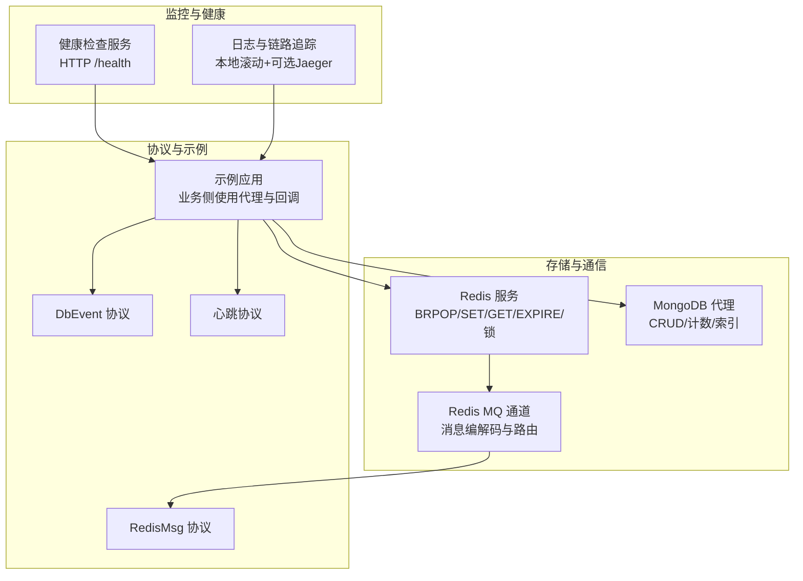
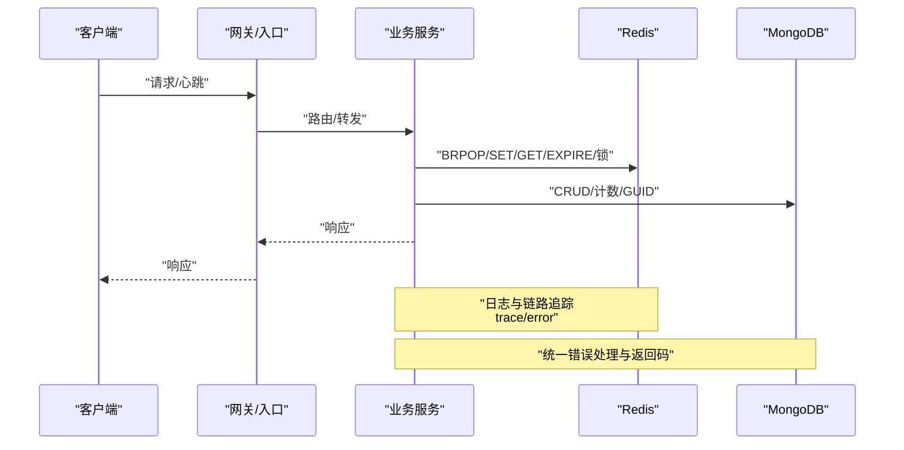
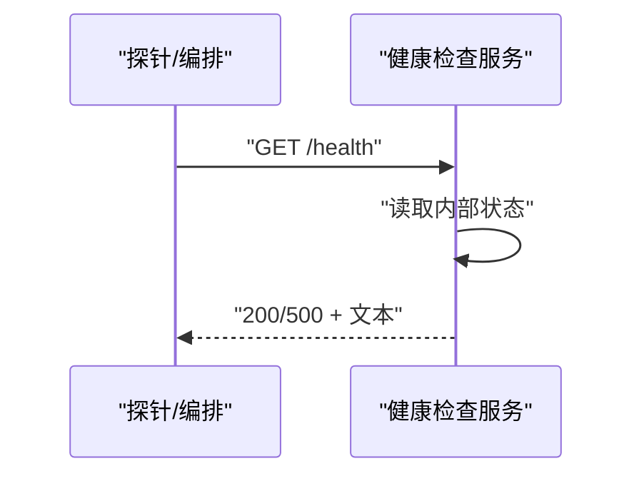
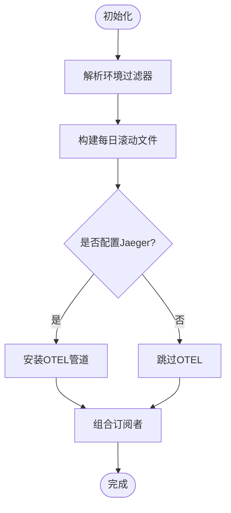
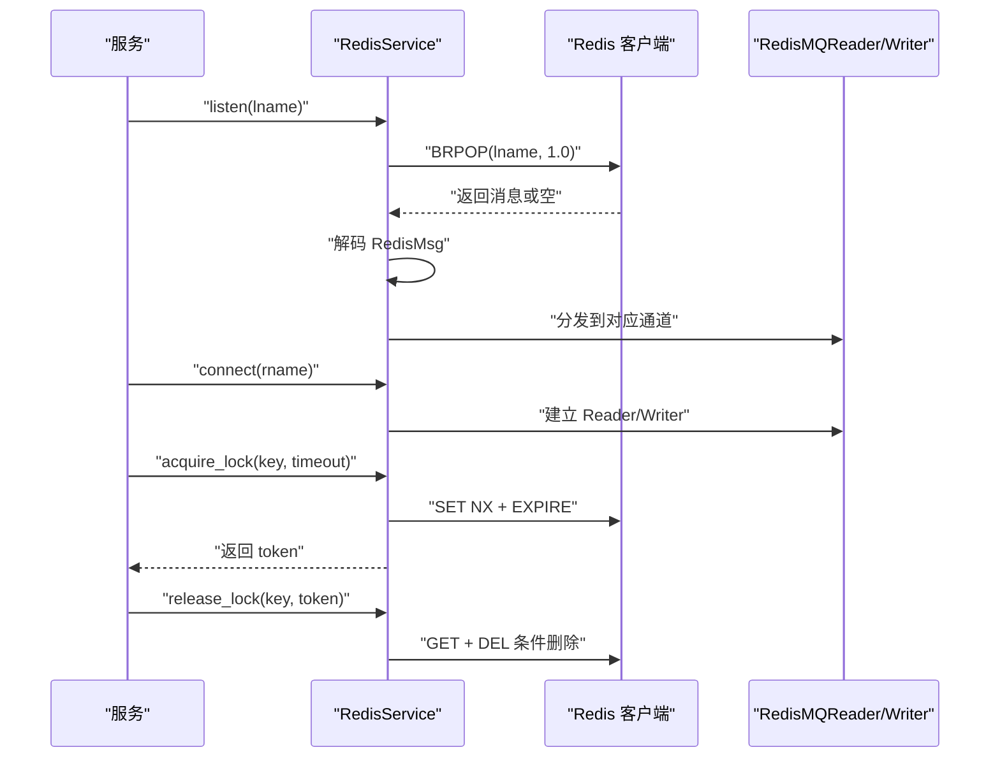
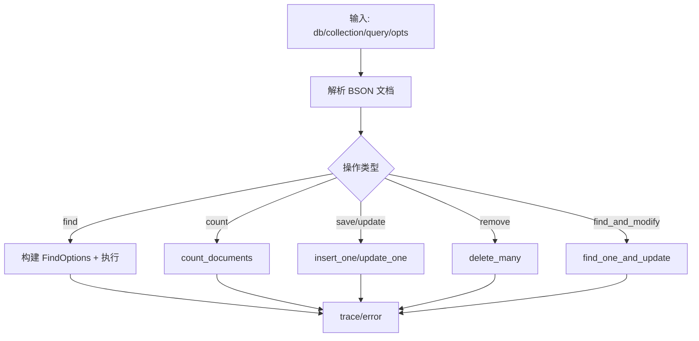
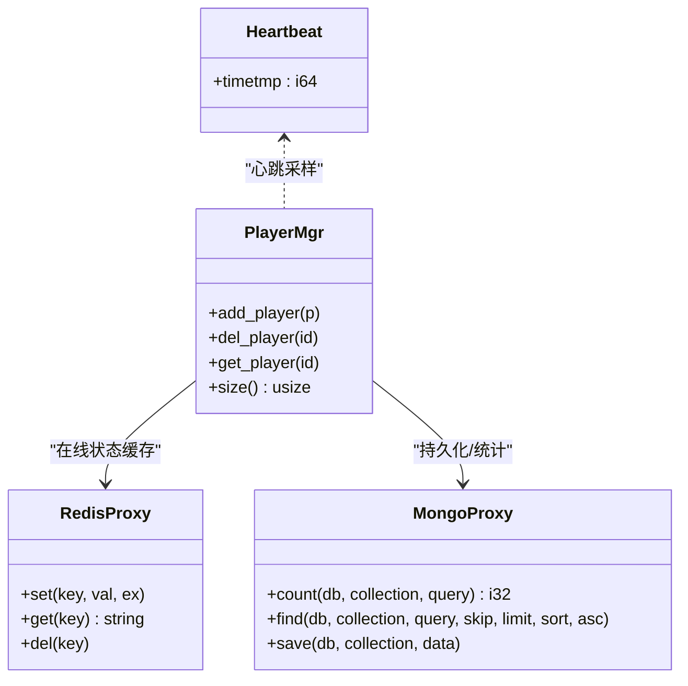
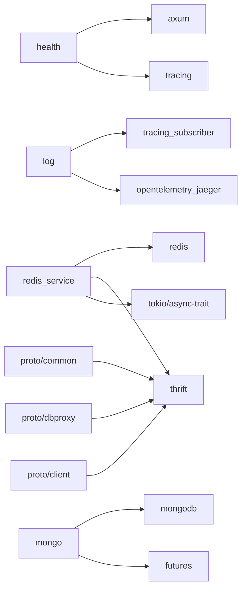

# 监控告警

<cite>
**本文引用的文件**
- [crates/health/src/lib.rs](file://crates/health/src/lib.rs)
- [crates/log/src/lib.rs](file://crates/log/src/lib.rs)
- [crates/mongo/src/lib.rs](file://crates/mongo/src/lib.rs)
- [crates/redis_service/src/redis_service.rs](file://crates/redis_service/src/redis_service.rs)
- [crates/redis_service/src/redis_mq_channel.rs](file://crates/redis_service/src/redis_mq_channel.rs)
- [crates/proto/src/common.rs](file://crates/proto/src/common.rs)
- [crates/proto/src/dbproxy.rs](file://crates/proto/src/dbproxy.rs)
- [crates/proto/src/client.rs](file://crates/proto/src/client.rs)
- [sample/server/src/app.py](file://sample/server/src/app.py)
</cite>

## 目录
1. [简介](#简介)
2. [项目结构](#项目结构)
3. [核心组件](#核心组件)
4. [架构总览](#架构总览)
5. [组件详解](#组件详解)
6. [依赖关系分析](#依赖关系分析)
7. [性能考量](#性能考量)
8. [故障排查指南](#故障排查指南)
9. [结论](#结论)
10. [附录](#附录)

## 简介
本指南面向 geese 框架，提供一套可落地的监控告警体系，覆盖健康检查、日志系统、Redis/MongoDB 监控、自定义指标采集、告警规则与可视化建议，并给出性能基准测试方法。文档以仓库中现有模块为基础，结合协议与示例工程，帮助读者快速搭建生产级可观测性能力。

## 项目结构
围绕监控告警的关键模块分布如下：
- 健康检查：基于 HTTP 的健康端点，用于容器编排与负载均衡探测
- 日志系统：支持本地文件滚动与可选 Jaeger OpenTelemetry 链路追踪
- Redis 监控：基于队列 BRPOP 的消息通道路由与锁、KV 操作的重试与错误记录
- MongoDB 监控：封装 CRUD 与计数等操作，统一记录 trace/error
- 协议与事件：定义 Redis 消息体、数据库事件、心跳等协议结构
- 示例工程：展示如何在业务侧使用 Redis/Mongo 代理与回调

图示来源
- [crates/health/src/lib.rs:1-50](file://crates/health/src/lib.rs#L1-L50)
- [crates/log/src/lib.rs:1-35](file://crates/log/src/lib.rs#L1-L35)
- [crates/redis_service/src/redis_service.rs:1-304](file://crates/redis_service/src/redis_service.rs#L1-L304)
- [crates/redis_service/src/redis_mq_channel.rs:1-55](file://crates/redis_service/src/redis_mq_channel.rs#L1-L55)
- [crates/mongo/src/lib.rs:1-245](file://crates/mongo/src/lib.rs#L1-L245)
- [crates/proto/src/common.rs:284-333](file://crates/proto/src/common.rs#L284-L333)
- [crates/proto/src/dbproxy.rs:789-876](file://crates/proto/src/dbproxy.rs#L789-L876)
- [crates/proto/src/client.rs:794-853](file://crates/proto/src/client.rs#L794-L853)
- [sample/server/src/app.py:1-118](file://sample/server/src/app.py#L1-L118)

章节来源
- [crates/health/src/lib.rs:1-50](file://crates/health/src/lib.rs#L1-L50)
- [crates/log/src/lib.rs:1-35](file://crates/log/src/lib.rs#L1-L35)
- [crates/redis_service/src/redis_service.rs:1-304](file://crates/redis_service/src/redis_service.rs#L1-L304)
- [crates/redis_service/src/redis_mq_channel.rs:1-55](file://crates/redis_service/src/redis_mq_channel.rs#L1-L55)
- [crates/mongo/src/lib.rs:1-245](file://crates/mongo/src/lib.rs#L1-L245)
- [crates/proto/src/common.rs:284-333](file://crates/proto/src/common.rs#L284-L333)
- [crates/proto/src/dbproxy.rs:789-876](file://crates/proto/src/dbproxy.rs#L789-L876)
- [crates/proto/src/client.rs:794-853](file://crates/proto/src/client.rs#L794-L853)
- [sample/server/src/app.py:1-118](file://sample/server/src/app.py#L1-L118)

## 核心组件
- 健康检查服务：提供 HTTP GET /health 接口，返回状态码与文本，便于容器探活与负载均衡
- 日志与链路追踪：支持按日滚动的本地文件输出，可选接入 Jaeger OTEL，统一 trace/error 记录
- Redis 服务：封装 BRPOP、SET/GET/EXPIRE、分布式锁、消息编解码与路由
- MongoDB 代理：封装索引、保存、更新、查找、计数、删除、GUID 获取等常用操作
- 协议层：RedisMsg、DbEvent、心跳等结构化消息，支撑跨进程/跨服务通信
- 示例应用：演示如何在业务侧使用代理、注册回调、处理心跳与数据库事件

章节来源
- [crates/health/src/lib.rs:1-50](file://crates/health/src/lib.rs#L1-L50)
- [crates/log/src/lib.rs:1-35](file://crates/log/src/lib.rs#L1-L35)
- [crates/redis_service/src/redis_service.rs:1-304](file://crates/redis_service/src/redis_service.rs#L1-L304)
- [crates/mongo/src/lib.rs:1-245](file://crates/mongo/src/lib.rs#L1-L245)
- [crates/proto/src/common.rs:284-333](file://crates/proto/src/common.rs#L284-L333)
- [crates/proto/src/dbproxy.rs:789-876](file://crates/proto/src/dbproxy.rs#L789-L876)
- [crates/proto/src/client.rs:794-853](file://crates/proto/src/client.rs#L794-L853)
- [sample/server/src/app.py:1-118](file://sample/server/src/app.py#L1-L118)

## 架构总览
下图展示了从客户端到服务端、再到存储与监控的整体流程，以及关键观测点（日志、健康、Redis/Mongo 指标）的位置。

图示来源
- [crates/health/src/lib.rs:22-32](file://crates/health/src/lib.rs#L22-L32)
- [crates/log/src/lib.rs:8-35](file://crates/log/src/lib.rs#L8-L35)
- [crates/redis_service/src/redis_service.rs:84-155](file://crates/redis_service/src/redis_service.rs#L84-L155)
- [crates/mongo/src/lib.rs:56-245](file://crates/mongo/src/lib.rs#L56-L245)

## 组件详解

### 健康检查接口
- 路由与端点：HTTP GET /health
- 行为：根据内部状态返回 200 或 500，并记录日志
- 启动方式：绑定主机地址并启动服务
- 使用建议：容器编排中作为 liveness/readiness 探针；可扩展为更复杂的依赖检查

图示来源
- [crates/health/src/lib.rs:22-32](file://crates/health/src/lib.rs#L22-L32)
- [crates/health/src/lib.rs:34-44](file://crates/health/src/lib.rs#L34-L44)

章节来源
- [crates/health/src/lib.rs:1-50](file://crates/health/src/lib.rs#L1-L50)

### 日志系统配置与管理
- 初始化流程：解析环境过滤器、创建每日滚动文件、可选注入 Jaeger OTEL 层
- 输出策略：非阻塞写入文件，支持 ANSI 关闭
- 错误与追踪：统一使用 trace/error 记录关键路径与异常
- 建议实践：
  - 通过环境变量控制日志级别
  - 按服务名区分日志文件，启用滚动压缩
  - 在生产开启 OTEL，统一上报 Jaeger

图示来源
- [crates/log/src/lib.rs:8-35](file://crates/log/src/lib.rs#L8-L35)

章节来源
- [crates/log/src/lib.rs:1-35](file://crates/log/src/lib.rs#L1-L35)

### Redis 监控配置
- 连接与会话：支持 BRPOP 队列监听、SET/GET/EXPIRE、分布式锁 acquire/release
- 重试与容错：对底层错误进行捕获与短暂休眠后重试，确保稳定性
- 消息通路：RedisMQReader/Writer 与 RedisMsg 编解码，支持动态连接建立
- 监控要点：
  - 连接数：通过 BRPOP 循环与连接池复用观察
  - 延迟：BRPOP 超时参数与消息处理耗时
  - 错误：错误日志与重试次数统计
  - 分布式锁：加锁/续期/释放的耗时与失败率

图示来源
- [crates/redis_service/src/redis_service.rs:65-155](file://crates/redis_service/src/redis_service.rs#L65-L155)
- [crates/redis_service/src/redis_service.rs:181-248](file://crates/redis_service/src/redis_service.rs#L181-L248)
- [crates/redis_service/src/redis_mq_channel.rs:15-40](file://crates/redis_service/src/redis_mq_channel.rs#L15-L40)
- [crates/proto/src/common.rs:284-333](file://crates/proto/src/common.rs#L284-L333)

章节来源
- [crates/redis_service/src/redis_service.rs:1-304](file://crates/redis_service/src/redis_service.rs#L1-L304)
- [crates/redis_service/src/redis_mq_channel.rs:1-55](file://crates/redis_service/src/redis_mq_channel.rs#L1-L55)
- [crates/proto/src/common.rs:284-333](file://crates/proto/src/common.rs#L284-L333)

### MongoDB 连接池监控与查询性能分析
- 连接池：通过 ClientOptions 解析连接字符串，创建客户端
- 查询与写入：封装 save/update/find/count/remove/find_and_modify/get_guid 等
- 性能与可观测性：统一 trace/error 记录，便于定位慢查询与错误
- 监控要点：
  - 连接池利用率：通过并发调用量与错误率评估
  - 查询性能：count/find/update/delete 的耗时与返回量
  - 索引策略：create_index 的结果与后续查询效果对比

图示来源
- [crates/mongo/src/lib.rs:56-245](file://crates/mongo/src/lib.rs#L56-L245)

章节来源
- [crates/mongo/src/lib.rs:1-245](file://crates/mongo/src/lib.rs#L1-L245)

### 自定义监控指标与采集
- 玩家在线数：可在业务侧维护玩家集合，结合 Redis 缓存键统计
- 消息处理延迟：在消息进入/离开处理函数处打点，计算耗时
- 实体数量统计：通过 DbEvent 中的 GetObjectCount 事件或直接 count 查询
- 心跳与响应时间：利用心跳协议结构记录时间戳，计算往返时延

图示来源
- [crates/proto/src/client.rs:794-853](file://crates/proto/src/client.rs#L794-L853)
- [crates/proto/src/dbproxy.rs:789-876](file://crates/proto/src/dbproxy.rs#L789-L876)
- [sample/server/src/app.py:101-118](file://sample/server/src/app.py#L101-L118)

章节来源
- [crates/proto/src/client.rs:794-853](file://crates/proto/src/client.rs#L794-L853)
- [crates/proto/src/dbproxy.rs:789-876](file://crates/proto/src/dbproxy.rs#L789-L876)
- [sample/server/src/app.py:1-118](file://sample/server/src/app.py#L1-L118)

### 告警规则配置与通知策略
- 健康检查：若 /health 长期返回非 200，触发告警
- Redis：BRPOP 失败率、SET/GET/EXPIRE/锁失败率、队列堆积（空返回）
- MongoDB：count/find/save/update/remove/find_and_modify 失败率、超时比例
- 日志：ERROR/WARN 频率阈值、特定错误关键字告警
- 通知策略：多通道（邮件/IM/短信），分级阈值与静默窗口

章节来源
- [crates/health/src/lib.rs:22-32](file://crates/health/src/lib.rs#L22-L32)
- [crates/redis_service/src/redis_service.rs:93-107](file://crates/redis_service/src/redis_service.rs#L93-L107)
- [crates/mongo/src/lib.rs:159-183](file://crates/mongo/src/lib.rs#L159-L183)
- [crates/log/src/lib.rs:8-35](file://crates/log/src/lib.rs#L8-L35)

### 监控数据可视化与性能基准测试
- 可视化：Prometheus + Grafana（采集日志/指标）、Jaeger UI（链路追踪）
- 基准测试：固定 QPS/并发压测，记录 p50/p95/p99 延迟、错误率、资源占用
- 建议指标：
  - Redis：请求延迟、失败率、队列长度、连接数
  - MongoDB：请求延迟、失败率、慢查询数、游标打开数
  - 应用：CPU/内存/IO、goroutines/堆栈、GC 次数与暂停时间

## 依赖关系分析
- 健康检查依赖 tokio/axum/tracing
- 日志依赖 tracing_subscriber/opentelemetry_jaeger
- Redis 服务依赖 redis/thrift/tokio/async-trait
- MongoDB 代理依赖 mongodb/futures
- 协议层提供 RedisMsg/DbEvent/心跳等结构

图示来源
- [crates/health/src/lib.rs:1-10](file://crates/health/src/lib.rs#L1-L10)
- [crates/log/src/lib.rs:1-7](file://crates/log/src/lib.rs#L1-L7)
- [crates/redis_service/src/redis_service.rs:1-17](file://crates/redis_service/src/redis_service.rs#L1-L17)
- [crates/mongo/src/lib.rs:1-6](file://crates/mongo/src/lib.rs#L1-L6)
- [crates/proto/src/common.rs:1-10](file://crates/proto/src/common.rs#L1-L10)
- [crates/proto/src/dbproxy.rs:1-10](file://crates/proto/src/dbproxy.rs#L1-L10)
- [crates/proto/src/client.rs:1-10](file://crates/proto/src/client.rs#L1-L10)

章节来源
- [crates/health/src/lib.rs:1-10](file://crates/health/src/lib.rs#L1-L10)
- [crates/log/src/lib.rs:1-7](file://crates/log/src/lib.rs#L1-L7)
- [crates/redis_service/src/redis_service.rs:1-17](file://crates/redis_service/src/redis_service.rs#L1-L17)
- [crates/mongo/src/lib.rs:1-6](file://crates/mongo/src/lib.rs#L1-L6)
- [crates/proto/src/common.rs:1-10](file://crates/proto/src/common.rs#L1-L10)
- [crates/proto/src/dbproxy.rs:1-10](file://crates/proto/src/dbproxy.rs#L1-L10)
- [crates/proto/src/client.rs:1-10](file://crates/proto/src/client.rs#L1-L10)

## 性能考量
- I/O 密集：Redis/Mongo 均为异步实现，注意合理设置超时与重试间隔
- 日志开销：避免高频细粒度 trace，生产环境建议提升到 warn/info
- 链路追踪：OTEL 批量导出，避免频繁网络抖动导致丢包
- 内存与 CPU：大查询/大批量写入需分页与批处理，减少单次峰值

## 故障排查指南
- 健康检查失败：检查服务状态设置与日志，确认端口绑定成功
- Redis 连接异常：关注 BRPOP 错误日志，必要时重建连接并重试
- MongoDB 查询失败：核对 BSON 文档解析与索引是否存在，查看错误码
- 日志缺失：确认环境过滤器与文件权限，检查滚动策略是否生效

章节来源
- [crates/health/src/lib.rs:22-32](file://crates/health/src/lib.rs#L22-L32)
- [crates/redis_service/src/redis_service.rs:93-107](file://crates/redis_service/src/redis_service.rs#L93-L107)
- [crates/mongo/src/lib.rs:159-183](file://crates/mongo/src/lib.rs#L159-L183)
- [crates/log/src/lib.rs:8-35](file://crates/log/src/lib.rs#L8-L35)

## 结论
geese 框架已具备健康检查、日志与链路追踪、Redis/MongoDB 代理等基础监控能力。结合本文提供的配置与实践建议，可快速搭建覆盖服务状态、存储性能与业务指标的完整监控告警体系，并通过可视化与基准测试持续优化系统稳定性与性能。

## 附录
- 健康检查端点：GET /health
- 日志级别：通过环境变量控制
- Redis 监控项：BRPOP 成功率、SET/GET/EXPIRE/锁成功率、队列长度
- MongoDB 监控项：CRUD 成功率、count/find 性能、索引命中率
- 自定义指标：在线玩家数、消息处理延迟、实体数量统计
- 告警策略：阈值、静默窗口、多通道通知
- 可视化：Grafana/Prometheus/Jaeger UI
- 基准测试：QPS/并发、延迟分布、错误率、资源占用