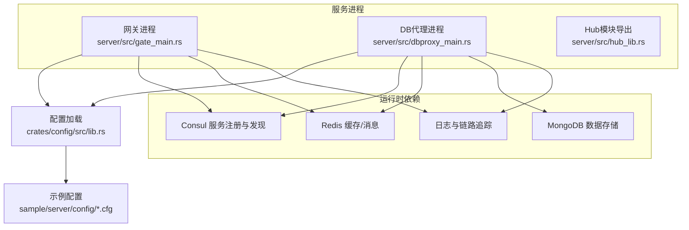
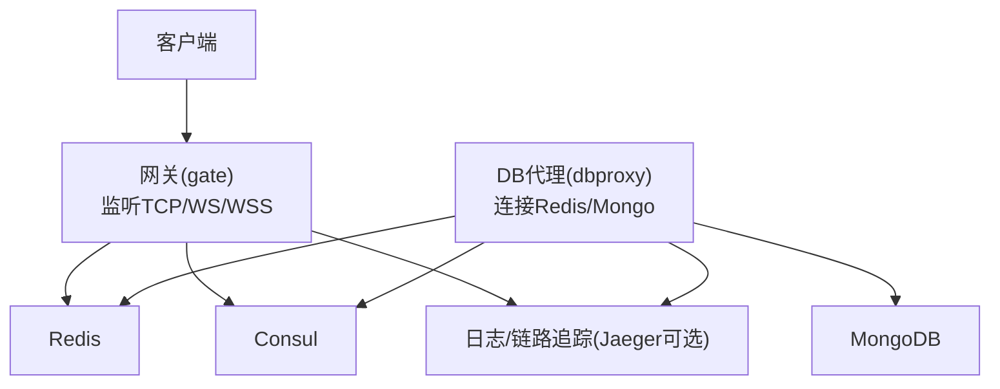
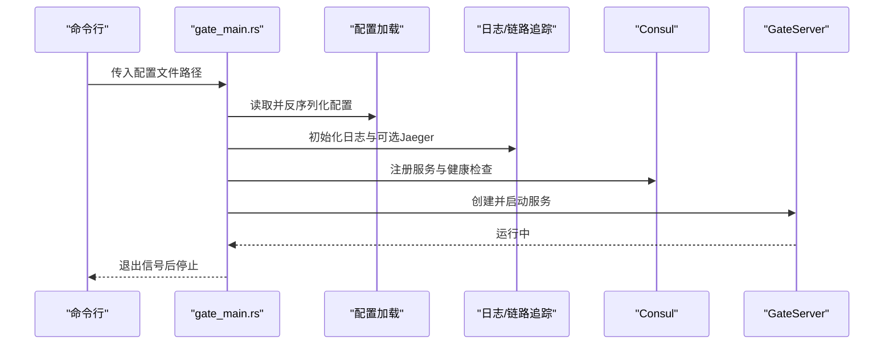
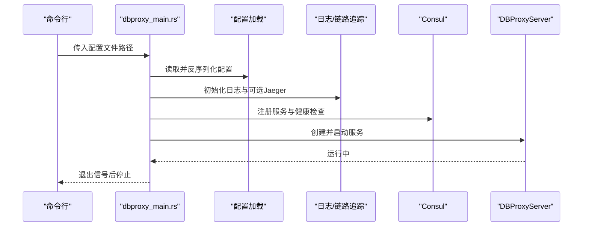
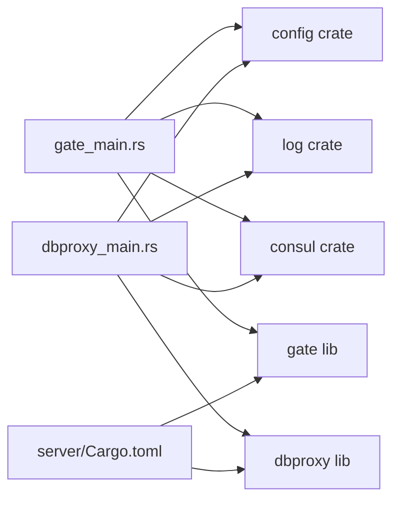

# 部署运维

<cite>
**本文引用的文件**
- [server/Cargo.toml](file://server/Cargo.toml)
- [server/src/dbproxy_main.rs](file://server/src/dbproxy_main.rs)
- [server/src/gate_main.rs](file://server/src/gate_main.rs)
- [server/src/hub_lib.rs](file://server/src/hub_lib.rs)
- [crates/config/src/lib.rs](file://crates/config/src/lib.rs)
- [crates/log/src/lib.rs](file://crates/log/src/lib.rs)
- [sample/server/config/dbproxy.cfg](file://sample/server/config/dbproxy.cfg)
- [sample/server/config/gate.cfg](file://sample/server/config/gate.cfg)
- [sample/server/config/player.cfg](file://sample/server/config/player.cfg)
- [sample/server/config/rank.cfg](file://sample/server/config/rank.cfg)
- [server/dependences/redis/redis.conf](file://server/dependences/redis/redis.conf)
</cite>

## 目录
1. [简介](#简介)
2. [项目结构](#项目结构)
3. [核心组件](#核心组件)
4. [架构总览](#架构总览)
5. [详细组件分析](#详细组件分析)
6. [依赖关系分析](#依赖关系分析)
7. [性能与容量规划](#性能与容量规划)
8. [监控与告警](#监控与告警)
9. [备份与灾难恢复](#备份与灾难恢复)
10. [容器化与编排](#容器化与编排)
11. [故障排查手册](#故障排查手册)
12. [结论](#结论)

## 简介
本指南面向运维工程师，提供 geese 在生产环境的完整部署与运维实践，覆盖服务器基础配置、网络与安全加固、容器化与编排、监控告警、备份恢复、高可用设计、性能调优与容量规划，以及故障排查方法。文档以仓库中的服务入口、配置加载、日志与链路追踪、依赖组件（Redis/Mongo/Consul）为核心线索，结合示例配置文件，形成可落地的操作步骤。

## 项目结构
geese 采用多二进制与多 crate 的组织方式：服务通过独立入口启动，配置由 JSON 文件提供，日志与链路追踪在运行时初始化，健康检查端口用于服务注册与存活探测。典型服务包括网关（gate）、数据库代理（dbproxy），以及业务服务（如 player、rank）。Redis 提供缓存与消息通道，Consul 用于服务发现与健康检查注册。

图表来源
- [server/src/gate_main.rs:1-117](file://server/src/gate_main.rs#L1-L117)
- [server/src/dbproxy_main.rs:1-78](file://server/src/dbproxy_main.rs#L1-L78)
- [server/src/hub_lib.rs:1-10](file://server/src/hub_lib.rs#L1-L10)
- [crates/config/src/lib.rs:1-13](file://crates/config/src/lib.rs#L1-L13)
- [sample/server/config/gate.cfg:1-12](file://sample/server/config/gate.cfg#L1-L12)
- [sample/server/config/dbproxy.cfg:1-13](file://sample/server/config/dbproxy.cfg#L1-L13)

章节来源
- [server/Cargo.toml:1-42](file://server/Cargo.toml#L1-L42)
- [server/src/gate_main.rs:1-117](file://server/src/gate_main.rs#L1-L117)
- [server/src/dbproxy_main.rs:1-78](file://server/src/dbproxy_main.rs#L1-L78)
- [crates/config/src/lib.rs:1-13](file://crates/config/src/lib.rs#L1-L13)
- [sample/server/config/gate.cfg:1-12](file://sample/server/config/gate.cfg#L1-L12)
- [sample/server/config/dbproxy.cfg:1-13](file://sample/server/config/dbproxy.cfg#L1-L13)

## 核心组件
- 服务入口与生命周期
  - 网关进程：解析配置、初始化日志与链路追踪、启动健康检查服务、注册 Consul 健康检查、启动服务循环并等待退出信号。
  - DB 代理进程：加载配置、初始化日志与链路追踪、注册 Consul 健康检查、启动服务循环并等待退出信号。
  - Hub 模块导出：以 Python 扩展形式导出 Hub 相关类型，便于上层业务集成。
- 配置加载
  - 统一从 JSON 文件读取并反序列化为对应配置结构体，支持服务端口、健康检查端口、日志级别与目录、Jaeger 地址、Redis/Mongo 连接串等。
- 日志与链路追踪
  - 支持按日志级别过滤、滚动文件输出、可选 Jaeger OpenTelemetry 追踪，便于生产环境可观测性。
- 服务注册与健康检查
  - 通过 Consul 客户端注册服务实例，并上报健康检查 HTTP 探针，实现服务发现与自动摘除。

章节来源
- [server/src/gate_main.rs:1-117](file://server/src/gate_main.rs#L1-L117)
- [server/src/dbproxy_main.rs:1-78](file://server/src/dbproxy_main.rs#L1-L78)
- [server/src/hub_lib.rs:1-10](file://server/src/hub_lib.rs#L1-L10)
- [crates/config/src/lib.rs:1-13](file://crates/config/src/lib.rs#L1-L13)
- [crates/log/src/lib.rs:1-35](file://crates/log/src/lib.rs#L1-L35)

## 架构总览
下图展示生产环境典型拓扑：客户端通过网关接入，网关与 DB 代理通过 Redis 协同，DB 代理访问 MongoDB 存储；Consul 负责服务注册与健康检查；日志与链路追踪贯穿各组件。

图表来源
- [server/src/gate_main.rs:60-86](file://server/src/gate_main.rs#L60-L86)
- [server/src/dbproxy_main.rs:40-68](file://server/src/dbproxy_main.rs#L40-L68)
- [sample/server/config/gate.cfg:1-12](file://sample/server/config/gate.cfg#L1-L12)
- [sample/server/config/dbproxy.cfg:1-13](file://sample/server/config/dbproxy.cfg#L1-L13)

## 详细组件分析

### 网关进程（gate）
- 启动流程
  - 解析命令行参数获取配置文件路径，读取并反序列化为 GateCfg。
  - 初始化日志与链路追踪，启动健康检查 HTTP 服务。
  - 注册 Consul 服务实例，配置健康检查探针。
  - 启动服务循环并等待退出信号。
- 关键行为
  - 支持 TCP/WS/WSS 多协议接入，通过配置项启用相应端口。
  - 与 Consul 协作进行服务注册与健康上报。
- 典型配置字段
  - consul_url、health_port、jaeger_url、redis_url、service_port、client_tcp_port、client_ws_port、client_wss_cfg、log_level、log_dir、log_file。

图表来源
- [server/src/gate_main.rs:33-117](file://server/src/gate_main.rs#L33-L117)
- [crates/config/src/lib.rs:5-13](file://crates/config/src/lib.rs#L5-L13)
- [crates/log/src/lib.rs:8-35](file://crates/log/src/lib.rs#L8-L35)

章节来源
- [server/src/gate_main.rs:1-117](file://server/src/gate_main.rs#L1-L117)
- [sample/server/config/gate.cfg:1-12](file://sample/server/config/gate.cfg#L1-L12)

### DB 代理进程（dbproxy）
- 启动流程
  - 解析配置文件，初始化日志与链路追踪。
  - 启动健康检查服务，注册 Consul 健康检查。
  - 初始化 DB 代理服务（连接 Redis/Mongo、索引与全局 ID 配置）。
- 关键行为
  - 通过 Consul 健康检查端口暴露 /health 探针。
  - 与 Redis/Mongo 协同处理数据读写与迁移。
- 典型配置字段
  - namespace、consul_url、health_port、redis_url、mongo_url、guid、index、service_port、log_level、log_dir、log_file、jaeger_url。

图表来源
- [server/src/dbproxy_main.rs:15-78](file://server/src/dbproxy_main.rs#L15-L78)
- [crates/config/src/lib.rs:5-13](file://crates/config/src/lib.rs#L5-L13)
- [crates/log/src/lib.rs:8-35](file://crates/log/src/lib.rs#L8-L35)

章节来源
- [server/src/dbproxy_main.rs:1-78](file://server/src/dbproxy_main.rs#L1-L78)
- [sample/server/config/dbproxy.cfg:1-13](file://sample/server/config/dbproxy.cfg#L1-L13)

### Hub 模块导出（Python 扩展）
- 作用
  - 将 Hub 上下文与消息泵等类型导出为 Python 扩展模块，便于业务侧以 Python 方式使用。
- 影响
  - 为上层业务提供与 Rust 实现的桥接能力，降低集成成本。

章节来源
- [server/src/hub_lib.rs:1-10](file://server/src/hub_lib.rs#L1-L10)

### 配置加载与日志/链路追踪
- 配置加载
  - 从文件读取 JSON 字符串，使用 serde_json 反序列化为具体配置结构体。
- 日志与链路追踪
  - 支持按环境变量控制日志级别，滚动文件输出，可选 Jaeger OpenTelemetry 追踪，便于生产环境观测。

章节来源
- [crates/config/src/lib.rs:1-13](file://crates/config/src/lib.rs#L1-L13)
- [crates/log/src/lib.rs:1-35](file://crates/log/src/lib.rs#L1-L35)

## 依赖关系分析
- 服务二进制与库
  - 服务二进制通过 Cargo.toml 指定依赖，包括 Thrift、Serde、Tokio、Consul 客户端、日志与健康检查、本地 IP 获取、Redis 服务封装、DB 代理与网关库等。
- 运行时依赖
  - Consul：服务注册与健康检查。
  - Redis：缓存与消息通道。
  - MongoDB：持久化存储。
- 示例配置
  - 提供 dbproxy、gate、player、rank 的示例配置，涵盖服务端口、健康检查端口、日志、Redis/Mongo 连接串等。

图表来源
- [server/Cargo.toml:8-28](file://server/Cargo.toml#L8-L28)
- [server/src/gate_main.rs:1-117](file://server/src/gate_main.rs#L1-L117)
- [server/src/dbproxy_main.rs:1-78](file://server/src/dbproxy_main.rs#L1-L78)

章节来源
- [server/Cargo.toml:1-42](file://server/Cargo.toml#L1-L42)
- [sample/server/config/gate.cfg:1-12](file://sample/server/config/gate.cfg#L1-L12)
- [sample/server/config/dbproxy.cfg:1-13](file://sample/server/config/dbproxy.cfg#L1-L13)

## 性能与容量规划
- 端口与协议
  - 网关支持 TCP/WS/WSS 多协议接入，建议根据业务流量与延迟要求选择合适协议与端口组合。
- 日志与追踪
  - 生产环境建议开启滚动日志与可选 Jaeger 追踪，避免高频写盘影响性能；合理设置日志级别。
- Redis/Mongo
  - 结合业务峰值 QPS 与延迟目标，评估 Redis 内存与持久化策略、Mongo 的副本集与分片策略。
- 健康检查与弹性
  - 利用 Consul 健康检查端口与探针，配合负载均衡器实现快速摘除与自愈。
- 调优建议
  - 通过压测工具模拟峰值流量，观察 CPU、内存、磁盘 IO、网络带宽与延迟分布，针对性优化线程池大小、连接池与批处理策略。

[本节为通用指导，无需特定文件引用]

## 监控与告警
- 健康检查
  - 网关与 DB 代理均通过健康检查端口暴露 /health 探针，建议在负载均衡或探针系统中配置周期性探测。
- 日志与链路追踪
  - 使用滚动文件输出与可选 Jaeger 追踪，结合日志采集系统（如 Filebeat/Fluent Bit）与分布式追踪系统（如 Jaeger/Zipkin）统一汇聚。
- 告警策略
  - 基于健康检查失败率、响应时间 P95/P99、错误码分布、资源使用率（CPU/内存/IO/网络）设定阈值告警。

章节来源
- [server/src/gate_main.rs:60-86](file://server/src/gate_main.rs#L60-L86)
- [server/src/dbproxy_main.rs:40-68](file://server/src/dbproxy_main.rs#L40-L68)
- [crates/log/src/lib.rs:8-35](file://crates/log/src/lib.rs#L8-L35)

## 备份与灾难恢复
- 备份策略
  - Redis：RDB/AOF 混合策略，定期快照与追加日志备份，跨机房同步与异地容灾。
  - MongoDB：副本集/分片集群备份，结合增量备份与 PITR（点对点恢复）能力。
- 灾难恢复
  - 制定恢复流程与演练计划，验证备份数据完整性与恢复时间目标（RTO/RPO）。
- 高可用设计
  - 服务多实例部署，结合 Consul 与负载均衡实现故障转移；数据库采用主从/副本集/分片提升可用性。

章节来源
- [sample/server/config/dbproxy.cfg:1-13](file://sample/server/config/dbproxy.cfg#L1-L13)
- [server/dependences/redis/redis.conf:412-494](file://server/dependences/redis/redis.conf#L412-L494)

## 容器化与编排
- 容器镜像
  - 基于最小化基础镜像构建，打包服务二进制与运行时依赖；将示例配置映射为环境变量或挂载卷。
- Kubernetes 配置要点
  - Deployment：副本数、就绪/存活探针指向健康检查端口；资源请求与限制。
  - Service：ClusterIP/LoadBalancer，暴露网关对外端口（TCP/WS/WSS）。
  - ConfigMap/Secret：存放配置与敏感信息；通过挂载卷注入。
  - HPA/VPA：基于 CPU/内存或自定义指标自动扩缩容。
- 服务网格与注册
  - 通过 Sidecar 注入 Consul Connect 或直接使用 Consul Agent；确保健康检查与 mTLS 配置正确。
- 安全加固
  - 最小权限原则、只读根文件系统、非 root 用户运行、禁用不必要系统调用与 Capabilities。

[本节为通用指导，无需特定文件引用]

## 故障排查手册
- 健康检查失败
  - 确认健康检查端口与路径配置正确；查看日志中健康服务启动与 Consul 注册结果。
- 无法连接外部依赖
  - 检查 Redis/Mongo 连接串、认证信息与网络连通性；确认防火墙与安全组放行。
- 日志与追踪异常
  - 核对日志级别与输出路径；若启用 Jaeger，检查端点可达性与服务名配置。
- 服务启动崩溃
  - 查看启动阶段的配置加载与初始化日志；关注 Consul 注册与健康服务启动错误。
- 性能退化
  - 分析 CPU/内存/IO/网络瓶颈；结合链路追踪定位慢调用；调整线程池与批处理参数。

章节来源
- [server/src/gate_main.rs:33-117](file://server/src/gate_main.rs#L33-L117)
- [server/src/dbproxy_main.rs:15-78](file://server/src/dbproxy_main.rs#L15-L78)
- [crates/config/src/lib.rs:5-13](file://crates/config/src/lib.rs#L5-L13)
- [crates/log/src/lib.rs:8-35](file://crates/log/src/lib.rs#L8-L35)

## 结论
本指南基于仓库中的服务入口、配置加载、日志与链路追踪、依赖组件与示例配置，给出了生产环境部署与运维的系统性方法。建议在上线前完成压测与容量规划，完善监控告警与备份恢复机制，并通过容器化与编排实现高可用与弹性伸缩。遇到问题时，优先检查健康检查、配置加载与依赖连通性，结合日志与链路追踪定位根因。