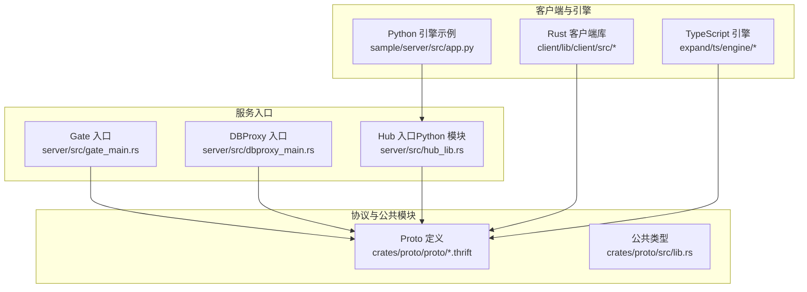
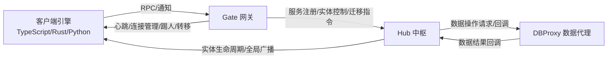
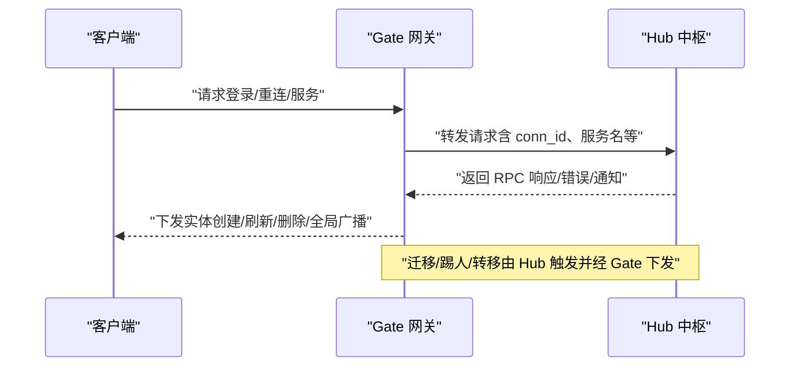
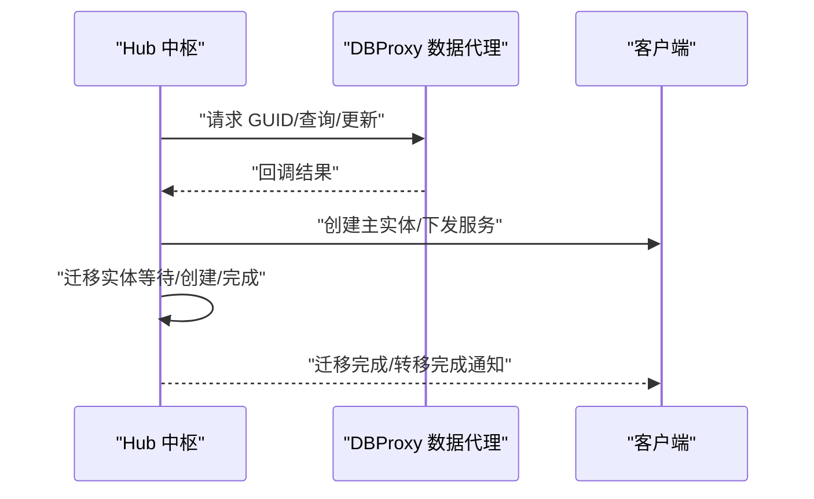
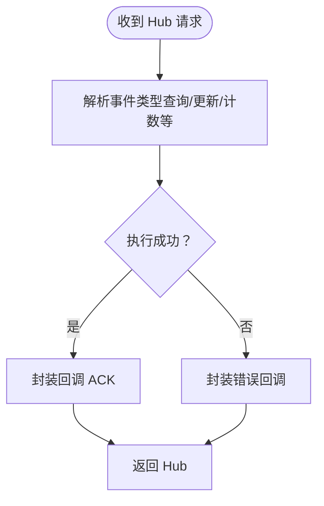
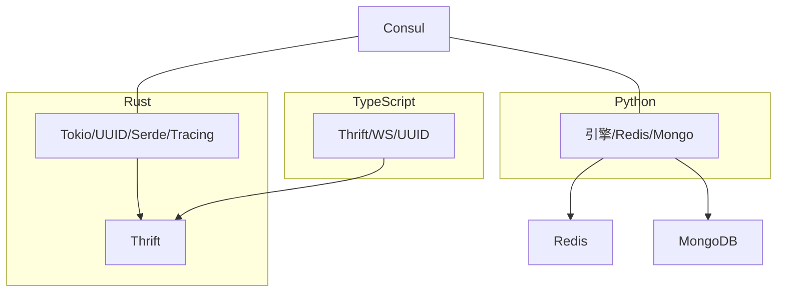

# 项目概述

<cite>
**本文引用的文件**
- [gate_main.rs](file://server/src/gate_main.rs)
- [dbproxy_main.rs](file://server/src/dbproxy_main.rs)
- [hub_lib.rs](file://server/src/hub_lib.rs)
- [gate.thrift](file://crates/proto/proto/gate.thrift)
- [hub.thrift](file://crates/proto/proto/hub.thrift)
- [dbproxy.thrift](file://crates/proto/proto/dbproxy.thrift)
- [common.thrift](file://crates/proto/proto/common.thrift)
- [client.thrift](file://crates/proto/proto/client.thrift)
- [Cargo.toml](file://client/Cargo.toml)
- [Cargo.toml（proto）](file://crates/proto/Cargo.toml)
- [package.json（TypeScript 扩展）](file://expand/ts/package.json)
- [app.py（示例服务端）](file://sample/server/src/app.py)
</cite>

## 目录
1. [引言](#引言)
2. [项目结构](#项目结构)
3. [核心组件](#核心组件)
4. [架构总览](#架构总览)
5. [详细组件分析](#详细组件分析)
6. [依赖分析](#依赖分析)
7. [性能考虑](#性能考虑)
8. [故障排查指南](#故障排查指南)
9. [结论](#结论)
10. [附录](#附录)

## 引言
本项目“geese”是一个面向分布式游戏服务器的高性能、可扩展、多语言协作的微服务框架。其核心目标是通过清晰的分层与协议抽象，实现客户端接入、业务中枢与数据代理的解耦，支持高并发、低延迟、跨服迁移与弹性扩缩容，满足多人在线、实时交互、复杂状态管理的游戏场景需求。

项目采用“Rust + Python + TypeScript”的混合技术栈：Rust 负责高性能网关与数据代理、Python 负责业务中枢（Hub）与服务编排、TypeScript 提供前端引擎与协议生成，形成“底层强性能 + 中层易开发 + 上层可交互”的完整闭环。

## 项目结构
项目按“服务入口 + 协议定义 + 核心库 + 示例与工具”的方式组织，核心目录与职责如下：
- server：服务主程序入口与运行时（Gate、DBProxy、Hub）
- crates：通用能力与协议库（网络、日志、健康检查、消息编解码、Proto 定义等）
- client：Rust 客户端与 Python 扩展桥接
- expand/ts：TypeScript 引擎与自动生成的协议代码
- sample：最小可运行示例（服务端 Python、客户端 TS/Py）
- rpc：协议解析与生成工具链
- tools：行为树编辑器等辅助工具

图表来源
- [gate_main.rs:1-117](file://server/src/gate_main.rs#L1-L117)
- [dbproxy_main.rs:1-78](file://server/src/dbproxy_main.rs#L1-L78)
- [hub_lib.rs:1-10](file://server/src/hub_lib.rs#L1-L10)
- [gate.thrift:1-225](file://crates/proto/proto/gate.thrift#L1-L225)
- [hub.thrift:1-292](file://crates/proto/proto/hub.thrift#L1-L292)
- [dbproxy.thrift:1-72](file://crates/proto/proto/dbproxy.thrift#L1-L72)
- [common.thrift:1-39](file://crates/proto/proto/common.thrift#L1-L39)
- [client.thrift:1-112](file://crates/proto/proto/client.thrift#L1-L112)

章节来源
- [gate_main.rs:1-117](file://server/src/gate_main.rs#L1-L117)
- [dbproxy_main.rs:1-78](file://server/src/dbproxy_main.rs#L1-L78)
- [hub_lib.rs:1-10](file://server/src/hub_lib.rs#L1-L10)
- [Cargo.toml:1-21](file://client/Cargo.toml#L1-L21)
- [Cargo.toml（proto）:1-10](file://crates/proto/Cargo.toml#L1-L10)
- [package.json（TypeScript 扩展）:1-15](file://expand/ts/package.json#L1-L15)
- [app.py（示例服务端）:1-118](file://sample/server/src/app.py#L1-L118)

## 核心组件
- Gate 网关：负责客户端接入、连接管理、心跳、转发 RPC/通知到 Hub，并向客户端下发实体生命周期与状态变更指令。
- Hub 中枢：负责玩家会话、服务注册、实体迁移、跨服消息路由、与 DBProxy 的数据交互。
- DBProxy 数据代理：统一处理数据库操作请求，提供 GUID、CRUD、聚合查询等能力，并对 Hub 进行回调。
- Proto 协议：以 Thrift 定义跨语言通信契约，确保 Gate-Hub-DBProxy 与客户端之间的消息一致性。
- 客户端生态：Rust 客户端库、TypeScript 引擎与 Python 引擎，分别用于服务端 Hub 的扩展与示例演示。

章节来源
- [gate_main.rs:18-117](file://server/src/gate_main.rs#L18-L117)
- [dbproxy_main.rs:15-78](file://server/src/dbproxy_main.rs#L15-L78)
- [hub_lib.rs:1-10](file://server/src/hub_lib.rs#L1-L10)
- [gate.thrift:1-225](file://crates/proto/proto/gate.thrift#L1-L225)
- [hub.thrift:1-292](file://crates/proto/proto/hub.thrift#L1-L292)
- [dbproxy.thrift:1-72](file://crates/proto/proto/dbproxy.thrift#L1-L72)
- [common.thrift:1-39](file://crates/proto/proto/common.thrift#L1-L39)
- [client.thrift:1-112](file://crates/proto/proto/client.thrift#L1-L112)

## 架构总览
下图展示了三层微服务的职责边界与交互路径：Gate 作为入口与中转，Hub 负责业务与迁移编排，DBProxy 负责数据持久化与回调。

图表来源
- [gate.thrift:135-153](file://crates/proto/proto/gate.thrift#L135-L153)
- [hub.thrift:216-242](file://crates/proto/proto/hub.thrift#L216-L242)
- [dbproxy.thrift:62-71](file://crates/proto/proto/dbproxy.thrift#L62-L71)
- [client.thrift:99-112](file://crates/proto/proto/client.thrift#L99-L112)

## 详细组件分析

### Gate 网关（接入与转发）
- 职责
  - 接收客户端 TCP/WebSocket/WSS 连接，维护连接 ID 与心跳
  - 将客户端 RPC/通知转发至 Hub，并接收 Hub 的回调与全局广播
  - 管理实体生命周期：创建、刷新、删除、迁移等待与完成通知
  - 处理踢人与跨服转移流程，保证消息有序与幂等
- 关键流程（登录/重连/服务调用）

图表来源
- [gate.thrift:158-225](file://crates/proto/proto/gate.thrift#L158-L225)
- [hub.thrift:216-242](file://crates/proto/proto/hub.thrift#L216-L242)
- [client.thrift:99-112](file://crates/proto/proto/client.thrift#L99-L112)

章节来源
- [gate_main.rs:33-117](file://server/src/gate_main.rs#L33-L117)
- [gate.thrift:1-225](file://crates/proto/proto/gate.thrift#L1-L225)
- [client.thrift:1-112](file://crates/proto/proto/client.thrift#L1-L112)

### Hub 中枢（业务与迁移）
- 职责
  - 维护玩家会话与实体映射，注册服务与查询服务实体
  - 处理跨服迁移：等待迁移、创建迁移实体、迁移完成确认
  - 转发客户端 RPC/通知到对应 Hub 或服务实体
  - 与 DBProxy 协作进行数据读写与回调
- 关键流程（登录/重连/迁移）

图表来源
- [hub.thrift:1-292](file://crates/proto/proto/hub.thrift#L1-L292)
- [dbproxy.thrift:1-72](file://crates/proto/proto/dbproxy.thrift#L1-L72)
- [client.thrift:1-112](file://crates/proto/proto/client.thrift#L1-L112)

章节来源
- [hub_lib.rs:1-10](file://server/src/hub_lib.rs#L1-L10)
- [hub.thrift:1-292](file://crates/proto/proto/hub.thrift#L1-L292)
- [app.py（示例服务端）:1-118](file://sample/server/src/app.py#L1-L118)

### DBProxy 数据代理（数据编排）
- 职责
  - 统一处理数据库 CRUD、聚合查询、计数等请求
  - 对 Hub 回调 ACK 结果，支撑业务逻辑决策
- 关键流程（数据请求/回调）

图表来源
- [dbproxy.thrift:62-71](file://crates/proto/proto/dbproxy.thrift#L62-L71)
- [hub.thrift:283-292](file://crates/proto/proto/hub.thrift#L283-L292)

章节来源
- [dbproxy_main.rs:15-78](file://server/src/dbproxy_main.rs#L15-L78)
- [dbproxy.thrift:1-72](file://crates/proto/proto/dbproxy.thrift#L1-L72)

### 协议与消息模型（Proto）
- 设计原则
  - 以 Thrift 定义跨语言消息契约，确保 Gate-Hub-DBProxy 与客户端一致
  - 使用 union 组织不同方向的消息集合，减少分支判断复杂度
  - 通过 common.thrift 抽象通用字段（方法名、二进制参数、RPC 响应/错误）
- 关键消息族
  - 客户端到 Gate：登录、重连、服务请求、RPC/通知
  - Gate 到 Hub：注册、实体控制、迁移、踢人、转移
  - Hub 到客户端：实体创建/刷新/删除、RPC/通知/全局广播
  - Hub 到 DBProxy：GUID/对象 CRUD/聚合查询等

章节来源
- [common.thrift:1-39](file://crates/proto/proto/common.thrift#L1-L39)
- [client.thrift:1-112](file://crates/proto/proto/client.thrift#L1-L112)
- [gate.thrift:1-225](file://crates/proto/proto/gate.thrift#L1-L225)
- [hub.thrift:1-292](file://crates/proto/proto/hub.thrift#L1-L292)
- [dbproxy.thrift:1-72](file://crates/proto/proto/dbproxy.thrift#L1-L72)

### 客户端生态（Rust/TS/Py）
- Rust 客户端库：提供高性能网络与协议编解码，适合作为服务端扩展或独立客户端
- TypeScript 引擎：提供前端游戏引擎能力与自动生成的协议代码，便于快速搭建前端联调环境
- Python 引擎（示例）：展示如何在 Hub 中注册服务、处理登录/重连、迁移与实体生命周期

章节来源
- [Cargo.toml:1-21](file://client/Cargo.toml#L1-L21)
- [Cargo.toml（proto）:1-10](file://crates/proto/Cargo.toml#L1-L10)
- [package.json（TypeScript 扩展）:1-15](file://expand/ts/package.json#L1-L15)
- [app.py（示例服务端）:1-118](file://sample/server/src/app.py#L1-L118)

## 依赖分析
- 语言与运行时
  - Rust：Tokio 异步运行时、Serde 序列化、UUID、Tracing 日志
  - Python：示例服务端使用内置引擎与 Redis/Mongo 集成
  - TypeScript：Thrift Typescript、WebSocket、UUID 等依赖
- 外部组件
  - Consul：服务注册与健康检查
  - Redis：会话缓存与消息队列
  - MongoDB：持久化存储
- 协议与生成
  - Thrift 定义与生成工具链，确保跨语言一致性

图表来源
- [Cargo.toml:8-16](file://client/Cargo.toml#L8-L16)
- [Cargo.toml（proto）:8-10](file://crates/proto/Cargo.toml#L8-L10)
- [package.json（TypeScript 扩展）:2-13](file://expand/ts/package.json#L2-L13)
- [gate_main.rs:7-16](file://server/src/gate_main.rs#L7-L16)
- [dbproxy_main.rs:5-11](file://server/src/dbproxy_main.rs#L5-L11)

章节来源
- [Cargo.toml:1-21](file://client/Cargo.toml#L1-L21)
- [Cargo.toml（proto）:1-10](file://crates/proto/Cargo.toml#L1-L10)
- [package.json（TypeScript 扩展）:1-15](file://expand/ts/package.json#L1-L15)
- [gate_main.rs:1-117](file://server/src/gate_main.rs#L1-L117)
- [dbproxy_main.rs:1-78](file://server/src/dbproxy_main.rs#L1-L78)

## 性能考虑
- 异步与并发
  - Rust 使用 Tokio 实现高并发网络 IO；Python 在 Hub 层通过协程与事件循环提升吞吐
- 序列化与传输
  - Thrift 二进制协议降低序列化开销；消息体以二进制携带参数，避免字符串解析成本
- 缓存与去重
  - Redis 缓存玩家会话与状态，减少重复登录/重连处理；Gate 维护连接 ID 与实体映射，避免重复下发
- 可观测性
  - Tracing/Jaeger 集成，结合 Consul 健康检查，保障线上问题快速定位

## 故障排查指南
- 健康检查
  - Gate/DBProxy 启动后注册 Consul 健康检查端点，可通过健康接口快速判断服务可用性
- 日志与追踪
  - 通过日志级别与 Jaeger URL 初始化日志与追踪，定位请求链路与异常节点
- 常见问题
  - 登录/重连失败：检查 Gate 到 Hub 的服务注册与回调是否正常
  - 实体未创建/刷新：核对 Hub 到 Gate 的实体生命周期消息是否下发
  - 数据写入无响应：确认 DBProxy 回调 ACK 是否返回，以及 MongoDB/Redis 连通性

章节来源
- [gate_main.rs:56-86](file://server/src/gate_main.rs#L56-L86)
- [dbproxy_main.rs:38-68](file://server/src/dbproxy_main.rs#L38-L68)
- [hub.thrift:283-292](file://crates/proto/proto/hub.thrift#L283-L292)

## 结论
Geese 以清晰的三层微服务架构与完善的协议体系，为游戏服务器提供了从接入、业务编排到数据持久化的全链路解决方案。Rust 的高性能、Python 的易用性与 TypeScript 的前端友好性在此项目中得到有机融合，既适合初学者快速上手，也能满足资深工程师对性能与可扩展性的严苛要求。

## 附录
- 应用场景建议
  - 多人在线对战/社交类游戏
  - 需要跨服迁移与全局广播的 MMORPG
  - 对实时性与一致性要求较高的竞技/策略类游戏
- 发展路线提示
  - 增强服务网格与熔断降级能力
  - 引入更丰富的消息队列与流式计算
  - 扩展更多数据库与缓存后端适配